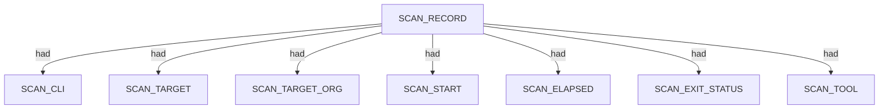
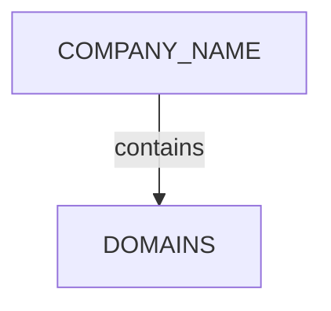
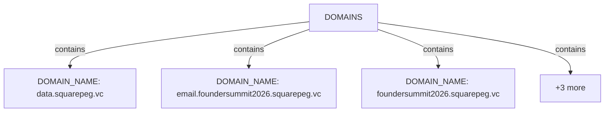
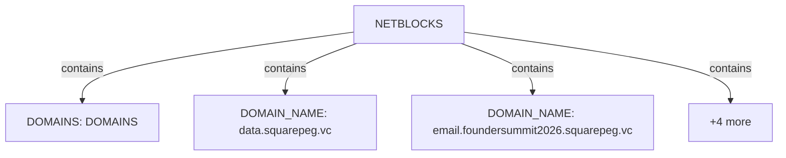
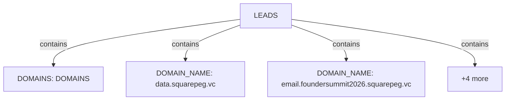
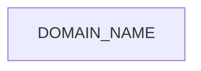
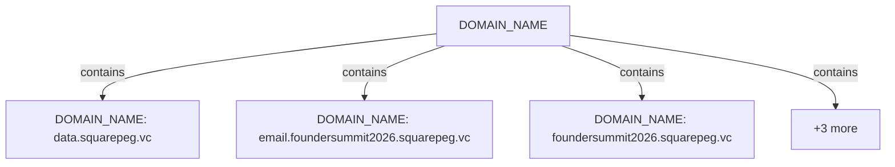

# Pius scan narrative — `corporate_squarepeg_ndjson`

## Introduction

Organizational attack-surface findings are grouped under the head company, with domains, affiliates, and unresolved research leads emitted per 08 rules.

## Scan

Every examination has one SCAN_RECORD with scan descriptors linked via had. This scan includes **1** Scan root node(s) (e.g. `pius:Square Peg Capital Pty Ltd:/mnt/c/projects/spiderfeet/.tools/pius run --org "Square Peg Capital Pty Ltd" --domain squarepeg.vc --plugins gleif,wikidata,whois,crt-sh --output ndjson`). Linked structures: `SCAN_CLI`, `SCAN_TARGET`, `SCAN_TARGET_ORG`, `SCAN_START`, `SCAN_ELAPSED`, `SCAN_EXIT_STATUS`.

### Structure overview

### Scan descriptors

| Nugget | Value |
| --- | --- |
| `SCAN_RECORD` | `pius:Square Peg Capital Pty Ltd:/mnt/c/projects/spiderfeet/.tools/pius run --org "Square Peg Capital Pty Ltd" --domain squarepeg.vc --plugins gleif,wikidata,whois,crt-sh --output ndjson` |

## Organization

Organisation scans root at COMPANY_NAME with category buckets for domains, netblocks, and research leads. This scan includes **1** Organization root node(s) (e.g. `Square Peg Capital Pty Ltd`). Linked structures: `DOMAINS`.

### Structure overview

### `DOMAINS`

| Nugget | Value |
| --- | --- |
| `DOMAIN_NAME` | `data.squarepeg.vc` |
| `DOMAIN_NAME` | `email.foundersummit2026.squarepeg.vc` |
| `DOMAIN_NAME` | `foundersummit2026.squarepeg.vc` |
| `DOMAIN_NAME` | `helix.squarepeg.vc` |
| `DOMAIN_NAME` | `squarepeg.vc` |
| `DOMAIN_NAME` | `www.squarepeg.vc` |

### `NETBLOCKS`

| Nugget | Value |
| --- | --- |
| `DOMAINS` | `DOMAINS` |
| `DOMAIN_NAME` | `data.squarepeg.vc` |
| `DOMAIN_NAME` | `email.foundersummit2026.squarepeg.vc` |
| `DOMAIN_NAME` | `foundersummit2026.squarepeg.vc` |
| `DOMAIN_NAME` | `helix.squarepeg.vc` |
| `DOMAIN_NAME` | `squarepeg.vc` |
| `DOMAIN_NAME` | `www.squarepeg.vc` |

### `LEADS`

| Nugget | Value |
| --- | --- |
| `DOMAINS` | `DOMAINS` |
| `DOMAIN_NAME` | `data.squarepeg.vc` |
| `DOMAIN_NAME` | `email.foundersummit2026.squarepeg.vc` |
| `DOMAIN_NAME` | `foundersummit2026.squarepeg.vc` |
| `DOMAIN_NAME` | `helix.squarepeg.vc` |
| `DOMAIN_NAME` | `squarepeg.vc` |
| `DOMAIN_NAME` | `www.squarepeg.vc` |

## Domains

Apex DOMAIN_NAME entities contain subdomain DOMAIN_NAME children; descriptors capture discovery mode, sources, and liveness. This scan includes **6** Domains root node(s) (e.g. `www.squarepeg.vc`, `squarepeg.vc`, `foundersummit2026.squarepeg.vc`). Linked structures: no child categories.

### Structure overview

### `DOMAIN_NAME`

| Nugget | Value |
| --- | --- |
| `DOMAIN_NAME` | `data.squarepeg.vc` |
| `DOMAIN_NAME` | `email.foundersummit2026.squarepeg.vc` |
| `DOMAIN_NAME` | `foundersummit2026.squarepeg.vc` |
| `DOMAIN_NAME` | `helix.squarepeg.vc` |
| `DOMAIN_NAME` | `squarepeg.vc` |
| `DOMAIN_NAME` | `www.squarepeg.vc` |

## Conclusion

See the appendix for the full node and edge inventory.

## Appendix

### Nodes

| Nugget | Value |
| --- | --- |
| `COMPANY_NAME` | `Square Peg Capital Pty Ltd` |
| `DISCOVERY_METHOD` | `certificate-transparency` |
| `DOMAINS` | `DOMAINS` |
| `DOMAIN_NAME` | `data.squarepeg.vc` |
| `DOMAIN_NAME` | `email.foundersummit2026.squarepeg.vc` |
| `DOMAIN_NAME` | `foundersummit2026.squarepeg.vc` |
| `DOMAIN_NAME` | `helix.squarepeg.vc` |
| `DOMAIN_NAME` | `squarepeg.vc` |
| `DOMAIN_NAME` | `www.squarepeg.vc` |
| `DOMAIN_NAME_PARENT` | `foundersummit2026.squarepeg.vc` |
| `DOMAIN_NAME_PARENT` | `squarepeg.vc` |
| `REVIEW_STATUS` | `confirmed` |
| `SCAN_CLI` | `/mnt/c/projects/spiderfeet/.tools/pius run --org "Square Peg Capital Pty Ltd" --domain squarepeg.vc --plugins gleif,wikidata,whois,crt-sh --output ndjson` |
| `SCAN_ELAPSED` | `35.046` |
| `SCAN_EXIT_STATUS` | `0` |
| `SCAN_RECORD` | `pius:Square Peg Capital Pty Ltd:/mnt/c/projects/spiderfeet/.tools/pius run --org "Square Peg Capital Pty Ltd" --domain squarepeg.vc --plugins gleif,wikidata,whois,crt-sh --output ndjson` |
| `SCAN_START` | `2026-07-05T13:10:18.904973+00:00` |
| `SCAN_TARGET` | `squarepeg.vc` |
| `SCAN_TARGET_ORG` | `Square Peg Capital Pty Ltd` |
| `SCAN_TOOL` | `pius` |

### Edges

| Source | Relation | Target |
| --- | --- | --- |
| `SCAN_RECORD` | `had` | `SCAN_CLI` |
| `SCAN_RECORD` | `had` | `SCAN_TARGET` |
| `SCAN_RECORD` | `had` | `SCAN_TARGET_ORG` |
| `SCAN_RECORD` | `had` | `SCAN_START` |
| `SCAN_RECORD` | `had` | `SCAN_ELAPSED` |
| `SCAN_RECORD` | `had` | `SCAN_EXIT_STATUS` |
| `SCAN_RECORD` | `had` | `SCAN_TOOL` |
| `SCAN_RECORD` | `contains` | `COMPANY_NAME` |
| `DOMAIN_NAME` | `had` | `DISCOVERY_METHOD` |
| `DOMAIN_NAME` | `had` | `DOMAIN_NAME_PARENT` |
| `COMPANY_NAME` | `contains` | `DOMAINS` |
| `DOMAINS` | `contains` | `DOMAIN_NAME` |
| `COMPANY_NAME` | `contains` | `DOMAIN_NAME` |
| `DOMAIN_NAME` | `had` | `REVIEW_STATUS` |
---

*OS-Intel Scan*
