# Pius scan narrative — `corporate_upside_ndjson`

## Introduction

Organizational attack-surface findings are grouped under the head company, with domains, affiliates, and unresolved research leads emitted per 08 rules.

## Scan

Every examination has one SCAN_RECORD with scan descriptors linked via had. This scan includes **1** Scan root node(s) (e.g. `pius:The Upside Pty Ltd:/mnt/c/projects/spiderfeet/.tools/pius run --org "The Upside Pty Ltd" --domain theupside.com.au --plugins gleif,wikidata,whois,crt-sh --output ndjson`). Linked structures: `SCAN_CLI`, `SCAN_TARGET`, `SCAN_TARGET_ORG`, `SCAN_START`, `SCAN_ELAPSED`, `SCAN_EXIT_STATUS`.

### Structure overview

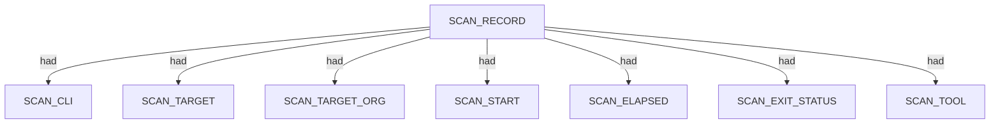

### `SCAN_CLI`

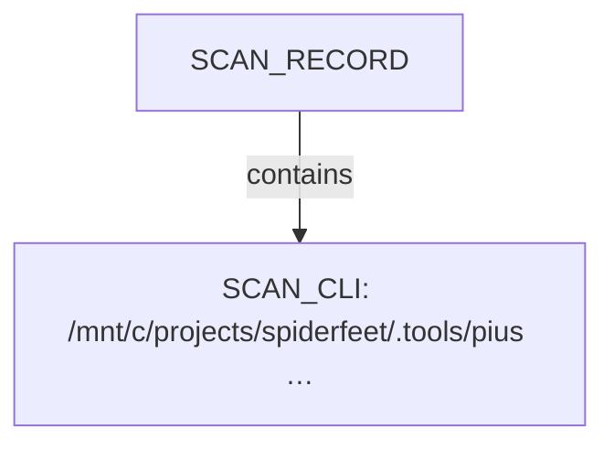

| Nugget | Value |
| --- | --- |
| `SCAN_CLI` | `/mnt/c/projects/spiderfeet/.tools/pius run --org "The Upside Pty Ltd" --domain theupside.com.au --plugins gleif,wikidata,whois,crt-sh --output ndjson` |

### `SCAN_TARGET`

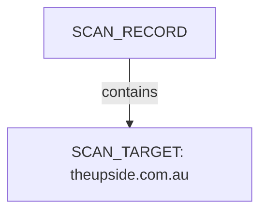

| Nugget | Value |
| --- | --- |
| `SCAN_TARGET` | `theupside.com.au` |

### `SCAN_TARGET_ORG`

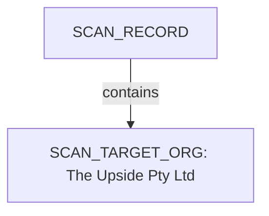

| Nugget | Value |
| --- | --- |
| `SCAN_TARGET_ORG` | `The Upside Pty Ltd` |

### `SCAN_START`

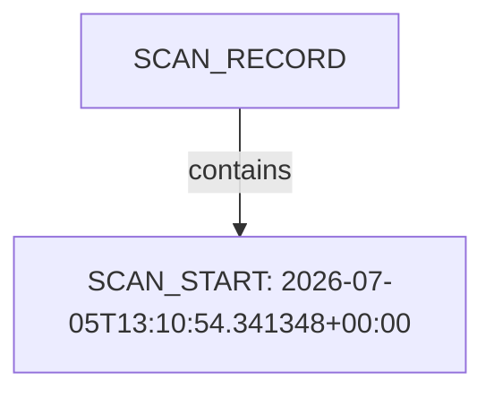

| Nugget | Value |
| --- | --- |
| `SCAN_START` | `2026-07-05T13:10:54.341348+00:00` |

### `SCAN_ELAPSED`

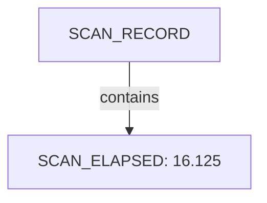

| Nugget | Value |
| --- | --- |
| `SCAN_ELAPSED` | `16.125` |

### `SCAN_EXIT_STATUS`

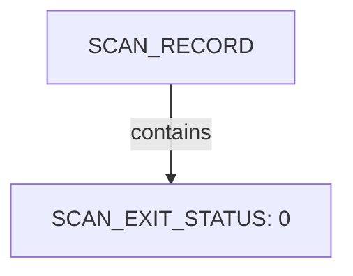

| Nugget | Value |
| --- | --- |
| `SCAN_EXIT_STATUS` | `0` |

### `SCAN_TOOL`

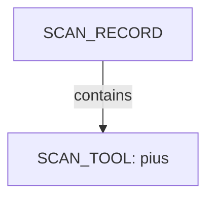

| Nugget | Value |
| --- | --- |
| `SCAN_TOOL` | `pius` |

## Organization

Organisation scans root at COMPANY_NAME with category buckets for domains, netblocks, and research leads. This scan includes **1** Organization root node(s) (e.g. `The Upside Pty Ltd`). Linked structures: `LEADS`, `DOMAINS`.

### Structure overview

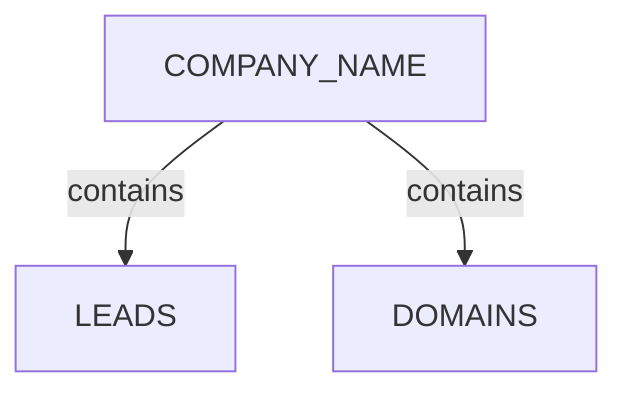

### `LEADS`

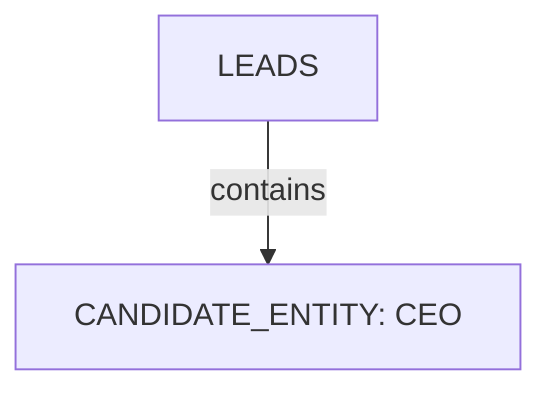

| Nugget | Value |
| --- | --- |
| `CANDIDATE_ENTITY` | `CEO` |

### `DOMAINS`

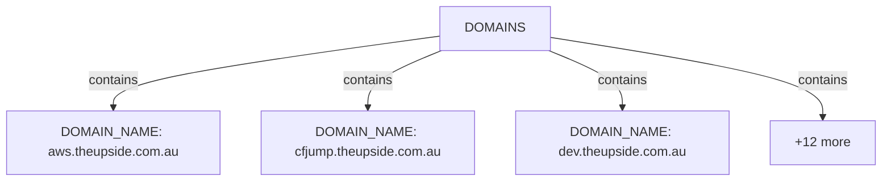

| Nugget | Value |
| --- | --- |
| `DOMAIN_NAME` | `aws.theupside.com.au` |
| `DOMAIN_NAME` | `cfjump.theupside.com.au` |
| `DOMAIN_NAME` | `dev.theupside.com.au` |
| `DOMAIN_NAME` | `e.theupside.com.au` |
| `DOMAIN_NAME` | `email.theupside.com.au` |
| `DOMAIN_NAME` | `info.theupside.com.au` |
| `DOMAIN_NAME` | `k8s.theupside.com.au` |
| `DOMAIN_NAME` | `mail.theupside.com.au` |
| `DOMAIN_NAME` | `news.theupside.com.au` |
| `DOMAIN_NAME` | `newsletter.theupside.com.au` |
| `DOMAIN_NAME` | `spf.theupside.com.au` |
| `DOMAIN_NAME` | `test.theupside.com.au` |
| `DOMAIN_NAME` | `theupside.com.au` |
| `DOMAIN_NAME` | `track.theupside.com.au` |
| `DOMAIN_NAME` | `www.theupside.com.au` |

## Domains

Apex DOMAIN_NAME entities contain subdomain DOMAIN_NAME children; descriptors capture discovery mode, sources, and liveness. This scan includes **15** Domains root node(s) (e.g. `theupside.com.au`, `www.theupside.com.au`, `track.theupside.com.au`). Linked structures: no child categories.

### Structure overview

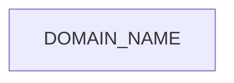

### Values

| Nugget | Value |
| --- | --- |
| `DOMAIN_NAME` | `aws.theupside.com.au` |
| `DOMAIN_NAME` | `cfjump.theupside.com.au` |
| `DOMAIN_NAME` | `dev.theupside.com.au` |
| `DOMAIN_NAME` | `e.theupside.com.au` |
| `DOMAIN_NAME` | `email.theupside.com.au` |
| `DOMAIN_NAME` | `info.theupside.com.au` |
| `DOMAIN_NAME` | `k8s.theupside.com.au` |
| `DOMAIN_NAME` | `mail.theupside.com.au` |
| `DOMAIN_NAME` | `news.theupside.com.au` |
| `DOMAIN_NAME` | `newsletter.theupside.com.au` |
| `DOMAIN_NAME` | `spf.theupside.com.au` |
| `DOMAIN_NAME` | `test.theupside.com.au` |
| `DOMAIN_NAME` | `theupside.com.au` |
| `DOMAIN_NAME` | `track.theupside.com.au` |
| `DOMAIN_NAME` | `www.theupside.com.au` |

## Conclusion

See the appendix for the full node and edge inventory.

## Appendix

### Nodes

| Nugget | Value |
| --- | --- |
| `CANDIDATE_ENTITY` | `CEO` |
| `COMPANY_NAME` | `The Upside Pty Ltd` |
| `DISCOVERY_METHOD` | `certificate-transparency` |
| `DOMAINS` | `DOMAINS` |
| `DOMAIN_NAME` | `aws.theupside.com.au` |
| `DOMAIN_NAME` | `cfjump.theupside.com.au` |
| `DOMAIN_NAME` | `dev.theupside.com.au` |
| `DOMAIN_NAME` | `e.theupside.com.au` |
| `DOMAIN_NAME` | `email.theupside.com.au` |
| `DOMAIN_NAME` | `info.theupside.com.au` |
| `DOMAIN_NAME` | `k8s.theupside.com.au` |
| `DOMAIN_NAME` | `mail.theupside.com.au` |
| `DOMAIN_NAME` | `news.theupside.com.au` |
| `DOMAIN_NAME` | `newsletter.theupside.com.au` |
| `DOMAIN_NAME` | `spf.theupside.com.au` |
| `DOMAIN_NAME` | `test.theupside.com.au` |
| `DOMAIN_NAME` | `theupside.com.au` |
| `DOMAIN_NAME` | `track.theupside.com.au` |
| `DOMAIN_NAME` | `www.theupside.com.au` |
| `DOMAIN_NAME_PARENT` | `com.au` |
| `DOMAIN_NAME_PARENT` | `theupside.com.au` |
| `DOMAIN_REGISTRAR` | `.au Domain Administration Limited` |
| `IS_PLACEHOLDER` | `true` |
| `IS_WILDCARD_DNS` | `true` |
| `LEADS` | `LEADS` |
| `NEEDS_REVIEW` | `true` |
| `PRESEED_TYPE` | `whois+name` |
| `REVIEW_STATUS` | `confirmed` |
| `SCAN_CLI` | `/mnt/c/projects/spiderfeet/.tools/pius run --org "The Upside Pty Ltd" --domain theupside.com.au --plugins gleif,wikidata,whois,crt-sh --output ndjson` |
| `SCAN_ELAPSED` | `16.125` |
| `SCAN_EXIT_STATUS` | `0` |
| `SCAN_RECORD` | `pius:The Upside Pty Ltd:/mnt/c/projects/spiderfeet/.tools/pius run --org "The Upside Pty Ltd" --domain theupside.com.au --plugins gleif,wikidata,whois,crt-sh --output ndjson` |
| `SCAN_START` | `2026-07-05T13:10:54.341348+00:00` |
| `SCAN_TARGET` | `theupside.com.au` |
| `SCAN_TARGET_ORG` | `The Upside Pty Ltd` |
| `SCAN_TOOL` | `pius` |
| `SUBDOMAIN_ENUMERATION_SUPPRESSED` | `true` |
| `WILDCARD_IP_COUNT` | `1` |

### Edges

| Source | Relation | Target |
| --- | --- | --- |
| `SCAN_RECORD` | `had` | `SCAN_CLI` |
| `SCAN_RECORD` | `had` | `SCAN_TARGET` |
| `SCAN_RECORD` | `had` | `SCAN_TARGET_ORG` |
| `SCAN_RECORD` | `had` | `SCAN_START` |
| `SCAN_RECORD` | `had` | `SCAN_ELAPSED` |
| `SCAN_RECORD` | `had` | `SCAN_EXIT_STATUS` |
| `SCAN_RECORD` | `had` | `SCAN_TOOL` |
| `SCAN_RECORD` | `contains` | `COMPANY_NAME` |
| `COMPANY_NAME` | `contains` | `DOMAIN_REGISTRAR` |
| `CANDIDATE_ENTITY` | `had` | `PRESEED_TYPE` |
| `CANDIDATE_ENTITY` | `had` | `IS_PLACEHOLDER` |
| `CANDIDATE_ENTITY` | `had` | `NEEDS_REVIEW` |
| `COMPANY_NAME` | `contains` | `LEADS` |
| `LEADS` | `contains` | `CANDIDATE_ENTITY` |
| `COMPANY_NAME` | `contains` | `CANDIDATE_ENTITY` |
| `CANDIDATE_ENTITY` | `had` | `REVIEW_STATUS` |
| `DOMAIN_NAME` | `had` | `DISCOVERY_METHOD` |
| `DOMAIN_NAME` | `had` | `DOMAIN_NAME_PARENT` |
| `COMPANY_NAME` | `contains` | `DOMAINS` |
| `DOMAINS` | `contains` | `DOMAIN_NAME` |
| `COMPANY_NAME` | `contains` | `DOMAIN_NAME` |
| `DOMAIN_NAME` | `had` | `REVIEW_STATUS` |
| `DOMAIN_NAME` | `had` | `IS_WILDCARD_DNS` |
| `DOMAIN_NAME` | `had` | `WILDCARD_IP_COUNT` |
| `DOMAIN_NAME` | `had` | `SUBDOMAIN_ENUMERATION_SUPPRESSED` |
---

*OS-Intel Scan*
