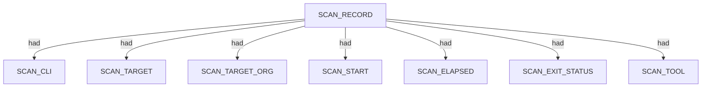
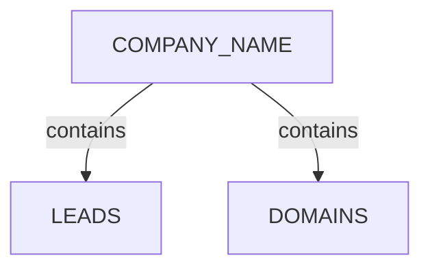
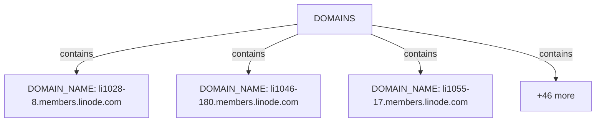
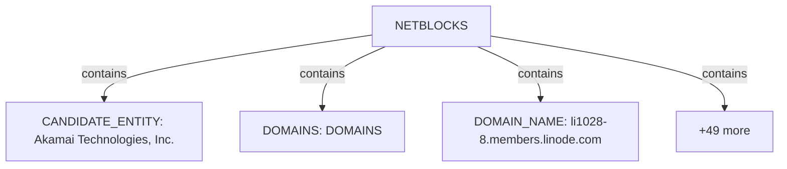
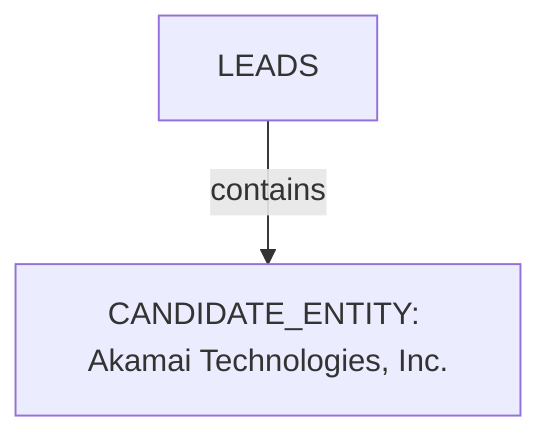
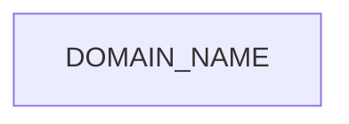
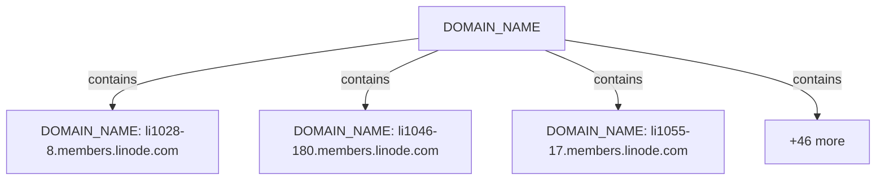

# Pius scan narrative — `crt_linode_ndjson`

## Introduction

Organizational attack-surface findings are grouped under the head company, with domains, affiliates, and unresolved research leads emitted per 08 rules.

## Scan

Every examination has one SCAN_RECORD with scan descriptors linked via had. This scan includes **1** Scan root node(s) (e.g. `pius:Linode:/mnt/c/projects/spiderfeet/.tools/pius run --org Linode --domain linode.com --plugins crt-sh --output ndjson`). Linked structures: `SCAN_CLI`, `SCAN_TARGET`, `SCAN_TARGET_ORG`, `SCAN_START`, `SCAN_ELAPSED`, `SCAN_EXIT_STATUS`.

### Structure overview

### Scan descriptors

| Nugget | Value |
| --- | --- |
| `SCAN_RECORD` | `pius:Linode:/mnt/c/projects/spiderfeet/.tools/pius run --org Linode --domain linode.com --plugins crt-sh --output ndjson` |

## Organization

Organisation scans root at COMPANY_NAME with category buckets for domains, netblocks, and research leads. This scan includes **1** Organization root node(s) (e.g. `Linode`). Linked structures: `LEADS`, `DOMAINS`.

### Structure overview

### `DOMAINS`

| Nugget | Value |
| --- | --- |
| `DOMAIN_NAME` | `li1028-8.members.linode.com` |
| `DOMAIN_NAME` | `li1046-180.members.linode.com` |
| `DOMAIN_NAME` | `li1055-17.members.linode.com` |
| `DOMAIN_NAME` | `li1055-94.members.linode.com` |
| `DOMAIN_NAME` | `li1081-239.members.linode.com` |
| `DOMAIN_NAME` | `li115-170.members.linode.com` |
| `DOMAIN_NAME` | `li1245-154.members.linode.com` |
| `DOMAIN_NAME` | `li1362-220.members.linode.com` |
| `DOMAIN_NAME` | `li1430-61.members.linode.com` |
| `DOMAIN_NAME` | `li1451-189.members.linode.com` |
| `DOMAIN_NAME` | `li1452-70.members.linode.com` |
| `DOMAIN_NAME` | `li148-141.members.linode.com` |
| `DOMAIN_NAME` | `li1498-45.members.linode.com` |
| `DOMAIN_NAME` | `li1519-235.members.linode.com` |
| `DOMAIN_NAME` | `li1591-123.members.linode.com` |
| `DOMAIN_NAME` | `li1647-116.members.linode.com` |
| `DOMAIN_NAME` | `li165-157.members.linode.com` |
| `DOMAIN_NAME` | `li1656-231.members.linode.com` |
| `DOMAIN_NAME` | `li1662-227.members.linode.com` |
| `DOMAIN_NAME` | `li1672-129.members.linode.com` |
| `DOMAIN_NAME` | `li1684-125.members.linode.com` |
| `DOMAIN_NAME` | `li1708-148.members.linode.com` |
| `DOMAIN_NAME` | `li1713-17.members.linode.com` |
| `DOMAIN_NAME` | `li1739-57.members.linode.com` |
| `DOMAIN_NAME` | `li1772-33.members.linode.com` |
| `DOMAIN_NAME` | `li1781-140.members.linode.com` |
| `DOMAIN_NAME` | `li1817-160.members.linode.com` |
| `DOMAIN_NAME` | `li1821-228.members.linode.com` |
| `DOMAIN_NAME` | `li229-211.members.linode.com` |
| `DOMAIN_NAME` | `li238-60.members.linode.com` |
| `DOMAIN_NAME` | `li256-77.members.linode.com` |
| `DOMAIN_NAME` | `li35-11.members.linode.com` |
| `DOMAIN_NAME` | `li463-22.members.linode.com` |
| `DOMAIN_NAME` | `li514-170.members.linode.com` |
| `DOMAIN_NAME` | `li572-196.members.linode.com` |
| `DOMAIN_NAME` | `li572-41.members.linode.com` |
| `DOMAIN_NAME` | `li574-183.members.linode.com` |
| `DOMAIN_NAME` | `li719-216.members.linode.com` |
| `DOMAIN_NAME` | `li795-130.members.linode.com` |
| `DOMAIN_NAME` | `li839-123.members.linode.com` |
| `DOMAIN_NAME` | `li840-199.members.linode.com` |
| `DOMAIN_NAME` | `li852-102.members.linode.com` |
| `DOMAIN_NAME` | `li859-243.members.linode.com` |
| `DOMAIN_NAME` | `li929-99.members.linode.com` |
| `DOMAIN_NAME` | `li951-236.members.linode.com` |
| `DOMAIN_NAME` | `li968-12.members.linode.com` |
| `DOMAIN_NAME` | `li968-8.members.linode.com` |
| `DOMAIN_NAME` | `li996-123.members.linode.com` |
| `DOMAIN_NAME` | `status.linode.com` |

### `NETBLOCKS`

| Nugget | Value |
| --- | --- |
| `CANDIDATE_ENTITY` | `Akamai Technologies, Inc.` |
| `DOMAINS` | `DOMAINS` |
| `DOMAIN_NAME` | `li1028-8.members.linode.com` |
| `DOMAIN_NAME` | `li1046-180.members.linode.com` |
| `DOMAIN_NAME` | `li1055-17.members.linode.com` |
| `DOMAIN_NAME` | `li1055-94.members.linode.com` |
| `DOMAIN_NAME` | `li1081-239.members.linode.com` |
| `DOMAIN_NAME` | `li115-170.members.linode.com` |
| `DOMAIN_NAME` | `li1245-154.members.linode.com` |
| `DOMAIN_NAME` | `li1362-220.members.linode.com` |
| `DOMAIN_NAME` | `li1430-61.members.linode.com` |
| `DOMAIN_NAME` | `li1451-189.members.linode.com` |
| `DOMAIN_NAME` | `li1452-70.members.linode.com` |
| `DOMAIN_NAME` | `li148-141.members.linode.com` |
| `DOMAIN_NAME` | `li1498-45.members.linode.com` |
| `DOMAIN_NAME` | `li1519-235.members.linode.com` |
| `DOMAIN_NAME` | `li1591-123.members.linode.com` |
| `DOMAIN_NAME` | `li1647-116.members.linode.com` |
| `DOMAIN_NAME` | `li165-157.members.linode.com` |
| `DOMAIN_NAME` | `li1656-231.members.linode.com` |
| `DOMAIN_NAME` | `li1662-227.members.linode.com` |
| `DOMAIN_NAME` | `li1672-129.members.linode.com` |
| `DOMAIN_NAME` | `li1684-125.members.linode.com` |
| `DOMAIN_NAME` | `li1708-148.members.linode.com` |
| `DOMAIN_NAME` | `li1713-17.members.linode.com` |
| `DOMAIN_NAME` | `li1739-57.members.linode.com` |
| `DOMAIN_NAME` | `li1772-33.members.linode.com` |
| `DOMAIN_NAME` | `li1781-140.members.linode.com` |
| `DOMAIN_NAME` | `li1817-160.members.linode.com` |
| `DOMAIN_NAME` | `li1821-228.members.linode.com` |
| `DOMAIN_NAME` | `li229-211.members.linode.com` |
| `DOMAIN_NAME` | `li238-60.members.linode.com` |
| `DOMAIN_NAME` | `li256-77.members.linode.com` |
| `DOMAIN_NAME` | `li35-11.members.linode.com` |
| `DOMAIN_NAME` | `li463-22.members.linode.com` |
| `DOMAIN_NAME` | `li514-170.members.linode.com` |
| `DOMAIN_NAME` | `li572-196.members.linode.com` |
| `DOMAIN_NAME` | `li572-41.members.linode.com` |
| `DOMAIN_NAME` | `li574-183.members.linode.com` |
| `DOMAIN_NAME` | `li719-216.members.linode.com` |
| `DOMAIN_NAME` | `li795-130.members.linode.com` |
| `DOMAIN_NAME` | `li839-123.members.linode.com` |
| `DOMAIN_NAME` | `li840-199.members.linode.com` |
| `DOMAIN_NAME` | `li852-102.members.linode.com` |
| `DOMAIN_NAME` | `li859-243.members.linode.com` |
| `DOMAIN_NAME` | `li929-99.members.linode.com` |
| `DOMAIN_NAME` | `li951-236.members.linode.com` |
| `DOMAIN_NAME` | `li968-12.members.linode.com` |
| `DOMAIN_NAME` | `li968-8.members.linode.com` |
| `DOMAIN_NAME` | `li996-123.members.linode.com` |
| `DOMAIN_NAME` | `status.linode.com` |
| `LEADS` | `LEADS` |

### `LEADS`

| Nugget | Value |
| --- | --- |
| `CANDIDATE_ENTITY` | `Akamai Technologies, Inc.` |

## Domains

Apex DOMAIN_NAME entities contain subdomain DOMAIN_NAME children; descriptors capture discovery mode, sources, and liveness. This scan includes **49** Domains root node(s) (e.g. `status.linode.com`, `li839-123.members.linode.com`, `li1362-220.members.linode.com`). Linked structures: no child categories.

### Structure overview

### `DOMAIN_NAME`

| Nugget | Value |
| --- | --- |
| `DOMAIN_NAME` | `li1028-8.members.linode.com` |
| `DOMAIN_NAME` | `li1046-180.members.linode.com` |
| `DOMAIN_NAME` | `li1055-17.members.linode.com` |
| `DOMAIN_NAME` | `li1055-94.members.linode.com` |
| `DOMAIN_NAME` | `li1081-239.members.linode.com` |
| `DOMAIN_NAME` | `li115-170.members.linode.com` |
| `DOMAIN_NAME` | `li1245-154.members.linode.com` |
| `DOMAIN_NAME` | `li1362-220.members.linode.com` |
| `DOMAIN_NAME` | `li1430-61.members.linode.com` |
| `DOMAIN_NAME` | `li1451-189.members.linode.com` |
| `DOMAIN_NAME` | `li1452-70.members.linode.com` |
| `DOMAIN_NAME` | `li148-141.members.linode.com` |
| `DOMAIN_NAME` | `li1498-45.members.linode.com` |
| `DOMAIN_NAME` | `li1519-235.members.linode.com` |
| `DOMAIN_NAME` | `li1591-123.members.linode.com` |
| `DOMAIN_NAME` | `li1647-116.members.linode.com` |
| `DOMAIN_NAME` | `li165-157.members.linode.com` |
| `DOMAIN_NAME` | `li1656-231.members.linode.com` |
| `DOMAIN_NAME` | `li1662-227.members.linode.com` |
| `DOMAIN_NAME` | `li1672-129.members.linode.com` |
| `DOMAIN_NAME` | `li1684-125.members.linode.com` |
| `DOMAIN_NAME` | `li1708-148.members.linode.com` |
| `DOMAIN_NAME` | `li1713-17.members.linode.com` |
| `DOMAIN_NAME` | `li1739-57.members.linode.com` |
| `DOMAIN_NAME` | `li1772-33.members.linode.com` |
| `DOMAIN_NAME` | `li1781-140.members.linode.com` |
| `DOMAIN_NAME` | `li1817-160.members.linode.com` |
| `DOMAIN_NAME` | `li1821-228.members.linode.com` |
| `DOMAIN_NAME` | `li229-211.members.linode.com` |
| `DOMAIN_NAME` | `li238-60.members.linode.com` |
| `DOMAIN_NAME` | `li256-77.members.linode.com` |
| `DOMAIN_NAME` | `li35-11.members.linode.com` |
| `DOMAIN_NAME` | `li463-22.members.linode.com` |
| `DOMAIN_NAME` | `li514-170.members.linode.com` |
| `DOMAIN_NAME` | `li572-196.members.linode.com` |
| `DOMAIN_NAME` | `li572-41.members.linode.com` |
| `DOMAIN_NAME` | `li574-183.members.linode.com` |
| `DOMAIN_NAME` | `li719-216.members.linode.com` |
| `DOMAIN_NAME` | `li795-130.members.linode.com` |
| `DOMAIN_NAME` | `li839-123.members.linode.com` |
| `DOMAIN_NAME` | `li840-199.members.linode.com` |
| `DOMAIN_NAME` | `li852-102.members.linode.com` |
| `DOMAIN_NAME` | `li859-243.members.linode.com` |
| `DOMAIN_NAME` | `li929-99.members.linode.com` |
| `DOMAIN_NAME` | `li951-236.members.linode.com` |
| `DOMAIN_NAME` | `li968-12.members.linode.com` |
| `DOMAIN_NAME` | `li968-8.members.linode.com` |
| `DOMAIN_NAME` | `li996-123.members.linode.com` |
| `DOMAIN_NAME` | `status.linode.com` |

## Conclusion

See the appendix for the full node and edge inventory.

## Appendix

### Nodes

| Nugget | Value |
| --- | --- |
| `CANDIDATE_ENTITY` | `Akamai Technologies, Inc.` |
| `COMPANY_NAME` | `Linode` |
| `DISCOVERY_METHOD` | `certificate-transparency` |
| `DOMAINS` | `DOMAINS` |
| `DOMAIN_NAME` | `li1028-8.members.linode.com` |
| `DOMAIN_NAME` | `li1046-180.members.linode.com` |
| `DOMAIN_NAME` | `li1055-17.members.linode.com` |
| `DOMAIN_NAME` | `li1055-94.members.linode.com` |
| `DOMAIN_NAME` | `li1081-239.members.linode.com` |
| `DOMAIN_NAME` | `li115-170.members.linode.com` |
| `DOMAIN_NAME` | `li1245-154.members.linode.com` |
| `DOMAIN_NAME` | `li1362-220.members.linode.com` |
| `DOMAIN_NAME` | `li1430-61.members.linode.com` |
| `DOMAIN_NAME` | `li1451-189.members.linode.com` |
| `DOMAIN_NAME` | `li1452-70.members.linode.com` |
| `DOMAIN_NAME` | `li148-141.members.linode.com` |
| `DOMAIN_NAME` | `li1498-45.members.linode.com` |
| `DOMAIN_NAME` | `li1519-235.members.linode.com` |
| `DOMAIN_NAME` | `li1591-123.members.linode.com` |
| `DOMAIN_NAME` | `li1647-116.members.linode.com` |
| `DOMAIN_NAME` | `li165-157.members.linode.com` |
| `DOMAIN_NAME` | `li1656-231.members.linode.com` |
| `DOMAIN_NAME` | `li1662-227.members.linode.com` |
| `DOMAIN_NAME` | `li1672-129.members.linode.com` |
| `DOMAIN_NAME` | `li1684-125.members.linode.com` |
| `DOMAIN_NAME` | `li1708-148.members.linode.com` |
| `DOMAIN_NAME` | `li1713-17.members.linode.com` |
| `DOMAIN_NAME` | `li1739-57.members.linode.com` |
| `DOMAIN_NAME` | `li1772-33.members.linode.com` |
| `DOMAIN_NAME` | `li1781-140.members.linode.com` |
| `DOMAIN_NAME` | `li1817-160.members.linode.com` |
| `DOMAIN_NAME` | `li1821-228.members.linode.com` |
| `DOMAIN_NAME` | `li229-211.members.linode.com` |
| `DOMAIN_NAME` | `li238-60.members.linode.com` |
| `DOMAIN_NAME` | `li256-77.members.linode.com` |
| `DOMAIN_NAME` | `li35-11.members.linode.com` |
| `DOMAIN_NAME` | `li463-22.members.linode.com` |
| `DOMAIN_NAME` | `li514-170.members.linode.com` |
| `DOMAIN_NAME` | `li572-196.members.linode.com` |
| `DOMAIN_NAME` | `li572-41.members.linode.com` |
| `DOMAIN_NAME` | `li574-183.members.linode.com` |
| `DOMAIN_NAME` | `li719-216.members.linode.com` |
| `DOMAIN_NAME` | `li795-130.members.linode.com` |
| `DOMAIN_NAME` | `li839-123.members.linode.com` |
| `DOMAIN_NAME` | `li840-199.members.linode.com` |
| `DOMAIN_NAME` | `li852-102.members.linode.com` |
| `DOMAIN_NAME` | `li859-243.members.linode.com` |
| `DOMAIN_NAME` | `li929-99.members.linode.com` |
| `DOMAIN_NAME` | `li951-236.members.linode.com` |
| `DOMAIN_NAME` | `li968-12.members.linode.com` |
| `DOMAIN_NAME` | `li968-8.members.linode.com` |
| `DOMAIN_NAME` | `li996-123.members.linode.com` |
| `DOMAIN_NAME` | `status.linode.com` |
| `DOMAIN_NAME_PARENT` | `linode.com` |
| `DOMAIN_NAME_PARENT` | `members.linode.com` |
| `LEADS` | `LEADS` |
| `PRESEED_TYPE` | `whois+company` |
| `REVIEW_STATUS` | `confirmed` |
| `SCAN_CLI` | `/mnt/c/projects/spiderfeet/.tools/pius run --org Linode --domain linode.com --plugins crt-sh --output ndjson` |
| `SCAN_ELAPSED` | `7.063` |
| `SCAN_EXIT_STATUS` | `0` |
| `SCAN_RECORD` | `pius:Linode:/mnt/c/projects/spiderfeet/.tools/pius run --org Linode --domain linode.com --plugins crt-sh --output ndjson` |
| `SCAN_START` | `2026-06-30T04:30:38.345430+00:00` |
| `SCAN_TARGET` | `linode.com` |
| `SCAN_TARGET_ORG` | `Linode` |
| `SCAN_TOOL` | `pius` |

### Edges

| Source | Relation | Target |
| --- | --- | --- |
| `SCAN_RECORD` | `had` | `SCAN_CLI` |
| `SCAN_RECORD` | `had` | `SCAN_TARGET` |
| `SCAN_RECORD` | `had` | `SCAN_TARGET_ORG` |
| `SCAN_RECORD` | `had` | `SCAN_START` |
| `SCAN_RECORD` | `had` | `SCAN_ELAPSED` |
| `SCAN_RECORD` | `had` | `SCAN_EXIT_STATUS` |
| `SCAN_RECORD` | `had` | `SCAN_TOOL` |
| `SCAN_RECORD` | `contains` | `COMPANY_NAME` |
| `CANDIDATE_ENTITY` | `had` | `PRESEED_TYPE` |
| `COMPANY_NAME` | `contains` | `LEADS` |
| `LEADS` | `contains` | `CANDIDATE_ENTITY` |
| `COMPANY_NAME` | `contains` | `CANDIDATE_ENTITY` |
| `CANDIDATE_ENTITY` | `had` | `REVIEW_STATUS` |
| `DOMAIN_NAME` | `had` | `DISCOVERY_METHOD` |
| `DOMAIN_NAME` | `had` | `DOMAIN_NAME_PARENT` |
| `COMPANY_NAME` | `contains` | `DOMAINS` |
| `DOMAINS` | `contains` | `DOMAIN_NAME` |
| `COMPANY_NAME` | `contains` | `DOMAIN_NAME` |
| `DOMAIN_NAME` | `had` | `REVIEW_STATUS` |
---

*OS-Intel Scan*
