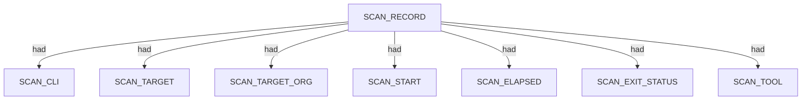
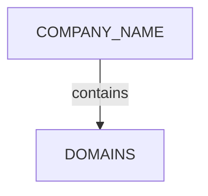
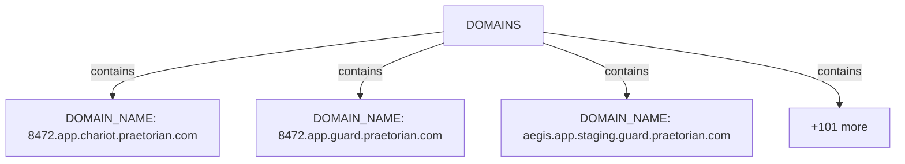
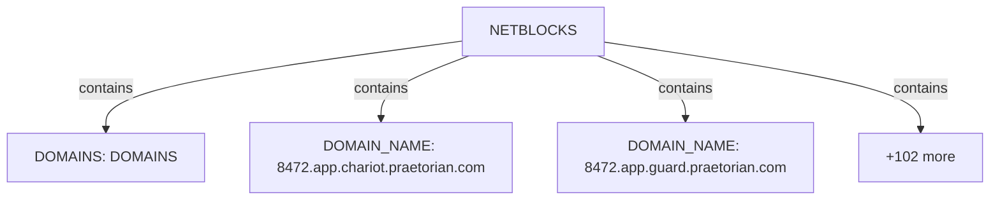
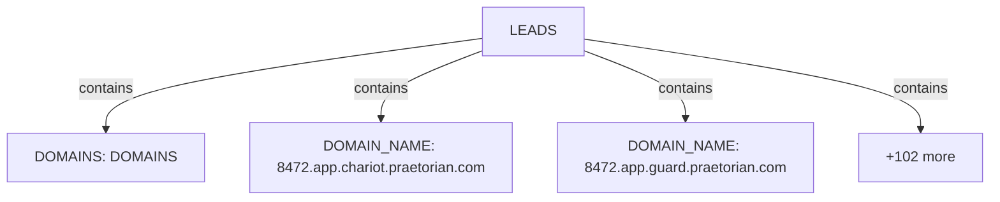
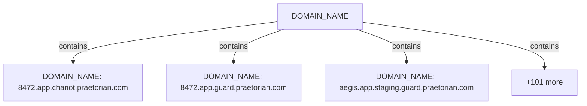

# Pius scan narrative — `crt_praetorian_ndjson`

## Introduction

Organizational attack-surface findings are grouped under the head company, with domains, affiliates, and unresolved research leads emitted per 08 rules.

## Scan

Every examination has one SCAN_RECORD with scan descriptors linked via had. This scan includes **1** Scan root node(s) (e.g. `pius:Praetorian:/mnt/c/projects/spiderfeet/.tools/pius run --org Praetorian --domain praetorian.com --plugins crt-sh --output ndjson`). Linked structures: `SCAN_CLI`, `SCAN_TARGET`, `SCAN_TARGET_ORG`, `SCAN_START`, `SCAN_ELAPSED`, `SCAN_EXIT_STATUS`.

### Structure overview

### Scan descriptors

| Nugget | Value |
| --- | --- |
| `SCAN_RECORD` | `pius:Praetorian:/mnt/c/projects/spiderfeet/.tools/pius run --org Praetorian --domain praetorian.com --plugins crt-sh --output ndjson` |

## Organization

Organisation scans root at COMPANY_NAME with category buckets for domains, netblocks, and research leads. This scan includes **1** Organization root node(s) (e.g. `Praetorian`). Linked structures: `DOMAINS`.

### Structure overview

### `DOMAINS`

| Nugget | Value |
| --- | --- |
| `DOMAIN_NAME` | `8472.app.chariot.praetorian.com` |
| `DOMAIN_NAME` | `8472.app.guard.praetorian.com` |
| `DOMAIN_NAME` | `aegis.app.staging.guard.praetorian.com` |
| `DOMAIN_NAME` | `agent-dev.chariot.praetorian.com` |
| `DOMAIN_NAME` | `agent-speculatore.praetorian.com` |
| `DOMAIN_NAME` | `agent.8472.app.chariot.praetorian.com` |
| `DOMAIN_NAME` | `agent.chariot.praetorian.com` |
| `DOMAIN_NAME` | `alice.praetorian.com` |
| `DOMAIN_NAME` | `api.chariot.praetorian.com` |
| `DOMAIN_NAME` | `api.praetorian.com` |
| `DOMAIN_NAME` | `armory.praetorian.com` |
| `DOMAIN_NAME` | `artifactory.praetorian.com` |
| `DOMAIN_NAME` | `blog-dev.praetorian.com` |
| `DOMAIN_NAME` | `blog.praetorian.com` |
| `DOMAIN_NAME` | `burp.8472.app.chariot.praetorian.com` |
| `DOMAIN_NAME` | `burp.8472.app.guard.praetorian.com` |
| `DOMAIN_NAME` | `burp.chariot.praetorian.com` |
| `DOMAIN_NAME` | `burp.prod.app.chariot.praetorian.com` |
| `DOMAIN_NAME` | `burp.prod.app.guard.praetorian.com` |
| `DOMAIN_NAME` | `capdev.chariot.praetorian.com` |
| `DOMAIN_NAME` | `chaos.praetorian.com` |
| `DOMAIN_NAME` | `chariot-comlink.praetorian.com` |
| `DOMAIN_NAME` | `chariot-comlink.staging.praetorian.com` |
| `DOMAIN_NAME` | `chariot-comlink.uat.praetorian.com` |
| `DOMAIN_NAME` | `chariot-leia.praetorian.com` |
| `DOMAIN_NAME` | `chariot-leia.staging.praetorian.com` |
| `DOMAIN_NAME` | `chariot-leia.uat.praetorian.com` |
| `DOMAIN_NAME` | `chariot-slave-one.praetorian.com` |
| `DOMAIN_NAME` | `chariot-slave-one.staging.praetorian.com` |
| `DOMAIN_NAME` | `chariot-slave-one.uat.praetorian.com` |
| `DOMAIN_NAME` | `chariot.praetorian.com` |
| `DOMAIN_NAME` | `chariot.staging.praetorian.com` |
| `DOMAIN_NAME` | `chariot.uat.praetorian.com` |
| `DOMAIN_NAME` | `chat.praetorian.com` |
| `DOMAIN_NAME` | `contentapalooza.praetorian.com` |
| `DOMAIN_NAME` | `crypto.praetorian.com` |
| `DOMAIN_NAME` | `demand.praetorian.com` |
| `DOMAIN_NAME` | `demo.chariot.praetorian.com` |
| `DOMAIN_NAME` | `dev-test0.app.staging.chariot.praetorian.com` |
| `DOMAIN_NAME` | `dev-test1.app.staging.chariot.praetorian.com` |
| `DOMAIN_NAME` | `diana.praetorian.com` |
| `DOMAIN_NAME` | `diana.staging.praetorian.com` |
| `DOMAIN_NAME` | `diana.uat.praetorian.com` |
| `DOMAIN_NAME` | `docs.chariot.praetorian.com` |
| `DOMAIN_NAME` | `docs.praetorian.com` |
| `DOMAIN_NAME` | `feedback.praetorian.com` |
| `DOMAIN_NAME` | `foxctf.praetorian.com` |
| `DOMAIN_NAME` | `future.chariot.praetorian.com` |
| `DOMAIN_NAME` | `go.praetorian.com` |
| `DOMAIN_NAME` | `guard.praetorian.com` |
| `DOMAIN_NAME` | `hof.praetorian.com` |
| `DOMAIN_NAME` | `jmukund.app.staging.chariot.praetorian.com` |
| `DOMAIN_NAME` | `joseph.app.staging.chariot.praetorian.com` |
| `DOMAIN_NAME` | `joseph.uat.app.staging.guard.praetorian.com` |
| `DOMAIN_NAME` | `jupiter-staging.praetorian.com` |
| `DOMAIN_NAME` | `jupiter.praetorian.com` |
| `DOMAIN_NAME` | `log4j.praetorian.com` |
| `DOMAIN_NAME` | `login.diana.staging.praetorian.com` |
| `DOMAIN_NAME` | `lp.praetorian.com` |
| `DOMAIN_NAME` | `luke.production.praetorian.com` |
| `DOMAIN_NAME` | `luke.staging.praetorian.com` |
| `DOMAIN_NAME` | `luke.uat.praetorian.com` |
| `DOMAIN_NAME` | `luna.praetorian.com` |
| `DOMAIN_NAME` | `mars.praetorian.com` |
| `DOMAIN_NAME` | `mastermind.praetorian.com` |
| `DOMAIN_NAME` | `merch.praetorian.com` |
| `DOMAIN_NAME` | `mlb.praetorian.com` |
| `DOMAIN_NAME` | `neptune.praetorian.com` |
| `DOMAIN_NAME` | `oob.chariot.praetorian.com` |
| `DOMAIN_NAME` | `oob.guard.praetorian.com` |
| `DOMAIN_NAME` | `peter-test-redirect.praetorian.com` |
| `DOMAIN_NAME` | `pm-bounces.praetorian.com` |
| `DOMAIN_NAME` | `portal.praetorian.com` |
| `DOMAIN_NAME` | `praetorian-cloudfront-redirect-test.praetorian.com` |
| `DOMAIN_NAME` | `praetorian.com` |
| `DOMAIN_NAME` | `preview.chariot.praetorian.com` |
| `DOMAIN_NAME` | `pwnable.praetorian.com` |
| `DOMAIN_NAME` | `redirect-with-cloudfront.praetorian.com` |
| `DOMAIN_NAME` | `rota.praetorian.com` |
| `DOMAIN_NAME` | `rtv.praetorian.com` |
| `DOMAIN_NAME` | `securetransfer.praetorian.com` |
| `DOMAIN_NAME` | `signup.praetorian.com` |
| `DOMAIN_NAME` | `speculae-gcp.praetorian.com` |
| `DOMAIN_NAME` | `speculae.praetorian.com` |
| `DOMAIN_NAME` | `sso.8472.app.guard.praetorian.com` |
| `DOMAIN_NAME` | `sso.guard.praetorian.com` |
| `DOMAIN_NAME` | `sso.uat.app.staging.guard.praetorian.com` |
| `DOMAIN_NAME` | `start.praetorian.com` |
| `DOMAIN_NAME` | `support.praetorian.com` |
| `DOMAIN_NAME` | `tesserarius-stage.praetorian.com` |
| `DOMAIN_NAME` | `test.app.staging.chariot.praetorian.com` |
| `DOMAIN_NAME` | `trust.praetorian.com` |
| `DOMAIN_NAME` | `uat.app.staging.chariot.praetorian.com` |
| `DOMAIN_NAME` | `uat.app.staging.guard.praetorian.com` |
| `DOMAIN_NAME` | `uat.chariot.praetorian.com` |
| `DOMAIN_NAME` | `webmail.praetorian.com` |
| `DOMAIN_NAME` | `www.chat.praetorian.com` |
| `DOMAIN_NAME` | `www.mars.praetorian.com` |
| `DOMAIN_NAME` | `www.neptune.praetorian.com` |
| `DOMAIN_NAME` | `www.praetorian.com` |
| `DOMAIN_NAME` | `www.securetransfer.praetorian.com` |
| `DOMAIN_NAME` | `www.support.praetorian.com` |
| `DOMAIN_NAME` | `www2.praetorian.com` |
| `DOMAIN_NAME` | `www3.praetorian.com` |

### `NETBLOCKS`

| Nugget | Value |
| --- | --- |
| `DOMAINS` | `DOMAINS` |
| `DOMAIN_NAME` | `8472.app.chariot.praetorian.com` |
| `DOMAIN_NAME` | `8472.app.guard.praetorian.com` |
| `DOMAIN_NAME` | `aegis.app.staging.guard.praetorian.com` |
| `DOMAIN_NAME` | `agent-dev.chariot.praetorian.com` |
| `DOMAIN_NAME` | `agent-speculatore.praetorian.com` |
| `DOMAIN_NAME` | `agent.8472.app.chariot.praetorian.com` |
| `DOMAIN_NAME` | `agent.chariot.praetorian.com` |
| `DOMAIN_NAME` | `alice.praetorian.com` |
| `DOMAIN_NAME` | `api.chariot.praetorian.com` |
| `DOMAIN_NAME` | `api.praetorian.com` |
| `DOMAIN_NAME` | `armory.praetorian.com` |
| `DOMAIN_NAME` | `artifactory.praetorian.com` |
| `DOMAIN_NAME` | `blog-dev.praetorian.com` |
| `DOMAIN_NAME` | `blog.praetorian.com` |
| `DOMAIN_NAME` | `burp.8472.app.chariot.praetorian.com` |
| `DOMAIN_NAME` | `burp.8472.app.guard.praetorian.com` |
| `DOMAIN_NAME` | `burp.chariot.praetorian.com` |
| `DOMAIN_NAME` | `burp.prod.app.chariot.praetorian.com` |
| `DOMAIN_NAME` | `burp.prod.app.guard.praetorian.com` |
| `DOMAIN_NAME` | `capdev.chariot.praetorian.com` |
| `DOMAIN_NAME` | `chaos.praetorian.com` |
| `DOMAIN_NAME` | `chariot-comlink.praetorian.com` |
| `DOMAIN_NAME` | `chariot-comlink.staging.praetorian.com` |
| `DOMAIN_NAME` | `chariot-comlink.uat.praetorian.com` |
| `DOMAIN_NAME` | `chariot-leia.praetorian.com` |
| `DOMAIN_NAME` | `chariot-leia.staging.praetorian.com` |
| `DOMAIN_NAME` | `chariot-leia.uat.praetorian.com` |
| `DOMAIN_NAME` | `chariot-slave-one.praetorian.com` |
| `DOMAIN_NAME` | `chariot-slave-one.staging.praetorian.com` |
| `DOMAIN_NAME` | `chariot-slave-one.uat.praetorian.com` |
| `DOMAIN_NAME` | `chariot.praetorian.com` |
| `DOMAIN_NAME` | `chariot.staging.praetorian.com` |
| `DOMAIN_NAME` | `chariot.uat.praetorian.com` |
| `DOMAIN_NAME` | `chat.praetorian.com` |
| `DOMAIN_NAME` | `contentapalooza.praetorian.com` |
| `DOMAIN_NAME` | `crypto.praetorian.com` |
| `DOMAIN_NAME` | `demand.praetorian.com` |
| `DOMAIN_NAME` | `demo.chariot.praetorian.com` |
| `DOMAIN_NAME` | `dev-test0.app.staging.chariot.praetorian.com` |
| `DOMAIN_NAME` | `dev-test1.app.staging.chariot.praetorian.com` |
| `DOMAIN_NAME` | `diana.praetorian.com` |
| `DOMAIN_NAME` | `diana.staging.praetorian.com` |
| `DOMAIN_NAME` | `diana.uat.praetorian.com` |
| `DOMAIN_NAME` | `docs.chariot.praetorian.com` |
| `DOMAIN_NAME` | `docs.praetorian.com` |
| `DOMAIN_NAME` | `feedback.praetorian.com` |
| `DOMAIN_NAME` | `foxctf.praetorian.com` |
| `DOMAIN_NAME` | `future.chariot.praetorian.com` |
| `DOMAIN_NAME` | `go.praetorian.com` |
| `DOMAIN_NAME` | `guard.praetorian.com` |
| `DOMAIN_NAME` | `hof.praetorian.com` |
| `DOMAIN_NAME` | `jmukund.app.staging.chariot.praetorian.com` |
| `DOMAIN_NAME` | `joseph.app.staging.chariot.praetorian.com` |
| `DOMAIN_NAME` | `joseph.uat.app.staging.guard.praetorian.com` |
| `DOMAIN_NAME` | `jupiter-staging.praetorian.com` |
| `DOMAIN_NAME` | `jupiter.praetorian.com` |
| `DOMAIN_NAME` | `log4j.praetorian.com` |
| `DOMAIN_NAME` | `login.diana.staging.praetorian.com` |
| `DOMAIN_NAME` | `lp.praetorian.com` |
| `DOMAIN_NAME` | `luke.production.praetorian.com` |
| `DOMAIN_NAME` | `luke.staging.praetorian.com` |
| `DOMAIN_NAME` | `luke.uat.praetorian.com` |
| `DOMAIN_NAME` | `luna.praetorian.com` |
| `DOMAIN_NAME` | `mars.praetorian.com` |
| `DOMAIN_NAME` | `mastermind.praetorian.com` |
| `DOMAIN_NAME` | `merch.praetorian.com` |
| `DOMAIN_NAME` | `mlb.praetorian.com` |
| `DOMAIN_NAME` | `neptune.praetorian.com` |
| `DOMAIN_NAME` | `oob.chariot.praetorian.com` |
| `DOMAIN_NAME` | `oob.guard.praetorian.com` |
| `DOMAIN_NAME` | `peter-test-redirect.praetorian.com` |
| `DOMAIN_NAME` | `pm-bounces.praetorian.com` |
| `DOMAIN_NAME` | `portal.praetorian.com` |
| `DOMAIN_NAME` | `praetorian-cloudfront-redirect-test.praetorian.com` |
| `DOMAIN_NAME` | `praetorian.com` |
| `DOMAIN_NAME` | `preview.chariot.praetorian.com` |
| `DOMAIN_NAME` | `pwnable.praetorian.com` |
| `DOMAIN_NAME` | `redirect-with-cloudfront.praetorian.com` |
| `DOMAIN_NAME` | `rota.praetorian.com` |
| `DOMAIN_NAME` | `rtv.praetorian.com` |
| `DOMAIN_NAME` | `securetransfer.praetorian.com` |
| `DOMAIN_NAME` | `signup.praetorian.com` |
| `DOMAIN_NAME` | `speculae-gcp.praetorian.com` |
| `DOMAIN_NAME` | `speculae.praetorian.com` |
| `DOMAIN_NAME` | `sso.8472.app.guard.praetorian.com` |
| `DOMAIN_NAME` | `sso.guard.praetorian.com` |
| `DOMAIN_NAME` | `sso.uat.app.staging.guard.praetorian.com` |
| `DOMAIN_NAME` | `start.praetorian.com` |
| `DOMAIN_NAME` | `support.praetorian.com` |
| `DOMAIN_NAME` | `tesserarius-stage.praetorian.com` |
| `DOMAIN_NAME` | `test.app.staging.chariot.praetorian.com` |
| `DOMAIN_NAME` | `trust.praetorian.com` |
| `DOMAIN_NAME` | `uat.app.staging.chariot.praetorian.com` |
| `DOMAIN_NAME` | `uat.app.staging.guard.praetorian.com` |
| `DOMAIN_NAME` | `uat.chariot.praetorian.com` |
| `DOMAIN_NAME` | `webmail.praetorian.com` |
| `DOMAIN_NAME` | `www.chat.praetorian.com` |
| `DOMAIN_NAME` | `www.mars.praetorian.com` |
| `DOMAIN_NAME` | `www.neptune.praetorian.com` |
| `DOMAIN_NAME` | `www.praetorian.com` |
| `DOMAIN_NAME` | `www.securetransfer.praetorian.com` |
| `DOMAIN_NAME` | `www.support.praetorian.com` |
| `DOMAIN_NAME` | `www2.praetorian.com` |
| `DOMAIN_NAME` | `www3.praetorian.com` |

### `LEADS`

| Nugget | Value |
| --- | --- |
| `DOMAINS` | `DOMAINS` |
| `DOMAIN_NAME` | `8472.app.chariot.praetorian.com` |
| `DOMAIN_NAME` | `8472.app.guard.praetorian.com` |
| `DOMAIN_NAME` | `aegis.app.staging.guard.praetorian.com` |
| `DOMAIN_NAME` | `agent-dev.chariot.praetorian.com` |
| `DOMAIN_NAME` | `agent-speculatore.praetorian.com` |
| `DOMAIN_NAME` | `agent.8472.app.chariot.praetorian.com` |
| `DOMAIN_NAME` | `agent.chariot.praetorian.com` |
| `DOMAIN_NAME` | `alice.praetorian.com` |
| `DOMAIN_NAME` | `api.chariot.praetorian.com` |
| `DOMAIN_NAME` | `api.praetorian.com` |
| `DOMAIN_NAME` | `armory.praetorian.com` |
| `DOMAIN_NAME` | `artifactory.praetorian.com` |
| `DOMAIN_NAME` | `blog-dev.praetorian.com` |
| `DOMAIN_NAME` | `blog.praetorian.com` |
| `DOMAIN_NAME` | `burp.8472.app.chariot.praetorian.com` |
| `DOMAIN_NAME` | `burp.8472.app.guard.praetorian.com` |
| `DOMAIN_NAME` | `burp.chariot.praetorian.com` |
| `DOMAIN_NAME` | `burp.prod.app.chariot.praetorian.com` |
| `DOMAIN_NAME` | `burp.prod.app.guard.praetorian.com` |
| `DOMAIN_NAME` | `capdev.chariot.praetorian.com` |
| `DOMAIN_NAME` | `chaos.praetorian.com` |
| `DOMAIN_NAME` | `chariot-comlink.praetorian.com` |
| `DOMAIN_NAME` | `chariot-comlink.staging.praetorian.com` |
| `DOMAIN_NAME` | `chariot-comlink.uat.praetorian.com` |
| `DOMAIN_NAME` | `chariot-leia.praetorian.com` |
| `DOMAIN_NAME` | `chariot-leia.staging.praetorian.com` |
| `DOMAIN_NAME` | `chariot-leia.uat.praetorian.com` |
| `DOMAIN_NAME` | `chariot-slave-one.praetorian.com` |
| `DOMAIN_NAME` | `chariot-slave-one.staging.praetorian.com` |
| `DOMAIN_NAME` | `chariot-slave-one.uat.praetorian.com` |
| `DOMAIN_NAME` | `chariot.praetorian.com` |
| `DOMAIN_NAME` | `chariot.staging.praetorian.com` |
| `DOMAIN_NAME` | `chariot.uat.praetorian.com` |
| `DOMAIN_NAME` | `chat.praetorian.com` |
| `DOMAIN_NAME` | `contentapalooza.praetorian.com` |
| `DOMAIN_NAME` | `crypto.praetorian.com` |
| `DOMAIN_NAME` | `demand.praetorian.com` |
| `DOMAIN_NAME` | `demo.chariot.praetorian.com` |
| `DOMAIN_NAME` | `dev-test0.app.staging.chariot.praetorian.com` |
| `DOMAIN_NAME` | `dev-test1.app.staging.chariot.praetorian.com` |
| `DOMAIN_NAME` | `diana.praetorian.com` |
| `DOMAIN_NAME` | `diana.staging.praetorian.com` |
| `DOMAIN_NAME` | `diana.uat.praetorian.com` |
| `DOMAIN_NAME` | `docs.chariot.praetorian.com` |
| `DOMAIN_NAME` | `docs.praetorian.com` |
| `DOMAIN_NAME` | `feedback.praetorian.com` |
| `DOMAIN_NAME` | `foxctf.praetorian.com` |
| `DOMAIN_NAME` | `future.chariot.praetorian.com` |
| `DOMAIN_NAME` | `go.praetorian.com` |
| `DOMAIN_NAME` | `guard.praetorian.com` |
| `DOMAIN_NAME` | `hof.praetorian.com` |
| `DOMAIN_NAME` | `jmukund.app.staging.chariot.praetorian.com` |
| `DOMAIN_NAME` | `joseph.app.staging.chariot.praetorian.com` |
| `DOMAIN_NAME` | `joseph.uat.app.staging.guard.praetorian.com` |
| `DOMAIN_NAME` | `jupiter-staging.praetorian.com` |
| `DOMAIN_NAME` | `jupiter.praetorian.com` |
| `DOMAIN_NAME` | `log4j.praetorian.com` |
| `DOMAIN_NAME` | `login.diana.staging.praetorian.com` |
| `DOMAIN_NAME` | `lp.praetorian.com` |
| `DOMAIN_NAME` | `luke.production.praetorian.com` |
| `DOMAIN_NAME` | `luke.staging.praetorian.com` |
| `DOMAIN_NAME` | `luke.uat.praetorian.com` |
| `DOMAIN_NAME` | `luna.praetorian.com` |
| `DOMAIN_NAME` | `mars.praetorian.com` |
| `DOMAIN_NAME` | `mastermind.praetorian.com` |
| `DOMAIN_NAME` | `merch.praetorian.com` |
| `DOMAIN_NAME` | `mlb.praetorian.com` |
| `DOMAIN_NAME` | `neptune.praetorian.com` |
| `DOMAIN_NAME` | `oob.chariot.praetorian.com` |
| `DOMAIN_NAME` | `oob.guard.praetorian.com` |
| `DOMAIN_NAME` | `peter-test-redirect.praetorian.com` |
| `DOMAIN_NAME` | `pm-bounces.praetorian.com` |
| `DOMAIN_NAME` | `portal.praetorian.com` |
| `DOMAIN_NAME` | `praetorian-cloudfront-redirect-test.praetorian.com` |
| `DOMAIN_NAME` | `praetorian.com` |
| `DOMAIN_NAME` | `preview.chariot.praetorian.com` |
| `DOMAIN_NAME` | `pwnable.praetorian.com` |
| `DOMAIN_NAME` | `redirect-with-cloudfront.praetorian.com` |
| `DOMAIN_NAME` | `rota.praetorian.com` |
| `DOMAIN_NAME` | `rtv.praetorian.com` |
| `DOMAIN_NAME` | `securetransfer.praetorian.com` |
| `DOMAIN_NAME` | `signup.praetorian.com` |
| `DOMAIN_NAME` | `speculae-gcp.praetorian.com` |
| `DOMAIN_NAME` | `speculae.praetorian.com` |
| `DOMAIN_NAME` | `sso.8472.app.guard.praetorian.com` |
| `DOMAIN_NAME` | `sso.guard.praetorian.com` |
| `DOMAIN_NAME` | `sso.uat.app.staging.guard.praetorian.com` |
| `DOMAIN_NAME` | `start.praetorian.com` |
| `DOMAIN_NAME` | `support.praetorian.com` |
| `DOMAIN_NAME` | `tesserarius-stage.praetorian.com` |
| `DOMAIN_NAME` | `test.app.staging.chariot.praetorian.com` |
| `DOMAIN_NAME` | `trust.praetorian.com` |
| `DOMAIN_NAME` | `uat.app.staging.chariot.praetorian.com` |
| `DOMAIN_NAME` | `uat.app.staging.guard.praetorian.com` |
| `DOMAIN_NAME` | `uat.chariot.praetorian.com` |
| `DOMAIN_NAME` | `webmail.praetorian.com` |
| `DOMAIN_NAME` | `www.chat.praetorian.com` |
| `DOMAIN_NAME` | `www.mars.praetorian.com` |
| `DOMAIN_NAME` | `www.neptune.praetorian.com` |
| `DOMAIN_NAME` | `www.praetorian.com` |
| `DOMAIN_NAME` | `www.securetransfer.praetorian.com` |
| `DOMAIN_NAME` | `www.support.praetorian.com` |
| `DOMAIN_NAME` | `www2.praetorian.com` |
| `DOMAIN_NAME` | `www3.praetorian.com` |

## Domains

Apex DOMAIN_NAME entities contain subdomain DOMAIN_NAME children; descriptors capture discovery mode, sources, and liveness. This scan includes **104** Domains root node(s) (e.g. `jupiter.praetorian.com`, `portal.praetorian.com`, `www.praetorian.com`). Linked structures: no child categories.

### Structure overview

### `DOMAIN_NAME`

| Nugget | Value |
| --- | --- |
| `DOMAIN_NAME` | `8472.app.chariot.praetorian.com` |
| `DOMAIN_NAME` | `8472.app.guard.praetorian.com` |
| `DOMAIN_NAME` | `aegis.app.staging.guard.praetorian.com` |
| `DOMAIN_NAME` | `agent-dev.chariot.praetorian.com` |
| `DOMAIN_NAME` | `agent-speculatore.praetorian.com` |
| `DOMAIN_NAME` | `agent.8472.app.chariot.praetorian.com` |
| `DOMAIN_NAME` | `agent.chariot.praetorian.com` |
| `DOMAIN_NAME` | `alice.praetorian.com` |
| `DOMAIN_NAME` | `api.chariot.praetorian.com` |
| `DOMAIN_NAME` | `api.praetorian.com` |
| `DOMAIN_NAME` | `armory.praetorian.com` |
| `DOMAIN_NAME` | `artifactory.praetorian.com` |
| `DOMAIN_NAME` | `blog-dev.praetorian.com` |
| `DOMAIN_NAME` | `blog.praetorian.com` |
| `DOMAIN_NAME` | `burp.8472.app.chariot.praetorian.com` |
| `DOMAIN_NAME` | `burp.8472.app.guard.praetorian.com` |
| `DOMAIN_NAME` | `burp.chariot.praetorian.com` |
| `DOMAIN_NAME` | `burp.prod.app.chariot.praetorian.com` |
| `DOMAIN_NAME` | `burp.prod.app.guard.praetorian.com` |
| `DOMAIN_NAME` | `capdev.chariot.praetorian.com` |
| `DOMAIN_NAME` | `chaos.praetorian.com` |
| `DOMAIN_NAME` | `chariot-comlink.praetorian.com` |
| `DOMAIN_NAME` | `chariot-comlink.staging.praetorian.com` |
| `DOMAIN_NAME` | `chariot-comlink.uat.praetorian.com` |
| `DOMAIN_NAME` | `chariot-leia.praetorian.com` |
| `DOMAIN_NAME` | `chariot-leia.staging.praetorian.com` |
| `DOMAIN_NAME` | `chariot-leia.uat.praetorian.com` |
| `DOMAIN_NAME` | `chariot-slave-one.praetorian.com` |
| `DOMAIN_NAME` | `chariot-slave-one.staging.praetorian.com` |
| `DOMAIN_NAME` | `chariot-slave-one.uat.praetorian.com` |
| `DOMAIN_NAME` | `chariot.praetorian.com` |
| `DOMAIN_NAME` | `chariot.staging.praetorian.com` |
| `DOMAIN_NAME` | `chariot.uat.praetorian.com` |
| `DOMAIN_NAME` | `chat.praetorian.com` |
| `DOMAIN_NAME` | `contentapalooza.praetorian.com` |
| `DOMAIN_NAME` | `crypto.praetorian.com` |
| `DOMAIN_NAME` | `demand.praetorian.com` |
| `DOMAIN_NAME` | `demo.chariot.praetorian.com` |
| `DOMAIN_NAME` | `dev-test0.app.staging.chariot.praetorian.com` |
| `DOMAIN_NAME` | `dev-test1.app.staging.chariot.praetorian.com` |
| `DOMAIN_NAME` | `diana.praetorian.com` |
| `DOMAIN_NAME` | `diana.staging.praetorian.com` |
| `DOMAIN_NAME` | `diana.uat.praetorian.com` |
| `DOMAIN_NAME` | `docs.chariot.praetorian.com` |
| `DOMAIN_NAME` | `docs.praetorian.com` |
| `DOMAIN_NAME` | `feedback.praetorian.com` |
| `DOMAIN_NAME` | `foxctf.praetorian.com` |
| `DOMAIN_NAME` | `future.chariot.praetorian.com` |
| `DOMAIN_NAME` | `go.praetorian.com` |
| `DOMAIN_NAME` | `guard.praetorian.com` |
| `DOMAIN_NAME` | `hof.praetorian.com` |
| `DOMAIN_NAME` | `jmukund.app.staging.chariot.praetorian.com` |
| `DOMAIN_NAME` | `joseph.app.staging.chariot.praetorian.com` |
| `DOMAIN_NAME` | `joseph.uat.app.staging.guard.praetorian.com` |
| `DOMAIN_NAME` | `jupiter-staging.praetorian.com` |
| `DOMAIN_NAME` | `jupiter.praetorian.com` |
| `DOMAIN_NAME` | `log4j.praetorian.com` |
| `DOMAIN_NAME` | `login.diana.staging.praetorian.com` |
| `DOMAIN_NAME` | `lp.praetorian.com` |
| `DOMAIN_NAME` | `luke.production.praetorian.com` |
| `DOMAIN_NAME` | `luke.staging.praetorian.com` |
| `DOMAIN_NAME` | `luke.uat.praetorian.com` |
| `DOMAIN_NAME` | `luna.praetorian.com` |
| `DOMAIN_NAME` | `mars.praetorian.com` |
| `DOMAIN_NAME` | `mastermind.praetorian.com` |
| `DOMAIN_NAME` | `merch.praetorian.com` |
| `DOMAIN_NAME` | `mlb.praetorian.com` |
| `DOMAIN_NAME` | `neptune.praetorian.com` |
| `DOMAIN_NAME` | `oob.chariot.praetorian.com` |
| `DOMAIN_NAME` | `oob.guard.praetorian.com` |
| `DOMAIN_NAME` | `peter-test-redirect.praetorian.com` |
| `DOMAIN_NAME` | `pm-bounces.praetorian.com` |
| `DOMAIN_NAME` | `portal.praetorian.com` |
| `DOMAIN_NAME` | `praetorian-cloudfront-redirect-test.praetorian.com` |
| `DOMAIN_NAME` | `praetorian.com` |
| `DOMAIN_NAME` | `preview.chariot.praetorian.com` |
| `DOMAIN_NAME` | `pwnable.praetorian.com` |
| `DOMAIN_NAME` | `redirect-with-cloudfront.praetorian.com` |
| `DOMAIN_NAME` | `rota.praetorian.com` |
| `DOMAIN_NAME` | `rtv.praetorian.com` |
| `DOMAIN_NAME` | `securetransfer.praetorian.com` |
| `DOMAIN_NAME` | `signup.praetorian.com` |
| `DOMAIN_NAME` | `speculae-gcp.praetorian.com` |
| `DOMAIN_NAME` | `speculae.praetorian.com` |
| `DOMAIN_NAME` | `sso.8472.app.guard.praetorian.com` |
| `DOMAIN_NAME` | `sso.guard.praetorian.com` |
| `DOMAIN_NAME` | `sso.uat.app.staging.guard.praetorian.com` |
| `DOMAIN_NAME` | `start.praetorian.com` |
| `DOMAIN_NAME` | `support.praetorian.com` |
| `DOMAIN_NAME` | `tesserarius-stage.praetorian.com` |
| `DOMAIN_NAME` | `test.app.staging.chariot.praetorian.com` |
| `DOMAIN_NAME` | `trust.praetorian.com` |
| `DOMAIN_NAME` | `uat.app.staging.chariot.praetorian.com` |
| `DOMAIN_NAME` | `uat.app.staging.guard.praetorian.com` |
| `DOMAIN_NAME` | `uat.chariot.praetorian.com` |
| `DOMAIN_NAME` | `webmail.praetorian.com` |
| `DOMAIN_NAME` | `www.chat.praetorian.com` |
| `DOMAIN_NAME` | `www.mars.praetorian.com` |
| `DOMAIN_NAME` | `www.neptune.praetorian.com` |
| `DOMAIN_NAME` | `www.praetorian.com` |
| `DOMAIN_NAME` | `www.securetransfer.praetorian.com` |
| `DOMAIN_NAME` | `www.support.praetorian.com` |
| `DOMAIN_NAME` | `www2.praetorian.com` |
| `DOMAIN_NAME` | `www3.praetorian.com` |

## Conclusion

See the appendix for the full node and edge inventory.

## Appendix

### Nodes

| Nugget | Value |
| --- | --- |
| `COMPANY_NAME` | `Praetorian` |
| `DISCOVERY_METHOD` | `certificate-transparency` |
| `DOMAINS` | `DOMAINS` |
| `DOMAIN_NAME` | `8472.app.chariot.praetorian.com` |
| `DOMAIN_NAME` | `8472.app.guard.praetorian.com` |
| `DOMAIN_NAME` | `aegis.app.staging.guard.praetorian.com` |
| `DOMAIN_NAME` | `agent-dev.chariot.praetorian.com` |
| `DOMAIN_NAME` | `agent-speculatore.praetorian.com` |
| `DOMAIN_NAME` | `agent.8472.app.chariot.praetorian.com` |
| `DOMAIN_NAME` | `agent.chariot.praetorian.com` |
| `DOMAIN_NAME` | `alice.praetorian.com` |
| `DOMAIN_NAME` | `api.chariot.praetorian.com` |
| `DOMAIN_NAME` | `api.praetorian.com` |
| `DOMAIN_NAME` | `armory.praetorian.com` |
| `DOMAIN_NAME` | `artifactory.praetorian.com` |
| `DOMAIN_NAME` | `blog-dev.praetorian.com` |
| `DOMAIN_NAME` | `blog.praetorian.com` |
| `DOMAIN_NAME` | `burp.8472.app.chariot.praetorian.com` |
| `DOMAIN_NAME` | `burp.8472.app.guard.praetorian.com` |
| `DOMAIN_NAME` | `burp.chariot.praetorian.com` |
| `DOMAIN_NAME` | `burp.prod.app.chariot.praetorian.com` |
| `DOMAIN_NAME` | `burp.prod.app.guard.praetorian.com` |
| `DOMAIN_NAME` | `capdev.chariot.praetorian.com` |
| `DOMAIN_NAME` | `chaos.praetorian.com` |
| `DOMAIN_NAME` | `chariot-comlink.praetorian.com` |
| `DOMAIN_NAME` | `chariot-comlink.staging.praetorian.com` |
| `DOMAIN_NAME` | `chariot-comlink.uat.praetorian.com` |
| `DOMAIN_NAME` | `chariot-leia.praetorian.com` |
| `DOMAIN_NAME` | `chariot-leia.staging.praetorian.com` |
| `DOMAIN_NAME` | `chariot-leia.uat.praetorian.com` |
| `DOMAIN_NAME` | `chariot-slave-one.praetorian.com` |
| `DOMAIN_NAME` | `chariot-slave-one.staging.praetorian.com` |
| `DOMAIN_NAME` | `chariot-slave-one.uat.praetorian.com` |
| `DOMAIN_NAME` | `chariot.praetorian.com` |
| `DOMAIN_NAME` | `chariot.staging.praetorian.com` |
| `DOMAIN_NAME` | `chariot.uat.praetorian.com` |
| `DOMAIN_NAME` | `chat.praetorian.com` |
| `DOMAIN_NAME` | `contentapalooza.praetorian.com` |
| `DOMAIN_NAME` | `crypto.praetorian.com` |
| `DOMAIN_NAME` | `demand.praetorian.com` |
| `DOMAIN_NAME` | `demo.chariot.praetorian.com` |
| `DOMAIN_NAME` | `dev-test0.app.staging.chariot.praetorian.com` |
| `DOMAIN_NAME` | `dev-test1.app.staging.chariot.praetorian.com` |
| `DOMAIN_NAME` | `diana.praetorian.com` |
| `DOMAIN_NAME` | `diana.staging.praetorian.com` |
| `DOMAIN_NAME` | `diana.uat.praetorian.com` |
| `DOMAIN_NAME` | `docs.chariot.praetorian.com` |
| `DOMAIN_NAME` | `docs.praetorian.com` |
| `DOMAIN_NAME` | `feedback.praetorian.com` |
| `DOMAIN_NAME` | `foxctf.praetorian.com` |
| `DOMAIN_NAME` | `future.chariot.praetorian.com` |
| `DOMAIN_NAME` | `go.praetorian.com` |
| `DOMAIN_NAME` | `guard.praetorian.com` |
| `DOMAIN_NAME` | `hof.praetorian.com` |
| `DOMAIN_NAME` | `jmukund.app.staging.chariot.praetorian.com` |
| `DOMAIN_NAME` | `joseph.app.staging.chariot.praetorian.com` |
| `DOMAIN_NAME` | `joseph.uat.app.staging.guard.praetorian.com` |
| `DOMAIN_NAME` | `jupiter-staging.praetorian.com` |
| `DOMAIN_NAME` | `jupiter.praetorian.com` |
| `DOMAIN_NAME` | `log4j.praetorian.com` |
| `DOMAIN_NAME` | `login.diana.staging.praetorian.com` |
| `DOMAIN_NAME` | `lp.praetorian.com` |
| `DOMAIN_NAME` | `luke.production.praetorian.com` |
| `DOMAIN_NAME` | `luke.staging.praetorian.com` |
| `DOMAIN_NAME` | `luke.uat.praetorian.com` |
| `DOMAIN_NAME` | `luna.praetorian.com` |
| `DOMAIN_NAME` | `mars.praetorian.com` |
| `DOMAIN_NAME` | `mastermind.praetorian.com` |
| `DOMAIN_NAME` | `merch.praetorian.com` |
| `DOMAIN_NAME` | `mlb.praetorian.com` |
| `DOMAIN_NAME` | `neptune.praetorian.com` |
| `DOMAIN_NAME` | `oob.chariot.praetorian.com` |
| `DOMAIN_NAME` | `oob.guard.praetorian.com` |
| `DOMAIN_NAME` | `peter-test-redirect.praetorian.com` |
| `DOMAIN_NAME` | `pm-bounces.praetorian.com` |
| `DOMAIN_NAME` | `portal.praetorian.com` |
| `DOMAIN_NAME` | `praetorian-cloudfront-redirect-test.praetorian.com` |
| `DOMAIN_NAME` | `praetorian.com` |
| `DOMAIN_NAME` | `preview.chariot.praetorian.com` |
| `DOMAIN_NAME` | `pwnable.praetorian.com` |
| `DOMAIN_NAME` | `redirect-with-cloudfront.praetorian.com` |
| `DOMAIN_NAME` | `rota.praetorian.com` |
| `DOMAIN_NAME` | `rtv.praetorian.com` |
| `DOMAIN_NAME` | `securetransfer.praetorian.com` |
| `DOMAIN_NAME` | `signup.praetorian.com` |
| `DOMAIN_NAME` | `speculae-gcp.praetorian.com` |
| `DOMAIN_NAME` | `speculae.praetorian.com` |
| `DOMAIN_NAME` | `sso.8472.app.guard.praetorian.com` |
| `DOMAIN_NAME` | `sso.guard.praetorian.com` |
| `DOMAIN_NAME` | `sso.uat.app.staging.guard.praetorian.com` |
| `DOMAIN_NAME` | `start.praetorian.com` |
| `DOMAIN_NAME` | `support.praetorian.com` |
| `DOMAIN_NAME` | `tesserarius-stage.praetorian.com` |
| `DOMAIN_NAME` | `test.app.staging.chariot.praetorian.com` |
| `DOMAIN_NAME` | `trust.praetorian.com` |
| `DOMAIN_NAME` | `uat.app.staging.chariot.praetorian.com` |
| `DOMAIN_NAME` | `uat.app.staging.guard.praetorian.com` |
| `DOMAIN_NAME` | `uat.chariot.praetorian.com` |
| `DOMAIN_NAME` | `webmail.praetorian.com` |
| `DOMAIN_NAME` | `www.chat.praetorian.com` |
| `DOMAIN_NAME` | `www.mars.praetorian.com` |
| `DOMAIN_NAME` | `www.neptune.praetorian.com` |
| `DOMAIN_NAME` | `www.praetorian.com` |
| `DOMAIN_NAME` | `www.securetransfer.praetorian.com` |
| `DOMAIN_NAME` | `www.support.praetorian.com` |
| `DOMAIN_NAME` | `www2.praetorian.com` |
| `DOMAIN_NAME` | `www3.praetorian.com` |
| `DOMAIN_NAME_PARENT` | `8472.app.chariot.praetorian.com` |
| `DOMAIN_NAME_PARENT` | `8472.app.guard.praetorian.com` |
| `DOMAIN_NAME_PARENT` | `app.chariot.praetorian.com` |
| `DOMAIN_NAME_PARENT` | `app.guard.praetorian.com` |
| `DOMAIN_NAME_PARENT` | `app.staging.chariot.praetorian.com` |
| `DOMAIN_NAME_PARENT` | `app.staging.guard.praetorian.com` |
| `DOMAIN_NAME_PARENT` | `chariot.praetorian.com` |
| `DOMAIN_NAME_PARENT` | `chat.praetorian.com` |
| `DOMAIN_NAME_PARENT` | `diana.staging.praetorian.com` |
| `DOMAIN_NAME_PARENT` | `guard.praetorian.com` |
| `DOMAIN_NAME_PARENT` | `mars.praetorian.com` |
| `DOMAIN_NAME_PARENT` | `neptune.praetorian.com` |
| `DOMAIN_NAME_PARENT` | `praetorian.com` |
| `DOMAIN_NAME_PARENT` | `prod.app.chariot.praetorian.com` |
| `DOMAIN_NAME_PARENT` | `prod.app.guard.praetorian.com` |
| `DOMAIN_NAME_PARENT` | `production.praetorian.com` |
| `DOMAIN_NAME_PARENT` | `securetransfer.praetorian.com` |
| `DOMAIN_NAME_PARENT` | `staging.praetorian.com` |
| `DOMAIN_NAME_PARENT` | `support.praetorian.com` |
| `DOMAIN_NAME_PARENT` | `uat.app.staging.guard.praetorian.com` |
| `DOMAIN_NAME_PARENT` | `uat.praetorian.com` |
| `REVIEW_STATUS` | `confirmed` |
| `SCAN_CLI` | `/mnt/c/projects/spiderfeet/.tools/pius run --org Praetorian --domain praetorian.com --plugins crt-sh --output ndjson` |
| `SCAN_ELAPSED` | `12.407` |
| `SCAN_EXIT_STATUS` | `0` |
| `SCAN_RECORD` | `pius:Praetorian:/mnt/c/projects/spiderfeet/.tools/pius run --org Praetorian --domain praetorian.com --plugins crt-sh --output ndjson` |
| `SCAN_START` | `2026-06-30T04:09:26.834504+00:00` |
| `SCAN_TARGET` | `praetorian.com` |
| `SCAN_TARGET_ORG` | `Praetorian` |
| `SCAN_TOOL` | `pius` |

### Edges

| Source | Relation | Target |
| --- | --- | --- |
| `SCAN_RECORD` | `had` | `SCAN_CLI` |
| `SCAN_RECORD` | `had` | `SCAN_TARGET` |
| `SCAN_RECORD` | `had` | `SCAN_TARGET_ORG` |
| `SCAN_RECORD` | `had` | `SCAN_START` |
| `SCAN_RECORD` | `had` | `SCAN_ELAPSED` |
| `SCAN_RECORD` | `had` | `SCAN_EXIT_STATUS` |
| `SCAN_RECORD` | `had` | `SCAN_TOOL` |
| `SCAN_RECORD` | `contains` | `COMPANY_NAME` |
| `DOMAIN_NAME` | `had` | `DISCOVERY_METHOD` |
| `DOMAIN_NAME` | `had` | `DOMAIN_NAME_PARENT` |
| `COMPANY_NAME` | `contains` | `DOMAINS` |
| `DOMAINS` | `contains` | `DOMAIN_NAME` |
| `COMPANY_NAME` | `contains` | `DOMAIN_NAME` |
| `DOMAIN_NAME` | `had` | `REVIEW_STATUS` |
---

*OS-Intel Scan*
