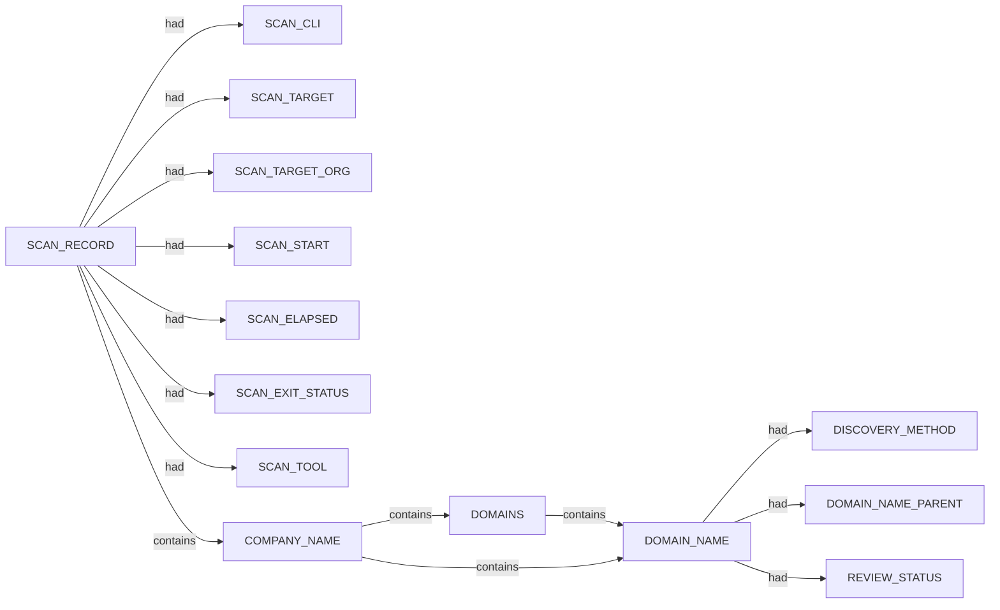

# Pius scan narrative — `crt_praetorian_ndjson`

## Introduction

Organizational attack-surface findings are grouped under the head company, with domains, affiliates, and unresolved research leads emitted per 08 rules.

## Organization

- `Praetorian`

## Domains

- `8472.app.chariot.praetorian.com`
- `8472.app.guard.praetorian.com`
- `aegis.app.staging.guard.praetorian.com`
- `agent-dev.chariot.praetorian.com`
- `agent-speculatore.praetorian.com`
- `agent.8472.app.chariot.praetorian.com`
- `agent.chariot.praetorian.com`
- `alice.praetorian.com`
- `api.chariot.praetorian.com`
- `api.praetorian.com`
- `armory.praetorian.com`
- `artifactory.praetorian.com`
- `blog-dev.praetorian.com`
- `blog.praetorian.com`
- `burp.8472.app.chariot.praetorian.com`
- `burp.8472.app.guard.praetorian.com`
- `burp.chariot.praetorian.com`
- `burp.prod.app.chariot.praetorian.com`
- `burp.prod.app.guard.praetorian.com`
- `capdev.chariot.praetorian.com`
- `chaos.praetorian.com`
- `chariot-comlink.praetorian.com`
- `chariot-comlink.staging.praetorian.com`
- `chariot-comlink.uat.praetorian.com`
- `chariot-leia.praetorian.com`
- `chariot-leia.staging.praetorian.com`
- `chariot-leia.uat.praetorian.com`
- `chariot-slave-one.praetorian.com`
- `chariot-slave-one.staging.praetorian.com`
- `chariot-slave-one.uat.praetorian.com`
- `chariot.praetorian.com`
- `chariot.staging.praetorian.com`
- `chariot.uat.praetorian.com`
- `chat.praetorian.com`
- `contentapalooza.praetorian.com`
- `crypto.praetorian.com`
- `demand.praetorian.com`
- `demo.chariot.praetorian.com`
- `dev-test0.app.staging.chariot.praetorian.com`
- `dev-test1.app.staging.chariot.praetorian.com`
- `diana.praetorian.com`
- `diana.staging.praetorian.com`
- `diana.uat.praetorian.com`
- `docs.chariot.praetorian.com`
- `docs.praetorian.com`
- `feedback.praetorian.com`
- `foxctf.praetorian.com`
- `future.chariot.praetorian.com`
- `go.praetorian.com`
- `guard.praetorian.com`
- `hof.praetorian.com`
- `jmukund.app.staging.chariot.praetorian.com`
- `joseph.app.staging.chariot.praetorian.com`
- `joseph.uat.app.staging.guard.praetorian.com`
- `jupiter-staging.praetorian.com`
- `jupiter.praetorian.com`
- `log4j.praetorian.com`
- `login.diana.staging.praetorian.com`
- `lp.praetorian.com`
- `luke.production.praetorian.com`
- `luke.staging.praetorian.com`
- `luke.uat.praetorian.com`
- `luna.praetorian.com`
- `mars.praetorian.com`
- `mastermind.praetorian.com`
- `merch.praetorian.com`
- `mlb.praetorian.com`
- `neptune.praetorian.com`
- `oob.chariot.praetorian.com`
- `oob.guard.praetorian.com`
- `peter-test-redirect.praetorian.com`
- `pm-bounces.praetorian.com`
- `portal.praetorian.com`
- `praetorian-cloudfront-redirect-test.praetorian.com`
- `praetorian.com`
- `preview.chariot.praetorian.com`
- `pwnable.praetorian.com`
- `redirect-with-cloudfront.praetorian.com`
- `rota.praetorian.com`
- `rtv.praetorian.com`
- `securetransfer.praetorian.com`
- `signup.praetorian.com`
- `speculae-gcp.praetorian.com`
- `speculae.praetorian.com`
- `sso.8472.app.guard.praetorian.com`
- `sso.guard.praetorian.com`
- `sso.uat.app.staging.guard.praetorian.com`
- `start.praetorian.com`
- `support.praetorian.com`
- `tesserarius-stage.praetorian.com`
- `test.app.staging.chariot.praetorian.com`
- `trust.praetorian.com`
- `uat.app.staging.chariot.praetorian.com`
- `uat.app.staging.guard.praetorian.com`
- `uat.chariot.praetorian.com`
- `webmail.praetorian.com`
- `www.chat.praetorian.com`
- `www.mars.praetorian.com`
- `www.neptune.praetorian.com`
- `www.praetorian.com`
- `www.securetransfer.praetorian.com`
- `www.support.praetorian.com`
- `www2.praetorian.com`
- `www3.praetorian.com`

## Graph structure (types)

## Trace

_Trace section omitted when no TRACE nodes present._

## Appendix

### Nodes

- `COMPANY_NAME`: Praetorian
- `DISCOVERY_METHOD`: certificate-transparency
- `DOMAINS`: DOMAINS
- `DOMAIN_NAME`: 8472.app.chariot.praetorian.com
- `DOMAIN_NAME`: 8472.app.guard.praetorian.com
- `DOMAIN_NAME`: aegis.app.staging.guard.praetorian.com
- `DOMAIN_NAME`: agent-dev.chariot.praetorian.com
- `DOMAIN_NAME`: agent-speculatore.praetorian.com
- `DOMAIN_NAME`: agent.8472.app.chariot.praetorian.com
- `DOMAIN_NAME`: agent.chariot.praetorian.com
- `DOMAIN_NAME`: alice.praetorian.com
- `DOMAIN_NAME`: api.chariot.praetorian.com
- `DOMAIN_NAME`: api.praetorian.com
- `DOMAIN_NAME`: armory.praetorian.com
- `DOMAIN_NAME`: artifactory.praetorian.com
- `DOMAIN_NAME`: blog-dev.praetorian.com
- `DOMAIN_NAME`: blog.praetorian.com
- `DOMAIN_NAME`: burp.8472.app.chariot.praetorian.com
- `DOMAIN_NAME`: burp.8472.app.guard.praetorian.com
- `DOMAIN_NAME`: burp.chariot.praetorian.com
- `DOMAIN_NAME`: burp.prod.app.chariot.praetorian.com
- `DOMAIN_NAME`: burp.prod.app.guard.praetorian.com
- `DOMAIN_NAME`: capdev.chariot.praetorian.com
- `DOMAIN_NAME`: chaos.praetorian.com
- `DOMAIN_NAME`: chariot-comlink.praetorian.com
- `DOMAIN_NAME`: chariot-comlink.staging.praetorian.com
- `DOMAIN_NAME`: chariot-comlink.uat.praetorian.com
- `DOMAIN_NAME`: chariot-leia.praetorian.com
- `DOMAIN_NAME`: chariot-leia.staging.praetorian.com
- `DOMAIN_NAME`: chariot-leia.uat.praetorian.com
- `DOMAIN_NAME`: chariot-slave-one.praetorian.com
- `DOMAIN_NAME`: chariot-slave-one.staging.praetorian.com
- `DOMAIN_NAME`: chariot-slave-one.uat.praetorian.com
- `DOMAIN_NAME`: chariot.praetorian.com
- `DOMAIN_NAME`: chariot.staging.praetorian.com
- `DOMAIN_NAME`: chariot.uat.praetorian.com
- `DOMAIN_NAME`: chat.praetorian.com
- `DOMAIN_NAME`: contentapalooza.praetorian.com
- `DOMAIN_NAME`: crypto.praetorian.com
- `DOMAIN_NAME`: demand.praetorian.com
- `DOMAIN_NAME`: demo.chariot.praetorian.com
- `DOMAIN_NAME`: dev-test0.app.staging.chariot.praetorian.com
- `DOMAIN_NAME`: dev-test1.app.staging.chariot.praetorian.com
- `DOMAIN_NAME`: diana.praetorian.com
- `DOMAIN_NAME`: diana.staging.praetorian.com
- `DOMAIN_NAME`: diana.uat.praetorian.com
- `DOMAIN_NAME`: docs.chariot.praetorian.com
- `DOMAIN_NAME`: docs.praetorian.com
- `DOMAIN_NAME`: feedback.praetorian.com
- `DOMAIN_NAME`: foxctf.praetorian.com
- `DOMAIN_NAME`: future.chariot.praetorian.com
- `DOMAIN_NAME`: go.praetorian.com
- `DOMAIN_NAME`: guard.praetorian.com
- `DOMAIN_NAME`: hof.praetorian.com
- `DOMAIN_NAME`: jmukund.app.staging.chariot.praetorian.com
- `DOMAIN_NAME`: joseph.app.staging.chariot.praetorian.com
- `DOMAIN_NAME`: joseph.uat.app.staging.guard.praetorian.com
- `DOMAIN_NAME`: jupiter-staging.praetorian.com
- `DOMAIN_NAME`: jupiter.praetorian.com
- `DOMAIN_NAME`: log4j.praetorian.com
- `DOMAIN_NAME`: login.diana.staging.praetorian.com
- `DOMAIN_NAME`: lp.praetorian.com
- `DOMAIN_NAME`: luke.production.praetorian.com
- `DOMAIN_NAME`: luke.staging.praetorian.com
- `DOMAIN_NAME`: luke.uat.praetorian.com
- `DOMAIN_NAME`: luna.praetorian.com
- `DOMAIN_NAME`: mars.praetorian.com
- `DOMAIN_NAME`: mastermind.praetorian.com
- `DOMAIN_NAME`: merch.praetorian.com
- `DOMAIN_NAME`: mlb.praetorian.com
- `DOMAIN_NAME`: neptune.praetorian.com
- `DOMAIN_NAME`: oob.chariot.praetorian.com
- `DOMAIN_NAME`: oob.guard.praetorian.com
- `DOMAIN_NAME`: peter-test-redirect.praetorian.com
- `DOMAIN_NAME`: pm-bounces.praetorian.com
- `DOMAIN_NAME`: portal.praetorian.com
- `DOMAIN_NAME`: praetorian-cloudfront-redirect-test.praetorian.com
- `DOMAIN_NAME`: praetorian.com
- `DOMAIN_NAME`: preview.chariot.praetorian.com
- `DOMAIN_NAME`: pwnable.praetorian.com
- `DOMAIN_NAME`: redirect-with-cloudfront.praetorian.com
- `DOMAIN_NAME`: rota.praetorian.com
- `DOMAIN_NAME`: rtv.praetorian.com
- `DOMAIN_NAME`: securetransfer.praetorian.com
- `DOMAIN_NAME`: signup.praetorian.com
- `DOMAIN_NAME`: speculae-gcp.praetorian.com
- `DOMAIN_NAME`: speculae.praetorian.com
- `DOMAIN_NAME`: sso.8472.app.guard.praetorian.com
- `DOMAIN_NAME`: sso.guard.praetorian.com
- `DOMAIN_NAME`: sso.uat.app.staging.guard.praetorian.com
- `DOMAIN_NAME`: start.praetorian.com
- `DOMAIN_NAME`: support.praetorian.com
- `DOMAIN_NAME`: tesserarius-stage.praetorian.com
- `DOMAIN_NAME`: test.app.staging.chariot.praetorian.com
- `DOMAIN_NAME`: trust.praetorian.com
- `DOMAIN_NAME`: uat.app.staging.chariot.praetorian.com
- `DOMAIN_NAME`: uat.app.staging.guard.praetorian.com
- `DOMAIN_NAME`: uat.chariot.praetorian.com
- `DOMAIN_NAME`: webmail.praetorian.com
- `DOMAIN_NAME`: www.chat.praetorian.com
- `DOMAIN_NAME`: www.mars.praetorian.com
- `DOMAIN_NAME`: www.neptune.praetorian.com
- `DOMAIN_NAME`: www.praetorian.com
- `DOMAIN_NAME`: www.securetransfer.praetorian.com
- `DOMAIN_NAME`: www.support.praetorian.com
- `DOMAIN_NAME`: www2.praetorian.com
- `DOMAIN_NAME`: www3.praetorian.com
- `DOMAIN_NAME_PARENT`: 8472.app.chariot.praetorian.com
- `DOMAIN_NAME_PARENT`: 8472.app.guard.praetorian.com
- `DOMAIN_NAME_PARENT`: app.chariot.praetorian.com
- `DOMAIN_NAME_PARENT`: app.guard.praetorian.com
- `DOMAIN_NAME_PARENT`: app.staging.chariot.praetorian.com
- `DOMAIN_NAME_PARENT`: app.staging.guard.praetorian.com
- `DOMAIN_NAME_PARENT`: chariot.praetorian.com
- `DOMAIN_NAME_PARENT`: chat.praetorian.com
- `DOMAIN_NAME_PARENT`: diana.staging.praetorian.com
- `DOMAIN_NAME_PARENT`: guard.praetorian.com
- `DOMAIN_NAME_PARENT`: mars.praetorian.com
- `DOMAIN_NAME_PARENT`: neptune.praetorian.com
- `DOMAIN_NAME_PARENT`: praetorian.com
- `DOMAIN_NAME_PARENT`: prod.app.chariot.praetorian.com
- `DOMAIN_NAME_PARENT`: prod.app.guard.praetorian.com
- `DOMAIN_NAME_PARENT`: production.praetorian.com
- `DOMAIN_NAME_PARENT`: securetransfer.praetorian.com
- `DOMAIN_NAME_PARENT`: staging.praetorian.com
- `DOMAIN_NAME_PARENT`: support.praetorian.com
- `DOMAIN_NAME_PARENT`: uat.app.staging.guard.praetorian.com
- `DOMAIN_NAME_PARENT`: uat.praetorian.com
- `REVIEW_STATUS`: confirmed
- `SCAN_CLI`: /mnt/c/projects/spiderfeet/.tools/pius run --org Praetorian --domain praetorian.com --plugins crt-sh --output ndjson
- `SCAN_ELAPSED`: 12.407
- `SCAN_EXIT_STATUS`: 0
- `SCAN_RECORD`: pius:Praetorian:/mnt/c/projects/spiderfeet/.tools/pius run --org Praetorian --domain praetorian.com --plugins crt-sh --output ndjson
- `SCAN_START`: 2026-06-30T04:09:26.834504+00:00
- `SCAN_TARGET`: praetorian.com
- `SCAN_TARGET_ORG`: Praetorian
- `SCAN_TOOL`: pius

### Edges

- `SCAN_RECORD` `had` `SCAN_CLI`
- `SCAN_RECORD` `had` `SCAN_TARGET`
- `SCAN_RECORD` `had` `SCAN_TARGET_ORG`
- `SCAN_RECORD` `had` `SCAN_START`
- `SCAN_RECORD` `had` `SCAN_ELAPSED`
- `SCAN_RECORD` `had` `SCAN_EXIT_STATUS`
- `SCAN_RECORD` `had` `SCAN_TOOL`
- `SCAN_RECORD` `contains` `COMPANY_NAME`
- `DOMAIN_NAME` `had` `DISCOVERY_METHOD`
- `DOMAIN_NAME` `had` `DOMAIN_NAME_PARENT`
- `COMPANY_NAME` `contains` `DOMAINS`
- `DOMAINS` `contains` `DOMAIN_NAME`
- `COMPANY_NAME` `contains` `DOMAIN_NAME`
- `DOMAIN_NAME` `had` `REVIEW_STATUS`
- `DOMAIN_NAME` `had` `DISCOVERY_METHOD`
- `DOMAIN_NAME` `had` `DOMAIN_NAME_PARENT`
- `DOMAINS` `contains` `DOMAIN_NAME`
- `COMPANY_NAME` `contains` `DOMAIN_NAME`
- `DOMAIN_NAME` `had` `REVIEW_STATUS`
- `DOMAIN_NAME` `had` `DISCOVERY_METHOD`
- `DOMAIN_NAME` `had` `DOMAIN_NAME_PARENT`
- `DOMAINS` `contains` `DOMAIN_NAME`
- `COMPANY_NAME` `contains` `DOMAIN_NAME`
- `DOMAIN_NAME` `had` `REVIEW_STATUS`
- `DOMAIN_NAME` `had` `DISCOVERY_METHOD`
- `DOMAINS` `contains` `DOMAIN_NAME`
- `COMPANY_NAME` `contains` `DOMAIN_NAME`
- `DOMAIN_NAME` `had` `REVIEW_STATUS`
- `DOMAIN_NAME` `had` `DISCOVERY_METHOD`
- `DOMAIN_NAME` `had` `DOMAIN_NAME_PARENT`
- `DOMAINS` `contains` `DOMAIN_NAME`
- `COMPANY_NAME` `contains` `DOMAIN_NAME`
- `DOMAIN_NAME` `had` `REVIEW_STATUS`
- `DOMAIN_NAME` `had` `DISCOVERY_METHOD`
- `DOMAIN_NAME` `had` `DOMAIN_NAME_PARENT`
- `DOMAINS` `contains` `DOMAIN_NAME`
- `COMPANY_NAME` `contains` `DOMAIN_NAME`
- `DOMAIN_NAME` `had` `REVIEW_STATUS`
- `DOMAIN_NAME` `had` `DISCOVERY_METHOD`
- `DOMAIN_NAME` `had` `DOMAIN_NAME_PARENT`
- `DOMAINS` `contains` `DOMAIN_NAME`
- `COMPANY_NAME` `contains` `DOMAIN_NAME`
- `DOMAIN_NAME` `had` `REVIEW_STATUS`
- `DOMAIN_NAME` `had` `DISCOVERY_METHOD`
- `DOMAIN_NAME` `had` `DOMAIN_NAME_PARENT`
- `DOMAINS` `contains` `DOMAIN_NAME`
- `COMPANY_NAME` `contains` `DOMAIN_NAME`
- `DOMAIN_NAME` `had` `REVIEW_STATUS`
- `DOMAIN_NAME` `had` `DISCOVERY_METHOD`
- `DOMAIN_NAME` `had` `DOMAIN_NAME_PARENT`
- `DOMAINS` `contains` `DOMAIN_NAME`
- `COMPANY_NAME` `contains` `DOMAIN_NAME`
- `DOMAIN_NAME` `had` `REVIEW_STATUS`
- `DOMAIN_NAME` `had` `DISCOVERY_METHOD`
- `DOMAIN_NAME` `had` `DOMAIN_NAME_PARENT`
- `DOMAINS` `contains` `DOMAIN_NAME`
- `COMPANY_NAME` `contains` `DOMAIN_NAME`
- `DOMAIN_NAME` `had` `REVIEW_STATUS`
- `DOMAIN_NAME` `had` `DISCOVERY_METHOD`
- `DOMAIN_NAME` `had` `DOMAIN_NAME_PARENT`
- `DOMAINS` `contains` `DOMAIN_NAME`
- `COMPANY_NAME` `contains` `DOMAIN_NAME`
- `DOMAIN_NAME` `had` `REVIEW_STATUS`
- `DOMAIN_NAME` `had` `DISCOVERY_METHOD`
- `DOMAIN_NAME` `had` `DOMAIN_NAME_PARENT`
- `DOMAINS` `contains` `DOMAIN_NAME`
- `COMPANY_NAME` `contains` `DOMAIN_NAME`
- `DOMAIN_NAME` `had` `REVIEW_STATUS`
- `DOMAIN_NAME` `had` `DISCOVERY_METHOD`
- `DOMAIN_NAME` `had` `DOMAIN_NAME_PARENT`
- `DOMAINS` `contains` `DOMAIN_NAME`
- `COMPANY_NAME` `contains` `DOMAIN_NAME`
- `DOMAIN_NAME` `had` `REVIEW_STATUS`
- `DOMAIN_NAME` `had` `DISCOVERY_METHOD`
- `DOMAIN_NAME` `had` `DOMAIN_NAME_PARENT`
- `DOMAINS` `contains` `DOMAIN_NAME`
- `COMPANY_NAME` `contains` `DOMAIN_NAME`
- `DOMAIN_NAME` `had` `REVIEW_STATUS`
- `DOMAIN_NAME` `had` `DISCOVERY_METHOD`
- `DOMAIN_NAME` `had` `DOMAIN_NAME_PARENT`
- `DOMAINS` `contains` `DOMAIN_NAME`
- `COMPANY_NAME` `contains` `DOMAIN_NAME`
- `DOMAIN_NAME` `had` `REVIEW_STATUS`
- `DOMAIN_NAME` `had` `DISCOVERY_METHOD`
- `DOMAIN_NAME` `had` `DOMAIN_NAME_PARENT`
- `DOMAINS` `contains` `DOMAIN_NAME`
- `COMPANY_NAME` `contains` `DOMAIN_NAME`
- `DOMAIN_NAME` `had` `REVIEW_STATUS`
- `DOMAIN_NAME` `had` `DISCOVERY_METHOD`
- `DOMAIN_NAME` `had` `DOMAIN_NAME_PARENT`
- `DOMAINS` `contains` `DOMAIN_NAME`
- `COMPANY_NAME` `contains` `DOMAIN_NAME`
- `DOMAIN_NAME` `had` `REVIEW_STATUS`
- `DOMAIN_NAME` `had` `DISCOVERY_METHOD`
- `DOMAIN_NAME` `had` `DOMAIN_NAME_PARENT`
- `DOMAINS` `contains` `DOMAIN_NAME`
- `COMPANY_NAME` `contains` `DOMAIN_NAME`
- `DOMAIN_NAME` `had` `REVIEW_STATUS`
- `DOMAIN_NAME` `had` `DISCOVERY_METHOD`
- `DOMAIN_NAME` `had` `DOMAIN_NAME_PARENT`
- `DOMAINS` `contains` `DOMAIN_NAME`
- `COMPANY_NAME` `contains` `DOMAIN_NAME`
- `DOMAIN_NAME` `had` `REVIEW_STATUS`
- `DOMAIN_NAME` `had` `DISCOVERY_METHOD`
- `DOMAIN_NAME` `had` `DOMAIN_NAME_PARENT`
- `DOMAINS` `contains` `DOMAIN_NAME`
- `COMPANY_NAME` `contains` `DOMAIN_NAME`
- `DOMAIN_NAME` `had` `REVIEW_STATUS`
- `DOMAIN_NAME` `had` `DISCOVERY_METHOD`
- `DOMAIN_NAME` `had` `DOMAIN_NAME_PARENT`
- `DOMAINS` `contains` `DOMAIN_NAME`
- `COMPANY_NAME` `contains` `DOMAIN_NAME`
- `DOMAIN_NAME` `had` `REVIEW_STATUS`
- `DOMAIN_NAME` `had` `DISCOVERY_METHOD`
- `DOMAIN_NAME` `had` `DOMAIN_NAME_PARENT`
- `DOMAINS` `contains` `DOMAIN_NAME`
- `COMPANY_NAME` `contains` `DOMAIN_NAME`
- `DOMAIN_NAME` `had` `REVIEW_STATUS`
- `DOMAIN_NAME` `had` `DISCOVERY_METHOD`
- `DOMAIN_NAME` `had` `DOMAIN_NAME_PARENT`
- `DOMAINS` `contains` `DOMAIN_NAME`
- `COMPANY_NAME` `contains` `DOMAIN_NAME`
- `DOMAIN_NAME` `had` `REVIEW_STATUS`
- `DOMAIN_NAME` `had` `DISCOVERY_METHOD`
- `DOMAIN_NAME` `had` `DOMAIN_NAME_PARENT`
- `DOMAINS` `contains` `DOMAIN_NAME`
- `COMPANY_NAME` `contains` `DOMAIN_NAME`
- `DOMAIN_NAME` `had` `REVIEW_STATUS`
- `DOMAIN_NAME` `had` `DISCOVERY_METHOD`
- `DOMAIN_NAME` `had` `DOMAIN_NAME_PARENT`
- `DOMAINS` `contains` `DOMAIN_NAME`
- `COMPANY_NAME` `contains` `DOMAIN_NAME`
- `DOMAIN_NAME` `had` `REVIEW_STATUS`
- `DOMAIN_NAME` `had` `DISCOVERY_METHOD`
- `DOMAIN_NAME` `had` `DOMAIN_NAME_PARENT`
- `DOMAINS` `contains` `DOMAIN_NAME`
- `COMPANY_NAME` `contains` `DOMAIN_NAME`
- `DOMAIN_NAME` `had` `REVIEW_STATUS`
- `DOMAIN_NAME` `had` `DISCOVERY_METHOD`
- `DOMAIN_NAME` `had` `DOMAIN_NAME_PARENT`
- `DOMAINS` `contains` `DOMAIN_NAME`
- `COMPANY_NAME` `contains` `DOMAIN_NAME`
- `DOMAIN_NAME` `had` `REVIEW_STATUS`
- `DOMAIN_NAME` `had` `DISCOVERY_METHOD`
- `DOMAIN_NAME` `had` `DOMAIN_NAME_PARENT`
- `DOMAINS` `contains` `DOMAIN_NAME`
- `COMPANY_NAME` `contains` `DOMAIN_NAME`
- `DOMAIN_NAME` `had` `REVIEW_STATUS`
- `DOMAIN_NAME` `had` `DISCOVERY_METHOD`
- `DOMAIN_NAME` `had` `DOMAIN_NAME_PARENT`
- `DOMAINS` `contains` `DOMAIN_NAME`
- `COMPANY_NAME` `contains` `DOMAIN_NAME`
- `DOMAIN_NAME` `had` `REVIEW_STATUS`
- `DOMAIN_NAME` `had` `DISCOVERY_METHOD`
- `DOMAIN_NAME` `had` `DOMAIN_NAME_PARENT`
- `DOMAINS` `contains` `DOMAIN_NAME`
- `COMPANY_NAME` `contains` `DOMAIN_NAME`
- `DOMAIN_NAME` `had` `REVIEW_STATUS`
- `DOMAIN_NAME` `had` `DISCOVERY_METHOD`
- `DOMAIN_NAME` `had` `DOMAIN_NAME_PARENT`
- `DOMAINS` `contains` `DOMAIN_NAME`
- `COMPANY_NAME` `contains` `DOMAIN_NAME`
- `DOMAIN_NAME` `had` `REVIEW_STATUS`
- `DOMAIN_NAME` `had` `DISCOVERY_METHOD`
- `DOMAIN_NAME` `had` `DOMAIN_NAME_PARENT`
- `DOMAINS` `contains` `DOMAIN_NAME`
- `COMPANY_NAME` `contains` `DOMAIN_NAME`
- `DOMAIN_NAME` `had` `REVIEW_STATUS`
- `DOMAIN_NAME` `had` `DISCOVERY_METHOD`
- `DOMAIN_NAME` `had` `DOMAIN_NAME_PARENT`
- `DOMAINS` `contains` `DOMAIN_NAME`
- `COMPANY_NAME` `contains` `DOMAIN_NAME`
- `DOMAIN_NAME` `had` `REVIEW_STATUS`
- `DOMAIN_NAME` `had` `DISCOVERY_METHOD`
- `DOMAIN_NAME` `had` `DOMAIN_NAME_PARENT`
- `DOMAINS` `contains` `DOMAIN_NAME`
- `COMPANY_NAME` `contains` `DOMAIN_NAME`
- `DOMAIN_NAME` `had` `REVIEW_STATUS`
- `DOMAIN_NAME` `had` `DISCOVERY_METHOD`
- `DOMAIN_NAME` `had` `DOMAIN_NAME_PARENT`
- `DOMAINS` `contains` `DOMAIN_NAME`
- `COMPANY_NAME` `contains` `DOMAIN_NAME`
- `DOMAIN_NAME` `had` `REVIEW_STATUS`
- `DOMAIN_NAME` `had` `DISCOVERY_METHOD`
- `DOMAIN_NAME` `had` `DOMAIN_NAME_PARENT`
- `DOMAINS` `contains` `DOMAIN_NAME`
- `COMPANY_NAME` `contains` `DOMAIN_NAME`
- `DOMAIN_NAME` `had` `REVIEW_STATUS`
- `DOMAIN_NAME` `had` `DISCOVERY_METHOD`
- `DOMAIN_NAME` `had` `DOMAIN_NAME_PARENT`
- `DOMAINS` `contains` `DOMAIN_NAME`
- `COMPANY_NAME` `contains` `DOMAIN_NAME`
- `DOMAIN_NAME` `had` `REVIEW_STATUS`
- `DOMAIN_NAME` `had` `DISCOVERY_METHOD`
- `DOMAIN_NAME` `had` `DOMAIN_NAME_PARENT`
- `DOMAINS` `contains` `DOMAIN_NAME`
- `COMPANY_NAME` `contains` `DOMAIN_NAME`
- `DOMAIN_NAME` `had` `REVIEW_STATUS`
- `DOMAIN_NAME` `had` `DISCOVERY_METHOD`
- `DOMAIN_NAME` `had` `DOMAIN_NAME_PARENT`
- `DOMAINS` `contains` `DOMAIN_NAME`
- `COMPANY_NAME` `contains` `DOMAIN_NAME`
- `DOMAIN_NAME` `had` `REVIEW_STATUS`
- `DOMAIN_NAME` `had` `DISCOVERY_METHOD`
- `DOMAIN_NAME` `had` `DOMAIN_NAME_PARENT`
- `DOMAINS` `contains` `DOMAIN_NAME`
- `COMPANY_NAME` `contains` `DOMAIN_NAME`
- `DOMAIN_NAME` `had` `REVIEW_STATUS`
- `DOMAIN_NAME` `had` `DISCOVERY_METHOD`
- `DOMAIN_NAME` `had` `DOMAIN_NAME_PARENT`
- `DOMAINS` `contains` `DOMAIN_NAME`
- `COMPANY_NAME` `contains` `DOMAIN_NAME`
- `DOMAIN_NAME` `had` `REVIEW_STATUS`
- `DOMAIN_NAME` `had` `DISCOVERY_METHOD`
- `DOMAIN_NAME` `had` `DOMAIN_NAME_PARENT`
- `DOMAINS` `contains` `DOMAIN_NAME`
- `COMPANY_NAME` `contains` `DOMAIN_NAME`
- `DOMAIN_NAME` `had` `REVIEW_STATUS`
- `DOMAIN_NAME` `had` `DISCOVERY_METHOD`
- `DOMAIN_NAME` `had` `DOMAIN_NAME_PARENT`
- `DOMAINS` `contains` `DOMAIN_NAME`
- `COMPANY_NAME` `contains` `DOMAIN_NAME`
- `DOMAIN_NAME` `had` `REVIEW_STATUS`
- `DOMAIN_NAME` `had` `DISCOVERY_METHOD`
- `DOMAIN_NAME` `had` `DOMAIN_NAME_PARENT`
- `DOMAINS` `contains` `DOMAIN_NAME`
- `COMPANY_NAME` `contains` `DOMAIN_NAME`
- `DOMAIN_NAME` `had` `REVIEW_STATUS`
- `DOMAIN_NAME` `had` `DISCOVERY_METHOD`
- `DOMAIN_NAME` `had` `DOMAIN_NAME_PARENT`
- `DOMAINS` `contains` `DOMAIN_NAME`
- `COMPANY_NAME` `contains` `DOMAIN_NAME`
- `DOMAIN_NAME` `had` `REVIEW_STATUS`
- `DOMAIN_NAME` `had` `DISCOVERY_METHOD`
- `DOMAIN_NAME` `had` `DOMAIN_NAME_PARENT`
- `DOMAINS` `contains` `DOMAIN_NAME`
- `COMPANY_NAME` `contains` `DOMAIN_NAME`
- `DOMAIN_NAME` `had` `REVIEW_STATUS`
- `DOMAIN_NAME` `had` `DISCOVERY_METHOD`
- `DOMAIN_NAME` `had` `DOMAIN_NAME_PARENT`
- `DOMAINS` `contains` `DOMAIN_NAME`
- `COMPANY_NAME` `contains` `DOMAIN_NAME`
- `DOMAIN_NAME` `had` `REVIEW_STATUS`
- `DOMAIN_NAME` `had` `DISCOVERY_METHOD`
- `DOMAIN_NAME` `had` `DOMAIN_NAME_PARENT`
- `DOMAINS` `contains` `DOMAIN_NAME`
- `COMPANY_NAME` `contains` `DOMAIN_NAME`
- `DOMAIN_NAME` `had` `REVIEW_STATUS`
- `DOMAIN_NAME` `had` `DISCOVERY_METHOD`
- `DOMAIN_NAME` `had` `DOMAIN_NAME_PARENT`
- `DOMAINS` `contains` `DOMAIN_NAME`
- `COMPANY_NAME` `contains` `DOMAIN_NAME`
- `DOMAIN_NAME` `had` `REVIEW_STATUS`
- `DOMAIN_NAME` `had` `DISCOVERY_METHOD`
- `DOMAIN_NAME` `had` `DOMAIN_NAME_PARENT`
- `DOMAINS` `contains` `DOMAIN_NAME`
- `COMPANY_NAME` `contains` `DOMAIN_NAME`
- `DOMAIN_NAME` `had` `REVIEW_STATUS`
- `DOMAIN_NAME` `had` `DISCOVERY_METHOD`
- `DOMAIN_NAME` `had` `DOMAIN_NAME_PARENT`
- `DOMAINS` `contains` `DOMAIN_NAME`
- `COMPANY_NAME` `contains` `DOMAIN_NAME`
- `DOMAIN_NAME` `had` `REVIEW_STATUS`
- `DOMAIN_NAME` `had` `DISCOVERY_METHOD`
- `DOMAIN_NAME` `had` `DOMAIN_NAME_PARENT`
- `DOMAINS` `contains` `DOMAIN_NAME`
- `COMPANY_NAME` `contains` `DOMAIN_NAME`
- `DOMAIN_NAME` `had` `REVIEW_STATUS`
- `DOMAIN_NAME` `had` `DISCOVERY_METHOD`
- `DOMAIN_NAME` `had` `DOMAIN_NAME_PARENT`
- `DOMAINS` `contains` `DOMAIN_NAME`
- `COMPANY_NAME` `contains` `DOMAIN_NAME`
- `DOMAIN_NAME` `had` `REVIEW_STATUS`
- `DOMAIN_NAME` `had` `DISCOVERY_METHOD`
- `DOMAIN_NAME` `had` `DOMAIN_NAME_PARENT`
- `DOMAINS` `contains` `DOMAIN_NAME`
- `COMPANY_NAME` `contains` `DOMAIN_NAME`
- `DOMAIN_NAME` `had` `REVIEW_STATUS`
- `DOMAIN_NAME` `had` `DISCOVERY_METHOD`
- `DOMAIN_NAME` `had` `DOMAIN_NAME_PARENT`
- `DOMAINS` `contains` `DOMAIN_NAME`
- `COMPANY_NAME` `contains` `DOMAIN_NAME`
- `DOMAIN_NAME` `had` `REVIEW_STATUS`
- `DOMAIN_NAME` `had` `DISCOVERY_METHOD`
- `DOMAIN_NAME` `had` `DOMAIN_NAME_PARENT`
- `DOMAINS` `contains` `DOMAIN_NAME`
- `COMPANY_NAME` `contains` `DOMAIN_NAME`
- `DOMAIN_NAME` `had` `REVIEW_STATUS`
- `DOMAIN_NAME` `had` `DISCOVERY_METHOD`
- `DOMAIN_NAME` `had` `DOMAIN_NAME_PARENT`
- `DOMAINS` `contains` `DOMAIN_NAME`
- `COMPANY_NAME` `contains` `DOMAIN_NAME`
- `DOMAIN_NAME` `had` `REVIEW_STATUS`
- `DOMAIN_NAME` `had` `DISCOVERY_METHOD`
- `DOMAIN_NAME` `had` `DOMAIN_NAME_PARENT`
- `DOMAINS` `contains` `DOMAIN_NAME`
- `COMPANY_NAME` `contains` `DOMAIN_NAME`
- `DOMAIN_NAME` `had` `REVIEW_STATUS`
- `DOMAIN_NAME` `had` `DISCOVERY_METHOD`
- `DOMAIN_NAME` `had` `DOMAIN_NAME_PARENT`
- `DOMAINS` `contains` `DOMAIN_NAME`
- `COMPANY_NAME` `contains` `DOMAIN_NAME`
- `DOMAIN_NAME` `had` `REVIEW_STATUS`
- `DOMAIN_NAME` `had` `DISCOVERY_METHOD`
- `DOMAIN_NAME` `had` `DOMAIN_NAME_PARENT`
- `DOMAINS` `contains` `DOMAIN_NAME`
- `COMPANY_NAME` `contains` `DOMAIN_NAME`
- `DOMAIN_NAME` `had` `REVIEW_STATUS`
- `DOMAIN_NAME` `had` `DISCOVERY_METHOD`
- `DOMAIN_NAME` `had` `DOMAIN_NAME_PARENT`
- `DOMAINS` `contains` `DOMAIN_NAME`
- `COMPANY_NAME` `contains` `DOMAIN_NAME`
- `DOMAIN_NAME` `had` `REVIEW_STATUS`
- `DOMAIN_NAME` `had` `DISCOVERY_METHOD`
- `DOMAIN_NAME` `had` `DOMAIN_NAME_PARENT`
- `DOMAINS` `contains` `DOMAIN_NAME`
- `COMPANY_NAME` `contains` `DOMAIN_NAME`
- `DOMAIN_NAME` `had` `REVIEW_STATUS`
- `DOMAIN_NAME` `had` `DISCOVERY_METHOD`
- `DOMAIN_NAME` `had` `DOMAIN_NAME_PARENT`
- `DOMAINS` `contains` `DOMAIN_NAME`
- `COMPANY_NAME` `contains` `DOMAIN_NAME`
- `DOMAIN_NAME` `had` `REVIEW_STATUS`
- `DOMAIN_NAME` `had` `DISCOVERY_METHOD`
- `DOMAIN_NAME` `had` `DOMAIN_NAME_PARENT`
- `DOMAINS` `contains` `DOMAIN_NAME`
- `COMPANY_NAME` `contains` `DOMAIN_NAME`
- `DOMAIN_NAME` `had` `REVIEW_STATUS`
- `DOMAIN_NAME` `had` `DISCOVERY_METHOD`
- `DOMAIN_NAME` `had` `DOMAIN_NAME_PARENT`
- `DOMAINS` `contains` `DOMAIN_NAME`
- `COMPANY_NAME` `contains` `DOMAIN_NAME`
- `DOMAIN_NAME` `had` `REVIEW_STATUS`
- `DOMAIN_NAME` `had` `DISCOVERY_METHOD`
- `DOMAIN_NAME` `had` `DOMAIN_NAME_PARENT`
- `DOMAINS` `contains` `DOMAIN_NAME`
- `COMPANY_NAME` `contains` `DOMAIN_NAME`
- `DOMAIN_NAME` `had` `REVIEW_STATUS`
- `DOMAIN_NAME` `had` `DISCOVERY_METHOD`
- `DOMAIN_NAME` `had` `DOMAIN_NAME_PARENT`
- `DOMAINS` `contains` `DOMAIN_NAME`
- `COMPANY_NAME` `contains` `DOMAIN_NAME`
- `DOMAIN_NAME` `had` `REVIEW_STATUS`
- `DOMAIN_NAME` `had` `DISCOVERY_METHOD`
- `DOMAIN_NAME` `had` `DOMAIN_NAME_PARENT`
- `DOMAINS` `contains` `DOMAIN_NAME`
- `COMPANY_NAME` `contains` `DOMAIN_NAME`
- `DOMAIN_NAME` `had` `REVIEW_STATUS`
- `DOMAIN_NAME` `had` `DISCOVERY_METHOD`
- `DOMAIN_NAME` `had` `DOMAIN_NAME_PARENT`
- `DOMAINS` `contains` `DOMAIN_NAME`
- `COMPANY_NAME` `contains` `DOMAIN_NAME`
- `DOMAIN_NAME` `had` `REVIEW_STATUS`
- `DOMAIN_NAME` `had` `DISCOVERY_METHOD`
- `DOMAIN_NAME` `had` `DOMAIN_NAME_PARENT`
- `DOMAINS` `contains` `DOMAIN_NAME`
- `COMPANY_NAME` `contains` `DOMAIN_NAME`
- `DOMAIN_NAME` `had` `REVIEW_STATUS`
- `DOMAIN_NAME` `had` `DISCOVERY_METHOD`
- `DOMAIN_NAME` `had` `DOMAIN_NAME_PARENT`
- `DOMAINS` `contains` `DOMAIN_NAME`
- `COMPANY_NAME` `contains` `DOMAIN_NAME`
- `DOMAIN_NAME` `had` `REVIEW_STATUS`
- `DOMAIN_NAME` `had` `DISCOVERY_METHOD`
- `DOMAIN_NAME` `had` `DOMAIN_NAME_PARENT`
- `DOMAINS` `contains` `DOMAIN_NAME`
- `COMPANY_NAME` `contains` `DOMAIN_NAME`
- `DOMAIN_NAME` `had` `REVIEW_STATUS`
- `DOMAIN_NAME` `had` `DISCOVERY_METHOD`
- `DOMAIN_NAME` `had` `DOMAIN_NAME_PARENT`
- `DOMAINS` `contains` `DOMAIN_NAME`
- `COMPANY_NAME` `contains` `DOMAIN_NAME`
- `DOMAIN_NAME` `had` `REVIEW_STATUS`
- `DOMAIN_NAME` `had` `DISCOVERY_METHOD`
- `DOMAIN_NAME` `had` `DOMAIN_NAME_PARENT`
- `DOMAINS` `contains` `DOMAIN_NAME`
- `COMPANY_NAME` `contains` `DOMAIN_NAME`
- `DOMAIN_NAME` `had` `REVIEW_STATUS`
- `DOMAIN_NAME` `had` `DISCOVERY_METHOD`
- `DOMAIN_NAME` `had` `DOMAIN_NAME_PARENT`
- `DOMAINS` `contains` `DOMAIN_NAME`
- `COMPANY_NAME` `contains` `DOMAIN_NAME`
- `DOMAIN_NAME` `had` `REVIEW_STATUS`
- `DOMAIN_NAME` `had` `DISCOVERY_METHOD`
- `DOMAIN_NAME` `had` `DOMAIN_NAME_PARENT`
- `DOMAINS` `contains` `DOMAIN_NAME`
- `COMPANY_NAME` `contains` `DOMAIN_NAME`
- `DOMAIN_NAME` `had` `REVIEW_STATUS`
- `DOMAIN_NAME` `had` `DISCOVERY_METHOD`
- `DOMAIN_NAME` `had` `DOMAIN_NAME_PARENT`
- `DOMAINS` `contains` `DOMAIN_NAME`
- `COMPANY_NAME` `contains` `DOMAIN_NAME`
- `DOMAIN_NAME` `had` `REVIEW_STATUS`
- `DOMAIN_NAME` `had` `DISCOVERY_METHOD`
- `DOMAIN_NAME` `had` `DOMAIN_NAME_PARENT`
- `DOMAINS` `contains` `DOMAIN_NAME`
- `COMPANY_NAME` `contains` `DOMAIN_NAME`
- `DOMAIN_NAME` `had` `REVIEW_STATUS`
- `DOMAIN_NAME` `had` `DISCOVERY_METHOD`
- `DOMAIN_NAME` `had` `DOMAIN_NAME_PARENT`
- `DOMAINS` `contains` `DOMAIN_NAME`
- `COMPANY_NAME` `contains` `DOMAIN_NAME`
- `DOMAIN_NAME` `had` `REVIEW_STATUS`
- `DOMAIN_NAME` `had` `DISCOVERY_METHOD`
- `DOMAIN_NAME` `had` `DOMAIN_NAME_PARENT`
- `DOMAINS` `contains` `DOMAIN_NAME`
- `COMPANY_NAME` `contains` `DOMAIN_NAME`
- `DOMAIN_NAME` `had` `REVIEW_STATUS`
- `DOMAIN_NAME` `had` `DISCOVERY_METHOD`
- `DOMAIN_NAME` `had` `DOMAIN_NAME_PARENT`
- `DOMAINS` `contains` `DOMAIN_NAME`
- `COMPANY_NAME` `contains` `DOMAIN_NAME`
- `DOMAIN_NAME` `had` `REVIEW_STATUS`
- `DOMAIN_NAME` `had` `DISCOVERY_METHOD`
- `DOMAIN_NAME` `had` `DOMAIN_NAME_PARENT`
- `DOMAINS` `contains` `DOMAIN_NAME`
- `COMPANY_NAME` `contains` `DOMAIN_NAME`
- `DOMAIN_NAME` `had` `REVIEW_STATUS`
- `DOMAIN_NAME` `had` `DISCOVERY_METHOD`
- `DOMAIN_NAME` `had` `DOMAIN_NAME_PARENT`
- `DOMAINS` `contains` `DOMAIN_NAME`
- `COMPANY_NAME` `contains` `DOMAIN_NAME`
- `DOMAIN_NAME` `had` `REVIEW_STATUS`
- `DOMAIN_NAME` `had` `DISCOVERY_METHOD`
- `DOMAIN_NAME` `had` `DOMAIN_NAME_PARENT`
- `DOMAINS` `contains` `DOMAIN_NAME`
- `COMPANY_NAME` `contains` `DOMAIN_NAME`
- `DOMAIN_NAME` `had` `REVIEW_STATUS`
- `DOMAIN_NAME` `had` `DISCOVERY_METHOD`
- `DOMAIN_NAME` `had` `DOMAIN_NAME_PARENT`
- `DOMAINS` `contains` `DOMAIN_NAME`
- `COMPANY_NAME` `contains` `DOMAIN_NAME`
- `DOMAIN_NAME` `had` `REVIEW_STATUS`
- `DOMAIN_NAME` `had` `DISCOVERY_METHOD`
- `DOMAIN_NAME` `had` `DOMAIN_NAME_PARENT`
- `DOMAINS` `contains` `DOMAIN_NAME`
- `COMPANY_NAME` `contains` `DOMAIN_NAME`
- `DOMAIN_NAME` `had` `REVIEW_STATUS`
- `DOMAIN_NAME` `had` `DISCOVERY_METHOD`
- `DOMAIN_NAME` `had` `DOMAIN_NAME_PARENT`
- `DOMAINS` `contains` `DOMAIN_NAME`
- `COMPANY_NAME` `contains` `DOMAIN_NAME`
- `DOMAIN_NAME` `had` `REVIEW_STATUS`
- `DOMAIN_NAME` `had` `DISCOVERY_METHOD`
- `DOMAIN_NAME` `had` `DOMAIN_NAME_PARENT`
- `DOMAINS` `contains` `DOMAIN_NAME`
- `COMPANY_NAME` `contains` `DOMAIN_NAME`
- `DOMAIN_NAME` `had` `REVIEW_STATUS`
- `DOMAIN_NAME` `had` `DISCOVERY_METHOD`
- `DOMAIN_NAME` `had` `DOMAIN_NAME_PARENT`
- `DOMAINS` `contains` `DOMAIN_NAME`
- `COMPANY_NAME` `contains` `DOMAIN_NAME`
- `DOMAIN_NAME` `had` `REVIEW_STATUS`
- `DOMAIN_NAME` `had` `DISCOVERY_METHOD`
- `DOMAIN_NAME` `had` `DOMAIN_NAME_PARENT`
- `DOMAINS` `contains` `DOMAIN_NAME`
- `COMPANY_NAME` `contains` `DOMAIN_NAME`
- `DOMAIN_NAME` `had` `REVIEW_STATUS`
- `DOMAIN_NAME` `had` `DISCOVERY_METHOD`
- `DOMAIN_NAME` `had` `DOMAIN_NAME_PARENT`
- `DOMAINS` `contains` `DOMAIN_NAME`
- `COMPANY_NAME` `contains` `DOMAIN_NAME`
- `DOMAIN_NAME` `had` `REVIEW_STATUS`
- `DOMAIN_NAME` `had` `DISCOVERY_METHOD`
- `DOMAIN_NAME` `had` `DOMAIN_NAME_PARENT`
- `DOMAINS` `contains` `DOMAIN_NAME`
- `COMPANY_NAME` `contains` `DOMAIN_NAME`
- `DOMAIN_NAME` `had` `REVIEW_STATUS`
- `DOMAIN_NAME` `had` `DISCOVERY_METHOD`
- `DOMAIN_NAME` `had` `DOMAIN_NAME_PARENT`
- `DOMAINS` `contains` `DOMAIN_NAME`
- `COMPANY_NAME` `contains` `DOMAIN_NAME`
- `DOMAIN_NAME` `had` `REVIEW_STATUS`
- `DOMAIN_NAME` `had` `DISCOVERY_METHOD`
- `DOMAIN_NAME` `had` `DOMAIN_NAME_PARENT`
- `DOMAINS` `contains` `DOMAIN_NAME`
- `COMPANY_NAME` `contains` `DOMAIN_NAME`
- `DOMAIN_NAME` `had` `REVIEW_STATUS`
- `DOMAIN_NAME` `had` `DISCOVERY_METHOD`
- `DOMAIN_NAME` `had` `DOMAIN_NAME_PARENT`
- `DOMAINS` `contains` `DOMAIN_NAME`
- `COMPANY_NAME` `contains` `DOMAIN_NAME`
- `DOMAIN_NAME` `had` `REVIEW_STATUS`
- `DOMAIN_NAME` `had` `DISCOVERY_METHOD`
- `DOMAIN_NAME` `had` `DOMAIN_NAME_PARENT`
- `DOMAINS` `contains` `DOMAIN_NAME`
- `COMPANY_NAME` `contains` `DOMAIN_NAME`
- `DOMAIN_NAME` `had` `REVIEW_STATUS`
- `DOMAIN_NAME` `had` `DISCOVERY_METHOD`
- `DOMAIN_NAME` `had` `DOMAIN_NAME_PARENT`
- `DOMAINS` `contains` `DOMAIN_NAME`
- `COMPANY_NAME` `contains` `DOMAIN_NAME`
- `DOMAIN_NAME` `had` `REVIEW_STATUS`
- `DOMAIN_NAME` `had` `DISCOVERY_METHOD`
- `DOMAIN_NAME` `had` `DOMAIN_NAME_PARENT`
- `DOMAINS` `contains` `DOMAIN_NAME`
- `COMPANY_NAME` `contains` `DOMAIN_NAME`
- `DOMAIN_NAME` `had` `REVIEW_STATUS`
- `DOMAIN_NAME` `had` `DISCOVERY_METHOD`
- `DOMAIN_NAME` `had` `DOMAIN_NAME_PARENT`
- `DOMAINS` `contains` `DOMAIN_NAME`
- `COMPANY_NAME` `contains` `DOMAIN_NAME`
- `DOMAIN_NAME` `had` `REVIEW_STATUS`
- `DOMAIN_NAME` `had` `DISCOVERY_METHOD`
- `DOMAIN_NAME` `had` `DOMAIN_NAME_PARENT`
- `DOMAINS` `contains` `DOMAIN_NAME`
- `COMPANY_NAME` `contains` `DOMAIN_NAME`
- `DOMAIN_NAME` `had` `REVIEW_STATUS`
- `DOMAIN_NAME` `had` `DISCOVERY_METHOD`
- `DOMAIN_NAME` `had` `DOMAIN_NAME_PARENT`
- `DOMAINS` `contains` `DOMAIN_NAME`
- `COMPANY_NAME` `contains` `DOMAIN_NAME`
- `DOMAIN_NAME` `had` `REVIEW_STATUS`
- `DOMAIN_NAME` `had` `DISCOVERY_METHOD`
- `DOMAIN_NAME` `had` `DOMAIN_NAME_PARENT`
- `DOMAINS` `contains` `DOMAIN_NAME`
- `COMPANY_NAME` `contains` `DOMAIN_NAME`
- `DOMAIN_NAME` `had` `REVIEW_STATUS`
- `DOMAIN_NAME` `had` `DISCOVERY_METHOD`
- `DOMAIN_NAME` `had` `DOMAIN_NAME_PARENT`
- `DOMAINS` `contains` `DOMAIN_NAME`
- `COMPANY_NAME` `contains` `DOMAIN_NAME`
- `DOMAIN_NAME` `had` `REVIEW_STATUS`
- `DOMAIN_NAME` `had` `DISCOVERY_METHOD`
- `DOMAIN_NAME` `had` `DOMAIN_NAME_PARENT`
- `DOMAINS` `contains` `DOMAIN_NAME`
- `COMPANY_NAME` `contains` `DOMAIN_NAME`
- `DOMAIN_NAME` `had` `REVIEW_STATUS`
---

*OS-Intel Scan*
