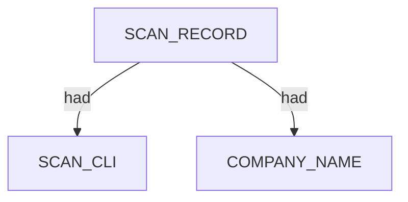

# Pius — proposed nugget graph structure

Ontology source: `.seed/05_Onotology_for_Nuggets.md`  
Generator: `.seed/scripts/cli_corpus/cli_tool_to_graph.py` (`pius_to_graph`)  
Harvest: `.seed/scripts/cli_corpus/manifests/pius.yaml` · runtime `wsl` · `.tools/pius`

Artifacts: `pius_<scenario_key>_proposed_nuggets_edges.json` in this directory.

## Capture discipline

- NDJSON (`--output ndjson`) must be captured via **subprocess stdout** — shell redirect produces empty files.
- Status banners land on **stderr** (`text_from: stderr` in manifest).
- WSL networking is flaky; harvest runs `wsl --shutdown` before each Pius scenario and retries once on empty stdout.
- `crt_linode_ndjson` may use `structured_fixture` when live crt-sh returns empty (upstream rate limit); fixture recorded in exam manifest as `structured_fixture_used`.

## Output classes

| Scenario | Semantic class | Notes |
|----------|----------------|-------|
| `crt_praetorian_ndjson` | Rich `Type:domain` crt-sh | ~100+ subdomains |
| `crt_linode_ndjson` | High-volume crt-sh | Fixture fallback when live empty |
| `corporate_bbc_gleif_ndjson` | gleif/wikidata/whois/crt corporate | Subsidiaries, `needs_review` |
| `rir_cidr_ndjson` | RIR phase-1 preseed | `Type:cidr` deferred — phase-2 not observed in bounded run |
| `sparse_scanme_ndjson` | whois preseed only | Intentional sparse |
| `obscure_miss_ndjson` | Clean miss | Empty NDJSON |
| `corporate_bbc_terminal` | Terminal review text | Text only, no graph |

## Graph head

## Findings

| NDJSON `Type` | Nugget | Edge |
|---------------|--------|------|
| `domain` | `INTERNET_NAME` | `SCAN_RECORD` → `contains` → domain; `PIUS_SOURCE` descriptor via `had` |
| `cidr` | `NETBLOCK_OWNER` | `SCAN_RECORD` → `contains` → netblock; `PIUS_SOURCE` via `had` |
| `preseed` | *(skipped in graph)* | Internal seed rows only |

## Examination evidence

`.docs/docs-for-cli-tools/app_examination_docs/pius/` — exams 1–7 aligned to manifest scenario order.

Semantic exploration matrix: `.docs/analysis/cli_exploration/pius_semantic_outcome_matrix.md`
