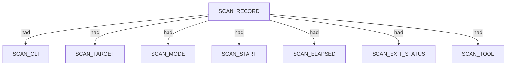
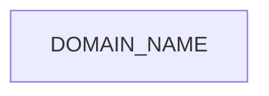
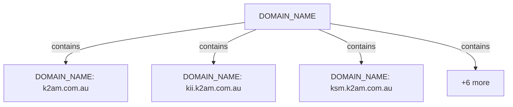

# Subfinder scan narrative — `corporate_k2am_active_oI`

## Introduction

Subfinder contributes DNS-focused domain enumeration. Active-mode IP resolution is retained as an IPV4_ADDRESS fact using currently approved SPEC-004 relations; the exact dns-resolves-to relation remains deferred until relation coverage is updated.

## Scan

Every examination has one SCAN_RECORD with scan descriptors linked via had. This scan includes **1** Scan root node(s) (e.g. `subfinder:k2am.com.au:subfinder -d k2am.com.au -active -oJ -oI -cs -o .docs/docs-for-cli-tools/exploration_scratch/subfinder/exams/corporate_k2am_active_oI.jsonl -silent`). Linked structures: `SCAN_CLI`, `SCAN_TARGET`, `SCAN_MODE`, `SCAN_START`, `SCAN_ELAPSED`, `SCAN_EXIT_STATUS`.

### Structure overview

### Scan descriptors

| Nugget | Value |
| --- | --- |
| `SCAN_RECORD` | `subfinder:k2am.com.au:subfinder -d k2am.com.au -active -oJ -oI -cs -o .docs/docs-for-cli-tools/exploration_scratch/subfinder/exams/corporate_k2am_active_oI.jsonl -silent` |

## Domains

Apex DOMAIN_NAME entities contain subdomain DOMAIN_NAME children; descriptors capture discovery mode, sources, and liveness. This scan includes **9** Domains root node(s) (e.g. `k2am.com.au`, `ksm.k2am.com.au`, `kii.k2am.com.au`). Linked structures: no child categories.

### Structure overview

### `DOMAIN_NAME`

| Nugget | Value |
| --- | --- |
| `DOMAIN_NAME` | `k2am.com.au` |
| `DOMAIN_NAME` | `kii.k2am.com.au` |
| `DOMAIN_NAME` | `ksm.k2am.com.au` |
| `DOMAIN_NAME` | `link.k2am.com.au` |
| `DOMAIN_NAME` | `mail.k2am.com.au` |
| `DOMAIN_NAME` | `owa.k2am.com.au` |
| `DOMAIN_NAME` | `smtp1.k2am.com.au` |
| `DOMAIN_NAME` | `smtp2.k2am.com.au` |
| `DOMAIN_NAME` | `www.k2am.com.au` |

## Conclusion

See the appendix for the full node and edge inventory.

## Appendix

### Nodes

| Nugget | Value |
| --- | --- |
| `CDN_REVIEW_NEEDED` | `true` |
| `DISCOVERY_MODE` | `active` |
| `DISCOVERY_SOURCE` | `crtsh` |
| `DISCOVERY_SOURCE` | `hackertarget` |
| `DOMAIN_NAME` | `k2am.com.au` |
| `DOMAIN_NAME` | `kii.k2am.com.au` |
| `DOMAIN_NAME` | `ksm.k2am.com.au` |
| `DOMAIN_NAME` | `link.k2am.com.au` |
| `DOMAIN_NAME` | `mail.k2am.com.au` |
| `DOMAIN_NAME` | `owa.k2am.com.au` |
| `DOMAIN_NAME` | `smtp1.k2am.com.au` |
| `DOMAIN_NAME` | `smtp2.k2am.com.au` |
| `DOMAIN_NAME` | `www.k2am.com.au` |
| `DOMAIN_NAME_PARENT` | `com.au` |
| `DOMAIN_NAME_PARENT` | `k2am.com.au` |
| `IPV4_ADDRESS` | `101.0.68.158` |
| `IPV4_ADDRESS` | `170.187.131.209` |
| `IPV4_ADDRESS` | `172.64.153.235` |
| `IPV4_ADDRESS` | `58.171.162.96` |
| `IPV4_ADDRESS` | `59.100.198.94` |
| `LIVENESS_STATUS` | `confirmed` |
| `LIVENESS_STATUS` | `unconfirmed` |
| `SCAN_CLI` | `subfinder -d k2am.com.au -active -oJ -oI -cs -o .docs/docs-for-cli-tools/exploration_scratch/subfinder/exams/corporate_k2am_active_oI.jsonl -silent` |
| `SCAN_ELAPSED` | `23.187` |
| `SCAN_EXIT_STATUS` | `0` |
| `SCAN_MODE` | `active` |
| `SCAN_RECORD` | `subfinder:k2am.com.au:subfinder -d k2am.com.au -active -oJ -oI -cs -o .docs/docs-for-cli-tools/exploration_scratch/subfinder/exams/corporate_k2am_active_oI.jsonl -silent` |
| `SCAN_START` | `2026-07-05T14:25:16.558422+00:00` |
| `SCAN_TARGET` | `k2am.com.au` |
| `SCAN_TOOL` | `subfinder` |

### Edges

| Source | Relation | Target |
| --- | --- | --- |
| `SCAN_RECORD` | `had` | `SCAN_CLI` |
| `SCAN_RECORD` | `had` | `SCAN_TARGET` |
| `SCAN_RECORD` | `had` | `SCAN_MODE` |
| `SCAN_RECORD` | `had` | `SCAN_START` |
| `SCAN_RECORD` | `had` | `SCAN_ELAPSED` |
| `SCAN_RECORD` | `had` | `SCAN_EXIT_STATUS` |
| `SCAN_RECORD` | `had` | `SCAN_TOOL` |
| `SCAN_RECORD` | `contains` | `DOMAIN_NAME` |
| `DOMAIN_NAME` | `had` | `DOMAIN_NAME_PARENT` |
| `DOMAIN_NAME` | `had` | `DISCOVERY_MODE` |
| `DOMAIN_NAME` | `had` | `DISCOVERY_SOURCE` |
| `DOMAIN_NAME` | `had` | `IPV4_ADDRESS` |
| `DOMAIN_NAME` | `had` | `LIVENESS_STATUS` |
| `IPV4_ADDRESS` | `had` | `CDN_REVIEW_NEEDED` |
---

*OS-Intel Scan*
