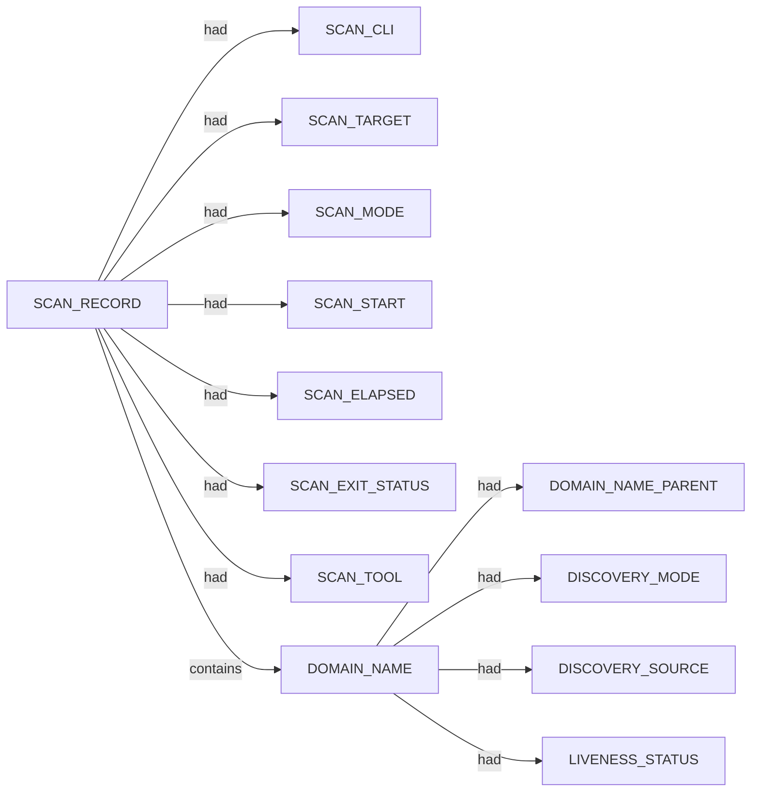

# Subfinder scan narrative — `corporate_k2am_passive_cs`

## Introduction

Subfinder contributes DNS-focused domain enumeration. Active-mode IP resolution is retained as an IPV4_ADDRESS fact using currently approved SPEC-004 relations; the exact dns-resolves-to relation remains deferred until relation coverage is updated.

## Domains

- `apps.k2am.com.au`
- `cpanel.k2am.com.au`
- `cpcalendars.k2am.com.au`
- `cpcontacts.k2am.com.au`
- `k2am.com.au`
- `kii.k2am.com.au`
- `ksm.k2am.com.au`
- `link.k2am.com.au`
- `mail.k2am.com.au`
- `owa.k2am.com.au`
- `smtp1.k2am.com.au`
- `smtp2.k2am.com.au`
- `webdisk.k2am.com.au`
- `webmail.k2am.com.au`
- `www.apps.k2am.com.au`
- `www.k2am.com.au`
- `www.kii.k2am.com.au`
- `www.ksm.k2am.com.au`
- `www.owa.k2am.com.au`

## Graph structure (types)

## Trace

_Trace section omitted when no TRACE nodes present._

## Appendix

### Nodes

- `DISCOVERY_MODE`: passive
- `DISCOVERY_SOURCE`: crtsh
- `DISCOVERY_SOURCE`: hackertarget
- `DOMAIN_NAME`: apps.k2am.com.au
- `DOMAIN_NAME`: cpanel.k2am.com.au
- `DOMAIN_NAME`: cpcalendars.k2am.com.au
- `DOMAIN_NAME`: cpcontacts.k2am.com.au
- `DOMAIN_NAME`: k2am.com.au
- `DOMAIN_NAME`: kii.k2am.com.au
- `DOMAIN_NAME`: ksm.k2am.com.au
- `DOMAIN_NAME`: link.k2am.com.au
- `DOMAIN_NAME`: mail.k2am.com.au
- `DOMAIN_NAME`: owa.k2am.com.au
- `DOMAIN_NAME`: smtp1.k2am.com.au
- `DOMAIN_NAME`: smtp2.k2am.com.au
- `DOMAIN_NAME`: webdisk.k2am.com.au
- `DOMAIN_NAME`: webmail.k2am.com.au
- `DOMAIN_NAME`: www.apps.k2am.com.au
- `DOMAIN_NAME`: www.k2am.com.au
- `DOMAIN_NAME`: www.kii.k2am.com.au
- `DOMAIN_NAME`: www.ksm.k2am.com.au
- `DOMAIN_NAME`: www.owa.k2am.com.au
- `DOMAIN_NAME_PARENT`: apps.k2am.com.au
- `DOMAIN_NAME_PARENT`: com.au
- `DOMAIN_NAME_PARENT`: k2am.com.au
- `DOMAIN_NAME_PARENT`: kii.k2am.com.au
- `DOMAIN_NAME_PARENT`: ksm.k2am.com.au
- `DOMAIN_NAME_PARENT`: owa.k2am.com.au
- `LIVENESS_STATUS`: unconfirmed
- `SCAN_CLI`: subfinder -d k2am.com.au -oJ -cs -o .docs/docs-for-cli-tools/exploration_scratch/subfinder/exams/corporate_k2am_passive_cs.jsonl -silent
- `SCAN_ELAPSED`: 23.594
- `SCAN_EXIT_STATUS`: 0
- `SCAN_MODE`: passive
- `SCAN_RECORD`: subfinder:k2am.com.au:subfinder -d k2am.com.au -oJ -cs -o .docs/docs-for-cli-tools/exploration_scratch/subfinder/exams/corporate_k2am_passive_cs.jsonl -silent
- `SCAN_START`: 2026-07-05T14:24:52.891526+00:00
- `SCAN_TARGET`: k2am.com.au
- `SCAN_TOOL`: subfinder

### Edges

- `SCAN_RECORD` `had` `SCAN_CLI`
- `SCAN_RECORD` `had` `SCAN_TARGET`
- `SCAN_RECORD` `had` `SCAN_MODE`
- `SCAN_RECORD` `had` `SCAN_START`
- `SCAN_RECORD` `had` `SCAN_ELAPSED`
- `SCAN_RECORD` `had` `SCAN_EXIT_STATUS`
- `SCAN_RECORD` `had` `SCAN_TOOL`
- `SCAN_RECORD` `contains` `DOMAIN_NAME`
- `DOMAIN_NAME` `had` `DOMAIN_NAME_PARENT`
- `SCAN_RECORD` `contains` `DOMAIN_NAME`
- `DOMAIN_NAME` `had` `DOMAIN_NAME_PARENT`
- `DOMAIN_NAME` `had` `DISCOVERY_MODE`
- `DOMAIN_NAME` `had` `DISCOVERY_SOURCE`
- `DOMAIN_NAME` `had` `DISCOVERY_SOURCE`
- `DOMAIN_NAME` `had` `LIVENESS_STATUS`
- `SCAN_RECORD` `contains` `DOMAIN_NAME`
- `DOMAIN_NAME` `had` `DOMAIN_NAME_PARENT`
- `DOMAIN_NAME` `had` `DISCOVERY_MODE`
- `DOMAIN_NAME` `had` `DISCOVERY_SOURCE`
- `DOMAIN_NAME` `had` `DISCOVERY_SOURCE`
- `DOMAIN_NAME` `had` `LIVENESS_STATUS`
- `SCAN_RECORD` `contains` `DOMAIN_NAME`
- `DOMAIN_NAME` `had` `DOMAIN_NAME_PARENT`
- `DOMAIN_NAME` `had` `DISCOVERY_MODE`
- `DOMAIN_NAME` `had` `DISCOVERY_SOURCE`
- `DOMAIN_NAME` `had` `LIVENESS_STATUS`
- `SCAN_RECORD` `contains` `DOMAIN_NAME`
- `DOMAIN_NAME` `had` `DOMAIN_NAME_PARENT`
- `DOMAIN_NAME` `had` `DISCOVERY_MODE`
- `DOMAIN_NAME` `had` `DISCOVERY_SOURCE`
- `DOMAIN_NAME` `had` `DISCOVERY_SOURCE`
- `DOMAIN_NAME` `had` `LIVENESS_STATUS`
- `SCAN_RECORD` `contains` `DOMAIN_NAME`
- `DOMAIN_NAME` `had` `DOMAIN_NAME_PARENT`
- `DOMAIN_NAME` `had` `DISCOVERY_MODE`
- `DOMAIN_NAME` `had` `DISCOVERY_SOURCE`
- `DOMAIN_NAME` `had` `LIVENESS_STATUS`
- `SCAN_RECORD` `contains` `DOMAIN_NAME`
- `DOMAIN_NAME` `had` `DOMAIN_NAME_PARENT`
- `DOMAIN_NAME` `had` `DISCOVERY_MODE`
- `DOMAIN_NAME` `had` `DISCOVERY_SOURCE`
- `DOMAIN_NAME` `had` `LIVENESS_STATUS`
- `SCAN_RECORD` `contains` `DOMAIN_NAME`
- `DOMAIN_NAME` `had` `DOMAIN_NAME_PARENT`
- `DOMAIN_NAME` `had` `DISCOVERY_MODE`
- `DOMAIN_NAME` `had` `DISCOVERY_SOURCE`
- `DOMAIN_NAME` `had` `LIVENESS_STATUS`
- `SCAN_RECORD` `contains` `DOMAIN_NAME`
- `DOMAIN_NAME` `had` `DOMAIN_NAME_PARENT`
- `DOMAIN_NAME` `had` `DISCOVERY_MODE`
- `DOMAIN_NAME` `had` `DISCOVERY_SOURCE`
- `DOMAIN_NAME` `had` `LIVENESS_STATUS`
- `SCAN_RECORD` `contains` `DOMAIN_NAME`
- `DOMAIN_NAME` `had` `DOMAIN_NAME_PARENT`
- `DOMAIN_NAME` `had` `DISCOVERY_MODE`
- `DOMAIN_NAME` `had` `DISCOVERY_SOURCE`
- `DOMAIN_NAME` `had` `LIVENESS_STATUS`
- `SCAN_RECORD` `contains` `DOMAIN_NAME`
- `DOMAIN_NAME` `had` `DOMAIN_NAME_PARENT`
- `DOMAIN_NAME` `had` `DISCOVERY_MODE`
- `DOMAIN_NAME` `had` `DISCOVERY_SOURCE`
- `DOMAIN_NAME` `had` `LIVENESS_STATUS`
- `SCAN_RECORD` `contains` `DOMAIN_NAME`
- `DOMAIN_NAME` `had` `DOMAIN_NAME_PARENT`
- `DOMAIN_NAME` `had` `DISCOVERY_MODE`
- `DOMAIN_NAME` `had` `DISCOVERY_SOURCE`
- `DOMAIN_NAME` `had` `LIVENESS_STATUS`
- `SCAN_RECORD` `contains` `DOMAIN_NAME`
- `DOMAIN_NAME` `had` `DOMAIN_NAME_PARENT`
- `DOMAIN_NAME` `had` `DISCOVERY_MODE`
- `DOMAIN_NAME` `had` `DISCOVERY_SOURCE`
- `DOMAIN_NAME` `had` `DISCOVERY_SOURCE`
- `DOMAIN_NAME` `had` `LIVENESS_STATUS`
- `SCAN_RECORD` `contains` `DOMAIN_NAME`
- `DOMAIN_NAME` `had` `DOMAIN_NAME_PARENT`
- `DOMAIN_NAME` `had` `DISCOVERY_MODE`
- `DOMAIN_NAME` `had` `DISCOVERY_SOURCE`
- `DOMAIN_NAME` `had` `LIVENESS_STATUS`
- `SCAN_RECORD` `contains` `DOMAIN_NAME`
- `DOMAIN_NAME` `had` `DOMAIN_NAME_PARENT`
- `DOMAIN_NAME` `had` `DISCOVERY_MODE`
- `DOMAIN_NAME` `had` `DISCOVERY_SOURCE`
- `DOMAIN_NAME` `had` `LIVENESS_STATUS`
- `SCAN_RECORD` `contains` `DOMAIN_NAME`
- `DOMAIN_NAME` `had` `DOMAIN_NAME_PARENT`
- `DOMAIN_NAME` `had` `DISCOVERY_MODE`
- `DOMAIN_NAME` `had` `DISCOVERY_SOURCE`
- `DOMAIN_NAME` `had` `LIVENESS_STATUS`
- `SCAN_RECORD` `contains` `DOMAIN_NAME`
- `DOMAIN_NAME` `had` `DOMAIN_NAME_PARENT`
- `DOMAIN_NAME` `had` `DISCOVERY_MODE`
- `DOMAIN_NAME` `had` `DISCOVERY_SOURCE`
- `DOMAIN_NAME` `had` `LIVENESS_STATUS`
- `SCAN_RECORD` `contains` `DOMAIN_NAME`
- `DOMAIN_NAME` `had` `DOMAIN_NAME_PARENT`
- `DOMAIN_NAME` `had` `DISCOVERY_MODE`
- `DOMAIN_NAME` `had` `DISCOVERY_SOURCE`
- `DOMAIN_NAME` `had` `LIVENESS_STATUS`
- `SCAN_RECORD` `contains` `DOMAIN_NAME`
- `DOMAIN_NAME` `had` `DOMAIN_NAME_PARENT`
- `DOMAIN_NAME` `had` `DISCOVERY_MODE`
- `DOMAIN_NAME` `had` `DISCOVERY_SOURCE`
- `DOMAIN_NAME` `had` `LIVENESS_STATUS`
- `DOMAIN_NAME` `had` `LIVENESS_STATUS`
---

*OS-Intel Scan*
