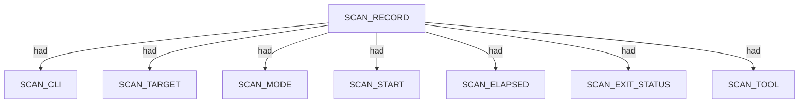
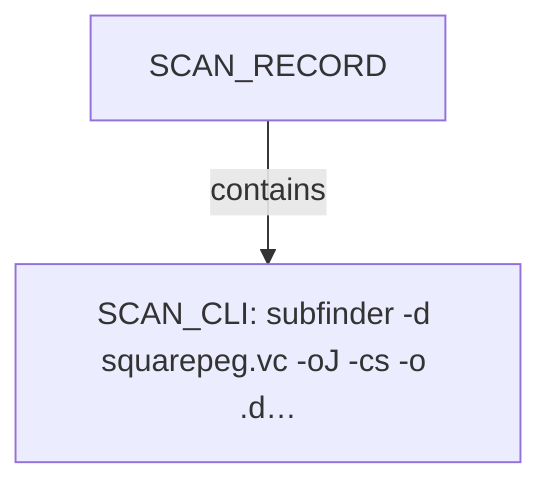
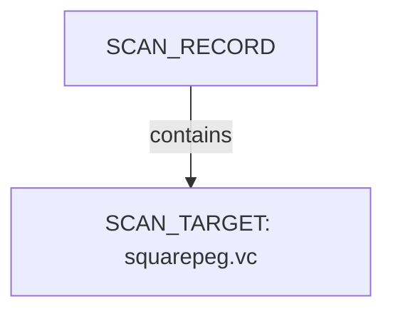
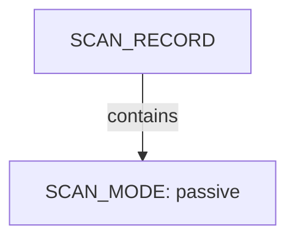
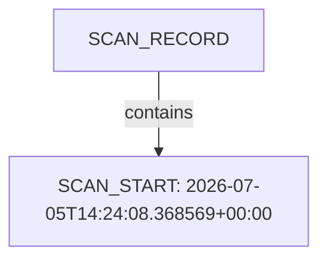
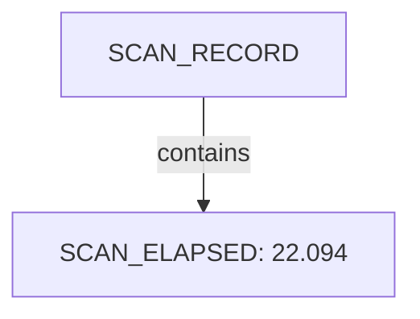
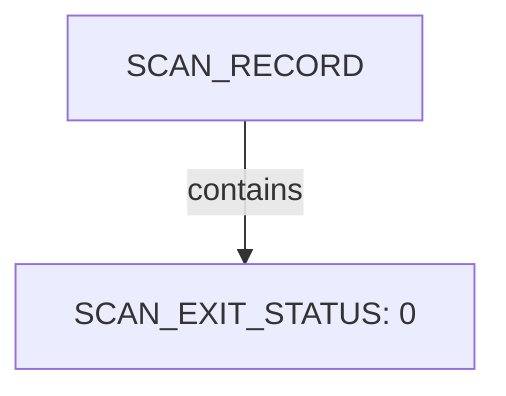
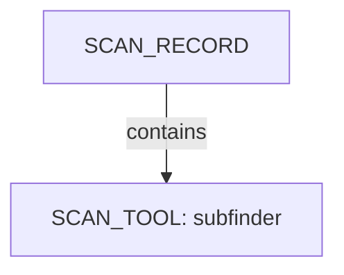
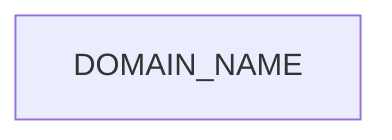

# Subfinder scan narrative — `corporate_squarepeg_passive_cs`

## Introduction

Subfinder contributes DNS-focused domain enumeration. Active-mode IP resolution is retained as an IPV4_ADDRESS fact using currently approved SPEC-004 relations; the exact dns-resolves-to relation remains deferred until relation coverage is updated.

## Scan

Every examination has one SCAN_RECORD with scan descriptors linked via had. This scan includes **1** Scan root node(s) (e.g. `subfinder:squarepeg.vc:subfinder -d squarepeg.vc -oJ -cs -o .docs/docs-for-cli-tools/exploration_scratch/subfinder/exams/corporate_squarepeg_passive_cs.jsonl -silent`). Linked structures: `SCAN_CLI`, `SCAN_TARGET`, `SCAN_MODE`, `SCAN_START`, `SCAN_ELAPSED`, `SCAN_EXIT_STATUS`.

### Structure overview

### `SCAN_CLI`

| Nugget | Value |
| --- | --- |
| `SCAN_CLI` | `subfinder -d squarepeg.vc -oJ -cs -o .docs/docs-for-cli-tools/exploration_scratch/subfinder/exams/corporate_squarepeg_passive_cs.jsonl -silent` |

### `SCAN_TARGET`

| Nugget | Value |
| --- | --- |
| `SCAN_TARGET` | `squarepeg.vc` |

### `SCAN_MODE`

| Nugget | Value |
| --- | --- |
| `SCAN_MODE` | `passive` |

### `SCAN_START`

| Nugget | Value |
| --- | --- |
| `SCAN_START` | `2026-07-05T14:24:08.368569+00:00` |

### `SCAN_ELAPSED`

| Nugget | Value |
| --- | --- |
| `SCAN_ELAPSED` | `22.094` |

### `SCAN_EXIT_STATUS`

| Nugget | Value |
| --- | --- |
| `SCAN_EXIT_STATUS` | `0` |

### `SCAN_TOOL`

| Nugget | Value |
| --- | --- |
| `SCAN_TOOL` | `subfinder` |

## Domains

Apex DOMAIN_NAME entities contain subdomain DOMAIN_NAME children; descriptors capture discovery mode, sources, and liveness. This scan includes **8** Domains root node(s) (e.g. `squarepeg.vc`, `helix.squarepeg.vc`, `plus.squarepeg.vc`). Linked structures: no child categories.

### Structure overview

### Values

| Nugget | Value |
| --- | --- |
| `DOMAIN_NAME` | `data.squarepeg.vc` |
| `DOMAIN_NAME` | `email.foundersummit2026.squarepeg.vc` |
| `DOMAIN_NAME` | `foundersummit2026.squarepeg.vc` |
| `DOMAIN_NAME` | `helix.squarepeg.vc` |
| `DOMAIN_NAME` | `plus.squarepeg.vc` |
| `DOMAIN_NAME` | `squarepeg.vc` |
| `DOMAIN_NAME` | `static.squarepeg.vc` |
| `DOMAIN_NAME` | `www.squarepeg.vc` |

## Conclusion

See the appendix for the full node and edge inventory.

## Appendix

### Nodes

| Nugget | Value |
| --- | --- |
| `DISCOVERY_MODE` | `passive` |
| `DISCOVERY_SOURCE` | `crtsh` |
| `DISCOVERY_SOURCE` | `hackertarget` |
| `DOMAIN_NAME` | `data.squarepeg.vc` |
| `DOMAIN_NAME` | `email.foundersummit2026.squarepeg.vc` |
| `DOMAIN_NAME` | `foundersummit2026.squarepeg.vc` |
| `DOMAIN_NAME` | `helix.squarepeg.vc` |
| `DOMAIN_NAME` | `plus.squarepeg.vc` |
| `DOMAIN_NAME` | `squarepeg.vc` |
| `DOMAIN_NAME` | `static.squarepeg.vc` |
| `DOMAIN_NAME` | `www.squarepeg.vc` |
| `DOMAIN_NAME_PARENT` | `foundersummit2026.squarepeg.vc` |
| `DOMAIN_NAME_PARENT` | `squarepeg.vc` |
| `LIVENESS_STATUS` | `unconfirmed` |
| `SCAN_CLI` | `subfinder -d squarepeg.vc -oJ -cs -o .docs/docs-for-cli-tools/exploration_scratch/subfinder/exams/corporate_squarepeg_passive_cs.jsonl -silent` |
| `SCAN_ELAPSED` | `22.094` |
| `SCAN_EXIT_STATUS` | `0` |
| `SCAN_MODE` | `passive` |
| `SCAN_RECORD` | `subfinder:squarepeg.vc:subfinder -d squarepeg.vc -oJ -cs -o .docs/docs-for-cli-tools/exploration_scratch/subfinder/exams/corporate_squarepeg_passive_cs.jsonl -silent` |
| `SCAN_START` | `2026-07-05T14:24:08.368569+00:00` |
| `SCAN_TARGET` | `squarepeg.vc` |
| `SCAN_TOOL` | `subfinder` |

### Edges

| Source | Relation | Target |
| --- | --- | --- |
| `SCAN_RECORD` | `had` | `SCAN_CLI` |
| `SCAN_RECORD` | `had` | `SCAN_TARGET` |
| `SCAN_RECORD` | `had` | `SCAN_MODE` |
| `SCAN_RECORD` | `had` | `SCAN_START` |
| `SCAN_RECORD` | `had` | `SCAN_ELAPSED` |
| `SCAN_RECORD` | `had` | `SCAN_EXIT_STATUS` |
| `SCAN_RECORD` | `had` | `SCAN_TOOL` |
| `SCAN_RECORD` | `contains` | `DOMAIN_NAME` |
| `DOMAIN_NAME` | `had` | `DOMAIN_NAME_PARENT` |
| `DOMAIN_NAME` | `had` | `DISCOVERY_MODE` |
| `DOMAIN_NAME` | `had` | `DISCOVERY_SOURCE` |
| `DOMAIN_NAME` | `had` | `LIVENESS_STATUS` |
---

*OS-Intel Scan*
