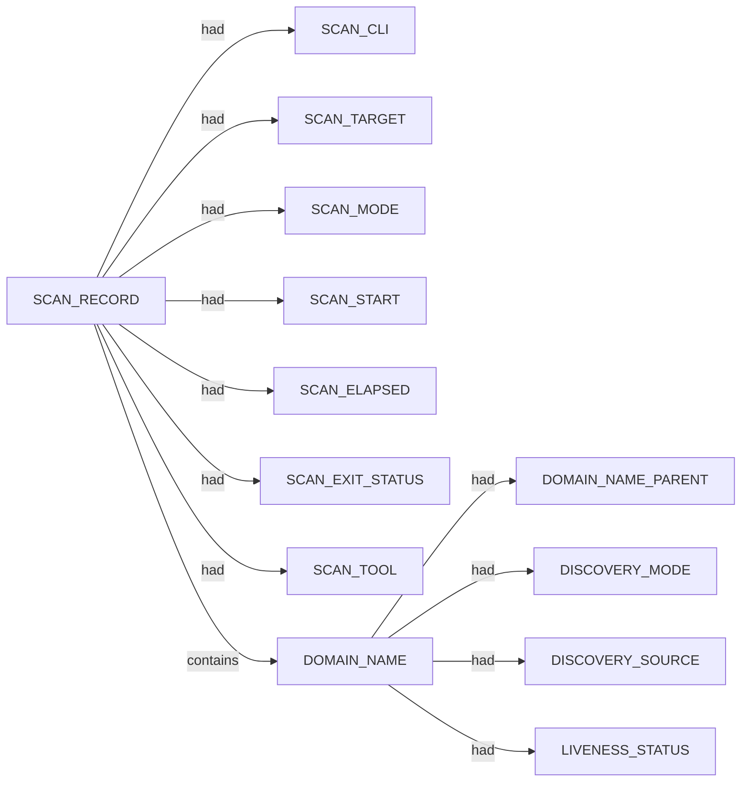

# Subfinder scan narrative — `corporate_upside_au_passive_cs`

## Introduction

Subfinder contributes DNS-focused domain enumeration. Active-mode IP resolution is retained as an IP_ADDRESS fact using currently approved SPEC-004 relations; the exact dns-resolves-to relation remains deferred until relation coverage is updated.

## Domains

- `aws.theupside.com.au`
- `cfjump.theupside.com.au`
- `dev.theupside.com.au`
- `e.theupside.com.au`
- `email.theupside.com.au`
- `info.theupside.com.au`
- `k8s.theupside.com.au`
- `mail.theupside.com.au`
- `news.theupside.com.au`
- `newsletter.theupside.com.au`
- `spf.theupside.com.au`
- `test.theupside.com.au`
- `theupside.com.au`
- `track.theupside.com.au`
- `www.aws.theupside.com.au`
- `www.dev.theupside.com.au`
- `www.e.theupside.com.au`
- `www.email.theupside.com.au`
- `www.info.theupside.com.au`
- `www.k8s.theupside.com.au`
- `www.mail.theupside.com.au`
- `www.news.theupside.com.au`
- `www.newsletter.theupside.com.au`
- `www.spf.theupside.com.au`
- `www.test.theupside.com.au`
- `www.theupside.com.au`
- `www.track.theupside.com.au`

## Graph structure (types)

## Trace

_Trace section omitted when no TRACE nodes present._

## Appendix

### Nodes

- `DISCOVERY_MODE`: passive
- `DISCOVERY_SOURCE`: crtsh
- `DISCOVERY_SOURCE`: hackertarget
- `DOMAIN_NAME`: aws.theupside.com.au
- `DOMAIN_NAME`: cfjump.theupside.com.au
- `DOMAIN_NAME`: dev.theupside.com.au
- `DOMAIN_NAME`: e.theupside.com.au
- `DOMAIN_NAME`: email.theupside.com.au
- `DOMAIN_NAME`: info.theupside.com.au
- `DOMAIN_NAME`: k8s.theupside.com.au
- `DOMAIN_NAME`: mail.theupside.com.au
- `DOMAIN_NAME`: news.theupside.com.au
- `DOMAIN_NAME`: newsletter.theupside.com.au
- `DOMAIN_NAME`: spf.theupside.com.au
- `DOMAIN_NAME`: test.theupside.com.au
- `DOMAIN_NAME`: theupside.com.au
- `DOMAIN_NAME`: track.theupside.com.au
- `DOMAIN_NAME`: www.aws.theupside.com.au
- `DOMAIN_NAME`: www.dev.theupside.com.au
- `DOMAIN_NAME`: www.e.theupside.com.au
- `DOMAIN_NAME`: www.email.theupside.com.au
- `DOMAIN_NAME`: www.info.theupside.com.au
- `DOMAIN_NAME`: www.k8s.theupside.com.au
- `DOMAIN_NAME`: www.mail.theupside.com.au
- `DOMAIN_NAME`: www.news.theupside.com.au
- `DOMAIN_NAME`: www.newsletter.theupside.com.au
- `DOMAIN_NAME`: www.spf.theupside.com.au
- `DOMAIN_NAME`: www.test.theupside.com.au
- `DOMAIN_NAME`: www.theupside.com.au
- `DOMAIN_NAME`: www.track.theupside.com.au
- `DOMAIN_NAME_PARENT`: aws.theupside.com.au
- `DOMAIN_NAME_PARENT`: com.au
- `DOMAIN_NAME_PARENT`: dev.theupside.com.au
- `DOMAIN_NAME_PARENT`: e.theupside.com.au
- `DOMAIN_NAME_PARENT`: email.theupside.com.au
- `DOMAIN_NAME_PARENT`: info.theupside.com.au
- `DOMAIN_NAME_PARENT`: k8s.theupside.com.au
- `DOMAIN_NAME_PARENT`: mail.theupside.com.au
- `DOMAIN_NAME_PARENT`: news.theupside.com.au
- `DOMAIN_NAME_PARENT`: newsletter.theupside.com.au
- `DOMAIN_NAME_PARENT`: spf.theupside.com.au
- `DOMAIN_NAME_PARENT`: test.theupside.com.au
- `DOMAIN_NAME_PARENT`: theupside.com.au
- `DOMAIN_NAME_PARENT`: track.theupside.com.au
- `LIVENESS_STATUS`: unconfirmed
- `SCAN_CLI`: subfinder -d theupside.com.au -oJ -cs -o .docs/docs-for-cli-tools/exploration_scratch/subfinder/exams/corporate_upside_au_passive_cs.jsonl -silent
- `SCAN_ELAPSED`: 22.735
- `SCAN_EXIT_STATUS`: 0
- `SCAN_MODE`: passive
- `SCAN_RECORD`: subfinder:theupside.com.au:subfinder -d theupside.com.au -oJ -cs -o .docs/docs-for-cli-tools/exploration_scratch/subfinder/exams/corporate_upside_au_passive_cs.jsonl -silent
- `SCAN_START`: 2026-07-05T14:23:45.538135+00:00
- `SCAN_TARGET`: theupside.com.au
- `SCAN_TOOL`: subfinder

### Edges

- `SCAN_RECORD` `had` `SCAN_CLI`
- `SCAN_RECORD` `had` `SCAN_TARGET`
- `SCAN_RECORD` `had` `SCAN_MODE`
- `SCAN_RECORD` `had` `SCAN_START`
- `SCAN_RECORD` `had` `SCAN_ELAPSED`
- `SCAN_RECORD` `had` `SCAN_EXIT_STATUS`
- `SCAN_RECORD` `had` `SCAN_TOOL`
- `SCAN_RECORD` `contains` `DOMAIN_NAME`
- `DOMAIN_NAME` `had` `DOMAIN_NAME_PARENT`
- `SCAN_RECORD` `contains` `DOMAIN_NAME`
- `DOMAIN_NAME` `had` `DOMAIN_NAME_PARENT`
- `DOMAIN_NAME` `had` `DISCOVERY_MODE`
- `DOMAIN_NAME` `had` `DISCOVERY_SOURCE`
- `DOMAIN_NAME` `had` `DISCOVERY_SOURCE`
- `DOMAIN_NAME` `had` `LIVENESS_STATUS`
- `SCAN_RECORD` `contains` `DOMAIN_NAME`
- `DOMAIN_NAME` `had` `DOMAIN_NAME_PARENT`
- `DOMAIN_NAME` `had` `DISCOVERY_MODE`
- `DOMAIN_NAME` `had` `DISCOVERY_SOURCE`
- `DOMAIN_NAME` `had` `DISCOVERY_SOURCE`
- `DOMAIN_NAME` `had` `LIVENESS_STATUS`
- `SCAN_RECORD` `contains` `DOMAIN_NAME`
- `DOMAIN_NAME` `had` `DOMAIN_NAME_PARENT`
- `DOMAIN_NAME` `had` `DISCOVERY_MODE`
- `DOMAIN_NAME` `had` `DISCOVERY_SOURCE`
- `DOMAIN_NAME` `had` `DISCOVERY_SOURCE`
- `DOMAIN_NAME` `had` `LIVENESS_STATUS`
- `SCAN_RECORD` `contains` `DOMAIN_NAME`
- `DOMAIN_NAME` `had` `DOMAIN_NAME_PARENT`
- `DOMAIN_NAME` `had` `DISCOVERY_MODE`
- `DOMAIN_NAME` `had` `DISCOVERY_SOURCE`
- `DOMAIN_NAME` `had` `DISCOVERY_SOURCE`
- `DOMAIN_NAME` `had` `LIVENESS_STATUS`
- `SCAN_RECORD` `contains` `DOMAIN_NAME`
- `DOMAIN_NAME` `had` `DOMAIN_NAME_PARENT`
- `DOMAIN_NAME` `had` `DISCOVERY_MODE`
- `DOMAIN_NAME` `had` `DISCOVERY_SOURCE`
- `DOMAIN_NAME` `had` `DISCOVERY_SOURCE`
- `DOMAIN_NAME` `had` `LIVENESS_STATUS`
- `SCAN_RECORD` `contains` `DOMAIN_NAME`
- `DOMAIN_NAME` `had` `DOMAIN_NAME_PARENT`
- `DOMAIN_NAME` `had` `DISCOVERY_MODE`
- `DOMAIN_NAME` `had` `DISCOVERY_SOURCE`
- `DOMAIN_NAME` `had` `DISCOVERY_SOURCE`
- `DOMAIN_NAME` `had` `LIVENESS_STATUS`
- `SCAN_RECORD` `contains` `DOMAIN_NAME`
- `DOMAIN_NAME` `had` `DOMAIN_NAME_PARENT`
- `DOMAIN_NAME` `had` `DISCOVERY_MODE`
- `DOMAIN_NAME` `had` `DISCOVERY_SOURCE`
- `DOMAIN_NAME` `had` `DISCOVERY_SOURCE`
- `DOMAIN_NAME` `had` `LIVENESS_STATUS`
- `SCAN_RECORD` `contains` `DOMAIN_NAME`
- `DOMAIN_NAME` `had` `DOMAIN_NAME_PARENT`
- `DOMAIN_NAME` `had` `DISCOVERY_MODE`
- `DOMAIN_NAME` `had` `DISCOVERY_SOURCE`
- `DOMAIN_NAME` `had` `DISCOVERY_SOURCE`
- `DOMAIN_NAME` `had` `LIVENESS_STATUS`
- `SCAN_RECORD` `contains` `DOMAIN_NAME`
- `DOMAIN_NAME` `had` `DOMAIN_NAME_PARENT`
- `DOMAIN_NAME` `had` `DISCOVERY_MODE`
- `DOMAIN_NAME` `had` `DISCOVERY_SOURCE`
- `DOMAIN_NAME` `had` `DISCOVERY_SOURCE`
- `DOMAIN_NAME` `had` `LIVENESS_STATUS`
- `SCAN_RECORD` `contains` `DOMAIN_NAME`
- `DOMAIN_NAME` `had` `DOMAIN_NAME_PARENT`
- `DOMAIN_NAME` `had` `DISCOVERY_MODE`
- `DOMAIN_NAME` `had` `DISCOVERY_SOURCE`
- `DOMAIN_NAME` `had` `DISCOVERY_SOURCE`
- `DOMAIN_NAME` `had` `LIVENESS_STATUS`
- `SCAN_RECORD` `contains` `DOMAIN_NAME`
- `DOMAIN_NAME` `had` `DOMAIN_NAME_PARENT`
- `DOMAIN_NAME` `had` `DISCOVERY_MODE`
- `DOMAIN_NAME` `had` `DISCOVERY_SOURCE`
- `DOMAIN_NAME` `had` `LIVENESS_STATUS`
- `SCAN_RECORD` `contains` `DOMAIN_NAME`
- `DOMAIN_NAME` `had` `DOMAIN_NAME_PARENT`
- `DOMAIN_NAME` `had` `DISCOVERY_MODE`
- `DOMAIN_NAME` `had` `DISCOVERY_SOURCE`
- `DOMAIN_NAME` `had` `DISCOVERY_SOURCE`
- `DOMAIN_NAME` `had` `LIVENESS_STATUS`
- `SCAN_RECORD` `contains` `DOMAIN_NAME`
- `DOMAIN_NAME` `had` `DOMAIN_NAME_PARENT`
- `DOMAIN_NAME` `had` `DISCOVERY_MODE`
- `DOMAIN_NAME` `had` `DISCOVERY_SOURCE`
- `DOMAIN_NAME` `had` `DISCOVERY_SOURCE`
- `DOMAIN_NAME` `had` `LIVENESS_STATUS`
- `SCAN_RECORD` `contains` `DOMAIN_NAME`
- `DOMAIN_NAME` `had` `DOMAIN_NAME_PARENT`
- `DOMAIN_NAME` `had` `DISCOVERY_MODE`
- `DOMAIN_NAME` `had` `DISCOVERY_SOURCE`
- `DOMAIN_NAME` `had` `DISCOVERY_SOURCE`
- `DOMAIN_NAME` `had` `LIVENESS_STATUS`
- `SCAN_RECORD` `contains` `DOMAIN_NAME`
- `DOMAIN_NAME` `had` `DOMAIN_NAME_PARENT`
- `DOMAIN_NAME` `had` `DISCOVERY_MODE`
- `DOMAIN_NAME` `had` `DISCOVERY_SOURCE`
- `DOMAIN_NAME` `had` `DISCOVERY_SOURCE`
- `DOMAIN_NAME` `had` `LIVENESS_STATUS`
- `SCAN_RECORD` `contains` `DOMAIN_NAME`
- `DOMAIN_NAME` `had` `DOMAIN_NAME_PARENT`
- `DOMAIN_NAME` `had` `DISCOVERY_MODE`
- `DOMAIN_NAME` `had` `DISCOVERY_SOURCE`
- `DOMAIN_NAME` `had` `DISCOVERY_SOURCE`
- `DOMAIN_NAME` `had` `LIVENESS_STATUS`
- `SCAN_RECORD` `contains` `DOMAIN_NAME`
- `DOMAIN_NAME` `had` `DOMAIN_NAME_PARENT`
- `DOMAIN_NAME` `had` `DISCOVERY_MODE`
- `DOMAIN_NAME` `had` `DISCOVERY_SOURCE`
- `DOMAIN_NAME` `had` `LIVENESS_STATUS`
- `SCAN_RECORD` `contains` `DOMAIN_NAME`
- `DOMAIN_NAME` `had` `DOMAIN_NAME_PARENT`
- `DOMAIN_NAME` `had` `DISCOVERY_MODE`
- `DOMAIN_NAME` `had` `DISCOVERY_SOURCE`
- `DOMAIN_NAME` `had` `DISCOVERY_SOURCE`
- `DOMAIN_NAME` `had` `LIVENESS_STATUS`
- `SCAN_RECORD` `contains` `DOMAIN_NAME`
- `DOMAIN_NAME` `had` `DOMAIN_NAME_PARENT`
- `DOMAIN_NAME` `had` `DISCOVERY_MODE`
- `DOMAIN_NAME` `had` `DISCOVERY_SOURCE`
- `DOMAIN_NAME` `had` `DISCOVERY_SOURCE`
- `DOMAIN_NAME` `had` `LIVENESS_STATUS`
- `SCAN_RECORD` `contains` `DOMAIN_NAME`
- `DOMAIN_NAME` `had` `DOMAIN_NAME_PARENT`
- `DOMAIN_NAME` `had` `DISCOVERY_MODE`
- `DOMAIN_NAME` `had` `DISCOVERY_SOURCE`
- `DOMAIN_NAME` `had` `DISCOVERY_SOURCE`
- `DOMAIN_NAME` `had` `LIVENESS_STATUS`
- `SCAN_RECORD` `contains` `DOMAIN_NAME`
- `DOMAIN_NAME` `had` `DOMAIN_NAME_PARENT`
- `DOMAIN_NAME` `had` `DISCOVERY_MODE`
- `DOMAIN_NAME` `had` `DISCOVERY_SOURCE`
- `DOMAIN_NAME` `had` `DISCOVERY_SOURCE`
- `DOMAIN_NAME` `had` `LIVENESS_STATUS`
- `SCAN_RECORD` `contains` `DOMAIN_NAME`
- `DOMAIN_NAME` `had` `DOMAIN_NAME_PARENT`
- `DOMAIN_NAME` `had` `DISCOVERY_MODE`
- `DOMAIN_NAME` `had` `DISCOVERY_SOURCE`
- `DOMAIN_NAME` `had` `DISCOVERY_SOURCE`
- `DOMAIN_NAME` `had` `LIVENESS_STATUS`
- `SCAN_RECORD` `contains` `DOMAIN_NAME`
- `DOMAIN_NAME` `had` `DOMAIN_NAME_PARENT`
- `DOMAIN_NAME` `had` `DISCOVERY_MODE`
- `DOMAIN_NAME` `had` `DISCOVERY_SOURCE`
- `DOMAIN_NAME` `had` `DISCOVERY_SOURCE`
- `DOMAIN_NAME` `had` `LIVENESS_STATUS`
- `SCAN_RECORD` `contains` `DOMAIN_NAME`
- `DOMAIN_NAME` `had` `DOMAIN_NAME_PARENT`
- `DOMAIN_NAME` `had` `DISCOVERY_MODE`
- `DOMAIN_NAME` `had` `DISCOVERY_SOURCE`
- `DOMAIN_NAME` `had` `DISCOVERY_SOURCE`
- `DOMAIN_NAME` `had` `LIVENESS_STATUS`
- `SCAN_RECORD` `contains` `DOMAIN_NAME`
- `DOMAIN_NAME` `had` `DOMAIN_NAME_PARENT`
- `DOMAIN_NAME` `had` `DISCOVERY_MODE`
- `DOMAIN_NAME` `had` `DISCOVERY_SOURCE`
- `DOMAIN_NAME` `had` `DISCOVERY_SOURCE`
- `DOMAIN_NAME` `had` `LIVENESS_STATUS`
- `SCAN_RECORD` `contains` `DOMAIN_NAME`
- `DOMAIN_NAME` `had` `DOMAIN_NAME_PARENT`
- `DOMAIN_NAME` `had` `DISCOVERY_MODE`
- `DOMAIN_NAME` `had` `DISCOVERY_SOURCE`
- `DOMAIN_NAME` `had` `DISCOVERY_SOURCE`
- `DOMAIN_NAME` `had` `LIVENESS_STATUS`
- `DOMAIN_NAME` `had` `LIVENESS_STATUS`
---

*OS-Intel Scan*
