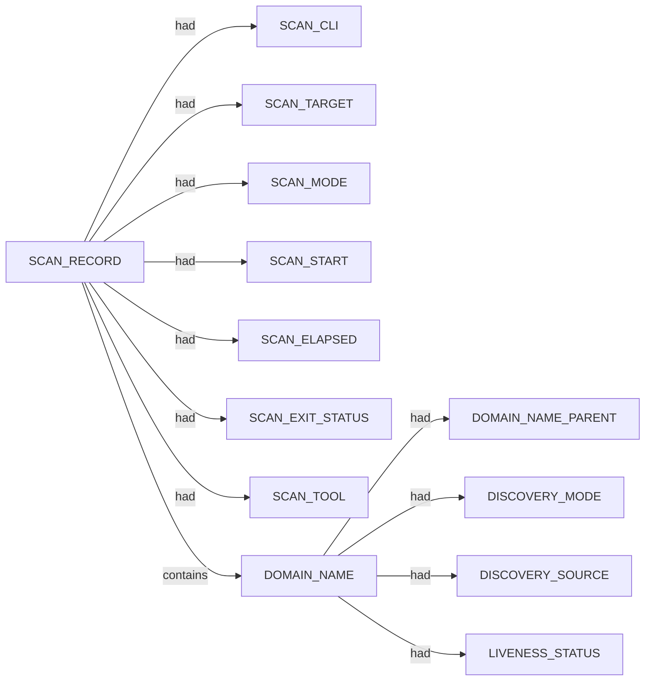

# Subfinder scan narrative — `corporate_upside_com_passive_cs`

## Introduction

Subfinder contributes DNS-focused domain enumeration. Active-mode IP resolution is retained as an IPV4_ADDRESS fact using currently approved SPEC-004 relations; the exact dns-resolves-to relation remains deferred until relation coverage is updated.

## Domains

- `blog.theupside.com`
- `image.theupside.com`
- `international.theupside.com`
- `link.theupside.com`
- `link2.theupside.com`
- `mail.theupside.com`
- `nancyz.theupside.com`
- `returns.theupside.com`
- `theupside.com`
- `uat.theupside.com`
- `uk.theupside.com`
- `www.nancyz.theupside.com`
- `www.theupside.com`

## Graph structure (types)

## Trace

_Trace section omitted when no TRACE nodes present._

## Appendix

### Nodes

- `DISCOVERY_MODE`: passive
- `DISCOVERY_SOURCE`: crtsh
- `DISCOVERY_SOURCE`: hackertarget
- `DOMAIN_NAME`: blog.theupside.com
- `DOMAIN_NAME`: image.theupside.com
- `DOMAIN_NAME`: international.theupside.com
- `DOMAIN_NAME`: link.theupside.com
- `DOMAIN_NAME`: link2.theupside.com
- `DOMAIN_NAME`: mail.theupside.com
- `DOMAIN_NAME`: nancyz.theupside.com
- `DOMAIN_NAME`: returns.theupside.com
- `DOMAIN_NAME`: theupside.com
- `DOMAIN_NAME`: uat.theupside.com
- `DOMAIN_NAME`: uk.theupside.com
- `DOMAIN_NAME`: www.nancyz.theupside.com
- `DOMAIN_NAME`: www.theupside.com
- `DOMAIN_NAME_PARENT`: nancyz.theupside.com
- `DOMAIN_NAME_PARENT`: theupside.com
- `LIVENESS_STATUS`: unconfirmed
- `SCAN_CLI`: subfinder -d theupside.com -oJ -cs -o .docs/docs-for-cli-tools/exploration_scratch/subfinder/exams/corporate_upside_com_passive_cs.jsonl -silent
- `SCAN_ELAPSED`: 24.25
- `SCAN_EXIT_STATUS`: 0
- `SCAN_MODE`: passive
- `SCAN_RECORD`: subfinder:theupside.com:subfinder -d theupside.com -oJ -cs -o .docs/docs-for-cli-tools/exploration_scratch/subfinder/exams/corporate_upside_com_passive_cs.jsonl -silent
- `SCAN_START`: 2026-07-05T14:25:39.820582+00:00
- `SCAN_TARGET`: theupside.com
- `SCAN_TOOL`: subfinder

### Edges

- `SCAN_RECORD` `had` `SCAN_CLI`
- `SCAN_RECORD` `had` `SCAN_TARGET`
- `SCAN_RECORD` `had` `SCAN_MODE`
- `SCAN_RECORD` `had` `SCAN_START`
- `SCAN_RECORD` `had` `SCAN_ELAPSED`
- `SCAN_RECORD` `had` `SCAN_EXIT_STATUS`
- `SCAN_RECORD` `had` `SCAN_TOOL`
- `SCAN_RECORD` `contains` `DOMAIN_NAME`
- `SCAN_RECORD` `contains` `DOMAIN_NAME`
- `DOMAIN_NAME` `had` `DOMAIN_NAME_PARENT`
- `DOMAIN_NAME` `had` `DISCOVERY_MODE`
- `DOMAIN_NAME` `had` `DISCOVERY_SOURCE`
- `DOMAIN_NAME` `had` `LIVENESS_STATUS`
- `SCAN_RECORD` `contains` `DOMAIN_NAME`
- `DOMAIN_NAME` `had` `DOMAIN_NAME_PARENT`
- `DOMAIN_NAME` `had` `DISCOVERY_MODE`
- `DOMAIN_NAME` `had` `DISCOVERY_SOURCE`
- `DOMAIN_NAME` `had` `DISCOVERY_SOURCE`
- `DOMAIN_NAME` `had` `LIVENESS_STATUS`
- `SCAN_RECORD` `contains` `DOMAIN_NAME`
- `DOMAIN_NAME` `had` `DOMAIN_NAME_PARENT`
- `DOMAIN_NAME` `had` `DISCOVERY_MODE`
- `DOMAIN_NAME` `had` `DISCOVERY_SOURCE`
- `DOMAIN_NAME` `had` `DISCOVERY_SOURCE`
- `DOMAIN_NAME` `had` `LIVENESS_STATUS`
- `SCAN_RECORD` `contains` `DOMAIN_NAME`
- `DOMAIN_NAME` `had` `DOMAIN_NAME_PARENT`
- `DOMAIN_NAME` `had` `DISCOVERY_MODE`
- `DOMAIN_NAME` `had` `DISCOVERY_SOURCE`
- `DOMAIN_NAME` `had` `LIVENESS_STATUS`
- `SCAN_RECORD` `contains` `DOMAIN_NAME`
- `DOMAIN_NAME` `had` `DOMAIN_NAME_PARENT`
- `DOMAIN_NAME` `had` `DISCOVERY_MODE`
- `DOMAIN_NAME` `had` `DISCOVERY_SOURCE`
- `DOMAIN_NAME` `had` `LIVENESS_STATUS`
- `SCAN_RECORD` `contains` `DOMAIN_NAME`
- `DOMAIN_NAME` `had` `DOMAIN_NAME_PARENT`
- `DOMAIN_NAME` `had` `DISCOVERY_MODE`
- `DOMAIN_NAME` `had` `DISCOVERY_SOURCE`
- `DOMAIN_NAME` `had` `LIVENESS_STATUS`
- `SCAN_RECORD` `contains` `DOMAIN_NAME`
- `DOMAIN_NAME` `had` `DOMAIN_NAME_PARENT`
- `DOMAIN_NAME` `had` `DISCOVERY_MODE`
- `DOMAIN_NAME` `had` `DISCOVERY_SOURCE`
- `DOMAIN_NAME` `had` `DISCOVERY_SOURCE`
- `DOMAIN_NAME` `had` `LIVENESS_STATUS`
- `SCAN_RECORD` `contains` `DOMAIN_NAME`
- `DOMAIN_NAME` `had` `DOMAIN_NAME_PARENT`
- `DOMAIN_NAME` `had` `DISCOVERY_MODE`
- `DOMAIN_NAME` `had` `DISCOVERY_SOURCE`
- `DOMAIN_NAME` `had` `DISCOVERY_SOURCE`
- `DOMAIN_NAME` `had` `LIVENESS_STATUS`
- `SCAN_RECORD` `contains` `DOMAIN_NAME`
- `DOMAIN_NAME` `had` `DOMAIN_NAME_PARENT`
- `DOMAIN_NAME` `had` `DISCOVERY_MODE`
- `DOMAIN_NAME` `had` `DISCOVERY_SOURCE`
- `DOMAIN_NAME` `had` `LIVENESS_STATUS`
- `SCAN_RECORD` `contains` `DOMAIN_NAME`
- `DOMAIN_NAME` `had` `DOMAIN_NAME_PARENT`
- `DOMAIN_NAME` `had` `DISCOVERY_MODE`
- `DOMAIN_NAME` `had` `DISCOVERY_SOURCE`
- `DOMAIN_NAME` `had` `LIVENESS_STATUS`
- `SCAN_RECORD` `contains` `DOMAIN_NAME`
- `DOMAIN_NAME` `had` `DOMAIN_NAME_PARENT`
- `DOMAIN_NAME` `had` `DISCOVERY_MODE`
- `DOMAIN_NAME` `had` `DISCOVERY_SOURCE`
- `DOMAIN_NAME` `had` `LIVENESS_STATUS`
- `SCAN_RECORD` `contains` `DOMAIN_NAME`
- `DOMAIN_NAME` `had` `DOMAIN_NAME_PARENT`
- `DOMAIN_NAME` `had` `DISCOVERY_MODE`
- `DOMAIN_NAME` `had` `DISCOVERY_SOURCE`
- `DOMAIN_NAME` `had` `LIVENESS_STATUS`
- `DOMAIN_NAME` `had` `LIVENESS_STATUS`
---

*OS-Intel Scan*
