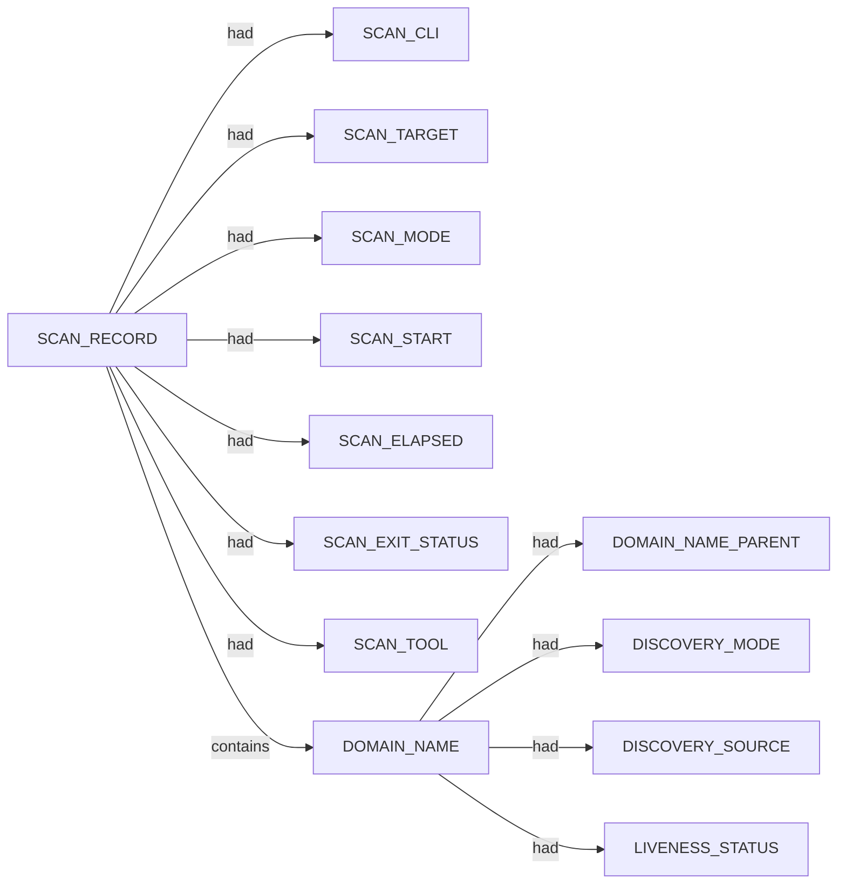

# Subfinder scan narrative — `corporate_vcof_sparse_passive`

## Introduction

Subfinder contributes DNS-focused domain enumeration. Active-mode IP resolution is retained as an IP_ADDRESS fact using currently approved SPEC-004 relations; the exact dns-resolves-to relation remains deferred until relation coverage is updated.

## Domains

- `venturecapitalopportunitiesfund.com.au`
- `www.venturecapitalopportunitiesfund.com.au`

## Graph structure (types)

## Trace

_Trace section omitted when no TRACE nodes present._

## Appendix

### Nodes

- `DISCOVERY_MODE`: passive
- `DISCOVERY_SOURCE`: crtsh
- `DISCOVERY_SOURCE`: hackertarget
- `DOMAIN_NAME`: venturecapitalopportunitiesfund.com.au
- `DOMAIN_NAME`: www.venturecapitalopportunitiesfund.com.au
- `DOMAIN_NAME_PARENT`: com.au
- `DOMAIN_NAME_PARENT`: venturecapitalopportunitiesfund.com.au
- `LIVENESS_STATUS`: unconfirmed
- `SCAN_CLI`: subfinder -d venturecapitalopportunitiesfund.com.au -oJ -cs -o .docs/docs-for-cli-tools/exploration_scratch/subfinder/exams/corporate_vcof_sparse_passive.jsonl -silent
- `SCAN_ELAPSED`: 22.312
- `SCAN_EXIT_STATUS`: 0
- `SCAN_MODE`: passive
- `SCAN_RECORD`: subfinder:venturecapitalopportunitiesfund.com.au:subfinder -d venturecapitalopportunitiesfund.com.au -oJ -cs -o .docs/docs-for-cli-tools/exploration_scratch/subfinder/exams/corporate_vcof_sparse_passive.jsonl -silent
- `SCAN_START`: 2026-07-05T14:24:30.524396+00:00
- `SCAN_TARGET`: venturecapitalopportunitiesfund.com.au
- `SCAN_TOOL`: subfinder

### Edges

- `SCAN_RECORD` `had` `SCAN_CLI`
- `SCAN_RECORD` `had` `SCAN_TARGET`
- `SCAN_RECORD` `had` `SCAN_MODE`
- `SCAN_RECORD` `had` `SCAN_START`
- `SCAN_RECORD` `had` `SCAN_ELAPSED`
- `SCAN_RECORD` `had` `SCAN_EXIT_STATUS`
- `SCAN_RECORD` `had` `SCAN_TOOL`
- `SCAN_RECORD` `contains` `DOMAIN_NAME`
- `DOMAIN_NAME` `had` `DOMAIN_NAME_PARENT`
- `SCAN_RECORD` `contains` `DOMAIN_NAME`
- `DOMAIN_NAME` `had` `DOMAIN_NAME_PARENT`
- `DOMAIN_NAME` `had` `DISCOVERY_MODE`
- `DOMAIN_NAME` `had` `DISCOVERY_SOURCE`
- `DOMAIN_NAME` `had` `DISCOVERY_SOURCE`
- `DOMAIN_NAME` `had` `LIVENESS_STATUS`
- `DOMAIN_NAME` `had` `LIVENESS_STATUS`
---

*OS-Intel Scan*
