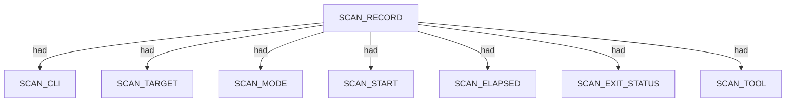
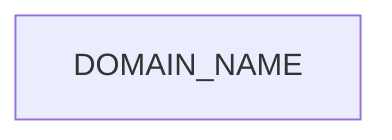
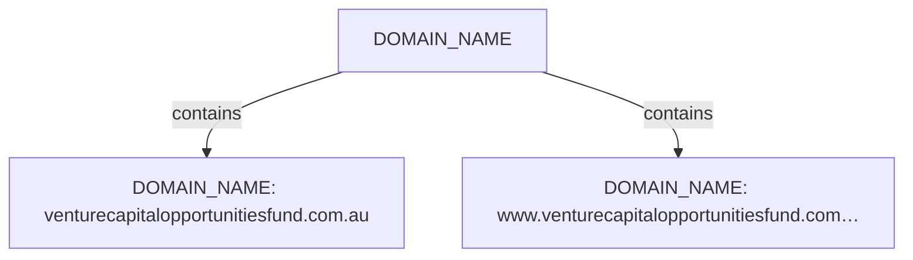

# Subfinder scan narrative — `corporate_vcof_sparse_passive`

## Introduction

Subfinder contributes DNS-focused domain enumeration. Active-mode IP resolution is retained as an IPV4_ADDRESS fact using currently approved SPEC-004 relations; the exact dns-resolves-to relation remains deferred until relation coverage is updated.

## Scan

Every examination has one SCAN_RECORD with scan descriptors linked via had. This scan includes **1** Scan root node(s) (e.g. `subfinder:venturecapitalopportunitiesfund.com.au:subfinder -d venturecapitalopportunitiesfund.com.au -oJ -cs -o .docs/docs-for-cli-tools/exploration_scratch/subfinder/exams/corporate_vcof_sparse_passive.jsonl -silent`). Linked structures: `SCAN_CLI`, `SCAN_TARGET`, `SCAN_MODE`, `SCAN_START`, `SCAN_ELAPSED`, `SCAN_EXIT_STATUS`.

### Structure overview

### Scan descriptors

| Nugget | Value |
| --- | --- |
| `SCAN_RECORD` | `subfinder:venturecapitalopportunitiesfund.com.au:subfinder -d venturecapitalopportunitiesfund.com.au -oJ -cs -o .docs/docs-for-cli-tools/exploration_scratch/subfinder/exams/corporate_vcof_sparse_passive.jsonl -silent` |

## Domains

Apex DOMAIN_NAME entities contain subdomain DOMAIN_NAME children; descriptors capture discovery mode, sources, and liveness. This scan includes **2** Domains root node(s) (e.g. `venturecapitalopportunitiesfund.com.au`, `www.venturecapitalopportunitiesfund.com.au`). Linked structures: no child categories.

### Structure overview

### `DOMAIN_NAME`

| Nugget | Value |
| --- | --- |
| `DOMAIN_NAME` | `venturecapitalopportunitiesfund.com.au` |
| `DOMAIN_NAME` | `www.venturecapitalopportunitiesfund.com.au` |

## Conclusion

See the appendix for the full node and edge inventory.

## Appendix

### Nodes

| Nugget | Value |
| --- | --- |
| `DISCOVERY_MODE` | `passive` |
| `DISCOVERY_SOURCE` | `crtsh` |
| `DISCOVERY_SOURCE` | `hackertarget` |
| `DOMAIN_NAME` | `venturecapitalopportunitiesfund.com.au` |
| `DOMAIN_NAME` | `www.venturecapitalopportunitiesfund.com.au` |
| `DOMAIN_NAME_PARENT` | `com.au` |
| `DOMAIN_NAME_PARENT` | `venturecapitalopportunitiesfund.com.au` |
| `LIVENESS_STATUS` | `unconfirmed` |
| `SCAN_CLI` | `subfinder -d venturecapitalopportunitiesfund.com.au -oJ -cs -o .docs/docs-for-cli-tools/exploration_scratch/subfinder/exams/corporate_vcof_sparse_passive.jsonl -silent` |
| `SCAN_ELAPSED` | `22.312` |
| `SCAN_EXIT_STATUS` | `0` |
| `SCAN_MODE` | `passive` |
| `SCAN_RECORD` | `subfinder:venturecapitalopportunitiesfund.com.au:subfinder -d venturecapitalopportunitiesfund.com.au -oJ -cs -o .docs/docs-for-cli-tools/exploration_scratch/subfinder/exams/corporate_vcof_sparse_passive.jsonl -silent` |
| `SCAN_START` | `2026-07-05T14:24:30.524396+00:00` |
| `SCAN_TARGET` | `venturecapitalopportunitiesfund.com.au` |
| `SCAN_TOOL` | `subfinder` |

### Edges

| Source | Relation | Target |
| --- | --- | --- |
| `SCAN_RECORD` | `had` | `SCAN_CLI` |
| `SCAN_RECORD` | `had` | `SCAN_TARGET` |
| `SCAN_RECORD` | `had` | `SCAN_MODE` |
| `SCAN_RECORD` | `had` | `SCAN_START` |
| `SCAN_RECORD` | `had` | `SCAN_ELAPSED` |
| `SCAN_RECORD` | `had` | `SCAN_EXIT_STATUS` |
| `SCAN_RECORD` | `had` | `SCAN_TOOL` |
| `SCAN_RECORD` | `contains` | `DOMAIN_NAME` |
| `DOMAIN_NAME` | `had` | `DOMAIN_NAME_PARENT` |
| `DOMAIN_NAME` | `had` | `DISCOVERY_MODE` |
| `DOMAIN_NAME` | `had` | `DISCOVERY_SOURCE` |
| `DOMAIN_NAME` | `had` | `LIVENESS_STATUS` |
---

*OS-Intel Scan*
