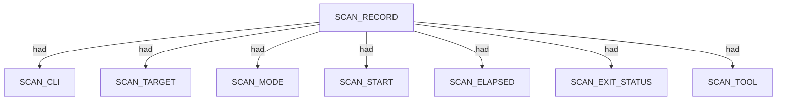
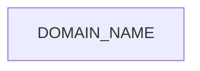
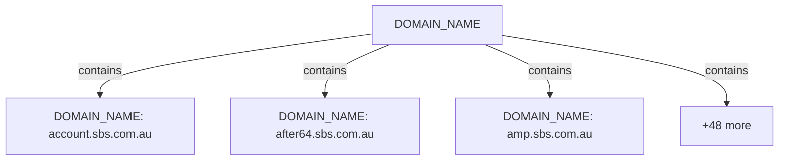

# Subfinder scan narrative — `enterprise_sbs_passive_cs`

## Introduction

Subfinder contributes DNS-focused domain enumeration. Active-mode IP resolution is retained as an IPV4_ADDRESS fact using currently approved SPEC-004 relations; the exact dns-resolves-to relation remains deferred until relation coverage is updated.

## Scan

Every examination has one SCAN_RECORD with scan descriptors linked via had. This scan includes **1** Scan root node(s) (e.g. `subfinder:sbs.com.au:subfinder -d sbs.com.au -oJ -cs -o .docs/docs-for-cli-tools/exploration_scratch/subfinder/exams/enterprise_sbs_passive_cs.jsonl -silent`). Linked structures: `SCAN_CLI`, `SCAN_TARGET`, `SCAN_MODE`, `SCAN_START`, `SCAN_ELAPSED`, `SCAN_EXIT_STATUS`.

### Structure overview

### Scan descriptors

| Nugget | Value |
| --- | --- |
| `SCAN_RECORD` | `subfinder:sbs.com.au:subfinder -d sbs.com.au -oJ -cs -o .docs/docs-for-cli-tools/exploration_scratch/subfinder/exams/enterprise_sbs_passive_cs.jsonl -silent` |

## Domains

Apex DOMAIN_NAME entities contain subdomain DOMAIN_NAME children; descriptors capture discovery mode, sources, and liveness. This scan includes **51** Domains root node(s) (e.g. `sbs.com.au`, `epgservice.c.aws.sbs.com.au`, `fos.analytics.edsqa01.aws.sbs.com.au`). Linked structures: no child categories.

### Structure overview

### `DOMAIN_NAME`

| Nugget | Value |
| --- | --- |
| `DOMAIN_NAME` | `account.sbs.com.au` |
| `DOMAIN_NAME` | `after64.sbs.com.au` |
| `DOMAIN_NAME` | `amp.sbs.com.au` |
| `DOMAIN_NAME` | `api.sbs.com.au` |
| `DOMAIN_NAME` | `assets.sbs.com.au` |
| `DOMAIN_NAME` | `auth.sbs.com.au` |
| `DOMAIN_NAME` | `epgservice.c.aws.sbs.com.au` |
| `DOMAIN_NAME` | `fda-docs.c.aws.sbs.com.au` |
| `DOMAIN_NAME` | `fos.adobe.edsqa01.aws.sbs.com.au` |
| `DOMAIN_NAME` | `fos.alego-1.edsqa01.aws.sbs.com.au` |
| `DOMAIN_NAME` | `fos.alego.edsqa01.aws.sbs.com.au` |
| `DOMAIN_NAME` | `fos.alejandrogo.edsqa01.aws.sbs.com.au` |
| `DOMAIN_NAME` | `fos.analytics.edsqa01.aws.sbs.com.au` |
| `DOMAIN_NAME` | `fos.beta.edsqa01.aws.sbs.com.au` |
| `DOMAIN_NAME` | `fos.bspcloud.edsqa01.aws.sbs.com.au` |
| `DOMAIN_NAME` | `fos.chrisfo-1.edsqa01.aws.sbs.com.au` |
| `DOMAIN_NAME` | `fos.chrisfo.edsqa01.aws.sbs.com.au` |
| `DOMAIN_NAME` | `fos.cloud.edsqa01.aws.sbs.com.au` |
| `DOMAIN_NAME` | `fos.dan-1.edsqa01.aws.sbs.com.au` |
| `DOMAIN_NAME` | `fos.dan.edsdev01.aws.sbs.com.au` |
| `DOMAIN_NAME` | `fos.dan.edsqa01.aws.sbs.com.au` |
| `DOMAIN_NAME` | `fos.freeze.edsdev01.aws.sbs.com.au` |
| `DOMAIN_NAME` | `fos.mad-1.edsdev01.aws.sbs.com.au` |
| `DOMAIN_NAME` | `fos.migrate.edsprd01.aws.sbs.com.au` |
| `DOMAIN_NAME` | `fos.mkoga-1.edsdev01.aws.sbs.com.au` |
| `DOMAIN_NAME` | `fos.mkoga-2.edsdev01.aws.sbs.com.au` |
| `DOMAIN_NAME` | `fos.pform.edsprd01.aws.sbs.com.au` |
| `DOMAIN_NAME` | `fos.platform.edsprd01.aws.sbs.com.au` |
| `DOMAIN_NAME` | `fos.prod.edsprd01.aws.sbs.com.au` |
| `DOMAIN_NAME` | `fos.sdk.edsdev01.aws.sbs.com.au` |
| `DOMAIN_NAME` | `fos.xander-1.edsdev01.aws.sbs.com.au` |
| `DOMAIN_NAME` | `fos.xanderbo.edsdev01.aws.sbs.com.au` |
| `DOMAIN_NAME` | `fusion-ses.prod.edsprd01.aws.sbs.com.au` |
| `DOMAIN_NAME` | `mobilelayer-dev01.edsdev02.aws.sbs.com.au` |
| `DOMAIN_NAME` | `mobilelayer-dev02.edsdev02.aws.sbs.com.au` |
| `DOMAIN_NAME` | `mobilelayer.edsdev02.aws.sbs.com.au` |
| `DOMAIN_NAME` | `mobilelayer.edsprd01.aws.sbs.com.au` |
| `DOMAIN_NAME` | `nginx-video.edsprd01.aws.sbs.com.au` |
| `DOMAIN_NAME` | `phoenix.analytics.edsqa01.aws.sbs.com.au` |
| `DOMAIN_NAME` | `phoenix.beta.edsqa01.aws.sbs.com.au` |
| `DOMAIN_NAME` | `phoenix.chrisfo-1.edsqa01.aws.sbs.com.au` |
| `DOMAIN_NAME` | `phoenix.chrisfo-2.edsqa01.aws.sbs.com.au` |
| `DOMAIN_NAME` | `phoenix.chrisfo-40.edsqa01.aws.sbs.com.au` |
| `DOMAIN_NAME` | `phoenix.chrisfo.edsqa01.aws.sbs.com.au` |
| `DOMAIN_NAME` | `phoenix.chrisha.edsqa01.aws.sbs.com.au` |
| `DOMAIN_NAME` | `phoenix.danielpe-1.edsqa01.aws.sbs.com.au` |
| `DOMAIN_NAME` | `phoenix.danielpe-2.edsqa01.aws.sbs.com.au` |
| `DOMAIN_NAME` | `phoenix.danielpe-3.edsqa01.aws.sbs.com.au` |
| `DOMAIN_NAME` | `phoenix.freeze.edsdev01.aws.sbs.com.au` |
| `DOMAIN_NAME` | `phoenix.prod.edsprd01.aws.sbs.com.au` |
| `DOMAIN_NAME` | `sbs.com.au` |

## Conclusion

See the appendix for the full node and edge inventory.

## Appendix

### Nodes

| Nugget | Value |
| --- | --- |
| `DISCOVERY_MODE` | `passive` |
| `DISCOVERY_SOURCE` | `hackertarget` |
| `DOMAIN_NAME` | `account.sbs.com.au` |
| `DOMAIN_NAME` | `after64.sbs.com.au` |
| `DOMAIN_NAME` | `amp.sbs.com.au` |
| `DOMAIN_NAME` | `api.sbs.com.au` |
| `DOMAIN_NAME` | `assets.sbs.com.au` |
| `DOMAIN_NAME` | `auth.sbs.com.au` |
| `DOMAIN_NAME` | `epgservice.c.aws.sbs.com.au` |
| `DOMAIN_NAME` | `fda-docs.c.aws.sbs.com.au` |
| `DOMAIN_NAME` | `fos.adobe.edsqa01.aws.sbs.com.au` |
| `DOMAIN_NAME` | `fos.alego-1.edsqa01.aws.sbs.com.au` |
| `DOMAIN_NAME` | `fos.alego.edsqa01.aws.sbs.com.au` |
| `DOMAIN_NAME` | `fos.alejandrogo.edsqa01.aws.sbs.com.au` |
| `DOMAIN_NAME` | `fos.analytics.edsqa01.aws.sbs.com.au` |
| `DOMAIN_NAME` | `fos.beta.edsqa01.aws.sbs.com.au` |
| `DOMAIN_NAME` | `fos.bspcloud.edsqa01.aws.sbs.com.au` |
| `DOMAIN_NAME` | `fos.chrisfo-1.edsqa01.aws.sbs.com.au` |
| `DOMAIN_NAME` | `fos.chrisfo.edsqa01.aws.sbs.com.au` |
| `DOMAIN_NAME` | `fos.cloud.edsqa01.aws.sbs.com.au` |
| `DOMAIN_NAME` | `fos.dan-1.edsqa01.aws.sbs.com.au` |
| `DOMAIN_NAME` | `fos.dan.edsdev01.aws.sbs.com.au` |
| `DOMAIN_NAME` | `fos.dan.edsqa01.aws.sbs.com.au` |
| `DOMAIN_NAME` | `fos.freeze.edsdev01.aws.sbs.com.au` |
| `DOMAIN_NAME` | `fos.mad-1.edsdev01.aws.sbs.com.au` |
| `DOMAIN_NAME` | `fos.migrate.edsprd01.aws.sbs.com.au` |
| `DOMAIN_NAME` | `fos.mkoga-1.edsdev01.aws.sbs.com.au` |
| `DOMAIN_NAME` | `fos.mkoga-2.edsdev01.aws.sbs.com.au` |
| `DOMAIN_NAME` | `fos.pform.edsprd01.aws.sbs.com.au` |
| `DOMAIN_NAME` | `fos.platform.edsprd01.aws.sbs.com.au` |
| `DOMAIN_NAME` | `fos.prod.edsprd01.aws.sbs.com.au` |
| `DOMAIN_NAME` | `fos.sdk.edsdev01.aws.sbs.com.au` |
| `DOMAIN_NAME` | `fos.xander-1.edsdev01.aws.sbs.com.au` |
| `DOMAIN_NAME` | `fos.xanderbo.edsdev01.aws.sbs.com.au` |
| `DOMAIN_NAME` | `fusion-ses.prod.edsprd01.aws.sbs.com.au` |
| `DOMAIN_NAME` | `mobilelayer-dev01.edsdev02.aws.sbs.com.au` |
| `DOMAIN_NAME` | `mobilelayer-dev02.edsdev02.aws.sbs.com.au` |
| `DOMAIN_NAME` | `mobilelayer.edsdev02.aws.sbs.com.au` |
| `DOMAIN_NAME` | `mobilelayer.edsprd01.aws.sbs.com.au` |
| `DOMAIN_NAME` | `nginx-video.edsprd01.aws.sbs.com.au` |
| `DOMAIN_NAME` | `phoenix.analytics.edsqa01.aws.sbs.com.au` |
| `DOMAIN_NAME` | `phoenix.beta.edsqa01.aws.sbs.com.au` |
| `DOMAIN_NAME` | `phoenix.chrisfo-1.edsqa01.aws.sbs.com.au` |
| `DOMAIN_NAME` | `phoenix.chrisfo-2.edsqa01.aws.sbs.com.au` |
| `DOMAIN_NAME` | `phoenix.chrisfo-40.edsqa01.aws.sbs.com.au` |
| `DOMAIN_NAME` | `phoenix.chrisfo.edsqa01.aws.sbs.com.au` |
| `DOMAIN_NAME` | `phoenix.chrisha.edsqa01.aws.sbs.com.au` |
| `DOMAIN_NAME` | `phoenix.danielpe-1.edsqa01.aws.sbs.com.au` |
| `DOMAIN_NAME` | `phoenix.danielpe-2.edsqa01.aws.sbs.com.au` |
| `DOMAIN_NAME` | `phoenix.danielpe-3.edsqa01.aws.sbs.com.au` |
| `DOMAIN_NAME` | `phoenix.freeze.edsdev01.aws.sbs.com.au` |
| `DOMAIN_NAME` | `phoenix.prod.edsprd01.aws.sbs.com.au` |
| `DOMAIN_NAME` | `sbs.com.au` |
| `DOMAIN_NAME_PARENT` | `adobe.edsqa01.aws.sbs.com.au` |
| `DOMAIN_NAME_PARENT` | `alego-1.edsqa01.aws.sbs.com.au` |
| `DOMAIN_NAME_PARENT` | `alego.edsqa01.aws.sbs.com.au` |
| `DOMAIN_NAME_PARENT` | `alejandrogo.edsqa01.aws.sbs.com.au` |
| `DOMAIN_NAME_PARENT` | `analytics.edsqa01.aws.sbs.com.au` |
| `DOMAIN_NAME_PARENT` | `beta.edsqa01.aws.sbs.com.au` |
| `DOMAIN_NAME_PARENT` | `bspcloud.edsqa01.aws.sbs.com.au` |
| `DOMAIN_NAME_PARENT` | `c.aws.sbs.com.au` |
| `DOMAIN_NAME_PARENT` | `chrisfo-1.edsqa01.aws.sbs.com.au` |
| `DOMAIN_NAME_PARENT` | `chrisfo-2.edsqa01.aws.sbs.com.au` |
| `DOMAIN_NAME_PARENT` | `chrisfo-40.edsqa01.aws.sbs.com.au` |
| `DOMAIN_NAME_PARENT` | `chrisfo.edsqa01.aws.sbs.com.au` |
| `DOMAIN_NAME_PARENT` | `chrisha.edsqa01.aws.sbs.com.au` |
| `DOMAIN_NAME_PARENT` | `cloud.edsqa01.aws.sbs.com.au` |
| `DOMAIN_NAME_PARENT` | `com.au` |
| `DOMAIN_NAME_PARENT` | `dan-1.edsqa01.aws.sbs.com.au` |
| `DOMAIN_NAME_PARENT` | `dan.edsdev01.aws.sbs.com.au` |
| `DOMAIN_NAME_PARENT` | `dan.edsqa01.aws.sbs.com.au` |
| `DOMAIN_NAME_PARENT` | `danielpe-1.edsqa01.aws.sbs.com.au` |
| `DOMAIN_NAME_PARENT` | `danielpe-2.edsqa01.aws.sbs.com.au` |
| `DOMAIN_NAME_PARENT` | `danielpe-3.edsqa01.aws.sbs.com.au` |
| `DOMAIN_NAME_PARENT` | `edsdev02.aws.sbs.com.au` |
| `DOMAIN_NAME_PARENT` | `edsprd01.aws.sbs.com.au` |
| `DOMAIN_NAME_PARENT` | `freeze.edsdev01.aws.sbs.com.au` |
| `DOMAIN_NAME_PARENT` | `mad-1.edsdev01.aws.sbs.com.au` |
| `DOMAIN_NAME_PARENT` | `migrate.edsprd01.aws.sbs.com.au` |
| `DOMAIN_NAME_PARENT` | `mkoga-1.edsdev01.aws.sbs.com.au` |
| `DOMAIN_NAME_PARENT` | `mkoga-2.edsdev01.aws.sbs.com.au` |
| `DOMAIN_NAME_PARENT` | `pform.edsprd01.aws.sbs.com.au` |
| `DOMAIN_NAME_PARENT` | `platform.edsprd01.aws.sbs.com.au` |
| `DOMAIN_NAME_PARENT` | `prod.edsprd01.aws.sbs.com.au` |
| `DOMAIN_NAME_PARENT` | `sbs.com.au` |
| `DOMAIN_NAME_PARENT` | `sdk.edsdev01.aws.sbs.com.au` |
| `DOMAIN_NAME_PARENT` | `xander-1.edsdev01.aws.sbs.com.au` |
| `DOMAIN_NAME_PARENT` | `xanderbo.edsdev01.aws.sbs.com.au` |
| `LIVENESS_STATUS` | `unconfirmed` |
| `SCAN_CLI` | `subfinder -d sbs.com.au -oJ -cs -o .docs/docs-for-cli-tools/exploration_scratch/subfinder/exams/enterprise_sbs_passive_cs.jsonl -silent` |
| `SCAN_ELAPSED` | `22.234` |
| `SCAN_EXIT_STATUS` | `0` |
| `SCAN_MODE` | `passive` |
| `SCAN_RECORD` | `subfinder:sbs.com.au:subfinder -d sbs.com.au -oJ -cs -o .docs/docs-for-cli-tools/exploration_scratch/subfinder/exams/enterprise_sbs_passive_cs.jsonl -silent` |
| `SCAN_START` | `2026-07-05T14:26:04.142058+00:00` |
| `SCAN_TARGET` | `sbs.com.au` |
| `SCAN_TOOL` | `subfinder` |

### Edges

| Source | Relation | Target |
| --- | --- | --- |
| `SCAN_RECORD` | `had` | `SCAN_CLI` |
| `SCAN_RECORD` | `had` | `SCAN_TARGET` |
| `SCAN_RECORD` | `had` | `SCAN_MODE` |
| `SCAN_RECORD` | `had` | `SCAN_START` |
| `SCAN_RECORD` | `had` | `SCAN_ELAPSED` |
| `SCAN_RECORD` | `had` | `SCAN_EXIT_STATUS` |
| `SCAN_RECORD` | `had` | `SCAN_TOOL` |
| `SCAN_RECORD` | `contains` | `DOMAIN_NAME` |
| `DOMAIN_NAME` | `had` | `DOMAIN_NAME_PARENT` |
| `DOMAIN_NAME` | `had` | `DISCOVERY_MODE` |
| `DOMAIN_NAME` | `had` | `DISCOVERY_SOURCE` |
| `DOMAIN_NAME` | `had` | `LIVENESS_STATUS` |
---

*OS-Intel Scan*
