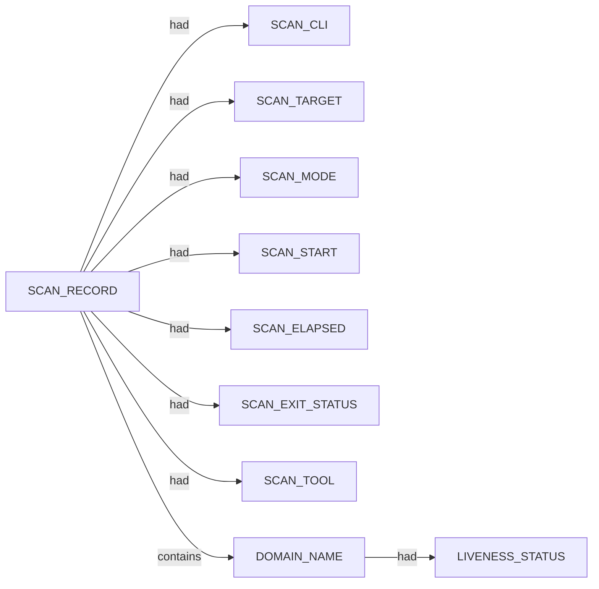

# Subfinder scan narrative — `invalid_domain_clean_miss`

## Introduction

Subfinder contributes DNS-focused domain enumeration. Active-mode IP resolution is retained as an IPV4_ADDRESS fact using currently approved SPEC-004 relations; the exact dns-resolves-to relation remains deferred until relation coverage is updated.

## Domains

- `not-a-real-domain-xyzzy.invalid`

## Graph structure (types)

## Trace

_Trace section omitted when no TRACE nodes present._

## Appendix

### Nodes

- `DOMAIN_NAME`: not-a-real-domain-xyzzy.invalid
- `LIVENESS_STATUS`: unconfirmed
- `SCAN_CLI`: subfinder -d not-a-real-domain-xyzzy.invalid -oJ -cs -o .docs/docs-for-cli-tools/exploration_scratch/subfinder/exams/invalid_domain_clean_miss.jsonl -silent
- `SCAN_ELAPSED`: 24.594
- `SCAN_EXIT_STATUS`: 0
- `SCAN_MODE`: passive
- `SCAN_RECORD`: subfinder:not-a-real-domain-xyzzy.invalid:subfinder -d not-a-real-domain-xyzzy.invalid -oJ -cs -o .docs/docs-for-cli-tools/exploration_scratch/subfinder/exams/invalid_domain_clean_miss.jsonl -silent
- `SCAN_START`: 2026-07-05T14:26:26.453039+00:00
- `SCAN_TARGET`: not-a-real-domain-xyzzy.invalid
- `SCAN_TOOL`: subfinder

### Edges

- `SCAN_RECORD` `had` `SCAN_CLI`
- `SCAN_RECORD` `had` `SCAN_TARGET`
- `SCAN_RECORD` `had` `SCAN_MODE`
- `SCAN_RECORD` `had` `SCAN_START`
- `SCAN_RECORD` `had` `SCAN_ELAPSED`
- `SCAN_RECORD` `had` `SCAN_EXIT_STATUS`
- `SCAN_RECORD` `had` `SCAN_TOOL`
- `SCAN_RECORD` `contains` `DOMAIN_NAME`
- `DOMAIN_NAME` `had` `LIVENESS_STATUS`
---

*OS-Intel Scan*
