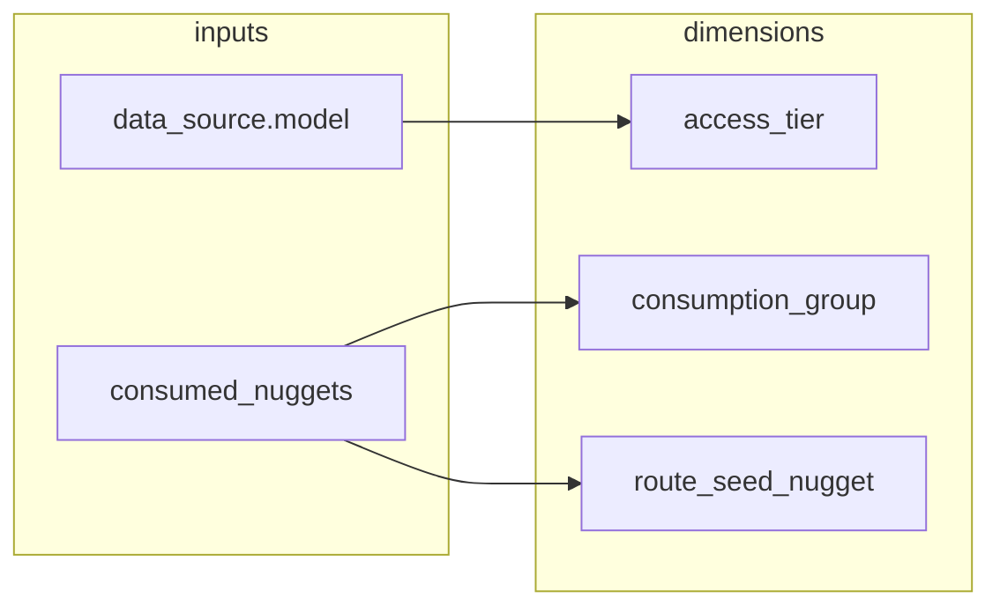

# Grouping of OSINT Services

This document describes how Spiderfeet classifies **OSINT service modules** for map navigation, route planning, favourites, and force-graph filtering. It is the canonical reference for the grouping dimensions stored on each record in `.docs/analysis/osint_services.json` and mirrored on the `osint-service` relation in `.seed/spiderfeet_map.tql`.

---

## 1. Scope and purpose

### What is an OSINT service?

An **OSINT service** is a Spiderfeet module whose metadata includes a `dataSource` block — i.e. it calls an external data provider rather than performing purely internal analysis. These modules are extracted from `modules/sfp_*.py` by `.docs/analysis/analyse_modules.py` and catalogued in `osint_services.json`.

| Metric | Count |
|--------|------:|
| Total modules in `modules/` | ~233 |
| Modules with `dataSource` (OSINT services) | **177** |
| Internal / non-external modules (excluded) | ~56 |

Each OSINT service record describes:

- **Identity** — `module_id`, `name`, `summary`, `flags`, `use_cases`, `categories`
- **Provider** — nested `data_source` (website, `model`, references, API key instructions, branding)
- **Graph behaviour** — `consumed_nuggets`, `produced_nuggets` (from module `watchedEvents` / `producedEvents`)
- **Grouping dimensions** — `access_tier`, `consumption_group`, `route_seed_nugget` (computed)

### Why group services?

The Spiderfeet **map model** connects nuggets through OSINT services via **routes**. Operators need to:

1. **Filter** the elemental map by cost/access and by what kind of seed data a service accepts
2. **Plan sequences** — chains of produced → consumed nuggets across services
3. **Build favourites** — common `(consumed → service → produced)` patterns without navigating 177 flat entries
4. **Colour and layout** force graphs — e.g. cluster by consumption family, badge by access tier

Grouping dimensions are **orthogonal**: a service has one access tier, one consumption group, and one route seed, simultaneously.

---

## 2. Source of truth

| Artifact | Role |
|----------|------|
| `.docs/analysis/analyse_modules.py` | Parses modules; computes grouping fields |
| `.docs/analysis/osint_services.json` | Generated catalogue (177 records) |
| `.seed/spiderfeet_map.tql` | TypeDB schema: `osint-service` owns grouping attributes |
| `modules/sfp_*.py` | Authoritative module metadata (`meta.dataSource.model`, event lists) |

Regenerate the JSON after module changes:

```bash
python .docs/analysis/analyse_modules.py
```

---

## 3. Grouping dimensions (overview)

Three computed fields sit on every OSINT service record and on the TypeDB `osint-service` relation:

| Dimension | Field | Cardinality | Use |
|-----------|-------|------------:|-----|
| **Access** | `access_tier` | 3 values | Cost / registration filter |
| **Consumption** | `consumption_group` | 12 values | Map family filter, layout bias |
| **Route seed** | `route_seed_nugget` | ~16 distinct values | Sequence entry point, route key |

Additionally, each service retains:

- **`consumed_nuggets`** — full list of nugget types the module listens for (may be multiple)
- **`data_source.model`** — Spiderfeet’s fine-grained access enum (6 values); mapped into `access_tier`



---

## 4. Dimension A — `access_tier`

### Purpose

Answers: *“What does it cost / require to run this service?”*  
Used for UI filters (e.g. “show only free, no signup”), legend badges, and policy gates.

### Canonical values

| `access_tier` | Meaning |
|---------------|---------|
| `free_no_auth` | No account or API key required by the provider model |
| `free_auth` | Free tier, but registration and/or API key required |
| `paid` | Commercial subscription or private/enterprise access only |

### Mapping from `data_source.model`

Spiderfeet modules declare one of six `data_source.model` values (validated in `test/unit/test_modules.py`). These map to three tiers:

| Spiderfeet `data_source.model` | `access_tier` | Count | Notes |
|--------------------------------|---------------|------:|-------|
| `FREE_NOAUTH_UNLIMITED` | `free_no_auth` | 88 | Open feeds, public APIs |
| `FREE_NOAUTH_LIMITED` | `free_no_auth` | 7 | No auth, but rate-limited |
| `FREE_AUTH_LIMITED` | `free_auth` | 61 | API key + quota |
| `FREE_AUTH_UNLIMITED` | `free_auth` | 11 | API key, generous/free unlimited tier |
| `COMMERCIAL_ONLY` | `paid` | 8 | Paid product |
| `PRIVATE_ONLY` | `paid` | 2 | Private/enterprise access |

### Distribution

| `access_tier` | Modules | Share |
|---------------|--------:|------:|
| `free_no_auth` | 95 | 53.7% |
| `free_auth` | 72 | 40.7% |
| `paid` | 10 | 5.6% |

### Important caveats

1. **`FREE_NOAUTH_LIMITED` is still `free_no_auth`** — “limited” refers to provider rate limits, not a paid subscription.
2. **`flags: ["apikey"]` does not override the tier** — tier follows `data_source.model` only. Some modules document API keys in metadata while declaring a NOAUTH model (rare inconsistency in source modules).
3. **`paid` is small but high-value** — breach intel, WHOIS depth, fraud scoring; see paid module list below.
4. **Raw `data_source.model` is preserved** on `osint-source` for quota detail (`LIMITED` vs `UNLIMITED`) when needed.

### Paid modules (all 10)

| Module | `consumption_group` | `route_seed_nugget` | `data_source.model` |
|--------|---------------------|---------------------|---------------------|
| `sfp_c99` | `email_identity_bundle` | `DOMAIN_NAME` | `COMMERCIAL_ONLY` |
| `sfp_dehashed` | `email_identity_bundle` | `DOMAIN_NAME` | `COMMERCIAL_ONLY` |
| `sfp_fsecure_riddler` | `domain_and_hostname` | `INTERNET_NAME` | `PRIVATE_ONLY` |
| `sfp_haveibeenpwned` | `email_identity_bundle` | `EMAILADDR` | `COMMERCIAL_ONLY` |
| `sfp_projectdiscovery` | `domain` | `DOMAIN_NAME` | `PRIVATE_ONLY` |
| `sfp_seon` | `email_identity_bundle` | `IP_ADDRESS` | `COMMERCIAL_ONLY` |
| `sfp_sociallinks` | `email_identity_bundle` | `EMAILADDR` | `COMMERCIAL_ONLY` |
| `sfp_spur` | `ip_netblock` | `IP_ADDRESS` | `COMMERCIAL_ONLY` |
| `sfp_whoisology` | `email` | `EMAILADDR` | `COMMERCIAL_ONLY` |
| `sfp_whoxy` | `email` | `EMAILADDR` | `COMMERCIAL_ONLY` |

Paid services skew toward **email/identity** enrichment (5 of 10 in `email_identity_bundle` or `email`).

---

## 5. Dimension B — `consumption_group`

### Purpose

Answers: *“What kind of input does this service primarily consume?”*  
Used for map filtering, force-graph clustering, and narrowing favourites — without creating 177 top-level buckets.

Each service is assigned **exactly one** of **12 consumption groups** using **priority rules** over the full `consumed_nuggets` set (most specific match wins).

### Canonical values

| Group | Modules | Share | Typical consumed nuggets |
|-------|--------:|------:|--------------------------|
| `ip_netblock` | 39 | 22.0% | `IP_ADDRESS` + `NETBLOCK_*` (+ affiliates) |
| `domain` | 29 | 16.4% | `DOMAIN_NAME` (+ domain WHOIS / similardomain) |
| `email_identity_bundle` | 23 | 13.0% | `EMAILADDR` + other identity fields |
| `hostname` | 20 | 11.3% | `INTERNET_NAME`, `CO_HOSTED_SITE`, affiliates |
| `other` | 17 | 9.6% | Multi-family or specialty inputs |
| `ip_only` | 15 | 8.5% | `IP_ADDRESS` / `IPV6` without netblock |
| `domain_and_hostname` | 13 | 7.3% | Both `DOMAIN_NAME` and `INTERNET_NAME` |
| `email` | 9 | 5.1% | `EMAILADDR` only |
| `crypto` | 4 | 2.3% | `BITCOIN_ADDRESS` / `ETHEREUM_ADDRESS` |
| `phone` | 4 | 2.3% | `PHONE_NUMBER` only |
| `web_url_content` | 2 | 1.1% | URLs, web content, JS providers |
| `org_entity` | 2 | 1.1% | `COMPANY_NAME`, `LEI` |

### Nugget sets used in classification

The classifier recognises these nugget families (subset of the full 172 nugget types):

**Domain** — `DOMAIN_NAME`, `AFFILIATE_DOMAIN_NAME`, `DOMAIN_WHOIS`, `SIMILARDOMAIN`, `SIMILARDOMAIN_WHOIS`, `DOMAIN_NAME_PARENT`, `AFFILIATE_DOMAIN_UNREGISTERED`

**Hostname** — `INTERNET_NAME`, `AFFILIATE_INTERNET_NAME`, `CO_HOSTED_SITE`, `CO_HOSTED_SITE_DOMAIN`, `CO_HOSTED_SITE_DOMAIN_WHOIS`, `INTERNET_NAME_UNRESOLVED`, `AFFILIATE_INTERNET_NAME_UNRESOLVED`, `AFFILIATE_INTERNET_NAME_HIJACKABLE`

**IP** — `IP_ADDRESS`, `IPV6_ADDRESS`, `AFFILIATE_IPADDR`, `AFFILIATE_IPV6_ADDRESS`, `INTERNAL_IP_ADDRESS`

**Netblock** — `NETBLOCK_MEMBER`, `NETBLOCK_OWNER`, `NETBLOCKV6_MEMBER`, `NETBLOCKV6_OWNER`, `NETBLOCK_WHOIS`

**Email** — `EMAILADDR`, `AFFILIATE_EMAILADDR`

**Web / URL** — `LINKED_URL_*`, `TARGET_WEB_*`, `URL_*`, `SEARCH_ENGINE_WEB_CONTENT`, `AFFILIATE_WEB_CONTENT`, `PROVIDER_JAVASCRIPT`

**Organisation** — `COMPANY_NAME`, `AFFILIATE_COMPANY_NAME`, `LEI`

**Crypto** — `BITCOIN_ADDRESS`, `ETHEREUM_ADDRESS`

### Priority rules (evaluation order)

Rules are applied **in order**; the first match assigns the group:

1. **`crypto`** — crypto nuggets present; no email; no netblock
2. **`phone`** — `PHONE_NUMBER` only (no email, IP, netblock, hostname)
3. **`email`** — exactly one consumed nugget and it is email
4. **`email_identity_bundle`** — email plus at least one other nugget
5. **`ip_netblock`** — IP and netblock nuggets together
6. **`ip_only`** — IP without netblock, domain, hostname, or email
7. **`domain_and_hostname`** — both domain and hostname families
8. **`domain`** — domain only (no hostname, IP, netblock)
9. **`hostname`** — hostname only (no domain, IP, netblock)
10. **`web_url_content`** — web/URL nuggets; no IP, netblock, or email
11. **`org_entity`** — company/LEI; no IP, email, or hostname
12. **`other`** — everything else (multi-family specialty)

### Group descriptions and map role

#### `domain` (29 modules)

WHOIS, DNS, domain reputation, certificate transparency, subdomain discovery.  
**Route pattern:** seed with `DOMAIN_NAME` → enrich registration, DNS, affiliates.  
**Example signature:** 20 modules consume `DOMAIN_NAME` alone.

#### `hostname` (20 modules)

Co-hosted sites, hostname resolution, hostname-centric reputation.  
**Route pattern:** seed with `INTERNET_NAME` or co-host cluster.  
**Example signature:** 13 modules consume `INTERNET_NAME` + `AFFILIATE_INTERNET_NAME` + `CO_HOSTED_SITE`.

#### `domain_and_hostname` (13 modules)

Cross-walk domain registration with resolved hostnames (e.g. passive DNS, combined lookups).

#### `ip_netblock` (39 modules)

Abuse/reputation lists, BGP/RIR context, malicious IP/subnet reporting.  
**Route pattern:** IP or netblock seed → malicious/descriptor nuggets.  
**Example signature:** 19 modules share `IP_ADDRESS` + netblock + `AFFILIATE_IPADDR`.

#### `ip_only` (15 modules)

Single-IP enrichment (geo, port, passive DNS on IP) without netblock membership events.

#### `email` (9 modules)

Single-email breach checks, validation, deliverability.

#### `email_identity_bundle` (23 modules)

Email plus domain, human name, or other identity correlators — people/org search style modules.

#### `phone` (4 modules)

HLR, carrier, phone validation APIs.

#### `crypto` (4 modules)

Blockchain / wallet intelligence.

#### `web_url_content` (2 modules)

Archive, adblock/JS provider analysis — URL and page artefact driven.

#### `org_entity` (2 modules)

LEI, company registry lookups.

#### `other` (17 modules)

**Catch-all for multi-family inputs** that fail earlier rules — e.g. domain + phone + IP (`sfp_abstractapi`), hostname + IP + co-host without netblock (`sfp_cybercrimetracker`), IP + domain pairs (`sfp_dnsdb`), social/geo specialty.

See [Section 8](#8-the-other-consumption-group) for the full list.

### Consumption group × access tier

| `consumption_group` | `free_no_auth` | `free_auth` | `paid` |
|---------------------|---------------:|------------:|-------:|
| `ip_netblock` | 24 | 14 | 1 |
| `domain` | 15 | 13 | 1 |
| `email_identity_bundle` | 8 | 10 | 5 |
| `hostname` | 18 | 2 | 0 |
| `other` | 9 | 8 | 0 |
| `ip_only` | 4 | 11 | 0 |
| `domain_and_hostname` | 8 | 4 | 1 |
| `email` | 3 | 4 | 2 |
| `crypto` | 2 | 2 | 0 |
| `phone` | 1 | 3 | 0 |
| `web_url_content` | 1 | 1 | 0 |
| `org_entity` | 2 | 0 | 0 |

**Observations:**

- **Hostname reputation** is almost entirely free/no-auth (18/20).
- **Paid** concentrates in **email/identity** and a few **domain/IP** depth tools.
- **`ip_only`** skews **free_auth** (API keys common for IP intel vendors).

---

## 6. Dimension C — `route_seed_nugget`

### Purpose

Answers: *“If I start a sequence here, which nugget type is the primary entry point?”*  
Used for sequence planning, force-graph expansion menus (“expand from this seed”), and route naming — **not** for replacing the full `consumed_nuggets` list.

When a module consumes multiple nugget types, `route_seed_nugget` picks **one** using fixed priority:

```
ROOT → INTERNET_NAME → DOMAIN_NAME → IP_ADDRESS → IPV6_ADDRESS →
EMAILADDR → PHONE_NUMBER → BITCOIN_ADDRESS → ETHEREUM_ADDRESS →
HUMAN_NAME → USERNAME → COMPANY_NAME → LEI → LINKED_URL_EXTERNAL →
LINKED_URL_INTERNAL → WEB_ANALYTICS_ID → SOCIAL_MEDIA → INTERESTING_FILE →
PHYSICAL_ADDRESS → PHYSICAL_COORDINATES → (else first alphabetically)
```

### Distribution (top values)

| `route_seed_nugget` | Modules | Typical role |
|---------------------|--------:|--------------|
| `INTERNET_NAME` | 53 | Hostname-first expansion |
| `IP_ADDRESS` | 47 | Network-first expansion |
| `DOMAIN_NAME` | 46 | Domain-first expansion |
| `EMAILADDR` | 12 | Identity/breach chains |
| `PHONE_NUMBER` | 4 | Telephony chains |
| `BITCOIN_ADDRESS` | 3 | Crypto chains |
| Other singletons | 12 | Specialty seeds |

The three dominant seeds (`INTERNET_NAME`, `IP_ADDRESS`, `DOMAIN_NAME`) account for **146 of 177** modules (82.5%) — matching how Spiderfeet scans are usually seeded.

### Relationship to `consumption_group`

| Concept | Cardinality | Question answered |
|---------|-------------|-------------------|
| `consumption_group` | One of 12 families | What **family** of inputs? |
| `route_seed_nugget` | One nugget type | What **single nugget** starts the route? |
| `consumed_nuggets` | One or many | What **exact events** does the module listen for? |

Example: `sfp_haveibeenpwned` consumes `EMAILADDR` + `PHONE_NUMBER` → group `email_identity_bundle`, seed `EMAILADDR`.

---

## 7. TypeDB schema binding

Grouping fields are first-class attributes on the abstract `osint-service` relation in `.seed/spiderfeet_map.tql`:

```typeql
relation osint-service,
    owns module_id,
    owns name,
    owns summary,
    owns flags,
    owns use_cases,
    owns categories,
    owns access_tier,
    owns consumption_group,
    owns route_seed_nugget,
    owns consumed_nuggets,
    owns produced_nuggets,
    ...
```

Attribute constraints:

```typeql
attribute access_tier, value string @values{ "free_no_auth", "free_auth", "paid" };
attribute consumption_group, value string @values{
    "domain", "hostname", "domain_and_hostname", "ip_netblock", "ip_only",
    "email", "email_identity_bundle", "phone", "crypto", "web_url_content",
    "org_entity", "other"
};
attribute route_seed_nugget, value string;
```

Fine-grained provider model remains on **`osint-source`** via `owns model` (linked through `data-source`).

Each concrete module is a sub-relation, e.g. `relation sfp-abusech, sub osint-service;` (177 subtypes).

---

## 8. The `other` consumption group

These **17 modules** have heterogeneous or multi-family `consumed_nuggets` and are intentionally not forced into a single family:

| Module | `consumed_nuggets` | Why `other` |
|--------|-------------------|-------------|
| `sfp_abstractapi` | domain, phone, IP, IPv6 | Multi-family enrichment API |
| `sfp_cybercrimetracker` | hostname + IP + co-host | Hostname+IP without netblock rule match |
| `sfp_dnsdb` | IP, IPv6, domain | Passive DNS cross-family |
| `sfp_google_tag_manager` | `WEB_ANALYTICS_ID` | Analytics ID specialty |
| `sfp_googlesafebrowsing` | hostname + IP + co-host | Safe browsing multi-input |
| `sfp_hybrid_analysis` | IP + domain | Sandbox lookup |
| `sfp_leakix` | IP + domain | Exposure search |
| `sfp_malwarepatrol` | hostname + IP + co-host | Multi-input reputation |
| `sfp_metadefender` | IP + hostname | Multi-input sandbox |
| `sfp_openstreetmap` | `PHYSICAL_ADDRESS` | Geo specialty |
| `sfp_slideshare` | `SOCIAL_MEDIA` | Social specialty |
| `sfp_socialprofiles` | `HUMAN_NAME` | People search |
| `sfp_twitter` | `SOCIAL_MEDIA` | Social specialty |
| `sfp_venmo` | `USERNAME` | Account specialty |
| `sfp_vxvault` | broad hostname + IP + IPv6 | Large multi-input set |
| `sfp_wigle` | `PHYSICAL_COORDINATES` | Wi‑Fi geo specialty |
| `sfp_zoneh` | broad hostname + IP + IPv6 | Defacement multi-input |

For map UX, **`other` should remain filterable** but may use a distinct visual treatment (neutral colour, “specialty” badge). Routes within `other` still have a valid `route_seed_nugget`.

---

## 9. Using groups in the map model

The Spiderfeet map has three layered views (see `.seed/02_stsage_by_stage_reengineer.md`):

| Map layer | Grouping use |
|-----------|--------------|
| **Elemental** | Show all services; filter by `consumption_group` and `access_tier`; colour nodes by group |
| **Favourites** | Promote common routes within a group (exact `consumed_nuggets` signature + service) |
| **Sequences** | Chain by matching `produced_nuggets` → next service’s `route_seed_nugget` / `consumed_nuggets` |

### Suggested force-graph filters

- **Access:** `free_no_auth` only for unrestricted demos
- **Family:** `ip_netblock` + `hostname` for infrastructure footprint
- **Seed:** start sequence from nodes matching `route_seed_nugget = DOMAIN_NAME`

### Suggested favourite candidates (high module count signatures)

| Signature | Modules | Likely favourite role |
|-----------|--------:|----------------------|
| `DOMAIN_NAME` only | 20 | Domain WHOIS/DNS stack |
| IP + netblock cluster | 19 | Reputation block |
| Hostname + co-host cluster | 13 | Shared hosting |
| `EMAILADDR` only | 9 | Breach checking |
| `DOMAIN_NAME` + `INTERNET_NAME` | 8 | Combined passive DNS |

---

## 10. Record shape (example)

```json
{
  "module_id": "sfp_abusech",
  "name": "abuse.ch",
  "data_source": {
    "website": "https://www.abuse.ch",
    "model": "FREE_AUTH_UNLIMITED"
  },
  "access_tier": "free_auth",
  "consumed_nuggets": [
    "INTERNET_NAME",
    "IP_ADDRESS",
    "NETBLOCK_MEMBER",
    "AFFILIATE_INTERNET_NAME",
    "AFFILIATE_IPADDR",
    "CO_HOSTED_SITE",
    "NETBLOCK_OWNER"
  ],
  "produced_nuggets": [
    "MALICIOUS_IPADDR",
    "MALICIOUS_INTERNET_NAME",
    "MALICIOUS_AFFILIATE_IPADDR",
    "MALICIOUS_AFFILIATE_INTERNET_NAME",
    "MALICIOUS_SUBNET",
    "MALICIOUS_COHOST",
    "MALICIOUS_NETBLOCK"
  ],
  "consumption_group": "ip_netblock",
  "route_seed_nugget": "INTERNET_NAME"
}
```

---

## 11. Maintenance and evolution

### Regenerating classifications

1. Edit Spiderfeet modules or classification rules in `analyse_modules.py`
2. Run `python .docs/analysis/analyse_modules.py`
3. Verify counts and spot-check `other` / `paid` lists
4. Load updated attributes into TypeDB when seeding map data

### When to extend the taxonomy

| Trigger | Action |
|---------|--------|
| New `data_source.model` enum in Spiderfeet | Add to `ACCESS_TIER_BY_MODEL` and tests |
| New nugget types consumed by many modules | Extend family frozensets in `consumption_group()` |
| `other` group grows beyond ~15% | Split new group (e.g. `social`, `geo`) with new `@values` entry |
| UI needs quota detail | Filter on `osint-source.model` (`LIMITED` vs `UNLIMITED`) alongside `access_tier` |

### Known limitations

1. **One group per service** — multi-family modules are approximated; full behaviour is always in `consumed_nuggets`.
2. **177 of ~233 modules** — internal modules (storage, formatting, correlation) are out of scope.
3. **Tier vs API key flag** — classification trusts `data_source.model`, not `flags`.
4. **Exact route signatures** — ~100+ unique `consumed_nuggets` sets; favourites should use exact signatures, not groups alone.

---

## 12. Quick reference

### Access tier

| Value | Provider models |
|-------|-----------------|
| `free_no_auth` | `FREE_NOAUTH_*` |
| `free_auth` | `FREE_AUTH_*` |
| `paid` | `COMMERCIAL_ONLY`, `PRIVATE_ONLY` |

### Consumption group (12)

`domain` · `hostname` · `domain_and_hostname` · `ip_netblock` · `ip_only` · `email` · `email_identity_bundle` · `phone` · `crypto` · `web_url_content` · `org_entity` · `other`

### Files

- **Catalogue:** `.docs/analysis/osint_services.json`
- **Classifier:** `.docs/analysis/analyse_modules.py`
- **Schema:** `.seed/spiderfeet_map.tql`
- **Colour hints:** `.docs/analysis/force_graph_colour_scheme.md`

---

*Generated from catalogue analysis of 177 OSINT services. Regenerate statistics after module changes via `analyse_modules.py`.*
