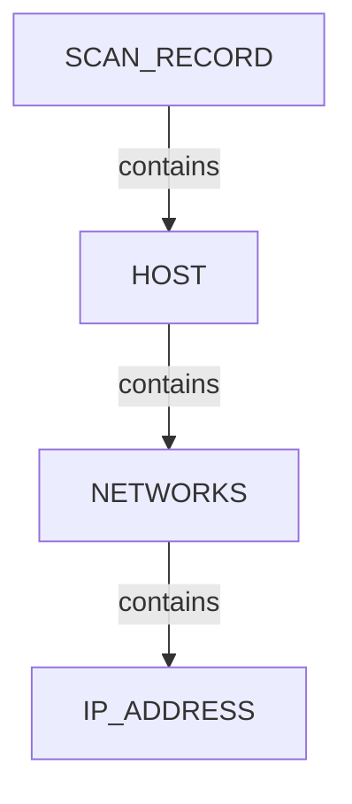

# SPEC-006 structure doc quality bar

**Gold file:** `.docs/docs-for-cli-tools/nugget_structure/nmap_nugget_graph_structure.md`  
**Spec:** `.governance/specs/SPEC-006-tool-structure-docs-ontology.md`  
**Audience:** Lesser agents rewriting or generating `*_nugget_graph_structure.md`

A tool Structure doc is **incomplete** until every row below is `Pass` or `N/A` (with reason).

## Document checklist

| # | Requirement | Pass criteria |
|---|-------------|---------------|
| Q1 | Title | `# <Tool> — proposed nugget graph structure` (em dash) |
| Q2 | Header | Ontology seed path(s), generator/adapter path, artifact naming pattern |
| Q3 | Scan head | Prose + at least one Mermaid with `SCAN_RECORD` and `had` descriptors |
| Q4 | Primary tree | At least one Mermaid for the tool’s main endpoint pattern (HOST/SYSTEM/CDN/DOMAIN/…) |
| Q5 | Specialty trees | Separate Mermaid sections for each distinct branch the tool can emit (ports/services, L2 MAC, org, vulns, TRACE, …) — **do not collapse unrelated patterns into one giant diagram** |
| Q6 | Scenario coverage | Table: scenario_id → primary structures (must cover formal examination matrix rows) |
| Q7 | Field mapping | Table: structured path/field → `nugget_id` |
| Q8 | Nugget table | When tool introduces or heavily uses types: nugget / type / parent / source / relation |
| Q9 | Review notes | Intentional omissions, deferred fields, relation vocabulary (`contains` / `had` / `listens-to`) |
| Q10 | Cross-link | Link to `../_Current_Ontology.md` |
| Q11 | Mermaid purity | Node labels are **types only** (optional short role like `HOST target`); no IPs, hostnames, URLs, CVE ids, org names |
| Q12 | Depth | Matches tool evidence: if graphs emit SSH keys / TRACE / vulns / org trees, the Structure doc must diagram them |
| Q13 | Engine-owned | After Epic M: file is regenerated from `rules/<tool>/structure.yaml` — hand edits go into YAML, not only the MD |

## Mermaid style (copy Nmap)



- Use `flowchart TD` (or `LR` only for composition overviews).
- Edge labels: `|contains|`, `|had|`, `|listens-to|`.
- Keep ≤ ~12 nodes per diagram; split specialty branches into their own sections.

## Anti-patterns (reject in review)

- Bullet-only “pipeline” notes with no Mermaid (current httpx/subfinder style)
- One giant Mermaid mixing scan head + all specialty trees
- Values inside Mermaid nodes (`HOST 192.168.1.1`, `SERVICE ssh`)
- Claiming a structure the live graphs do not emit
- Shipping Structure MD without matching `structure.yaml` after M1
- Leaving Katana/Nuclei without a Structure doc while Tools page lists the tool

## Current gap snapshot (2026-07-13)

| Tool | Structure doc | vs Nmap bar |
|------|---------------|-------------|
| nmap | strong | **Gold** |
| netdiscover | strong | Near gold — keep; align to engine |
| nerva | thin | Rewrite |
| pius | thin | Rewrite |
| subfinder | thin | Rewrite |
| httpx | thin | Rewrite |
| katana | **missing** | Create |
| nuclei | **missing** | Create |

## Verification hints

```bash
# After engine lands:
poetry run python .seed/scripts/cli_corpus/render_structure_docs.py --all
poetry run pytest .tests/test_structure_doc_engine.py -q
# Manual: ./start.ps1 → CLI Profiling → Tools → Structure for each tool
```
