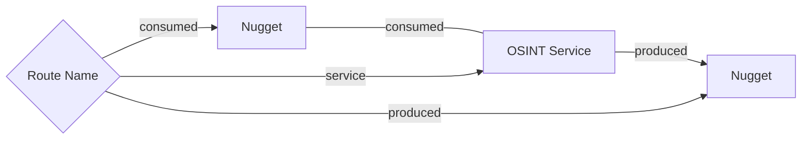

# Stage by Stage Reengineering of SpiderFoot to Spiderfeet v2

## 1. Overall Objective

The overall objective is to reengineer SpiderFoot to Spiderfeet v2 over a few stages:

0. **Setup Project Guidance for the Governance rules in each Project Root Directory** (in the .governance directory) This project has two separate codebases, the spiderfeet codebase and the spiderfeet-widget codebase. The Generic Governance rules are setup in the .governance directory, and the project specific Governance rules are to be setup in the .governance/project directory, once you have read this entire document and completed your planning. The project specific Governance rules are used to guide the project's development, and are used to ensure that the project is developed in a consistent and predictable way. Make sure these rules are then copied into the .cursor/rules directory, so that they are used by the Cursor AI agent.
1. **Name Change:** Convert all versions of the term SpiderFoot to Spiderfeet, including the terms spiderfoot, SpiderFoot, Spiderfoot, etc.. Make sure any directory and file names are changed as well, until the term Spiderfoot can no longer be found in the codebase. Also, ensure that all references to the SpiderFoot project are updated to Spiderfeet, including the README.md file. Change MIT License to Apache 2.0 License, owned by Brett Forbes. Develop a Logo for Spiderfeet, and add it to the README.md file.
2. **FastAPI over CLI:** Establish a FastAPI backend over the CLI commands, so that the CLI commands can be called from the JS iFrame (spiderfeet_widget) user interface. Include a full Swagger UI for the API, and a full API documentation.
3. **TypeDB OSINT Consumption and Production Model:** Establish a new, consistent, logical map as a data model for enriching data with OSINT services, where nuggets with known values are consumed by OSINT services and new nuggets are produced by OSINT service modules. Implement this map of all of the nugget consumption and production routes in TypeDB, where the OSINT service is a relation and the nuggets are entities, and display it as a force graph in a JS iFrame (spiderfeet_widget) UI using a Fast API backend. Use the FastAPI backend to provide full CRUD functionality for the TypeDB map model, with Type-Bridge classes, so that the map model can be edited and updated from the JS iFrame (spiderfeet_widget) user interface. Provide a connection setup widget for the JS iFrame (spiderfeet_widget) user interface so that a running TypeDB instance can be selected, and the loading of schema and data occur. Use the database name `spiderfeet-map`
4. **Module by Module Interactive Testing Framework:** Use this map of nugget consumption and production routes through modules to establish a new, module by module interactive testing framework , in a new tab on the JS iFrame (spiderfeet_widget) user interface. We need to first generate reealistic testing data for every nugget consumed in the map. Then in the user interface, each combination of consumption and production of nuggets can be tested for each module, displaying the value of the consumed nugget, the CLI call, the resulting nuggets, and the raw return data from the module. A deep investigation must be performed on the web for each module to ensure, the data in the module is update and complete. Modules that produce errors can be identified and fixed during this process, and modules where the output is not as expected can also be identified and fixed during this process. The results, performance (consumption to production time), and any errors must be annotated against the TypeDB map model, so it serves as a record, and history of every time any module was exercised. A table (paged to 10 rows only) should be provided for every module, listing the TypeDB report of performance on the JS iFrame (spiderfeet_widget). To exit this stage, the JS iFrame (spiderfeet_widget) user interface should have a test of every consumption/production route in the map.
5. **Quarrantine Services: Module by Module Testing:** Now, add the quarrantine services to the map, so that they are a sub class of OSINT services and test them in the same way as the modules. Every consumption and production route must be tested as well as response times, results and raw results. A deep investigation must be performed on the web for each module to ensure, the data in the module is update and complete. Modules that do work, and have completely accurate output should have their type changed to OSINT Service, and the TypeDB map model updated to reflect this. Modules and sources which do not work, must either be fixed, or if the service is no longer viable deleted from the map and the code base. The results, performance (consumption to production time), and any errors must be annotated against the TypeDB map model, so it serves as a record, and history of every time any module was exercised. To exit this stage, the JS iFrame (spiderfeet_widget) user interface should have a test of every consumption/production route in the map, all of the quarantine  are either converted to full modules, or all inneffectual routes and services have been deleted.
6. **Analyse the Finalsed Map, Develop Favourites and Sequences** With an updated map of all OSINT service routes, we must first compare the results for each combination of consumption and production nugget routes. We anticipate using this updated capabilities in two ways: either interactively through a user interface to selectively produce new nuggets (similar to Maltego), or through a single, multi-step sequence which maximally expands the original nugget.In both cases, this process and results will be driven through a tab on the JS iFrame (spiderfeet_widget) user interface, and each selection will produce a force graph of resulting niuggets, linked by OSINT services. To achieve this, the analysis will collect together the top performing services for each common combination of consumption and production routes, and collect them as a favourite. All modules in a fvourtie are run, and their answers consolidated into one or more common production nuggets. Sequences are multi-module hops of favourites and other modules, where the nuggets produced by one module, are then consumed by other modules to create a chain of nuggets. Sequences can be maximally expanded if every possible chain of produced nuggets to consumed nuggets has been explored and the results returned. Every favourite and sequence must be tested interactively in the user interface, in another tab of the JS iFrame (spiderfeet_widget). Make sure an API in FastAPI is developed directly for each favourite and each sequence, in order to feed them to the JS iFrame (spiderfeet_widget)
7. **Develop a drop-in replacement for the existing `modules\sfp__stor_db.py`, based on a TypeDB database**, using an extension of the mapping and annotation schema above. This ensures that every nugget is stored in the TypeDB database, and can be retrieved and used by other modules. Further, every nugget that is produced, is related to the nugget that was consumed by the OSINT service module relation, through the TypeDB graph, so the full provenance of nugget derivation can be traced. Use the database name `spiderfeet-actual` for the TypeDB database.
8. **Develop the Spiderfeet User Interface:** Create the main tab on the JS iFrame (spiderfeet_widget) user interface, which will be the main entry point for the user to interact with the Spiderfeet platform. This tab will contain other sub-tabs, one for each discrete OSINT investigation. There are two ways to start an OSINT investigation, either by pushing in a nugget with a value by API, which would then cause a new sub-tab to be opened, or by selecting a "New Investigation" button, which would then cause a new sub-tab to be opened, and dragging and ropping a nugget from the palette on the left. Once the new nugget has been dragged in to the page, then a value can be entered for it. From that point a user can use a RMB menu ove this nugget to chose a single Favourites service, or choose a sequence to run. The results of the investigation will be displayed in a table on the page, and a force graph will be displayed showing the relationships between the nuggets and the OSINT services.

## 2. Stage by Stage Guidance

Each stage is a separate epic, with multiple user stories. Not everything is known at this stage and hence once the development of any individual stage is complete an exploratory process will be undertaken to check whether the feature set is complete for that stage. This project contains two separate codebases, the `spiderfeet` codebase and the `spiderfeet-widget` codebase, and you should read the [multi root directory skill](.cursor\skills\cursor-multi-repo\SKILL.md) so that you know how to work with both code bases at the same time. Note the documentation b elow only includees the first 4 stages listed above, so at present only do plans for the first 4 stages.

### 2.0 Setup Project Guidance for the Governance rules in each Project Root Directory

After reading this document, setup the project-specific governance rules in the .governance/project directory of each root directory, using the Generic Governance rules as a guide. These rules should then be copied into the .cursor/rules directory, so that they are used by the Cursor AI agent. Make sure the rules for the `spiderfeet` root space, and the `spiderfeet-widget` root space are setup correctly, since one is Python and the other is JS.

Make sure the planning process creates epics and user story issues for both the `spiderfeet` and `spiderfeet-widget` codebases, and that the issues are linked to the appropriate epic. But dont push the issue documents to github as github issues until they are approved by the project owner. Once they are approved, push the issue documents to each codebase's github as github issues for all epics and user stories. Make sure the issues are in the correct board state before work starts (`Backlog` or `Ready`) and move it to `Ready` once the issue is clear enough to execute. Create a project and a kanban board to centralise all issues for both `spiderfeet` and `spiderfeet-widget` epics and user stories in a single board for the whole project.

Once you sellect a github issue to work on, make sure you rpovide extensive documentation for everything you did, and then ask for approval to push the changes to github. Once you have approval to close the issue, push the changes to github for that issue as a pull request with best practice documentation of the changes. 

At that point, record your closing of the issue in the `.tasks` directory, in the appropriate root directory, with a json file and a markdown file for each issue, as shown in the examples below. Make sure the json file is named after the issue number, and the markdown file is named after the issue title (e.g. .tasks\issue-22.json and .tasks\issue-22.md as shown below).

```json
{
    "author": {
        "id": "MDQ6VXNlcjE3MDMxMg==",
        "is_bot": true,
        "login": "modeller",
        "name": "Brett Forbes"
    },
    "body": "Remove E2E test files that test project rules documentation. These are not needed for actual functionality testing.",
    "closedAt": null,
    "createdAt": "2025-07-02T16:38:49Z",
    "labels": [
        {
            "id": "LA_kwDOMGtJXc8AAAABpJVFRw",
            "name": "bug",
            "description": "Something isn't working",
            "color": "d73a4a"
        }
    ],
    "number": 22,
    "state": "OPEN",
    "title": "Remove unnecessary rules testing files",
    "updatedAt": "2025-07-02T16:38:49Z",
    "url": "https://github.com/typerefinery-ai/widget-graph-viz/issues/22"
}
```

```markdown
---
issue_number: 22
title: "Remove unnecessary rules testing files"
state: OPEN
author: Brett Forbes
created_at: 2025-07-02T16:38:49Z
updated_at: 2025-07-02T16:38:49Z
labels:
  - bug
url: https://github.com/typerefinery-ai/widget-graph-viz/issues/22
---

## Summary
Remove E2E test files that only test project rules documentation, as they are not needed for actual functionality testing.

## Acceptance Criteria
- [ ] All unnecessary rules testing files are identified
- [ ] Files are removed from the codebase
- [ ] No impact on functional test coverage
- [ ] Changes are committed and pushed

## Incremental Updates

- 2025-07-04: Issue trace file created and initial metadata captured. 
```


### 2.1 Name Change: Convert all versions of the term SpiderFoot to Spiderfeet, including the terms spiderfoot, SpiderFoot, Spiderfoot, etc.. 

The aim is to reengineer and rebrand an existing project, so that it is a new and improved project, with a new name, a new logo, and as separate code bases for the reengineered Python backend `spiderfeet` and the new user interface iFrame widget `spiderfeet-widget`, based on a template project. The `spiderfeet-widget` codebase should be able to run, using `start.ps1`, and all that is needed is to change the user interface to suit the requirements of the project.

With regard to the `spiderfeet` root directory, make sure any directory and file names are changed as well, until the term Spiderfoot can no longer be found in the codebase. Also, ensure that all references to the SpiderFoot project are updated to Spiderfeet, including the README.md file. Change MIT License to Apache 2.0 License, owned by Brett Forbes. Develop 3 examples of a Logo for Spiderfeet, and add them to the README.md file so that I can choose between them.

With regard to the `spiderfeet-widget` root directory, add an Apache 2.0 License, owned by Brett Forbes. Use the same 3 examples of a Logo for Spiderfeet, and add them to the README.md file as you modify it so that I can choose between them.

Create another issue for you and i to review the logo choices, and select the one we want. Further we can also search for the term `spiderfoot` to confirm whether every instance has been replaced. Set it as the last task in the epic, and once you have completed it, ask for approval to close the epic. Once this final logo is selected, it should also be used in the iFrame widget user interface, as you modify them below

### 2.2 FastAPI over CLI: Establish a FastAPI backend over the CLI commands, so that the CLI commands can be called from API's by the JS iFrame (spiderfeet_widget) user interface. 

This epic is solely on the `spiderfeet` codebase, and includes a full Swagger UI for the API, and a full API documentation.  There is no epic or user story in the `spiderfeet-widget` codebase for this stage.

Ideally, you also create a full set of API descriptions and tests within Requestly, so that we can test the API's and ensure they are working correctly. I have Requestly installed, so part of this Epic is to work with me to set Requestly up to test every API we create and ensure they are working correctly. This includes giving me the input data and correct formats for any API's that are created. We need to use Requestly to prove the API's we make in the `spiderfeet` codebase are working correctly, and Requestly needs configuratrion data to test every API you create. Create a full API testing plan that we can go through.

Make sure there is a `./start.ps1` script in the `spiderfeet root to start the FastAPI server.

Create a final issue in the epic for you and i to test every API we create in Requestly and ensure they are working correctly. Set it as the last task in the epic, and once you have completed it, ask for approval to close the epic.

### 2.3 TypeDB OSINT Consumption and Production Model: Establish a new, consistent, logical map as a data model for enriching data with OSINT services, where nuggets with known values are consumed by OSINT services and new nuggets are produced by OSINT service modules, and this can be viewed in the user interface iFrame (spiderfeet_widget). 

This stage has epics/tasks in each codebase, `spiderfeet` and `spiderfeet-widget`, and you should create the epics/tasks in each codebase, and then link them to the appropriate epic/task in the other codebase.

Ensure you are familiar with the TypeDB skill in the .cursor/skills directory (`.cursor\skills\typedb\SKILL.md`), and the type-bridge skill in the .cursor/skills directory (`.cursor\skills\type-bridge\SKILL.md`), and use them to help you create the TypeDB map model.

### 2.3.0 The Current SpiderFoot Codebase Construction

The `spiderfeet` codebase has a simple construction where a scanning framework is used to call one or more modules, from a directory of more than 200 modules (`modules`). The scan fires off an event, based on the envent types found in the `eventDetails` list in the `spiderfeet/db.py` file.

A root data value is passed to the scanning framework, as part of the root event, and the framework returns one or more data values, and stores them in the tables in the above db file (`spiderfeet/db.py`). There is some rudimentary logging of the events and results, but it is not very comprehensive.

### 2.3.1 The New Spiderfeet Map Model

The new view will be based on some analysis of the current codebase construction, and the creation of a new, consistent, logical map as a data model for enriching data with OSINT services, where nuggets with known values are consumed by OSINT services and new nuggets with unknown values are produced.

Every `osint-service` consumes one or more `nugget`s, and produces one or more `nugget`s.

We define a `route`, as an individual connection between a `consumed` nugget and one or more `produced` nuggets, through an `osint-service`. A route has a `name`, and any osint service can host one or more routes. Until we are working through the testing process, its impossible to know whether a given `osint-service` will produce one or more `nugget`s, or just one `nugget`, thus the `route` relations cant be setup until the actual input/outpu combinations can be determined.

Routes are intialised with a `route-state` of `in-test`, and then proven to be either `favourite`, `unique`, `unreliable`, or `dominated` by another route.



This map is implemented in full in the typeql spiderfeet schema `.seed\spiderfeet_map.tql`

Each route only provides a piece of the picture, some routes may be unique, some may be replicated by others, some may be unreliable. A route starts with a `route-state` of `in-test`, and then is proven to be either `favourite`, `unique`, `unreliable`, or `dominated` by another route. Hence, we will also need to create a Favourite, based on performance metrics, or other criteria, for every common combination of consumption and production routes (i.e. where there are duplicates of the same route), and a Sequence for every possible chain of produced nuggets to consumed nuggets. 

This map will also be useful as a basis to connect a log of scans from that service, so that nuggets production could alsways be traced back to the original consumption event. Sequences may be manually selected step-by-step through mouse over and RMB menu items on a force graph UI, or selected as a single, multi-step sequence which maximally expands the original nugget.

Essentially, we want 3 maps within one:

1. Routes: a graph of "connected nugget and OSINT services that represent all possible options for consuming and producing nuggets
2. Favourites: a graph of connected nuggets and OSINT services that represent the most common combinations of consumption and production routes
3. Sequences: a graph of connected nuggets and OSINT services that represent the most common chains of produced nuggets to consumed nuggets

So our strategy must be to first insert the sub-graphs of `consumed nuggets -> osint service -> produced nuggets` for each service producing the core map model. Until the testing process has been undertaken, its impossible to know whether a given `osint-service`, consuming a single `nugget` or multiple `nugget`s, will produce a single `nugget` or multiple `nugget`s. Then we can match each individual `consumed - osint service - produced` objects and insert the `route` relation, with some `name` attribute for each route, and 
`route-state = "in-test"` for all of them.

### 2.3.2 Implement the TypeDB ORM

Executed solely in `spiderfeet` codebase, and not in `spiderfeet-widget` codebase.

Make sure you maintain a connection string in a json file, so that it can be injected into every interaction with TypeDB. In the future, we will use an iFrame user interface, and it will have a connections control to let users select the TypeDB instance to use, but for the moment, just externalising the connection string to a json file will suffice.

Use the type=bridge skill to create a series of type-bridge classes for the TypeDB spiderfeet map model (`.seed\spiderfeet_map.tql`), and ensure they are working correctly.

If there is an issue with the type-bridge classes, you can use the type-bridge skill to help you fix them. 

#### 2.3.2.1 Database Initialisation

Executed solely in `spiderfeet` codebase, and not in `spiderfeet-widget` codebase.

Using the connection string in the json file, create the TypeDB `spiderfeet-map` database. Load the `.seed\spiderfeet_map.tql` schema.

Load the nuggets from the `.docs\analysis\nuggets.json` file, and insert them as sub classes of the `nugget` class in the TypeDB database, where the entity name is the kebab-case version of the `nugget_id` field. At this stage the `nugget_data` and `nugget_instance_id` fields are both empty, as these are only used in the live system to record the raw data from the OSINT service, whereas this core of the map model uses archetype objects without data.

Then, load the osint services from the `.docs\analysis\osint_services.json` file, a list of data objects. The data objects in the file have two special fields `consumed_nuggets` and `produced_nuggets` which are lists of foreign keys to the `nugget_id`. 

In the schema these data objects are mapped as specialised sub-classes of the `osint-service` relation, where the sub-class name is the kebab-case version of the `module_id` field. The top-level proeprties of the data objects, become attributes owned directly by the `osint-service` relation when converted to TypeDB. The `data-source` subobject in each data object is mapped as an `osint-source` entity, and its top-level properties are attributes owned directly by this sub-object. This `osint-source` entity is related to the `osint-service` relation through the `data-source` relation, so it acts as a sub-object to the relation, just like in the json object structure. When setting up the `osint-service` relation, the `service-state` attribute should be set to `in-test`.

The `consumed_nuggets` and `produced_nuggets` foreign keys are both:

1. Stored as lists of strings in the `osint-service` relation, in the `consumed_nuggets` and `produced_nuggets` attributes, note thet the cardinality pf thesed two properties should be specified to suit lists .
2. Used as foreign keys and converted into relations, linking particular nugget objects to the `osint-service` relation through the `consumed` and `produced` roles, again with cardinality that enable a list of nuggets to be linked to a single osint-service relation by both consumption and production

This database initialisation process must be fully automated, and should be able to be run multiple times without causing issues. The front end iFrame user interface has a connection setup widget for the JS iFrame (spiderfeet_widget) user interface so that a running TypeDB instance can be selected, and the loading of schema and data occur. Use the database name `spiderfeet-map`.

In future stages, we will continue to flesh out the map model, and add more relations and attributes to the TypeDB database, based on tests, so that the map model can be used to drive the development of the Spiderfeet platform.

### 2.3.3 Implement the FastAPI backend for the TypeDB map model

Executed solely in `spiderfeet` codebase, and not in `spiderfeet-widget` codebase.

Implement the FastAPI backend for the TypeDB map model, using the type-bridge skill to help you integrate the Type-Bridge classes into the FastAPI backend. The FastAPI backend should provide full CRUD functionality for the TypeDB map model, with Type-Bridge classes, so that the map model can be edited and updated from the JS iFrame (spiderfeet_widget) user interface. The FastAPI backend should also provide a connection setup widget for the JS iFrame (spiderfeet_widget) user interface so that a running TypeDB instance can be selected, and the loading of schema and data occur. Use the database name `spiderfeet-map`.

Make sure the database initialisation process is attached to an API endpoint in the FastAPI backend, so that it can be triggered from the user interface, or when a new connection is selected.

Further, make an API endpoint that uses type-bridge to return a nodes and edges set of arrays, providing a force graph representation of the entire TypeDB map model (nuggets and osint-services). This will be used to display in the JS iFrame (spiderfeet_widget) user interface.

The FastAPI backend should also provide a full API documentation, and a full Swagger UI for the API. The API should be fully tested, and the tests should be stored in the `.tests` directory, and should be runnable using the `pytest` command.

Make sure there is a `./start.ps1` script in the `spiderfeet root to start the FastAPI server.

### 2.3.4 Implement the JS iFrame (spiderfeet_widget) user interface

Executed solely in `spiderfeet-widget` codebase, and not in `spiderfeet` codebase.

You need to read the bootstrap skill `.cursor\skills\bootstrap\SKILL.md` and the d3js skill `.cursor\skills\d3js\SKILL.md` to help you implement the JS iFrame (`spiderfeet_widget`) user interface. The user interface needs to be responsive, but only for computer screens, not mobile devices.

You also need to read the colour theme work that has already been done in the `.docs\analysis\force_graph_colour_scheme.md` file, and use the colour scheme to help you implement the JS iFrame (`spiderfeet_widget`) user interface. You also need to copy the icons from the `.docs\analysis\nugget_icons` directory in the `spiderfeet` root directory to the `src\assets\icons` directory in the `spiderfeet-widget` root directory, and use them in the JS iFrame (`spiderfeet_widget`) user interface.

#### 2.3.4.1 Overview of the widget user interface

The iFrame user interface is designed on a Bootstrap 5 grid system, and uses the d3js library to create force graphs. The user interface is responsive, but only for computer screens, not mobile devices. There should be a light and dark mode for the user interface, and the user can switch between them via a toggle button in the navbar.

At the top there is a nav-bar with a logo on the left, and a connection setup widget on the right. There are five page-links on the navbar: `Enrichments`, `Composer`, `Maps`, `Logs` and `Tests`. The `Enrichments` page is the default page, and the `Composer`, `Maps`, `Logs` and `Tests` pages are accessed via the links in the navbar. The description in Section 2.3.4 is only about the `Maps` page, and the other pages are described in subsequent sections.

Nothing else can be done without the connection setup widget being set to a valid TypeDB instance, and so everything else is greyed out or disabled, until this connection has been set.

#### 2.3.4.2 Connection Setup Widget

The connection setup widget is a dropdown menu that allows the user to select the TypeDB instance to use. The dropdown menu is populated with the names of the TypeDB instances that are available, and the user can select the one they want to use. When an instance is selected, it is checked to see whether th `spiderfeet-map` database exists, and if not, it is created and initialised via API call to the FastAPI backend.

#### 2.3.4.3 Force Graph Widget

The force graph is full width and full height of the page, and is the main content of the page. It is a force graph of the TypeDB map model, and is created using the d3js library. The force graph is responsive, and will resize to fit the width and height of the page.

Enusre that the icons in the force graph do not overlap, and keep all edge lengths at least 3 * nugget icon width. The edges are straight lines with arrowheads. the arrowhead for the `consumed` edge role points in towards the `osint-service` node, and the arrowhead for the `produced` edge role points out from the `osint-service` node to the `nugget` node. Make sure there are edge labels for each edge, showing the `consumed` and `produced` roles. For the `route` relation, the arrows always point ouwtwards, down to the `nugget` or `osint-service` relation playing the roles. Again use edge labels in the centre of each edge, with a slight gap between text and edge.

Create a legend for the force graph, showing the different types of nodes and edges, and their colours. The legend should be on the bottom right of the browser window, and should be a small box with the type of node or edge, and the colour of the node or edge.

#### 2.3.4.4 OSINT Services Nodes and their Icons

While the size, icon and colour of the `nugget` nodes are defined in the `.docs\analysis\force_graph_colour_scheme.md` file, the size, icons and colours of the `osint-service` nodes are not defined yet.

Lets set the size of the `osint-service` nodes to be twice the size of the nugget nodes. Make it a square with rounded corners, and the three colours of the `osint-service` nodes (`active`, `in-test`, or `invalid`) must be different to any of the colours of the `nugget` nodes. We will use the `fav_icon` and `logo` fields in the datasource sub object to provide the icons and colours of the `osint-service` nodes. We are not sure which one is best, so lets create a switch that enables the user to select which one they want to use. The switch should be on the top right of the page, and should be a small toggle button with `fav_icon` and `logo` choices displayed as text. Use a Bootstrap 5 switch component for this.

#### 2.3.4.5 Multiple Layout Options for the Force Graph

Create a series of buttons on the left hand side of the force graph, usinf Bootstrap 5 components to enable the user to select the layout of the force graph. The layouts should be suitable to the connections between the nodes, and the number of nodes in the graph. Create as many layout options as you can and gather them in the buttons. If possible incllude a 3d option, using the d3js library.

Make sure one of the options, based on horizontal and vertical forces, sets out each `osint-service` node horizontally, grouped in [groups](.docs\grouping_of_osint_services.md), from left to right, with some space between them. The consumed `nugget` nodes are then vertically above the `osint-service`, and the produced `nugget` nodes should be below it. 

In the future, the `route` nodes will be inserted in an orthogonal direction to each `osint-service` node, and its `consumed` and `produced` `nugget` nodes. The `route` nodes are connected to the `osint-service` node by the `osint-service` role, to the consumed `nugget` node by the `consumed` role, and to the produced `nugget` node by the `produced` role. These roles in the TypeQL relation are converted into labelled edges for the force graph.

#### 2.3.4.6 "Shadow nodes and edges" for the Force Graph

In a force graph, where there is an intrinsic hierarchy of nodes, if nodes at the bottom of the hieararchy have edges to multiple nodes above them, then the outcome of the force graph, will be visually squashed around these nodes. To avoid this, we can add "shadow nodes" to these common nodes, exact copies with the id altered in a predicatble way, and we change all of the edges so instead of pointing to the same node, they point to an individual copy of the node, or "shadow edges" pointing to a "shadow" node.

Create a function to create "shadow nodes" and "shadow edges" for the force graph, and a function to remove these shadows back to the original nodes and edges arrays. Place a button on the screen, next to the layout buttons, to enable the user to toggle the shadows on and off.

#### 2.3.4.7 Tooltips for the Force Graph

Create tooltips for the force graph, providing a pretty print json representation of the node or edge data, when the user hovers over the node or edge with the mouse.

#### 2.3.4.8 Zoom and Pan for the Force Graph

Provide zoom and pan functionality for the force graph, so that the user can zoom in and out of the graph, and pan the graph around to view different parts of the graph.

#### 2.3.4.9 Drag and Drop of Nodes in the Force Graph

Enable the ability select a node, and drag it to a new position in the graph. Once you have dragged the node to the new position, it should be fixed in place. Double-clicking the node resets this so its position is dyunamically calculated again.

#### 2.3.4.10 Filtering Based on Grouping Criteria

Create a series of filtering controls, underneath the layout buttons, to enable the user to filter the force graph based on the grouping criteria defined in the `.docs\grouping_of_osint_services.md` file. In addition, propvide filtering based on user input typed string matching the name of the `osint-service` node, or `nugget` node name.

#### 2.3.4.11 Filtering Based on RMB Menu Items

When selecting a node, a rich context menu should be displayed, with items to open any hidden nodes that have edges to that node, and to open any hidden edges that have that node as the target. For example, only having an ip address nugget, and the the RMB menu item, will reveal the groups of things connected to it, and then selecting the second levels shows the items connected. Selecting that item makes the edge and the node appear in the graph

### 2.4 Module by Module Interactive Testing Framework: Use this map of nugget consumption and production routes through modules to establish a new, module by module interactive testing framework , in a new tab on the JS iFrame (spiderfeet_widget) user interface.

We now have a map of nugget consumption and production for different osint services (modules), that is identical to our current code modules, but we are uncertain about:

1. Module Effectiveness: Does the module work as expected?
2. Module Performance: How fast does the module run?
3. Module Routes: What are the routes through the module?

What we need is a systematic means of testing every route through the map model, and recording the results of the tests. We can then use these results to evaluate the effectiveness, performance and routes of the modules. We can use the Grouping of OSINT Services criteria to group the modules into categories, and then test each category of modules. Note that we cannot test any paid services, unless they offer free access for a short period, so these services must be noted as untested in the map model. We will be storing all of our results 

#### 2.4.1 Capture all Results in `scan-record` Relation Connected to the Route and OSINT Service Relations

We need to add a `scan-record` relation, with fields to hold a result that can appear in a table of logs 

- `scan-instance-id`: A unqie id that defines every scan instance 
- `scan-result`: A text string representing the results of the scan
- `scan-duration`: A valid duration object
- `scan-timestamp` : A timestamtp
- `scan-notes`: ad hoc notes

Relates to

- `consumed`: a list of `nugget` relations, each with a `nugget-id` and `nugget-value`
- `produced`: a list of `nugget` relations, each with a `nugget-id` and `nugget-value`
- `service`: an `osint-service` relation, with a `module-id` and `module-name`
- `route`: a `route` relation, with a `route-name` and `route-state`

Every time a scan is run, a new `scan-record` relation is created, with the `scan-instance-id` being the unique id of the scan, and the `scan-results` being a text string representing the results of the scan. The `scan-duration` is a valid duration object, and the `scan-timestamp` is a timestamp. The `scan-notes` is a text string of ad hoc notes. This record then relates to the `consumed`, `produced`, `service` and `route` relations, to record the results of every scan instance.

#### 2.4.2 Test Nugget Data Needed for Testing all of the Routes through all of the OSINT Service Relation's

In order to test all of the routes through all of the OSINT Service Relation's, we need to create test data objects, equivalent to actual data objects provided by a user, as required for each route. Actual `nugget` data objects include two fields, not used in the archetype `nugget` objects above:

- `nugget_instance_id` - a unique string - `nugget_id` + "--" + UUID4
- `nugget_data` - the actual value of the nugget

We need to create test data for every nugget in the following list `.docs\analysis\nuggets_consumed_list.json` that obeys the following criteria:

- Actual values, sampled in the wild, so the osint-service will actually respond, as opposed to synthetic data which the service may ignore
- Actual values for 3 different countries, Australia, UK and USA, since some of the services may work better in some domains than others

The data needed to test all of the osint-service routes, based on the consumed nugget values, should be saved in the `.docs\analysis\test_nugget_data.csv` file, which is a list containing an object with:

- `nugget_id`: the id of the nugget
- `nugget_instance_id` - a unique string - `nugget_id` + "--" + UUID4
- `nugget_data`: the actual value of the nugget
- `nugget_description`: the country of the nugget  `+ " - test data"`
- `nugget_type`: the type of the nugget

Now, insert them into the `spiderfeeet-map` TypeDB database, as sub classes of the `nugget` class in the TypeDB database, where the entity name is the kebab-case version of the `nugget_id` field. This is the raw data for the upcoming tests, which will be used to test the routes through the OSINT Service Relation's, inside the map model.

#### 2.4.3 Testing the Routes in a Module

Go through all of the modules in the `spiderfeet-map` TypeDB database. The aim is to run  a series of tests from the iFrame user interface, through the FastAPI backend, to test the routes through the OSINT Service Relation's, and record their results inside the map model. Ideally, we check both the FastAPI and CLI interfaces for each module, to ensure that the results are the same.

Every module has one or more nugget id's listed in their `consumed_nuggets` field in the `spiderfeet-map` TypeDB database, and one or more nugget id's listed in their `produced_nuggets` field. A single `route` relation must link one or more `consumed` nugget id's to one or more `produced` nugget id's, through an `osint-service` node. The `route` relation's can only be created in the `spiderfeet-map` TypeDB database, after they are tested as you can not know what `nugget`s will be `produced` till the test is run.

Every `route` that you identify needs a unique name, which is a combination of the `consumed` and `produced` nugget id's, and the `osint-service` module id. The name should be a descriptive name of the route, such as "IP Address to ASN", "Domain to IP Address", "Email Address to IP Address", etc. The name should be unique, and should not contain any spaces or special characters.

##### 2.4.3.1 User Interface for Testing the Routes in a Module

The user interface for testing will be held within the iFrame described above, but on the  `Tests` page.

The page should hold a large list of accordion items, one item for each route. Accordian items are grouped according to the `osint-service` module id initially. A series of controls on the left hand side enable the user to select the `consumed` and `produced` nugget id's for the route, and to select the `osint-service` module id to filter the list of routes. Aleternatively, the user can choose one of the groupings defined in the `.docs\grouping_of_osint_services.md` file, to filter the list of routes.

Each accordion item body should contain:

- the name of the Route as a heading
- The CLI command to run the test, including the data to send, with a copy button to copy the command to the clipboard.
- The FastAPI command to run the test, including the data to send, with a copy button to copy the command to the clipboard.
- A force graph of the `scan-record` relation, showing the `consumed` and `produced` nugget's,  the `osint-service` module, and the `route` relation witht the same set of `consumed` and `produced` nugget's.
- The results of the test, including the output and the response time.
- The status of the test, including whether it passed or failed, and any errors.
- The notes for the test, including any ad hoc notes.

The accordion item header should contain:

- the name of the Route as a heading
- a button to run the test
- an icon showing the status of the test
- the duration of the test


Above the accordion list have a visual summary table showing number of routes, number of tests, number of passed tests, number of failed tests, number of in-progress tests, number of not-started tests, number of aborted tests, number of completed tests, number of errors, number of notes, .

##### 2.4.3.2 Process of Testing the Routes in a Module

We assume that you initially, queried a list of `osint-service` objects from the `spiderfeet-map` TypeDB database, and that for one of these modules, you have a list of `nugget` objects that are consumed and a list of `nugget` objects that are produced.

Initially, for any module, we are unsure of everything. Because the codebase is a few years old, and the module documentation is sparse, we dont even know whether it will still work, or it is missing some new capabilities that have been added since the module was last updated.

First you should review the website associated with each module, to understand what it does, and how it works. Try to identify of there is any details on the api, and compare them to the ones in the module. We need to be sure the module definition is up to date, and that it is using the latest api.

Then, for each `nugget` object in the consumed list, you should run the test, and record the results in the `spiderfeet-map` TypeDB database, by using the produced results to create new sub-objects of the `nugget` class, with the `nugget_instance_id` being the unique id of the nugget, and the `nugget_data` being the actual value of the nugget.

Finally, you should create a new route and a new scan record for each `nugget` object in the consumed list. If the scan works correctly, then the produced `nugget` object should be created, and the route should be created. In this case, the `scan` will be related to the `osint-service` and the `route` relations. If the scan does not work, then the route should not be created, and the scan record should be created with the `scan-result` being "error", and the `scan-notes` being "scan failed". 

If no route works on the `consumed` `nugget` object, then the route should not be created, and the scan record should be created with the `scan-result` being "error", and the `scan-notes` being "no route found". In this case,k the servcice status should be set to `invalid`.
