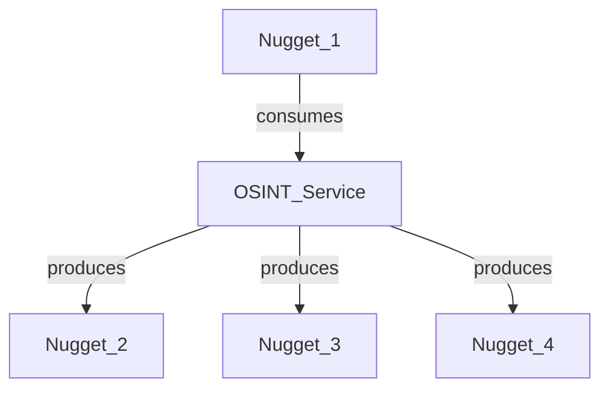
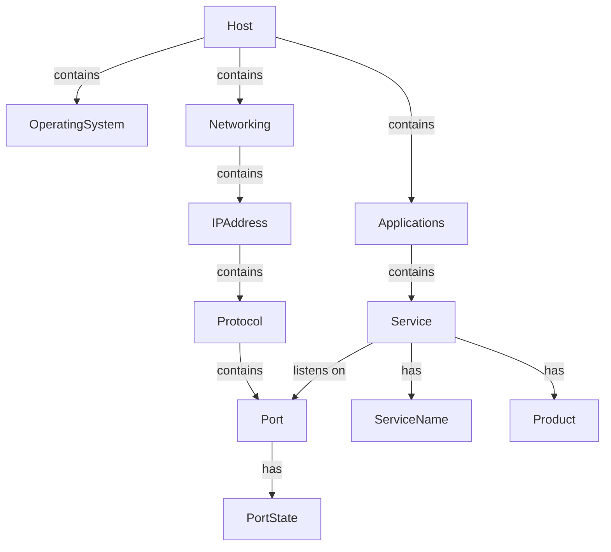

# Driving and Integrating CLI Apps

## Background

### The original SpiderFoot processing model

After executing four epics, it has become obvious that the philosophy of the original SpiderFoot processing model was flawed because it was semantically flat, and thereby there were practical limits on its extension and usefulness. The original concept was:



The conception was that an `OSINT_Service` is a service that can be used to gather information about a target. It consumes a `Nugget` and produces one or more nuggets in response. Sometimes no response was received and in certain instances, this was a `clean_miss`, although no nugget was produced.

## The Flat Nugget model Problems, and its Hierarchical Replacement

The problem with the Flat Nugget model is that it is not useful, since it does not understnad the relationshsips between the nuggets. The reality is that underlying all possible services, there is a consistent ontology that must exist over the range of all possible nuggets, no matter how many services we add, they can all fit within a single coherent model of all networks and systems. 

Thus all services can be represented as a graph of relationships between the nuggets, based on this underlying schema. If you want to add a new service, you need to add a new `Nugget` class, plus extend this ontology to contain the new concepts and relationships that are unique to the new service. This is a much more useful model, since it allows us to reason about the relationships between the nuggets, and to use this knowledge to build new services, adding together all of the relationships into a single coherent model.



## The SpiderFeet V2 Hierarchical Processing Rules

Essentially, we need to transition SpiderFeet so that it is no longer a flat model, but a hierarchical model, where the nuggets are grouped into a hierarchy of networks and systems, to encapsulate the relationships between the consumed and produced nuggets.

In short, we expect to transition all modules so they return a nuggets array, and an edges array, where the edges are the relationships between the nuggets. During the transition each service can return an empty array for the edges, until we go through and revise a specific service to return the correct edges.

We will use only a very limited number of relationships to describe the relationships between the nuggets, so well adopt a very simple, hierarchical `system` contain `sub system`, which then contain other `sub system`s etc. Nodes can be of two types, entity or attribute, where attributes are related through `has` relationships.

We will employ a transitive modelling mechanism, so a `host` `contains` an `IPAddress`, even if it is actually the `Networking` entity that contains the `IPAddress`. Further, the host always `listens_on` the `Port` if the `PortState` is `open`. As another example, a trace that links IP Addresses and hops, should actually link to the hosts, through the relation `detects` that the host contains the IPAddress. Ultimately, the trace is linking the hops between the hosts and this is how we will be able to trace the network and system topology.

Every nugget should have a `nugget_instance_id` attribute, which is a unique identifier for the nugget. The unique identifier is based on using the `nugget_id` and `nugget_data` as the seed, in the following formula.

```python
nugget_instance_id = f"{nugget_id}-{uuid5(namespace, nugget_data)}"
```

Every scan should have a `scan_id` attribute, which is a unique identifier for the scan. The unique identifier is based on the following formula.

```python
scan_id = f"{OSINT_Service_Name}-{uuid4()}"
```


Every scan should return a graph, where the nodes are the nuggets, and the edges are the relationships between the nuggets. The head nugget of the graph should be the scan entity nugget, with some scan attributes. It  


stuff pasted in

- Systems can be `Host` or `Device`
- Traces occur between one or more systems, but the rule is that each Trace connects to an IP Address, which is either a `Host` or `Device`
- A scan
- "has" -> an entity has an attribute 
- "contains" -> an entity contains another entity (e.g. IPADDRESS contains multiple PORT for PROTOCOL) 
- "listens on" -> an entity listens on another entity, for example a service listens on a port 


http://scanme.nmap.org/

`scanme.nmap.org` is a public test server for Nmap.


Base repo: `c:\projects\spiderfeet`

## Master table

| Tool | Agent skill | References index | Zero-to-Hero | CLI options | Primary parser |
|------|-------------|------------------|--------------|-------------|----------------|
| TextFSM | [SKILL.md](.cursor/skills/textfsm/SKILL.md) | [references/SKILLS.md](.cursor/skills/textfsm/references/SKILLS.md) | [TextFMS-Zero-to-Hero.md](.docs/docs-for-cli-tools/TextFMS-Zero-to-Hero.md) | — | TextFSM |
| Nmap | [SKILL.md](.cursor/skills/nmap/SKILL.md) | [references/SKILLS.md](.cursor/skills/nmap/references/SKILLS.md) | [NMAP-Zero-to-Hero.md](.docs/docs-for-cli-tools/NMAP-Zero-to-Hero.md) | [NMAP-CLI-Options.md](.docs/docs-for-cli-tools/NMAP-CLI-Options.md) | XML (`-oX`) |
| NetDiscover | [SKILL.md](.cursor/skills/netdiscover/SKILL.md) | [references/SKILLS.md](.cursor/skills/netdiscover/references/SKILLS.md) | [NetDiscover-Zero-to-Hero.md](.docs/docs-for-cli-tools/NetDiscover-Zero-to-Hero.md) | [NetDiscover-CLI-Options.md](.docs/docs-for-cli-tools/NetDiscover-CLI-Options.md) | TextFSM (`-P`) |
| Nerva | [SKILL.md](.cursor/skills/nerva/SKILL.md) | [references/SKILLS.md](.cursor/skills/nerva/references/SKILLS.md) | [Nerva-Zero-to-Hero.md](.docs/docs-for-cli-tools/Nerva-Zero-to-Hero.md) | [Nerva-CLI-Options.md](.docs/docs-for-cli-tools/Nerva-CLI-Options.md) | JSON (`--json`) |
| Nuclei | [SKILL.md](.cursor/skills/nuclei/SKILL.md) | [references/SKILLS.md](.cursor/skills/nuclei/references/SKILLS.md) | [Nuclei-Zero-to-Hero.md](.docs/docs-for-cli-tools/Nuclei-Zero-to-Hero.md) | [Nuclei-CLI-Options.md](.docs/docs-for-cli-tools/Nuclei-CLI-Options.md) | JSONL (`-jsonl`) |
| Aircrack-ng | [SKILL.md](.cursor/skills/aircrack-ng/SKILL.md) | [references/SKILLS.md](.cursor/skills/aircrack-ng/references/SKILLS.md) | [Aircrack-Ng-Zero-to-Hero.md](.docs/docs-for-cli-tools/Aircrack-Ng-Zero-to-Hero.md) | [Aircrack-Ng-CLI-Options.md](.docs/docs-for-cli-tools/Aircrack-Ng-CLI-Options.md) | TextFSM (airodump CSV) |
| CMSeeK | [SKILL.md](.cursor/skills/cmseek/SKILL.md) | [references/SKILLS.md](.cursor/skills/cmseek/references/SKILLS.md) | [CMSeeK-Zero-to-Hero.md](.docs/docs-for-cli-tools/CMSeeK-Zero-to-Hero.md) | [CMSeeK-CLI-Options.md](.docs/docs-for-cli-tools/CMSeeK-CLI-Options.md) | JSON (`cms.json`) |
| WAFWOOF | [SKILL.md](.cursor/skills/wafwoof/SKILL.md) | [references/SKILLS.md](.cursor/skills/wafwoof/references/SKILLS.md) | [WAFWOOF-Zero-to-Hero.md](.docs/docs-for-cli-tools/WAFWOOF-Zero-to-Hero.md) | [WAFWOOF-CLI-Options.md](.docs/docs-for-cli-tools/WAFWOOF-CLI-Options.md) | JSON (`-f json`) |
| Pius | [SKILL.md](.cursor/skills/pius/SKILL.md) | [references/SKILLS.md](.cursor/skills/pius/references/SKILLS.md) | [PIUS-Zero-to-Hero.md](.docs/docs-for-cli-tools/PIUS-Zero-to-Hero.md) | [PIUS-CLI-Options.md](.docs/docs-for-cli-tools/PIUS-CLI-Options.md) | NDJSON (`--output ndjson`) |

