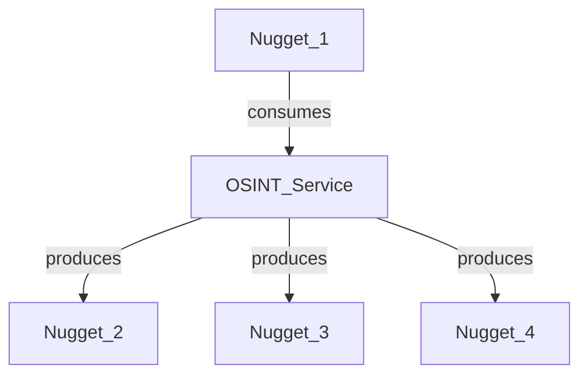
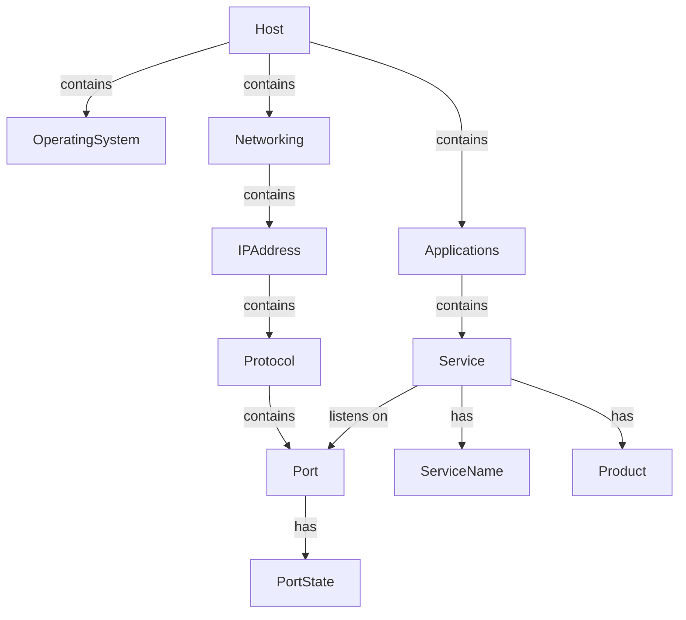
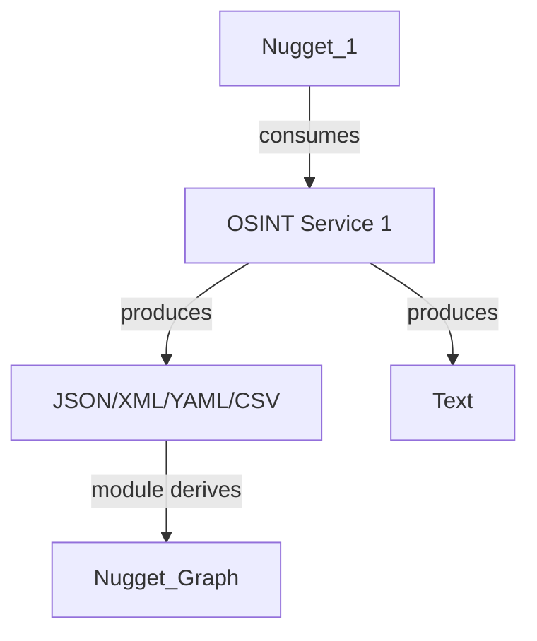
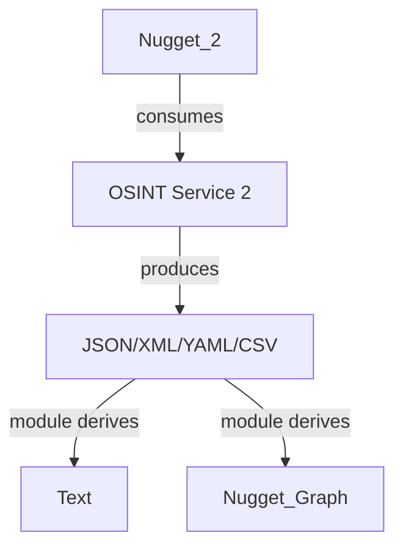
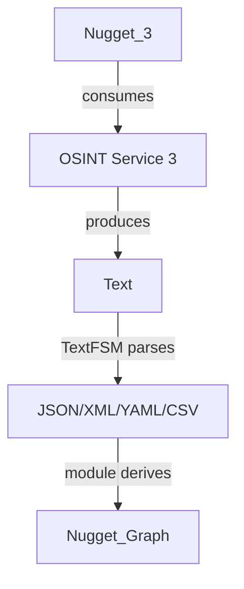

# Driving and Integrating CLI Apps

**Exclusion:** Note that the Aircrack-ng skill is excluded from this epic, since we are waiting for the correct usb woireless dongle to arrive before we can test it. We will handle it separatelyt and later.

## 1. Background

### 1.1 The original SpiderFoot processing model

After executing four epics, it has become obvious that the philosophy of the original SpiderFoot processing model was flawed because it was semantically flat, and thereby there were practical limits on its extension and usefulness. The original concept was:



The conception was that an `OSINT_Service` is a service that can be used to gather information about a target. It consumes a `Nugget` and produces one or more nuggets in response. Sometimes no response was received and in certain instances, this was a `clean_miss`, although no nugget was produced.

### 1.2 The Flat Nugget model Problems, and its Hierarchical Replacement

The problem with the Flat Nugget model is that it is not useful, since it does not understnad the relationshsips between the nuggets. The reality is that underlying all possible services, there is a consistent ontology that must exist over the range of all possible nuggets, no matter how many services we add, they can all fit within a single coherent model of all networks and systems. 

Thus all services can be represented as a graph of relationships between the nuggets, based on this underlying schema. 

If you want to add a new service, you need to add a new `Nugget` class, plus extend this ontology to contain the new concepts and relationships that are unique to the new service. This is a much more useful model, since it allows us to reason about the relationships between the nuggets, and to use this knowledge to build new services, adding together all of the relationships into a single coherent model.



### 1.3 The SpiderFeet V2 Hierarchical Processing Rules

Use the rules described in the nuggets ontology document (`.seed\05_Onotology_for_Nuggets.md`) to define the relationships between the nuggets. Use the `spiderfeet-map` and `spiderfeet-actual` databases in TypeDB to create the ontology.


### 1.4 The New Scanning Process and Output Formats

Some scans require no input nugget, and are simply a matter of running the scan and returning the results. Most scans require input nuggets, such as an IPADDRESS, IPADDRESSRANGE and the aim will be to return a graph of nuggets and relations. 

It is the function of the module to enable any CLI command to be used to run the scan, and convert the results into a graph of nuggets and relations. The aim is to display both text and a structured form of the scan results in tabs. Generally, it is the function of the module to turn the structured form into a nugget graph, based on some yet to be determined rules.


Every scan will be converted into 3 output formats so the output of one command can be presented to users in 3 different output tabs:

- **text:** raw textual description of the scan - to be read on screen by the user
- **data:** raw data description of the scan results: json, xml, csv, yaml - to be explored by the user using our Data Viewer
- **graph:** derived nugget graph (nodes and edges arrays) of the scan and created nuggets displayed as a D3 force directed graph - to be explored by the user using our Graph Viewer

There are 3 different options with the CLI apps either:

1. **OSINT-Service produces Structured + Text** They enable two outputs, so both structured and text



2. **OSINT Service only Enables 1 output, so Structured is selected** They enable only one output type, and so structured is selected



3. **OSINT Service only Produces Text** They only provide output in text form, and thereby we need to use TextFSM to parse it into structured form



In options 1, 2 and 3, the nugget graph is  derived from the structured form (json, xml, csv, yaml). ITs just that sometimes that structured form is produced from text by TextFSM. These produced outputs are then used to generate the third output form, according to module-specific rules and code, which is then sent to the user interface for display. 

In certain situations, the module will need to produce text from the structured from, but this can be informed during the testing process, so you can capture examples of the text presentation and the structured form, and then use this to generate the text.

### 1.5 The Problem with Unifying all of the Services is we dont know the actual ontology yet

The underlying problem is that until we know the full extent of the data to be integrated, so we cant easily create an ontology at present. Instead what we need to do is progtreessivley exercise each CLI app, through all of its options and capture the outputs. Then in a separate stage where we can both analyse this output and propose a new ontology based on the output. In many cases the report offered by the scanner may be inconsistent with our underlying ontology model, and so we will propose a mapping of the report to the ontology model, and then use this mapping in the module code.

Basically, for every scan we will have two inputs, a permissive scan target, like scanme.nmap.org, and a more normal target, like bbc.co.uk. The permissive target will be used to capture the full extent of the data, and the normal target will be used to capture data that have more errors in it. In short, the proposal is that the full ontology can only be defined iteratively, as we exercise each CLI app, and capture the outputs. We will start with NMAP, since the most is known about it

### 1.6 Once the ontology is realised, then the mapping for every module can be finalised

We can only work out an ontology, by exercising CLI apps through all of their options and watching their returned results. We assume we will exercise 5 to start off, and then we will develop a strawman core nuggets ontology to map all of these five modules. Then we will exercise the modules on a one-by one basis, and update the ontology as we go.

However, once that has been realised acroos all of the modules, then we can finalise the mapping for every module, and use this to generate the final ontology. This will be an incredibly powerful outcome as we can represent and integrate the output of more than 20 tools in a common semantic model, a very powerful capability.

At that point we will be ready to reengineer the SpiderFeet modules to support  the new V2 processing model, driven by ontology.

## 2. The Process of Driving and Integrating the CLI Apps

### 2.1 Production Research/Profiling Pipeline

We need a production harness for >20 tools, that can be used to exercise the apps, capture the outputs and save the outputs to files. This will be used to drive the exploration and formal examination processes. We will also want a simple ui to anable the user to look at the results of the agents efforts and make decisions about the next steps.

We assume we or a user will want to bring on additional CLI apps to suit themselves and want to develop a generic pipeline

We will need to proviude a detailed prompt or skill to enable an agent to understand everything it needs to know about how to explore and examine the apps, interact with the user to extend or refine the ontology by using this pipeline and user interface. Install the skill in this file `.cursor\skills\cli_app_profiling\SKILL.md`, and add additional files in the references sub directory (`.cursor\skills\cli_app_profiling\references`) that you index in your skill file.

#### 2.1.1 Components

Components:

- Tool manifest (YAML/JSON per tool)
- Runner (Windows / WSL)
- Evidence recorder (command + stdout/stderr + files + metadata)
- Scenario matrix runner
- Human review artifacts (proposed nodes/edges draft)
- install/bootstrap adapters per tool
- credential/profile management
- scheduling/retries/timeouts
- corpus index + diffing across tool versions
- ontology proposal workflow + approval queue
- parser hints (XML/JSON/TextFSM/DB export)

#### 2.1.2 Core objects

#### 2.1.3 UI for Research/Profiling Pipeline

We should add another link to the spidefeet-wdiget nav-bar called "CLI App Profiling". It is the agent that will run and test the CLI app, so the UI is solely for the user to:

- review results
- updated the proposed nodes/edges draft
- approve or reject the proposed nodes/edges draft
- approve or reject the ontology proposal
- approve or reject the parser hints

The link opens a simple page with a table of each app that was tested. Selecting an app, then opens a list of all of the examiantions run on that CLI app.

Selecting an examination, then opens a page 3 tabs:

- Tab 1: Is a printed pane with the raw output text of the examination
- Tab 2: Is a pane with our data viewer plugged into it to display the structured data output of the examination. Our data viewer is documented here (https://github.com/brettforbes/json-yaml-xml-csv-widget/blob/main/.plan/03-spiderfeet-integration.md), and here (https://github.com/brettforbes/json-yaml-xml-csv-widget/blob/main/Embed_prompt.md). The data viewer fits in the tab and if provided with the structured data file, making sure to trigger the data explorer into the correct mode for the file type
- Tab 3: Is a pane with a D3 force directed graph of the nugget graph structure for the examination. The graph is generated from the proposed nodes/edges draft. MAke sure you have zoom and pan. Enable pretty print tooltips when hovering over a nugget. Enable drag and drop, node is pinned after being dragged. Double clicking the node releases it back to force directed layout.
- Tab 4: Is a pane with a markdown document that describes the graph structure for the examination. The markdown document is generated from the proposed nodes/edges draft.

One assumes the user modifies the raw data in tab 1 and the proposed nodes/edges draft in tab 2, 3 and 4 in their IDE, and no attempt is made to provide an editable view. the aim is only to provide a simple structured means of reviewing the results of the examination.

#### 2.1.4 Additional Nuggets for the CLI App Profiling Pipeline

Clearly as a basis we already have some nuggets documented here (`.docs\analysis\nuggets.json`), but we need to add additional nuggets for the CLI App Profiling Pipeline. Fuirther, they are documented in the TypeQL ontology model (`.seed\spiderfeet_map.tql`), but there is no hiearchy (i.e. the nodes and edges arrays) setup for the nuggets as yet, and they are currently flat.

We clearly need to add additional entity and descriptor types to copy with the returned data, and we will leave it up to yuou to suggest more nuggets to suit the output of CLI apps.

However some new nuggets seem obvious, but may be abstract (used to organise results) rather than contained in the results themselves. and we should add them to the `.docs\analysis\nuggets.json` file, including:

- `clear_miss`
- `networking`
- `application`

We will leave it up to you to suggest new nuggets. Nother that it may be better to create new files in the `.docs\analysis\nugget_structure` directory, rather than adding to the existing `.docs\analysis\nuggets.json` file, and then modify your code that builds the nuggets to add them into the existing `.docs\analysis\nuggets.json` file. That way all of the new nuggets are collected in a single, searpate file and aggregated later by script.

##### 2.1.2.A. Tool manifest (tools/nmap.yaml, tools/dnsx.yaml)

- binary path(s): native Windows vs WSL
- install/bootstrap commands
- version probe (nmap --version)
- allowed targets
- scenario definitions
- expected output types

##### 2.1.2.B. Scenario matrix

explore every flag combo until you find the set of inputs needed to expose the full breadth of returned semantic data types, so that we can be sure that we can convert the output of any option into nuggets. Convert these into named scenarios.
named scenarios: baseline, xml_export, json_export, error_case, empty_case

##### 2.1.2.C. Runner abstraction

Runner
```
  run(command, env, cwd, timeout) -> RunResult
```
RunResult
```
  command, exit_code, stdout, stderr, files[], duration, runtime(windows|wsl)
```

##### 2.1.2.D. Evidence bundle for each examination scan (durable artifact)

`.docs\docs-for-cli-tools\app_examination_docs\<tool>\`
  1_manifest.json
  1_command.txt
  1_output_text.txt
  1_output_structured.json # one of these four
  1_output_structured.xml # one of these four
  1_output_structured.yaml # one of these four
  1_output_structured.csv # one of these four
  1_review.status.json    # pending|approved|rejected

`.docs\docs-for-cli-tools\nugget_structure`
  <tool_name>_1_proposed_nuggets_edges.json   # draft
  <tool_name>_1_proposed_nuggets_edges.md   # draft


### 2.2 Choosing the Options For Each CLI App

For 20 tools, literal full option coverage is not practical.

Examples:

- Nmap: thousands of flag combinations
- Metasploit: thousands of modules + datastore permutations
- Nuclei: template corpus × flags × targets
- Recon-ng: marketplace modules × SOURCE modes × workspaces

What we actually want is as large a representative coverage of the returned objects as is practical. We cannot afford to have data returned that we do not know how to turn into nuggets, so we must explore comprehensively before the formal examination.

#### 2.2.1 Fixed Output Options, No Variations

We can fix the output of each app, based on rules, so no variation  is needed here:

1. Full verbosity should always be used where available
2. Structured data order of preference is json, then xml, then yaml or finally csv
3. If the app supports multiple output options simultaneously, you must output both a structured type of output and normal text
4. It the app supports multiple options, but only one at a time, then you must choose a structured format for the output. In this case, during the formal examination, you must run every option twice, one with structured format, and one with text format. This would then give us the ability to create templates to convert the structured format back into text format similar to the native app output.
5. If the app only supports terminal output, then you must use TextFSM to parse the output into structured form

#### 2.2.2 Exploratory Search by the Agent Before Formal Examination

There is no real limit on analysis time, and we are happy to spend 1 hour or more exploring all of the options of any single app, before we start our formal examination and actual saving of text and structured data output files. 

We can only integrate an app if we are 100% sure that some option chosen by a user will generate data that we dont know how to extract into nuggets. If some option was chosen that generated data we couldnt convert into nuggets, then this would be a problem. So the cost of missing a single nugget is too high, and so we need to be 100% sure that we can convert the output of any option into nuggets.

When the agent is exploring the app, it does not need to check every permuation or combination, as some will obviously not change the output data types much, if at all. It does need to check the differences between permissive targets and corporate targets, as these will obviously produce different output data types.

The objective for the exploration is to:

1. Discern all of the options that expose the full breadth of returned semantic data types, so that we can be sure that we can convert the output of any option into nuggets. Create a formal examination plan that describes the options to be explored, and the expected output data types.
2. Get a sense of the strategy of the app, how one can be an expert with the app, and extract different types of information from the output. After the exploration is complete, create a strategy skill for an agent to be able to use the app, that describes the strategy of the app, and how one can extract different types of information from the output. This should be imformation that is independent of the tools actual skill, and so should be put in a separate skill called `<tool_name>_strategy.skill`. Feel free to cross reference files in  the actual skill  directory inside the strategy skill document. The intent is to use both the skill and the strategy skill together so they should be complementary. Put the strategy skill for each app in the `.strategy` directory, which you create if it does not exist. Create a common `refences` sub directory if any of your apps require additional details in the strategy skill. This strategy file can be updated as we learn more about using the app in differnt scenarios.
3. Write the text output of the app's help or manual page that describes the cli options unmodified in a triple tick code box, with a simple title of the app name and the term Help Text into a simple markdown file called `<tool_name>_cli_help_text.md` in the `.docs\docs-for-cli-tools\cli_help_text` directory. If there is multiple modules with multiple help text, separate them with markdown headings and a brief description of each module. The aim is to leave it so it looks like it came out of the teminal, without too much markdown except for the headings.

#### 2.2.3 Formal Examination of the App

After the exploration is complete, and the strategy document is created, the agent can use the formal examination plan  to examine the app. 

The examination process will investigate the full range of options specified in the plan, across both permissive and corporate targets. It will save both text and structured data output files for each option examined in the `.docs\docs-for-cli-tools\app_examination_docs\<tool_name>` directory. 

It shall produce its view on the nuggets to be extracted, and the graph structure to be used to represent the nuggets in a markdown document called `<tool_name>_nugget_graph_structure.md` in the directory `.docs\docs-for-cli-tools\nugget_structure`.


### 2.3 Developing test inputs for each CLI app

For each CLI app, we need to develop 2 test inputs that will be used to exercise the app, a permissive easy to scan option that provides the full extent of the data, and a more normal target that is more likely to be properly protected (i.e. may not provide as much feedback for some types of scans). You may be able to find examples in the documentation, or do your own research. These test inputs will be used to capture the outputs of the app.

Two examples are provided, the first is a very permissive system open for scanning, the second is a generic corporate website, we expect to be properly protected (i.e. may not provide as much feedback for some types of scans):

- `scanme.nmap.org`
- `bbc.co.uk`
- `sbs.com.au`

For each test input, we need to capture the outputs of the app. Test inputs should be documented in the formal examination plan, and in the command text file for each examination scan. The command text file should be in the `.docs\docs-for-cli-tools\app_examination_docs\<tool_name>` directory.


### 2.4 The Overall Process

The overall process:

1. Install CLI apps to a local directory called `c:\cli_apps`, unless it is already installed, e.g. nmap is already installed in `c:\Program Files\Nmap`
2. Do everything necessary to get the CLI apps working, including setting up the environment variables and any other necessary configuration. Run it from WSL if you cant run it from the command line.
3. Exercise all of the CLI apps through all of their options and capture the outputs.
4. Analyse every output, propose the produced nugget graph structure for each output type.
5. Let me review, edit if necessary and approve every proposed nugget graph structure.
6. Update the ontology as necessary to support the new nugget graph structures found in the outputs.
7. Repeat the process for the next CLI app.
8. Once all of the CLI apps have been exercised, and we have defined the outputs and graph structures for every app option. Then it will be easy for us to reengineer the SpiderFeet modules to support the new V2 processing model, driven by ontology (This will be a separate project, not defined here).


## 3. The Master table of all of the CLI apps

**Exclusion:** Note that the Aircrack-ng skill is excluded from this epic, since we are waiting for the correct usb woireless dongle to arrive before we can test it. We will handle it separatelyt and later.


| Tool | Agent skill | References index | Zero-to-Hero | CLI options | Primary parser |
|------|-------------|------------------|--------------|-------------|----------------|
| Nmap | [SKILL.md](.cursor/skills/nmap/SKILL.md) | [references/SKILLS.md](.cursor/skills/nmap/references/SKILLS.md) | [NMAP-Zero-to-Hero.md](.docs/docs-for-cli-tools/NMAP-Zero-to-Hero.md) | [NMAP-CLI-Options.md](.docs/docs-for-cli-tools/NMAP-CLI-Options.md) | XML (`-oX`) |
| NetDiscover | [SKILL.md](.cursor/skills/netdiscover/SKILL.md) | [references/SKILLS.md](.cursor/skills/netdiscover/references/SKILLS.md) | [NetDiscover-Zero-to-Hero.md](.docs/docs-for-cli-tools/NetDiscover-Zero-to-Hero.md) | [NetDiscover-CLI-Options.md](.docs/docs-for-cli-tools/NetDiscover-CLI-Options.md) | TextFSM (`-P`) |
| Nerva | [SKILL.md](.cursor/skills/nerva/SKILL.md) | [references/SKILLS.md](.cursor/skills/nerva/references/SKILLS.md) | [Nerva-Zero-to-Hero.md](.docs/docs-for-cli-tools/Nerva-Zero-to-Hero.md) | [Nerva-CLI-Options.md](.docs/docs-for-cli-tools/Nerva-CLI-Options.md) | JSON (`--json`) |
| Nuclei | [SKILL.md](.cursor/skills/nuclei/SKILL.md) | [references/SKILLS.md](.cursor/skills/nuclei/references/SKILLS.md) | [Nuclei-Zero-to-Hero.md](.docs/docs-for-cli-tools/Nuclei-Zero-to-Hero.md) | [Nuclei-CLI-Options.md](.docs/docs-for-cli-tools/Nuclei-CLI-Options.md) | JSONL (`-jsonl`) |
| Aircrack-ng | [SKILL.md](.cursor/skills/aircrack-ng/SKILL.md) | [references/SKILLS.md](.cursor/skills/aircrack-ng/references/SKILLS.md) | [Aircrack-Ng-Zero-to-Hero.md](.docs/docs-for-cli-tools/Aircrack-Ng-Zero-to-Hero.md) | [Aircrack-Ng-CLI-Options.md](.docs/docs-for-cli-tools/Aircrack-Ng-CLI-Options.md) | TextFSM (airodump CSV) |
| CMSeeK | [SKILL.md](.cursor/skills/cmseek/SKILL.md) | [references/SKILLS.md](.cursor/skills/cmseek/references/SKILLS.md) | [CMSeeK-Zero-to-Hero.md](.docs/docs-for-cli-tools/CMSeeK-Zero-to-Hero.md) | [CMSeeK-CLI-Options.md](.docs/docs-for-cli-tools/CMSeeK-CLI-Options.md) | JSON (`cms.json`) |
| WAFWOOF | [SKILL.md](.cursor/skills/wafwoof/SKILL.md) | [references/SKILLS.md](.cursor/skills/wafwoof/references/SKILLS.md) | [WAFWOOF-Zero-to-Hero.md](.docs/docs-for-cli-tools/WAFWOOF-Zero-to-Hero.md) | [WAFWOOF-CLI-Options.md](.docs/docs-for-cli-tools/WAFWOOF-CLI-Options.md) | JSON (`-f json`) |
| Pius | [SKILL.md](.cursor/skills/pius/SKILL.md) | [references/SKILLS.md](.cursor/skills/pius/references/SKILLS.md) | [PIUS-Zero-to-Hero.md](.docs/docs-for-cli-tools/PIUS-Zero-to-Hero.md) | [PIUS-CLI-Options.md](.docs/docs-for-cli-tools/PIUS-CLI-Options.md) | NDJSON (`--output ndjson`) |
| Nosey Parker | [SKILL.md](.cursor/skills/nosey_parker/SKILL.md) | [references/SKILLS.md](.cursor/skills/nosey_parker/references/SKILLS.md) | [Nosey-Parker-Zero-to-Hero.md](.docs/docs-for-cli-tools/Nosey-Parker-Zero-to-Hero.md) | [Nosey-Parker-CLI-Options.md](.docs/docs-for-cli-tools/Nosey-Parker-CLI-Options.md) | JSONL / findings DB |
| NTLMRecon | [SKILL.md](.cursor/skills/NTLMRecon/SKILL.md) | [references/SKILLS.md](.cursor/skills/NTLMRecon/references/SKILLS.md) | [NTLMRecon-Zero-to-Hero.md](.docs/docs-for-cli-tools/NTLMRecon-Zero-to-Hero.md) | [NTLMRecon-CLI-Options.md](.docs/docs-for-cli-tools/NTLMRecon-CLI-Options.md) | Text / optional JSON |
| Titus | [SKILL.md](.cursor/skills/Titus/SKILL.md) | [references/SKILLS.md](.cursor/skills/Titus/references/SKILLS.md) | [Titus-Zero-to-Hero.md](.docs/docs-for-cli-tools/Titus-Zero-to-Hero.md) | [Titus-CLI-Options.md](.docs/docs-for-cli-tools/Titus-CLI-Options.md) | JSON / SARIF / text |
| Trajan | [SKILL.md](.cursor/skills/trajan/SKILL.md) | [references/SKILLS.md](.cursor/skills/trajan/references/SKILLS.md) | [Trajan-Zero-to-Hero.md](.docs/docs-for-cli-tools/Trajan-Zero-to-Hero.md) | [Trajan-CLI-Options.md](.docs/docs-for-cli-tools/Trajan-CLI-Options.md) | JSON / SARIF |
| Vespasian | [SKILL.md](.cursor/skills/vespian/SKILL.md) | [references/SKILLS.md](.cursor/skills/vespian/references/SKILLS.md) | [Vespasian-Zero-to-Hero.md](.docs/docs-for-cli-tools/Vespasian-Zero-to-Hero.md) | [Vespasian-CLI-Options.md](.docs/docs-for-cli-tools/Vespasian-CLI-Options.md) | JSON / graph data |
| Aurelian | [SKILL.md](.cursor/skills/Aurelian/SKILL.md) | [references/SKILLS.md](.cursor/skills/Aurelian/references/SKILLS.md) | [Aurelian-Zero-to-Hero.md](.docs/docs-for-cli-tools/Aurelian-Zero-to-Hero.md) | [Aurelian-CLI-Options.md](.docs/docs-for-cli-tools/Aurelian-CLI-Options.md) | JSON / findings |
| Augustus | [SKILL.md](.cursor/skills/Augustus/SKILL.md) | [references/SKILLS.md](.cursor/skills/Augustus/references/SKILLS.md) | [Augustus-Zero-to-Hero.md](.docs/docs-for-cli-tools/Augustus-Zero-to-Hero.md) | [Augustus-CLI-Options.md](.docs/docs-for-cli-tools/Augustus-CLI-Options.md) | JSON / report text |
| dnsx | [SKILL.md](.cursor/skills/dnsx/SKILL.md) | [references/SKILLS.md](.cursor/skills/dnsx/references/SKILLS.md) | [dnsx-Zero-to-Hero.md](.docs/docs-for-cli-tools/dnsx-Zero-to-Hero.md) | [dnsx-CLI-Options.md](.docs/docs-for-cli-tools/dnsx-CLI-Options.md) | JSON / line output |
| webanalyze | [SKILL.md](.cursor/skills/webanalyze/SKILL.md) | [references/SKILLS.md](.cursor/skills/webanalyze/references/SKILLS.md) | [webanalyze-Zero-to-Hero.md](.docs/docs-for-cli-tools/webanalyze-Zero-to-Hero.md) | [webanalyze-CLI-Options.md](.docs/docs-for-cli-tools/webanalyze-CLI-Options.md) | JSON |
| tldfinder | [SKILL.md](.cursor/skills/tldfinder/SKILL.md) | [references/SKILLS.md](.cursor/skills/tldfinder/references/SKILLS.md) | [tldfinder-Zero-to-Hero.md](.docs/docs-for-cli-tools/tldfinder-Zero-to-Hero.md) | [tldfinder-CLI-Options.md](.docs/docs-for-cli-tools/tldfinder-CLI-Options.md) | JSON / text |
| katana | [SKILL.md](.cursor/skills/katana/SKILL.md) | [references/SKILLS.md](.cursor/skills/katana/references/SKILLS.md) | [katana-Zero-to-Hero.md](.docs/docs-for-cli-tools/katana-Zero-to-Hero.md) | [katana-CLI-Options.md](.docs/docs-for-cli-tools/katana-CLI-Options.md) | JSONL / crawl output |
| mapcidr | [SKILL.md](.cursor/skills/mapcidr/SKILL.md) | [references/SKILLS.md](.cursor/skills/mapcidr/references/SKILLS.md) | [mapcidr-Zero-to-Hero.md](.docs/docs-for-cli-tools/mapcidr-Zero-to-Hero.md) | [mapcidr-CLI-Options.md](.docs/docs-for-cli-tools/mapcidr-CLI-Options.md) | Text / expanded CIDRs |
| uncover | [SKILL.md](.cursor/skills/uncover/SKILL.md) | [references/SKILLS.md](.cursor/skills/uncover/references/SKILLS.md) | [uncover-Zero-to-Hero.md](.docs/docs-for-cli-tools/uncover-Zero-to-Hero.md) | [uncover-CLI-Options.md](.docs/docs-for-cli-tools/uncover-CLI-Options.md) | JSONL / provider output |
| recon-ng | [SKILL.md](.cursor/skills/recon_ng/SKILL.md) | [references/SKILLS.md](.cursor/skills/recon_ng/references/SKILLS.md) | [recon-ng-Zero-to-Hero.md](.docs/docs-for-cli-tools/recon-ng-Zero-to-Hero.md) | [recon-ng-CLI-Options.md](.docs/docs-for-cli-tools/recon-ng-CLI-Options.md) | SQLite workspace + exports |
| Metasploit Framework | [SKILL.md](.cursor/skills/metasploit_framework/SKILL.md) | [references/SKILLS.md](.cursor/skills/metasploit_framework/references/SKILLS.md) | [Metasploit-Framework-Zero-to-Hero.md](.docs/docs-for-cli-tools/Metasploit-Framework-Zero-to-Hero.md) | [Metasploit-Framework-CLI-Options.md](.docs/docs-for-cli-tools/Metasploit-Framework-CLI-Options.md) | DB tables + console/export parsing |

