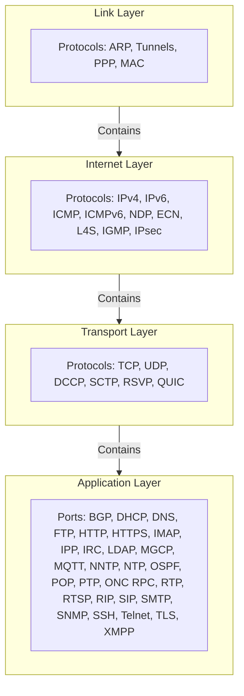
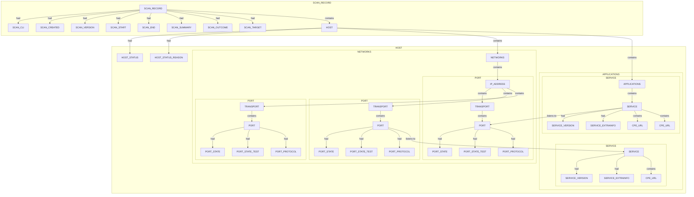
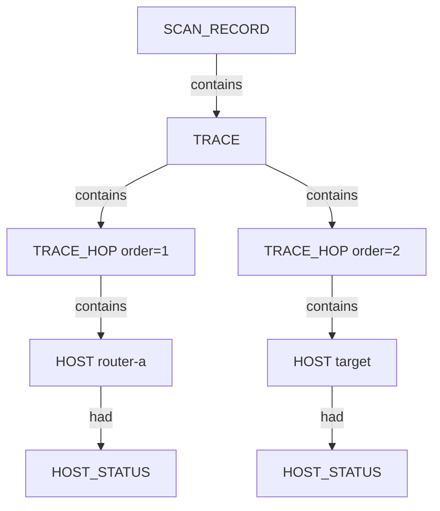

# Ontology for Nuggets

> **Agent rule (enforcement summary):** `.cursor/rules/proj-05-spiderfeet-nugget-ontology.mdc`  
> **TypeDB schema:** `.seed/spiderfeet_map.tql`

Use this document when proposing, reviewing, or regenerating nugget graphs.

## 1. Definition of Nugget

A nugget is an archetype of a node in the ontology. It is a template for one or more nodes that can be instantiated for a given scan. It can be defined as an abstract entity with the following attributes, as shown in `.seed\spiderfeet_map.tql`.

```tql
define
	entity nugget @abstract,
		owns nugget_id,
		owns nugget_instance_id @key, #  f"{nugget_id}-{uuid5(namespace, nugget_data)}"
		owns nugget_description,
		owns nugget_type,
		owns nugget_event_type,
		owns nugget_icon,
		owns nugget_colour,
		owns nugget_data, # where the nugget's data is recorded in the scan
		owns nugget_source_data, # the source nugget that strarted the scan, may be empty if the scan was not started by a nugget
		owns nugget_module, # the module that generated the nugget
		owns nugget_generated, # the date and time the nugget was generated
		owns nugget_confidence, # the confidence in the nugget's accuracy
		owns nugget_visibility, # the visibility of the nugget
		owns nugget_risk, # the risk of the nugget
		owns nugget_false_positive, # whether the nugget is a false positive
		plays osint-service:consumed, # the osint service that consumed the nugget
		plays osint-service:produced, # the osint service that produced the nugget
		plays route:consumed, # the route that consumed the nugget
		plays route:produced, # the route that produced the nugget
		plays scan-record:consumed, # the scan record that consumed the nugget
		plays scan-record:produced, # the scan record that produced the nugget;

  entity node @abstract, sub nugget;
  entity descriptor @abstract, sub node;
```

There can be two categories of nuggets:

- Entity nuggets: these are nodes that represent a single entity in the graph. They are the most common type of nugget. They can hold one atom of data.
- Descriptor nuggets: these are nodes that represent an attribute of an entity. They are attached to a specific entity node and used to capture specific attributes of the entity. They can hold one atom of data.

Existing nuggets have icons have svg icons (`.docs\analysis\nugget_icons`). These icons were generated by an agent based on a document with a icon description and colour scheme (`.docs\analysis\force_graph_colour_scheme.md`), as we3 expand the number of nuggets, we need to add to the list of icons, and make sure they are all consistent and follow the same naming convention.

### 1.1 Actual Nugget Types

Actual nuggets should then be a specific subclass of the abstract nugget entity, such as `ip-address` or `domain-name`. Every nugget should have a `nugget_instance_id` attribute, which is a unique identifier for the nugget. The unique identifier is based on using the `nugget_id` and `nugget_data` as the seed, in the following formula. This is important as it will mean that we can avoid the same value value being enetered in the knowledge graph multiple times, and instead we will link to the single value in the graph.


Actual Nuggets are used in three main ways:

1. **Archetype Nuggets**: These are the archetype nugget types,and are used in both the `spiderfeet-map` and the `spiderfeet-actual` databases in TypeDB. They have no value for `nugget_data`. In the `spiderfeet-map` they are only ever attached to the `osint-record` through the `consumed` and `produced` roles. In the `spiderfeet-actual` database
2. **Category Nuggets**: These are the category nugget types, and are used only in the `spiderfeet-actual` database in TypeDB. They have no value for `nugget_data`, but must have a value for `nugget_instance_id` as defined below. In the `spiderfeet-actual` database they are attached to top-level `entity` nuggets, such as the `HOST` or `DEVICE` nuggets, through the `contains` role (e.g. `HOST` `contains` `NETWORK`, `HOST` `contains` `APPLICATIONS`).
3. **Instance Nuggets**: These are the instance nugget types meant to carry the `entity` and `descriptor` data, and are used in both the `spiderfeet-map` and the `spiderfeet-actual` databases in TypeDB. They must have a value for `nugget_data` and `nugget_instance_id` as defined below

```python
namespace = "nugget_instance_id" # This is a fixed namespace for the SpiderFeet ontology, and matches the Stix ontology namespace
nugget_instance_id = f"{nugget_id}-{uuid5(namespace, nugget_data)}"
```

The old nugget source is contained in `.docs\analysis\nuggets.json`. It is a JSON file that contains the nugget_id, nugget_description, nugget_type, nugget_icon, and nugget_colour for each nugget.

### 1.2 Problems with the Current Nugget Types

The problem with the Flat Nugget model is that it is unable to represent how the actual networking system works, since it does not understand the relationshsips between the nuggets. The reality is that underlying all possible services, there is a consistent ontology that must exist over the range of all possible nuggets, no matter how many services we add, they can all fit within a single coherent model of all networks and systems. 

Thus all services can be represented as a graph of relationships between the nuggets, based on this underlying schema. 

If you want to add a new service, you need to add a new `Nugget` class, plus extend this ontology to contain the new concepts and relationships that are unique to the new service. This is a much more useful model, since it allows us to reason about the relationships between the nuggets, and to use this knowledge to build new services, adding together all of the relationships into a single coherent model.

To create an ontology that is consistent across >20 different CLI apps, then we must take account oif multiple in-built hierarchies that are present in the data, and that must be represented in the ontology.

### 1.3 Internal Scans have a Different Level of Detail to External Scans

Internal scans contain much more detail than external scans, and yet we want a consistent ontology between internal and external scans. This problem can be resolved by being careful with the schema design, and the power of TypeDB to enforce transitive relationships in the data.

In short, the external scan must resul in a reduced schema, as for example one deos not resolve the individual network adapters, only the system as a whole., In order to keep the schema consistenet we use:

- **Limited Relations** The first thing to do is to have the fewest relations possible so we can establish functions to synchronise the values in a hierarchy.  
- **Transitive Relations** The second thing to do is to have the transitive relations possible so we can establish functions to synchronise the values in a hierarchy. The key transitive relations are `contains` and `listens-to`, which can then be integraterd with transitive functions, so the host `contains` the ip address, even if other nodes such as the adpater or networks actually own the ip address.

### 1.4 Expanding the Current Number and Types of Nuggets

We will definitiely need to expand the number of types of the nuggets on an iterative basis, as we examine new CLI services and their results. We will need to add new types of nuggets to the ontology, and to the `spiderfeet-map` and `spiderfeet-actual` databases in TypeDB.


## 2 Embedded Hierarchies in the design of Networked Systems that Must be Obeyed by our Nuggets Ontology

To semantically model something, we need to exploit its own intrinsic hierarchy. This is often hidden in the design of the system, but it is there. For example, the Internet Protocol Suite is a fixed hierarchy that is used to model the communication between applications. The flat nugget concept falls apart as the complexity grows here, asit doesn't mimic the natureal structure (4-level) of the Internet Protocol Suite.

## 2.1 Hierarchies in Systems, Hosts, Devices and Mobiles

Every system on a  network can be one of the following:

- host - a standard system, usually witha  scre3en and keyboard
- device - a system that is not a host, such as a router, switch, or other network device
- mobile - a system that is not a host or device, such as a phone, tablet, or other mobile device

Components within a system are usually contained within a category, such as:

- networks - the networks that the system is connected to
- applications - the applications that the system is running
- environment - the opeating system, BIOS, firmware, etc. that the system is offering


### 2.2 Fixed Hierarchy in Internet Protocol Suite

Applications listen to ports and use protocols to communicate with other applications, as shown by the Internet Protocol Suite model diagram below. Note that some Port Numbers do not correspond to a specific protocol, so it is really the Port Number that is the key, and the protocol is the attribute of the port, sometimes null.

Ports are the actual attack surface of a system, what could be considered the outside of the system, the "front door", or the bottom of the graph below.




## 2.3 Hierachies in NMAP Scan Results

NMAP scan results are a hierarchy of systems, hosts, devices and mobiles, as shown by the following XML file:

```xml
<?xml version="1.0" encoding="UTF-8"?>
<!DOCTYPE nmaprun>
<?xml-stylesheet href="file:///C:/Program Files (x86)/Nmap/nmap.xsl" type="text/xsl"?>
<!-- Nmap 7.80 scan initiated Wed Jun 17 20:46:57 2026 as: nmap -sT -sV -T3 -p 22,80,443 -oX - scanme.nmap.org -->
<nmaprun scanner="nmap" args="nmap -sT -sV -T3 -p 22,80,443 -oX - scanme.nmap.org" start="1781693217" startstr="Wed Jun 17 20:46:57 2026" version="7.80" xmloutputversion="1.04">
<scaninfo type="connect" protocol="tcp" numservices="3" services="22,80,443"/>
<verbose level="0"/>
<debugging level="0"/>
<host starttime="1781693219" endtime="1781693229"><status state="up" reason="reset" reason_ttl="52"/>
<address addr="45.33.32.156" addrtype="ipv4"/>
<hostnames>
<hostname name="scanme.nmap.org" type="user"/>
<hostname name="scanme.nmap.org" type="PTR"/>
</hostnames>
<ports><port protocol="tcp" portid="22"><state state="open" reason="syn-ack" reason_ttl="0"/><service name="ssh" product="OpenSSH" version="6.6.1p1 Ubuntu 2ubuntu2.13" extrainfo="Ubuntu Linux; protocol 2.0" ostype="Linux" method="probed" conf="10"><cpe>cpe:/a:openbsd:openssh:6.6.1p1</cpe><cpe>cpe:/o:linux:linux_kernel</cpe></service></port>
<port protocol="tcp" portid="80"><state state="open" reason="syn-ack" reason_ttl="0"/><service name="http" product="Apache httpd" version="2.4.7" extrainfo="(Ubuntu)" method="probed" conf="10"><cpe>cpe:/a:apache:http_server:2.4.7</cpe></service></port>
<port protocol="tcp" portid="443"><state state="filtered" reason="no-response" reason_ttl="0"/><service name="https" method="table" conf="3"/></port>
</ports>
<times srtt="153625" rttvar="87312" to="502873"/>
</host>
<runstats><finished time="1781693229" timestr="Wed Jun 17 20:47:09 2026" elapsed="12.69" summary="Nmap done at Wed Jun 17 20:47:09 2026; 1 IP address (1 host up) scanned in 12.69 seconds" exit="success"/><hosts up="1" down="0" total="1"/>
</runstats>
</nmaprun>
```

Converting the NMAP scan results into a nugget graph (nodes + edges) derived from `.docs/analysis/hierarchy/nmap_example_nodes.csv` and `nmap_example_edges.csv`:



## 2.4 Hierarchies in Powershell Internal Scan Results

As described previously, internal scans contain much more detail than external scans, and yet we want a consistent ontology between internal and external scans.

Consider the following example of a Powershell internal scan result:

```powershell
PS C:\Users\brett> Get-NetIPConfiguration -All -Detailed

ComputerName                          : MODELLERS-PC
InterfaceAlias                        : WiFi
InterfaceIndex                        : 17
InterfaceDescription                  : Intel(R) Wi-Fi 6 AX201 160MHz
NetCompartment.CompartmentId          : 1
NetCompartment.CompartmentDescription : Default Compartment
NetAdapter.LinkLayerAddress           : 88-D8-2E-C2-2C-0C
NetAdapter.Status                     : Up
NetProfile.Name                       : DODO-7A5F-5G 2
NetProfile.NetworkCategory            : Public
NetProfile.IPv6Connectivity           : Internet
NetProfile.IPv4Connectivity           : Internet
IPv6Address                           : fd14:5f94:d87a:5f00:48f5:a634:2690:ed8
                                        2403:4800:2966:1c38:7120:f30f:3fb7:42af
                                        2403:4800:2966:1c00::3
IPv6TemporaryAddress                  : fd14:5f94:d87a:5f00:c171:a72d:ee31:7be8
                                        2403:4800:2966:1c38:c171:a72d:ee31:7be8
IPv6LinkLocalAddress                  : fe80::70e8:46f9:84cd:3ce3%17
IPv4Address                           : 192.168.1.13
IPv6DefaultGateway                    : fe80::1
IPv4DefaultGateway                    : 192.168.1.1
NetIPv6Interface.NlMTU                : 1492
NetIPv4Interface.NlMTU                : 1500
NetIPv6Interface.DHCP                 : Enabled
NetIPv4Interface.DHCP                 : Enabled
DNSServer                             : fe80::1
                                        192.168.1.1
                                        192.168.1.1

ComputerName                          : MODELLERS-PC
InterfaceAlias                        : Ethernet 3
InterfaceIndex                        : 21
InterfaceDescription                  : Realtek USB GbE Family Controller #2
NetCompartment.CompartmentId          : 1
NetCompartment.CompartmentDescription : Default Compartment
NetAdapter.LinkLayerAddress           : 00-E0-4C-68-02-19
NetAdapter.Status                     : Disconnected

ComputerName                          : MODELLERS-PC
InterfaceAlias                        : Bluetooth Network Connection
InterfaceIndex                        : 9
InterfaceDescription                  : Bluetooth Device (Personal Area Network)
NetCompartment.CompartmentId          : 1
NetCompartment.CompartmentDescription : Default Compartment
NetAdapter.LinkLayerAddress           : 88-D8-2E-C2-2C-10
NetAdapter.Status                     : Disconnected

ComputerName                          : MODELLERS-PC
InterfaceAlias                        : Local Area Connection* 2
InterfaceIndex                        : 2
InterfaceDescription                  : Microsoft Wi-Fi Direct Virtual Adapter #2
NetCompartment.CompartmentId          : 1
NetCompartment.CompartmentDescription : Default Compartment
NetAdapter.LinkLayerAddress           : 8A-D8-2E-C2-2C-0C
NetAdapter.Status                     : Disconnected

ComputerName                          : MODELLERS-PC
InterfaceAlias                        : Local Area Connection* 1
InterfaceIndex                        : 14
InterfaceDescription                  : Microsoft Wi-Fi Direct Virtual Adapter
NetCompartment.CompartmentId          : 1
NetCompartment.CompartmentDescription : Default Compartment
NetAdapter.LinkLayerAddress           : 88-D8-2E-C2-2C-0D
NetAdapter.Status                     : Disconnected
```

Converting the Internal Scan Results into a nugget graph (nodes + edges) derived from `.docs/analysis/hierarchy/PS_Example_Nodes.csv` and `PS_Example_Edges.csv`:

```mermaid
flowchart TD
  n1["SCAN_RECORD"]
  n2["SCAN_CLI"]
  n3["SCAN_TARGET"]
  n4["HOST"]
  n5["NETWORKS"]
  n6["ADAPTER"]
  n7["ADAPTER_DESCRIPTION"]
  n8["ADAPTER_STATUS"]
  n9["MAC_ADDRESS"]
  n10["IP_ADDRESS"]
  n11["IPV6_ADDRESS"]
  n12["IPV6_ADDRESS"]
  n13["IPV6_ADDRESS"]
  n14["TEMP_IPV6_ADDRESS"]
  n15["TEMP_IPV6_ADDRESS"]
  n16["LOCAL_IPV6_ADDRESS"]
  n17["IP_DEFAULT_GW"]
  n18["IPV6_DEFAUL_GW"]
  n19["ADAPTER"]
  n20["ADAPTER_INDEX"]
  n21["ADAPTER_DESCRIPTION"]
  n22["ADAPTER_STATUS"]
  n23["MAC_ADDRESS"]
  n24["ADAPTER"]
  n25["ADAPTER_INDEX"]
  n26["ADAPTER_DESCRIPTION"]
  n27["ADAPTER_STATUS"]
  n28["MAC_ADDRESS"]
  n29["ADAPTER"]
  n30["ADAPTER_INDEX"]
  n31["ADAPTER_DESCRIPTION"]
  n32["ADAPTER_STATUS"]
  n33["MAC_ADDRESS"]
  n34["ADAPTER"]
  n35["ADAPTER_INDEX"]
  n36["ADAPTER_DESCRIPTION"]
  n37["ADAPTER_STATUS"]
  n38["MAC_ADDRESS"]
  n1 -->|had| n2
  n1 -->|had| n3
  n1 -->|contains| n4
  n4 -->|contains| n5
  n5 -->|contains| n6
  n6 -->|had| n7
  n6 -->|had| n8
  n6 -->|contains| n9
  n6 -->|contains| n10
  n6 -->|contains| n11
  n6 -->|contains| n12
  n6 -->|contains| n13
  n6 -->|contains| n14
  n6 -->|contains| n15
  n6 -->|contains| n16
  n6 -->|contains| n17
  n6 -->|contains| n18
  n5 -->|contains| n19
  n19 -->|had| n20
  n19 -->|had| n21
  n19 -->|had| n22
  n19 -->|contains| n23
  n19 -->|had| n22
  n5 -->|contains| n24
  n24 -->|had| n25
  n24 -->|had| n26
  n24 -->|had| n27
  n24 -->|contains| n28
  n5 -->|contains| n29
  n29 -->|had| n30
  n29 -->|had| n31
  n29 -->|had| n32
  n29 -->|contains| n33
  n5 -->|contains| n34
  n34 -->|had| n35
  n34 -->|had| n36
  n34 -->|had| n37
  n34 -->|contains| n38
```



## 2.5 Identical Ontology Between Internal and External Scans

As the above shows, by using transitivge relationships, we can create a consistent ontology between internal and external scans, even though the internal scan contains much more detail. The foundation shown above can serve as a basis for a consistent ontology between internal and external scans.

## 2.6 Host reachability status

Nmap reports host liveness separately from addresses and ports:

```xml
<status state="up" reason="echo-reply" reason_ttl="51"/>
```

Map this to the **HOST** entity (not to the IP address alone):

- `HOST` `had` `HOST_STATUS` — canonical state (`up`, `down`, `unknown`, `skipped`, …)
- `HOST` `had` `HOST_STATUS_REASON` — Nmap `reason` when present (for example `echo-reply`, `localhost-response`, `syn-ack`)

`HOST_STATUS` is scan-time evidence about the system endpoint. The same host may appear in multiple scans with different status values; each value is a distinct descriptor instance keyed by `nugget_data`.

## 2.7 Traceroute traces relate hosts, not bare IPs

Nmap embeds path data under the scanned host:

```xml
<trace proto="icmp">
  <hop ttl="2" ipaddr="203.134.80.60" rtt="7.00" host="lo0-33.bng71.alexeqn.nsw.vocus.network"/>
  ...
  <hop ttl="13" ipaddr="45.33.32.156" rtt="152.00" host="scanme.nmap.org"/>
</trace>
```

Although each hop is keyed by an IP string in XML, the trace is a **semantic path between hosts** (routers, gateways, and the target). Do not model hops as disconnected `IP_ADDRESS` nodes.

Model:

- `SCAN_RECORD` `contains` `TRACE` when a trace block is present
- `TRACE` `had` `TRACE_PROTOCOL` from `@proto` (`icmp`, `tcp`, `udp`, …)
- For each hop in TTL order: `TRACE` `contains` `TRACE_HOP`
- Each `TRACE_HOP` `had` `HOP_ORDER`, `HOP_TTL`, `HOP_RTT` (when present)
- Each `TRACE_HOP` `contains` `HOST` — the system at that hop
- Each hop `HOST` `contains` `NETWORKS` `contains` `IP_ADDRESS` for `@ipaddr`
- When `@host` is present, `HOST` `had` `INTERNET_NAME`
- When the hop `@ipaddr` matches the scanned target, **reuse** the same `HOST` instance already linked from `SCAN_RECORD` `contains`

The ordered `TRACE` `contains` `TRACE_HOP` chain is the host-to-host path. IP addresses are contained facts under each host; they do not replace the host entity in the trace.



## 3. Core Model

- Output is always a graph: `nodes[]` plus `edges[]`.
- Every graph has one scan head entity. The scan `contains` every discovered top-level entity and `has` scan attributes such as command, target, runtime, and tool.
- A node is either an **entity** or a **descriptor** or a **category**. Entities can contain entities; descriptors describe entities; categories contain entities and descriptors.
- Use only these relationships unless the ontology rule is explicitly extended:
  - `contains`: entity -> entity containment or ownership
  - `had`: entity -> attribute - NB: `has` would be better, but it is a TypeQL reserved word, hence `had` must be used in TypeDB.
  - `listens-to`: service/application/host -> open port
- Do not invent relation names such as `relates`, `detects`, `uses`, or `produces` in proposed graphs.
- Sometimes when a scan happens, a nugget can be known with some likelihood or confidence, but not with certainty. In this case, the entity nugget should have a **descriptor** with a `confidence` attribute.

### 3.1 Hierarchy Discipline

- Prefer stable hierarchy before tool-specific convenience: `Scan -> Host/Device`, then domain containers such as `Networking` or `Applications`, then concrete entities and attributes.
- Network facts belong under `Networking` where helpful: IP address, protocol, port, port state, trace/hop.
- Host reachability belongs on `HOST`: `HOST_STATUS` and `HOST_STATUS_REASON` from discovery scans.
- Traceroute paths belong on `TRACE` → ordered `TRACE_HOP` → `HOST` chains; hop IPs are contained under each hop host.
- Application/service facts belong under `Applications` or a service entity: service name, product, version, CPE, web technology.
- `TCP_PORT_OPEN` represents only an open TCP port. Filtered, closed, unknown, or UDP ports need distinct state/port semantics, not `TCP_PORT_OPEN`.
- Use transitive edges where possible as they preserve truth and improve querying, e.g. host `contains` an IP and host/service `listens on` an open port.

### 3.2 Mapping Rules

- Map source fields to existing ontology terms first. Propose a new nugget only when no existing entity or attribute can faithfully represent the fact.
- If a new nugget is required, state whether it is entity or attribute, its parent, and why existing nuggets are insufficient.
- Keep scanner-specific result containers out of the ontology unless they represent a durable concept. Tool names are scan attributes, not entity classes.
- `clean_miss` is scan-level evidence that the run completed but produced no qualifying target intelligence; it is not a replacement for error modelling.
- **Instance identity (SPEC-019 R19-01):** `ENTITY`, `SUBENTITY`, `CATEGORY`, and `INTERNAL` nodes use **uuid4 occurrence** ids scoped by `GraphBuilder.add_node(..., parent_id=)` — same `(parent_id, nugget_id, nugget_data)` reuses one node; different parents may share the same value as separate nodes. `DESCRIPTOR` and `DATA` stay **uuid5** unique-by-value: `f"{nugget_id}--{uuid5(ONTOLOGY_NAMESPACE, nugget_data)}"`. Duplicate `(nugget_id, nugget_data)` pairs are allowed for uuid4 types; `validate_graph` still forbids duplicate ids and duplicate descriptor/data pairs.

### 3.3 Review Gate

Before accepting a proposed graph, check: no relation drift, scan ownership exists, each node has a clear entity/attribute role, each source field is accounted for or explicitly ignored, and every ontology extension is justified.

## 4. Document Generation - Using the Ontology to Tell A Story

Once the semantic map of a scan has been derived from a CLI app or API's native output, it is easy to generate a markdown report using the ontology to tell the story revealed by the scan. For any given CLI App, its best to wait till you have finalised the semantic graph before you start generating the report. Once the ontology is complete, for all varitions of the same CLI App, the report should be the same, and easy to generate.

The reason it is so easy is because the ontology is a semantic map, or graph (i.e. nodes connected by edges), where the natural nesting and hierarchies of concepts and values is well described. 

1. **Has** Any entity can have its own set of descriptors connected by the relation (`had-this`), and in the cas eit makes sense to talk about the entity, its value and it's descriptors. 
2. **Contains**  Any entity can be nested within other entities and there are lots of its own nesting levels all using the same relation (`contains-this`), so a system- can contain one or more sub-systems

### 4.1 Key Meta concepts

Meta concepts are the key enckosing system of a series of nested components and properties that describe a significant overarching concept, that coalesces a semantic real-scale object from all of the nuggets that it has or contains.

Three meta concepts are currently defined:

1. **Scan** - This meta concept contains the scan itself, the scan's attributes and its contained concepts.
2. **Host** - This meta concept contains the host itself, and the host's attributes and its contained concepts.
3. **Trace** - This meta concept contains the trace itself, and the trace's attributes and its contained concepts. Except that although a trace hop directs to a host with an ip address, the point of the trace objects is interconnection, not detailed descriptions of hosts. Thus it is generally last in the narrative, after the story of the scan, and the story of any hosts that were scanned. 

### 4.2 The Power of Categories at Organising Sub-Systems within a Meta concept

Meta concepts can contain categories, which are key containers for grouping underlying nodes and properties that describe various sub systems, and sub-systems that contain sub-sub-systems, and so on.

For a Host, four Categories are Currently Defined as being within the Host meta concept, but only 3 implemented currently:

1. **Networks** - This category contains the networks that the host is connected to, and the network addresses that are assigned to the host.
2. **Applications** - This category contains the applications that are installed on the host.
3. **Environment** - This category contains the environment that the host is running in, such as the operating system, the hardware, and the software.
4. **Vulnerabilities** - This category contains the vulnerabilities that are found on the host.

### 4.3 Agent Prompt for Generating a Narrative

You have a lot of skill at taking a template, and fitting a few words around data (nugget names and data values) to create a narrative report.
Given the above discussion, can you reengineer the production of each markdown documents so it uses every nugget and value in the story. Plot out the maximum story (i.e. a report if all data is there), then all other stories are some subset of the maximum story. Write code to take the nodes and edges array, and apply it to a template to create the story.

Try to create a generic process, as this template-driven narrative generation from semantic map will be used for all CLI Apps, as it is a powerful benefit of the ontology.

Each narrative story starts first with a description of the scan

Then a stroy is devised for each of the hosts that were found, in the order of (if available):

- host data and descriptors first
- Environment category with oeprating system
- Networks category with network addresses, protocols and ports
- Applications category with services names, versions and CPEs
- Vulnerabilities category with vulnerabilities found on the host

Finally, a story is devised for the trace, if it was found. since the hosts are already described in the report, the trace is solely concerned on describing hope betwween hosts, previously described, which it can achieve very effectively visually (e.g. mermaid diagrams). It would include:

- trace data and descriptors first
- each trace hops with hosts and ip addresses
- a mermaid diagram of the trace, with the hosts and ip addresses

The story is then completed with a summary of the scan, and detailed appendix including all of the nuggets that were found. Assume there is a title, and an introduction, and a conclusion. A Footer of "OS-Intel Scan" with the date of the scan, and page number.