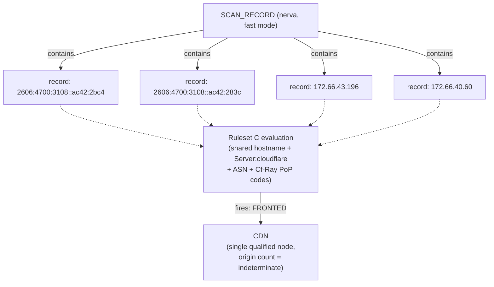
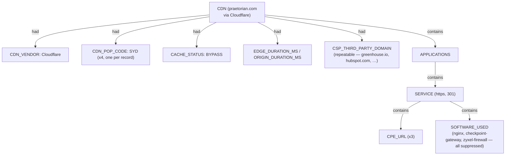

# Nerva Sub-graph — Ontology Extension
 
Companion doc to `osint-domain-ontology-rules.md` (pius),
`subfinder-ontology-rules.md`, and `httpx-ontology-rules.md`. Nerva is a
**TLS/HTTP fingerprinting probe**, closest in shape to httpx (it also
qualifies a `SYSTEM` and reports a `SERVICE`), but it goes one layer
deeper — it doesn't just observe a live response, it actively
**fingerprints** the stack behind it (technologies, CPEs, vendor/product
guesses from header and error-page heuristics), and its response headers
frequently contain rich CDN-operational metadata worth capturing in its
own right. It forks nothing new at the type level — it reuses `SYSTEM`
qualification, `NETWORKS`/`APPLICATIONS`, `SERVICE`, `CPE_URL` (from the
Nmap sub-graph), and `SOFTWARE_USED` (from httpx) directly.
 
**This specific dataset is a worked example of exactly the CDN-fronting
problem described in the earlier network-scan correlation ruleset**
(`07_Scan_Record_Host_Correlation_Rulesets.md`, Ruleset C) — four records,
one hostname (`praetorian.com`), four different IPs (two IPv6, two IPv4),
all `Server: cloudflare`, all identical CSP/HSTS, all `Cf-Ray` suffixed
`-SYD`. This doc's job is to make sure that correlation logic actually
gets **invoked** on Nerva's output, not re-derive it — Rulesets A/B/C are
reused by reference, not restated.
 
---
 
## Alignment with the unified model
 
| Unified layer | httpx sub-graph | Nerva sub-graph |
|---|---|---|
| **Scan head** | `SCAN_RECORD` + `SCAN_PROBE_PROFILE`, `SCAN_HOST_INPUT_COUNT` | `SCAN_RECORD` + `SCAN_MODE` *(new — e.g. `"fast"`)*, `SCAN_TIMEOUT_MS` *(new, from `-w`)*, `SCAN_TARGET` *(reused)* |
| **Endpoint qualification** | `SYSTEM` → `HOST` or `CDN`, keyed on `record.host` (IP) | **Reused exactly** — `SYSTEM` → `CDN` when Ruleset C fires (see Rule N1), else → `HOST`. Nerva's own `technologies`/`fingerprint_metadata` fields are what usually *supply* the Ruleset C evidence, not a separate signal |
| **Categories** | `NETWORKS`, `APPLICATIONS` | same, reused unchanged |
| **Nested structural facts** | `SERVICE` → `SOFTWARE_USED` | `SERVICE` → `SOFTWARE_USED` *(reused)*, `SERVICE` → `CPE_URL` *(reused from Nmap)*, `SOFTWARE_USED` → `SOFTWARE_VENDOR`/`SOFTWARE_PRODUCT` *(new descriptors, from `fingerprint_metadata`)* |
| **Facts (`had`)** | HTTP response facts on `SERVICE` | same set, **plus** the full CDN-operational descriptor block from the earlier CDN ruleset doc (PoP code, cache status, edge/origin timing, CSP third parties, NEL, HSTS) |
| **Correlation hand-off** | flags CDN fan-in for Ruleset C | **directly triggers full Ruleset A/B/C evaluation** — this is the dataset Ruleset C was written against |
 
### Head structure: four IPs, one CDN system, invoking Ruleset C
 

 
**Critical departure from Rule H1's httpx logic:** httpx keys `HOST`/`CDN`
qualification per-IP because each IP there was usually a genuinely
distinct backend. Here, all four IPs are the **same logical CDN edge
presence** for one hostname — collapsing them into four separate `CDN`
nodes would misrepresent "Cloudflare has 4 anycast entry points for this
name" as "praetorian.com has 4 origin systems." Rule N1 handles this
explicitly.
 
### Fact-rich CDN node
 

 
---
 
## Vocabulary additions
 
### Descriptors
 
| Descriptor | Applies to | Source field |
|---|---|---|
| `CDN_VENDOR` | `CDN` | derived from `Server` header / `version` field (Rule N1, reusing the earlier CDN-fronting doc's provider-signature approach) |
| `CDN_POP_CODE` | `CDN` (repeatable — one per record/edge node observed) | suffix of `Cf-Ray` header (or equivalent per-vendor header) |
| `EDGE_NODE_ID` | `CDN` (repeatable) | full `Cf-Ray` value |
| `CACHE_STATUS` | `SERVICE` | `Cf-Cache-Status` header |
| `EDGE_DURATION_MS` / `ORIGIN_DURATION_MS` | `SERVICE` | parsed from `Server-Timing` header |
| `PROTOCOLS_OFFERED` | `SERVICE` (repeatable) | parsed from `Alt-Svc` header |
| `HSTS_MAX_AGE` / `HSTS_PRELOAD` / `HSTS_INCLUDE_SUBDOMAINS` | `SERVICE` | parsed from `Strict-Transport-Security` header |
| `CSP_THIRD_PARTY_DOMAIN` | `SERVICE` (repeatable) | parsed from `Content-Security-Policy` header |
| `NEL_ACTIVE` | `SERVICE` | true if `Nel`/`Report-To` headers present |
| `HTTP_STATUS_CODE` / `HTTP_REDIRECT_LOCATION` | `SERVICE` | `metadata.status_code`, `metadata.response_headers.Location` (reused pattern from httpx) |
| `SOFTWARE_VENDOR` / `SOFTWARE_PRODUCT` | `SOFTWARE_USED` | `metadata.fingerprint_metadata.<name>.vendor` / `.product` |
| `DETECTION_METHOD` | `SOFTWARE_USED` | `metadata.fingerprint_metadata.<name>.detection_method`, if present |
| `ORIGIN_FINGERPRINT_SUPPRESSED` | `SOFTWARE_USED` | true whenever the parent `SERVICE`/`CDN` is `FRONTED` per Ruleset C — see Rule N4 |
| `TLS_ENABLED` | `SERVICE` | `record.tls` |
 
No new entity types — `CPE_URL` and `SOFTWARE_USED` are reused directly
from the Nmap and httpx sub-graphs respectively.
 
---
 
## Rule N0 — Value normalization (reuse Rule R0, no changes needed)
 
No markdown-wrapped values in this dataset. Reuse unchanged.
 
---
 
## Rule N1 — System qualification MUST run Ruleset C before creating any node
 
**This is the load-bearing rule for this tool.** Unlike httpx (where
`record.cdn` is a direct boolean the tool hands you), Nerva gives no such
flag — qualification has to be derived from the response evidence itself,
using the **exact** Ruleset C criteria from the earlier correlation doc.
 
```
FOR the full set of records sharing the same `host` value:
   run Ruleset C (C1–C6) against the combined evidence:
     C1: Server header / technologies list matches known CDN vendor signature
         → "Cloudflare" appears literally in metadata.technologies and
           in the Server header on every record here — STRONG match
     C2: ASN/IP-range ownership lookup for each `ip` value
         (not resolvable from this JSON alone — flag as a follow-up
         lookup, don't block classification on it)
     C3: Anycast pattern — multiple IPs for one hostname, each carrying
         a distinct edge-node/PoP identifier (Cf-Ray suffix)
         → four distinct Cf-Ray values, all suffixed "-SYD" — this
           actually indicates the SAME PoP served all four addresses,
           which is still consistent with anycast/edge routing, not
           four different backends
     C4: TLS cert is multi-tenant/shared SAN (not observable from this
         JSON — no cert data captured; skip, don't assume)
     C5: absence of non-web ports (not observable from a single-port
         fast-mode probe; skip)
 
   IF C1 fires (as it does here)
   THEN classify the WHOLE GROUP (all 4 records) as ONE qualified CDN node
        keyed on hostname, NOT one CDN node per IP
        set origin_host_count = null (per the original Ruleset C output
        contract — this must propagate here unchanged)
   ELSE
      each record's `ip` qualifies its own SYSTEM independently, following
      httpx's Rule H1 pattern (HOST unless further evidence says CDN)
```
 
**Example — this dataset:** all four records share `host:
"praetorian.com"`, all show `Server: cloudflare` and `"Cloudflare"` in
`technologies`. C1 fires unambiguously. Result: **one** `CDN(praetorian.com)`
node, not four, with `origin_host_count = null` and four `CDN_POP_CODE`/
`EDGE_NODE_ID` descriptor pairs attached (one per record, since each
carries its own `Cf-Ray`) rather than four separate qualified systems.
 
This directly corrects a mistake the httpx-only approach would make if
naively ported here: httpx's Rule H1 keys qualification per-`IP_ADDRESS`
because in that dataset different IPs really were different backends
(Cloudflare edge vs K2AM's own Apache). Applying that same per-IP keying
to Nerva's praetorian.com data would wrongly produce four separate `CDN`
nodes for what is structurally one edge presence.
 
---
 
## Rule N2 — CDN operational descriptors, reused verbatim from the earlier CDN-fronting ruleset
 
The earlier CDN-context doc (produced before the pius/subfinder/httpx
chain) already specified this exact extraction — repeated here only to
confirm it plugs into this sub-graph's `CDN`/`SERVICE` nodes without
modification:
 
```
CDN --[had]--> CDN_VENDOR("Cloudflare")
CDN --[had]--> CDN_POP_CODE("SYD")              — one edge per record
CDN --[had]--> EDGE_NODE_ID(full Cf-Ray value)   — one edge per record
SERVICE --[had]--> CACHE_STATUS(Cf-Cache-Status)
SERVICE --[had]--> EDGE_DURATION_MS, ORIGIN_DURATION_MS   (from Server-Timing)
SERVICE --[had]--> PROTOCOLS_OFFERED("h3")        (from Alt-Svc)
SERVICE --[had]--> HSTS_MAX_AGE(31536000), HSTS_PRELOAD(true), HSTS_INCLUDE_SUBDOMAINS(true)
SERVICE --[had]--> CSP_THIRD_PARTY_DOMAIN(...)    — repeatable, one per
                    distinct domain parsed out of the CSP header
                    (googletagmanager.com, greenhouse.io, hubspot.com,
                    player.vimeo.com, google.com, youtube.com,
                    doubleclick.net, twitter.com, hsforms.com,
                    hsforms.net, disqus.com, vimeo.com, hotjar.com,
                    driftt.com, drift.com)
SERVICE --[had]--> NEL_ACTIVE(true)
```
 
**Note on `ORIGIN_DURATION_MS = 0` across all four records:** per the
earlier doc, a non-zero origin duration would confirm the edge actually
round-tripped to a real backend. All four records here show
`cfOrigin;dur=0` — consistent with this being a cached/redirect response
served entirely at the edge, not evidence either way about the origin's
existence.
 
---
 
## Rule N3 — `technologies[]` and `cpes[]` expansion (reusing httpx's array-expansion + Nmap's CPE handling)
 
```
FOR EACH entry in record.metadata.technologies[]:
   create/reuse SOFTWARE_USED(name = entry)   — same repeatable-nugget
        principle as httpx Rule H4
   edge: SERVICE --[contains]--> SOFTWARE_USED
 
FOR EACH cpe in record.metadata.cpes[]:
   create/reuse CPE_URL(value = cpe)          — reused directly from
        the Nmap sub-graph's OS-fingerprint CPE handling
   edge: SERVICE --[contains]--> CPE_URL
 
FOR EACH key in record.metadata.fingerprint_metadata:
   find the SOFTWARE_USED node with matching name (case/hyphen-insensitive
   match against the technologies[] entry, e.g. "nginx" ↔ "nginx",
   "checkpoint-gateway" ↔ implied by product/vendor)
   attach SOFTWARE_USED --[had]--> SOFTWARE_VENDOR(fingerprint_metadata[key].vendor)
   attach SOFTWARE_USED --[had]--> SOFTWARE_PRODUCT(fingerprint_metadata[key].product)
   IF fingerprint_metadata[key].detection_method exists
   THEN attach SOFTWARE_USED --[had]--> DETECTION_METHOD(...)
```
 
**Example — this dataset**, `technologies` includes `"nginx"`,
`"checkpoint-gateway"`, `"zyxel-firewall"`, each with a matching
`fingerprint_metadata` entry:
```
SOFTWARE_USED("nginx")
  --[had]--> SOFTWARE_VENDOR("F5")
  --[had]--> SOFTWARE_PRODUCT("Nginx")
  --[had]--> DETECTION_METHOD("error_page")
 
SOFTWARE_USED("checkpoint-gateway")
  --[had]--> SOFTWARE_VENDOR("Check Point")
  --[had]--> SOFTWARE_PRODUCT("Security Gateway")
 
SOFTWARE_USED("zyxel-firewall")
  --[had]--> SOFTWARE_VENDOR("Zyxel")
  --[had]--> SOFTWARE_PRODUCT("Zyxel Firewall")
```
 
---
 
## Rule N4 — Origin-fingerprint suppression flag
 
**This is the rule that stops N3 from silently over-claiming.** Once
Rule N1 has classified a node as `CDN` (Ruleset C fired), the
`nginx`/`checkpoint-gateway`/`zyxel-firewall` technologies detected above
are near-certainly **edge-side fingerprinting artifacts** — Cloudflare's
own infrastructure or error-page quirks tripping a signature match — not
evidence of the real origin's actual software stack. This is the exact
caveat flagged in the very first CDN-fronting conversation in this
thread, and it must be enforced here as a rule, not left as a footnote.
 
```
FOR EACH SOFTWARE_USED node created under N3, where its parent SERVICE
belongs to a SYSTEM classified as CDN under Rule N1:
   tag SOFTWARE_USED --[had]--> ORIGIN_FINGERPRINT_SUPPRESSED(true)
   — do NOT delete or hide the node; keep it for audit, but any
     downstream process building an "origin technology stack" report
     MUST exclude nodes tagged this way
```
 
**Example:** all three `SOFTWARE_USED` nodes in N3's example
(`nginx`, `checkpoint-gateway`, `zyxel-firewall`) get
`ORIGIN_FINGERPRINT_SUPPRESSED = true`, since Rule N1 classified this
whole group as `CDN`. `"Cloudflare"` and `"Cloudflare Browser Insights"`
as `SOFTWARE_USED` entries do **not** need this flag — they're accurately
describing the CDN layer itself, not a false claim about a hidden origin.
 
---
 
## Rule N5 — Redirect-target linkage
 
```
IF record.metadata.status_code is a 3xx AND record.metadata.response_headers.Location exists
THEN
   parsed = parse_url(response_headers.Location[0])
   ensure DOMAIN_NAME(value = parsed.hostname) exists
   edge: SERVICE --[had]--> HTTP_REDIRECT_LOCATION(response_headers.Location[0])
   edge: DOMAIN_NAME(record.host) --[redirects-to]--> DOMAIN_NAME(parsed.hostname)
        — new relation, distinct from cname-alias-to (httpx) since this
          is an HTTP-layer redirect fact, not a DNS-layer alias
```
 
**Example — this dataset:** every record is a 301 to
`https://www.praetorian.com/` →
`DOMAIN_NAME("praetorian.com") --[redirects-to]--> DOMAIN_NAME("www.praetorian.com")`.
Created once (deduplicated across the four identical redirects), not
four times.
 
---
 
## Conclusions drawn from this specific dataset
 
- **This is a single Cloudflare edge presence, not four hosts** — Rule
  N1 firing here is the entire point of this sub-graph existing
  alongside Rulesets A/B/C rather than duplicating per-tool logic. Any
  downstream count of "how many praetorian.com servers are there" must
  read `origin_host_count = null` off the `CDN` node, not `4` off the
  raw record count.
- **The apparent origin tech stack (nginx/Check Point/Zyxel) should not
  be reported as praetorian.com's real infrastructure** without
  independent corroboration — Rule N4 exists specifically so this
  doesn't happen silently.
- **The real redirect target, `www.praetorian.com`, is the next
  legitimate thing to scan** — this dataset only fingerprints the bare
  domain, which immediately bounces.
- **The CSP header is a genuinely useful piece of OSINT independent of
  the CDN question** — the third-party domain list
  (`greenhouse.io` → careers/ATS, `hubspot.com` → marketing/CRM,
  `driftt.com`/`drift.com` → chat widget, `hotjar.com` → analytics)
  gives a reasonable picture of praetorian.com's marketing/vendor stack
  without needing any origin access at all.
---
 
## Full Field Reference
 
### CDN (qualified SYSTEM, group-keyed per Rule N1)
 
| Field | Type | Source |
|---|---|---|
| `hostname_key` | string | `record.host`, shared across the group (R N1 dedup key — NOT per-IP) |
| `origin_host_count` | null | forced null when Ruleset C fires (contract preserved from the original CDN ruleset doc) |
| `cdn_vendor` | string | derived from `Server` header / `metadata.version` |
| `cdn_pop_code` | string (repeatable) | `Cf-Ray` suffix, one per record |
| `edge_node_id` | string (repeatable) | full `Cf-Ray` value, one per record |
 
### SERVICE (Nerva-contributed fields)
 
| Field | Type | Source |
|---|---|---|
| `tls_enabled` | bool | `record.tls` |
| `http_status_code` | int | `metadata.status_code` |
| `http_redirect_location` | string or null | `metadata.response_headers.Location[0]` |
| `cache_status` | string | `Cf-Cache-Status` header |
| `edge_duration_ms` / `origin_duration_ms` | float | parsed `Server-Timing` |
| `protocols_offered` | array[string] | parsed `Alt-Svc` |
| `hsts_max_age` / `hsts_preload` / `hsts_include_subdomains` | int / bool / bool | parsed `Strict-Transport-Security` |
| `csp_third_party_domain` | string (repeatable) | parsed `Content-Security-Policy` |
| `nel_active` | bool | presence of `Nel`/`Report-To` |
 
### SOFTWARE_USED (Nerva-contributed fields)
 
| Field | Type | Source |
|---|---|---|
| `software_vendor` | string or null | `fingerprint_metadata.<name>.vendor` |
| `software_product` | string or null | `fingerprint_metadata.<name>.product` |
| `detection_method` | string or null | `fingerprint_metadata.<name>.detection_method` |
| `origin_fingerprint_suppressed` | bool | true when parent SYSTEM is `CDN` (Rule N4) |
 
### Edge: DOMAIN_NAME --[redirects-to]--> DOMAIN_NAME
 
| Field | Type | Source |
|---|---|---|
| *(no additional fields)* | | `metadata.response_headers.Location[0]` |
 
### SCAN_RECORD (Nerva-contributed descriptors)
 
| Field | Type | Source |
|---|---|---|
| `scan_mode` | string | inferred from command flags, e.g. `"fast"` (`--fast`) |
| `scan_timeout_ms` | int | `-w` flag value |
 
---
 
## Validation log — datasets tested against this ruleset
 
| Dataset | Records | Gap found | Fix |
|---|---|---|---|
| praetorian.com fast HTTPS (`tcp_fast_praetorian_json`) | 4 | naively porting httpx's per-IP `SYSTEM` qualification here would create 4 separate `CDN` nodes for one logical edge presence | Rule N1 — group qualification by hostname, explicitly invoking Ruleset C (from the pre-existing correlation doc) rather than re-deriving CDN detection from scratch |
| praetorian.com fast HTTPS (same) | — | `technologies[]` entries (`nginx`, `checkpoint-gateway`, `zyxel-firewall`) look like real origin infrastructure but are very likely edge-side fingerprinting artifacts once Ruleset C has fired | new Rule N4 (`ORIGIN_FINGERPRINT_SUPPRESSED` flag) — nodes kept for audit, excluded from any "real origin stack" report |
| praetorian.com fast HTTPS (same) | — | all four records carry rich CDN-operational headers (PoP code, cache status, edge/origin timing, CSP third parties) that the pius/subfinder/httpx docs had no descriptor set for | Rule N2, reusing the full descriptor list from the earlier standalone CDN-fronting ruleset doc verbatim |
| praetorian.com fast HTTPS (same) | — | every record 301-redirects to `www.praetorian.com`, an HTTP-layer fact distinct from DNS-layer `cname-alias-to` (httpx) | new Rule N5, new `redirects-to` relation |
 
This table follows the same format as the pius, subfinder, and httpx
validation logs.
 