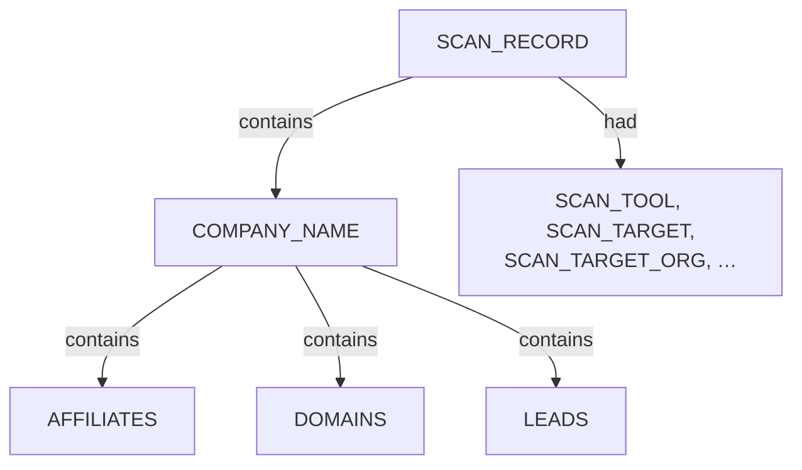
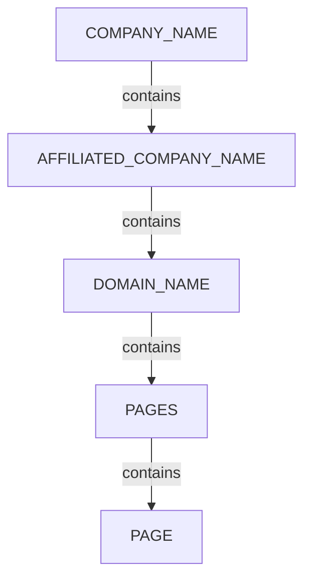
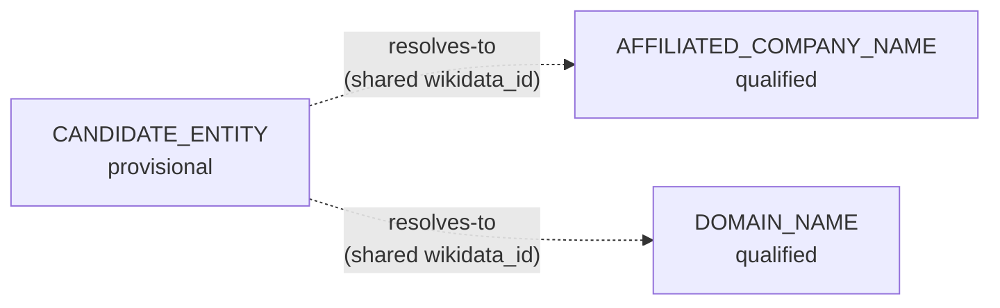

# OSINT Company/Domain Sub-graph — Ontology Extension
 
This is the `pius` OSINT sub-graph, written to **plug into the same unified
CLI profiling ontology** used by the Nmap and Netdiscover sub-graphs (per
`05_Onotology_for_Nuggets.md` / the CLI Profiling Ontology doc). Same
principle: one `SCAN_RECORD` per run, an endpoint-equivalent root entity,
category nuggets bucketing structural children, and descriptor nuggets
(`had`) carrying facts. Nothing here forks a parallel vocabulary — it
extends the shared one, the same way Netdiscover extends it with `SYSTEM`
and Nmap extends it with `HOST`.
 
Two naming corrections from earlier drafts of this doc, both driven by
the existing vocabulary: the invented `ORGANIZATION` entity is retired in
favor of the **already-existing** `COMPANY_NAME` (head company) and
`AFFILIATED_COMPANY_NAME` (subsidiaries/related companies) nuggets, and
`LEGAL_ENTITY` is folded into `AFFILIATED_COMPANY_NAME` rather than kept
as a separate type.
 
---
 
## Alignment with the unified model
 
| Unified layer | Host sub-graphs (Nmap / Netdiscover) | OSINT sub-graph (pius) |
|---|---|---|
| **Scan head** | `SCAN_RECORD` + `SCAN_CLI`, `SCAN_TARGET`, `SCAN_TOOL`, … | `SCAN_RECORD` + `SCAN_TOOL`, `SCAN_TARGET` *(reused)*, `SCAN_TARGET_ORG` *(new)*, `SCAN_COMMAND`, `SCAN_START`, `SCAN_DURATION`, `SCAN_EXIT_CODE` |
| **Endpoint (root)** | `SYSTEM` / `HOST` | `COMPANY_NAME` |
| **Endpoint (provisional → qualified)** | `SYSTEM` (provisional) → `HOST` (qualified) via correlation | `CANDIDATE_ENTITY` (provisional) → `AFFILIATED_COMPANY_NAME` or `DOMAIN_NAME` (qualified) via `resolves-to` |
| **Categories** | `NETWORKS`, `APPLICATIONS`, `ENVIRONMENT`, `VULNERABILITIES` | `AFFILIATES`, `DOMAINS`, `LEADS`, `PAGES` |
| **Nested structural facts (`contains`)** | `TRANSPORT` → `PORT` | `COMPANY_NAME` → `AFFILIATED_COMPANY_NAME` → `DOMAIN_NAME` → `PAGE` |
| **Facts (`had`)** | `IP_ADDRESS`, `MAC_VENDOR`, `HOST_STATUS` | `DOMAIN_WHOIS`, `WIKIDATA_ID`, `CONFIDENCE_SCORE`, `LEI`, `JURISDICTION`, `IS_WILDCARD_DNS`, `NETWORK_TYPE` |
| **Correlation** | shared `IP_ADDRESS` reclassifies `SYSTEM` → `HOST` | shared `wikidata_id` resolves `CANDIDATE_ENTITY` → `AFFILIATED_COMPANY_NAME` / `DOMAIN_NAME` |
 
The provisional → qualified pattern is the same mechanism in both
sub-graphs: a cheap, uncertain finding sits in the graph as a placeholder
until a stronger piece of evidence (an IP match for hosts; a shared
Wikidata ID for companies) justifies promoting it. `SYSTEM` and
`CANDIDATE_ENTITY` are structurally the same kind of thing — "we found
*something*, we don't yet know exactly what."
 
### Head structure
 

 
### Company → affiliate → domain → page chain
 

 
### Provisional → qualified (correlation)
 

 
---
 
## Why this dataset needs new rules
 
Two structural problems distinguish this data from a clean scan format:
 
1. **The declared `Type` field is unreliable.** Records labelled
   `Type: "domain"` sometimes contain a legal entity name
   (`"BBC WORLD SERVICE INDIA PRIVATE LIMITED"`), not a domain string.
2. **`Type: "preseed"` is pipeline state, not a finding.** These are
   unresolved research leads (`needs_review: true` in nearly every case),
   distinct from confirmed domains or companies.
A third problem, found once the "subsidiary" and "website" fields on
wikidata `domain`-type records were actually used instead of ignored:
**one record often encodes three separate facts at once** — a company
relationship, a brand/subsidiary identity, and a specific web page — and
these need to be pulled apart into their own nuggets, not flattened into
a single edge.
 
---
 
## Vocabulary additions
 
### Entities
 
| Entity | Type | Notes |
|---|---|---|
| `COMPANY_NAME` | ENTITY *(existing)* | The head/root company being profiled — one per scan, reused rather than invented |
| `AFFILIATED_COMPANY_NAME` | ENTITY *(existing)* | Subsidiary, brand, or related legal entity — replaces the earlier draft's invented `LEGAL_ENTITY` |
| `CANDIDATE_ENTITY` | ENTITY *(proposed new)* | Unresolved research lead (`preseed` records) |
| `PAGE` | ENTITY *(proposed new)* | A specific URL (host + path) found under a domain, distinct from the bare domain itself |
 
### Categories
 
| Category | Notes |
|---|---|
| `AFFILIATES` | Bucket under `COMPANY_NAME` (or under another `AFFILIATED_COMPANY_NAME`, recursively) holding subsidiary/related companies |
| `DOMAINS` | Bucket under `COMPANY_NAME` or `AFFILIATED_COMPANY_NAME` holding that entity's domains |
| `LEADS` | Bucket under `COMPANY_NAME` holding unresolved `CANDIDATE_ENTITY` research leads |
| `PAGES` | Bucket under `DOMAIN_NAME` holding specific `PAGE` findings |
 
### Descriptors
 
| Descriptor | Applies to | Source field |
|---|---|---|
| `WIKIDATA_ID` | any entity | `wikidata_id` |
| `LEI` | `AFFILIATED_COMPANY_NAME` | `lei` |
| `JURISDICTION` | `AFFILIATED_COMPANY_NAME` | `jurisdiction` |
| `CONFIDENCE_SCORE` | any entity | `confidence` (null if absent — R7) |
| `DISCOVERY_METHOD` | any entity | `method` (wikidata) or `"certificate-transparency"` (crt-sh) |
| `NEEDS_REVIEW` | any entity | `needs_review` |
| `RELATIONSHIP_TYPE` | edge, not entity | `relationship` / `relationshipType`, defaults to `"affiliated"` |
| `PRESEED_TYPE` | `CANDIDATE_ENTITY` | `preseed_type` |
| `IS_PLACEHOLDER` | `CANDIDATE_ENTITY` | R2, matched against `PLACEHOLDER_VALUE_PATTERN` |
| `IS_WILDCARD_DNS` / `WILDCARD_IP_COUNT` / `SUBDOMAIN_ENUMERATION_SUPPRESSED` | `DOMAIN_NAME` | R10, parsed from `document.stderr_banner` |
| `NETWORK_TYPE` | `DOMAIN_NAME` | `"tor"` when the domain ends `.onion`, else omitted |
| `PAGE_URL` / `PAGE_PATH` / `BRAND_NAME` | `PAGE` | parsed from `record.Data.website` |
 
### Relations
 
`resolves-to` — links a `CANDIDATE_ENTITY` to the `AFFILIATED_COMPANY_NAME`
(preferred) or `DOMAIN_NAME` it was later confirmed as, when both share a
`wikidata_id`.
 
---
 
## Rule R0 — Value normalization (markdown-link unwrapping)
 
Some sources (observed from crt-sh output in at least one pius run) return
`Value` wrapped in markdown link syntax instead of a plain string, e.g.:
 
```
"Value": "[www.squarepeg.vc](https://www.squarepeg.vc)"
```
 
This must be normalized **before** any shape-based classification (R1) or
consistency check runs, or it will be misclassified — the raw string fails
`DOMAIN_REGEX` (contains `[`, `]`, `(`, `)`, `:`, `/`) and would otherwise
fall through to `AFFILIATED_COMPANY_NAME` under R1, which is wrong.
 
```
IF record.Value matches MARKDOWN_LINK_PATTERN:
   ^\[(?<label>[^\]]+)\]\((?<url>[^)]+)\)$
THEN
   IF url is a well-formed URL
   THEN candidate_value = hostname extracted from url
   ELSE candidate_value = label
   store original record.Value as RAW_VALUE (audit trail, never discarded)
ELSE
   candidate_value = record.Value unchanged
```
 
All downstream rules (R1 onward) operate on `candidate_value`, not the raw
`record.Value`.
 
**Example:**
```
raw:  "[www.squarepeg.vc](https://www.squarepeg.vc)"
url:  "https://www.squarepeg.vc" → hostname → "www.squarepeg.vc"
label: "www.squarepeg.vc"                     (matches, consistent)
candidate_value = "www.squarepeg.vc"
```
 
If `label` and the extracted hostname ever disagree (e.g. a link whose
display text doesn't match its href), prefer the **hostname from the URL**
as `candidate_value` — the URL is the more reliable source since it will
actually resolve, whereas display text can be arbitrary. Flag the record
for review when they disagree.
 
---
 
## Rule R1 — Value-shape gates entity type, not the declared `Type` field
 
```
IF record.Type = "domain"
   AND candidate_value matches DOMAIN_REGEX
THEN create DOMAIN_NAME(value = candidate_value)
 
ELSE IF record.Type = "domain"
   AND candidate_value does NOT match DOMAIN_REGEX
THEN create AFFILIATED_COMPANY_NAME(value = candidate_value)
 
ELSE
   proceed to R2
```
 
`DOMAIN_REGEX` = one or more DNS labels separated by dots, ending in a
plausible TLD, containing no whitespace and no legal-suffix tokens
(`LIMITED`, `LLC`, `INC`, `PRIVATE`, `CORPORATION`, etc. as a denylist
backstop even if the regex alone passes). **Labels may be fully numeric**
(e.g. `8472.app.guard.praetorian.com` is a valid domain, not an IP address
or version string) — do not add a "must contain a letter" constraint.
 
**Addendum — dark-web domains:** if `candidate_value` ends in `.onion`,
tag the resulting `DOMAIN_NAME` with `NETWORK_TYPE = "tor"`. Observed in
the BBC dataset (`bbcweb3hytmzhn5d532owbu6oqadra5z3ar726vq5kgwwn6aucdccrad.onion`)
— the domain shape rule accepts it fine (dot-separated labels + a
TLD-shaped suffix), but the distinction between clearnet and dark-web
presence is worth surfacing explicitly rather than treating it as an
ordinary domain.
 
**Example:**
- `candidate_value: "bbc.co.uk"` → matches → `DOMAIN_NAME`
- `candidate_value: "BBC WORLD SERVICE INDIA PRIVATE LIMITED"` → fails
  (spaces, denylist term `PRIVATE`/`LIMITED`) → `AFFILIATED_COMPANY_NAME`
- `candidate_value: "www.squarepeg.vc"` (post R0 unwrap) → matches →
  `DOMAIN_NAME`
---
 
## Rule R2 — `preseed` records become `CANDIDATE_ENTITY`, with a registrar exception and a placeholder filter
 
A `preseed` record where `Value` is a generic role/title placeholder
rather than an actual identifying name — e.g. `preseed_type: "whois+name"`
with `Value: "CEO"` — must not be turned into a normal `CANDIDATE_ENTITY`.
This is common under privacy-redaction regimes (auDA's `.au` policy,
GDPR-driven registrar redaction, etc.), where the actual contact name is
withheld and only a role label survives. Creating a plain
`CANDIDATE_ENTITY("CEO")` would pollute the graph with a meaningless,
non-unique node — "CEO" carries no identifying information and would
collide across unrelated orgs' scans if graphs are ever merged.
 
```
IF record.Type = "preseed"
THEN
   IF record.Source = "whois"
      AND record.Value matches KNOWN_REGISTRAR_PATTERN
   THEN link/create DOMAIN_REGISTRAR(value = record.Value)
 
   ELSE IF record.Value matches PLACEHOLDER_VALUE_PATTERN
   THEN create CANDIDATE_ENTITY(
           value = record.Value,
           preseed_type = record.Data.preseed_type,
           is_placeholder = true,
           needs_review = true    (forced true regardless of source field)
        )
        — do NOT use this node's value as a dedup/matching key elsewhere
          (Rule R5, Rule R8) since the value is not a stable identifier
 
   ELSE create CANDIDATE_ENTITY(
           value = record.Value,
           preseed_type = record.Data.preseed_type,
           is_placeholder = false
        )
ELSE
   proceed to R3
```
 
`KNOWN_REGISTRAR_PATTERN` = value matches a maintained list/pattern of
registrar and registry-operator names. This needs to cover both commercial
registrars (`"GoDaddy"`, `"MarkMonitor"`) **and** ccTLD registry-operator
naming conventions, which vary a lot by country — e.g. `"Nominet UK"`
(`.uk`) and `".au Domain Administration Limited"` (`.au`, confirmed from a
real scan). Maintain as external config; expect to keep adding
country-specific registry-operator names as new ccTLD scans surface them.
 
`PLACEHOLDER_VALUE_PATTERN` = value is a generic role/title/redaction
placeholder rather than an actual identifying name — e.g. `"CEO"`,
`"Registrant"`, `"Admin Contact"`, `"Technical Contact"`, `"Owner"`,
`"Domain Administrator"`, `"REDACTED FOR PRIVACY"`, `"Not Disclosed"`,
`"Data Protected"`. Maintain as external config, same pattern as the
registrar list. This check applies regardless of `preseed_type`, but is
most often seen on `preseed_type: "whois+name"` since that's the field
meant to hold an actual person's name.
 
**Example:**
- `Value: "Nominet UK"`, `Source: "whois"` → matches registrar pattern →
  `DOMAIN_REGISTRAR`
- `Value: ".au Domain Administration Limited"`, `Source: "whois"` →
  matches registrar pattern (ccTLD registry operator) → `DOMAIN_REGISTRAR`
- `Value: "CEO"`, `Source: "whois"`, `preseed_type: "whois+name"` → no
  registrar match, matches placeholder pattern →
  `CANDIDATE_ENTITY(value = "CEO", is_placeholder = true, needs_review = true)`
- `Value: "BBC News"`, `Source: "wikidata"`, `Type: "preseed"` → no
  registrar match, not a placeholder → `CANDIDATE_ENTITY(preseed_type =
  "whois+company", is_placeholder = false)`
---
 
## Rule R3 — Domain parent hierarchy via structural derivation
 
```
FOR EACH DOMAIN_NAME entity D:
   IF D.value contains more than one label (i.e. has a parent domain
      obtainable by stripping the leftmost label)
   THEN
      parent_value = D.value with leftmost label removed
      create/reuse DOMAIN_NAME_PARENT(value = parent_value)
      link D --[had]--> DOMAIN_NAME_PARENT
   ELSE
      no parent edge created (D is already a bare registrable domain)
```
 
Applied to **every** `DOMAIN_NAME`, regardless of source — deterministic
string operation, not a claim requiring external evidence.
 
**Example:**
- `news.bbc.co.uk` → `--[had]--> DOMAIN_NAME_PARENT("bbc.co.uk")`
- `bbc.co.uk` → no parent edge (already the registrable root in this
  dataset's context)
---
 
## Rule R4 — Company/domain containment hierarchy
 
**Replaces the earlier flat "org contains domain" version.** Real data
showed that one wikidata `domain`-type record actually bundles three
separate facts — a parent-company relationship, a subsidiary/brand
identity, and a domain — that need pulling apart into their own nuggets,
not flattened into a single edge. Split into three sub-rules by source.
 
### R4a — wikidata records with a `subsidiary` field
 
```
IF record.Source = "wikidata" AND record.Type = "domain"
   AND record.Data.subsidiary exists
THEN
   org_value = record.Data.org ELSE document.org ELSE null
   IF org_value is not null
   THEN
      create/reuse COMPANY_NAME(value = org_value)
      create/reuse AFFILIATED_COMPANY_NAME(
          value = record.Data.subsidiary,
          wikidata_id = record.Data.wikidata_id
      )
      edge: COMPANY_NAME --[contains]--> AFFILIATED_COMPANY_NAME
      tag edge RELATIONSHIP_TYPE = record.Data.relationship
               ELSE "affiliated"
      edge: AFFILIATED_COMPANY_NAME --[contains]--> DOMAIN_NAME(candidate_value)
```
 
This is the case that was previously missed entirely — the `subsidiary`
field was present on every wikidata `domain`-type record in the BBC
dataset and simply never read.
 
**Example — `bbc.co.uk` record** (`subsidiary: "BBC News"`,
`relationship: "owned-by (P127)"`, `wikidata_id: "Q1160945"`):
```
COMPANY_NAME("British Broadcasting Corporation")
  --[contains, RELATIONSHIP_TYPE="owned-by (P127)"]--> AFFILIATED_COMPANY_NAME("BBC News", wikidata_id="Q1160945")
  --[contains]--> DOMAIN_NAME("bbc.co.uk")
```
 
### R4b — gleif records (no domain, company-to-company only)
 
```
IF record.Source = "gleif"
THEN
   org_value = record.Data.org ELSE document.org ELSE null
   IF org_value is not null
   THEN
      create/reuse COMPANY_NAME(value = org_value)
      target = AFFILIATED_COMPANY_NAME created for this record under R1
               (LEI, JURISDICTION descriptors attach here per R6)
      edge: COMPANY_NAME --[contains]--> AFFILIATED_COMPANY_NAME
      tag edge RELATIONSHIP_TYPE = record.Data.relationshipType
               ELSE "affiliated"
```
 
Note `record.Data.org` is **absent** on gleif `domain`-type records —
this is exactly why the `document.org` fallback exists. Without it, the
four gleif-verified legal entities in the BBC dataset (LEI-backed
subsidiaries) would be completely disconnected from `COMPANY_NAME`.
 
**Example:** `AFFILIATED_COMPANY_NAME("BBC MEDIA ACTION")`, no
`record.Data.org` → falls back to `document.org =
"British Broadcasting Corporation"`; `relationshipType: "subsidiary"`
present → edge tagged `RELATIONSHIP_TYPE = "subsidiary"`.
 
### R4c — everything else (crt-sh, and any record with no subsidiary/relationship info)
 
```
org_value = record.Data.org ELSE document.org ELSE null
IF org_value is not null
THEN
   create/reuse COMPANY_NAME(value = org_value)
   target = the DOMAIN_NAME | AFFILIATED_COMPANY_NAME | CANDIDATE_ENTITY
            created under R1/R2
   edge: COMPANY_NAME --[contains]--> target
   tag edge RELATIONSHIP_TYPE = record.Data.relationship
            ELSE record.Data.relationshipType
            ELSE "affiliated"
ELSE
   no containment edge created
```
 
This is the majority case for every crt-sh-heavy scan (hundreds of BBC
subdomains, ~100 Praetorian subdomains, all Square Peg Capital and The
Upside records) — crt-sh never supplies a relationship field, only `org`,
so every one of these gets the `"affiliated"` default rather than being
left disconnected.
 
**Example:** crt-sh record for `DOMAIN_NAME("jupiter.praetorian.com")`:
`org: "Praetorian"` present, no relationship field at all → edge tagged
`RELATIONSHIP_TYPE = "affiliated"` (default).
 
---
 
## Rule R5 — Single node per unique (type, value) pair
 
```
IF a COMPANY_NAME / AFFILIATED_COMPANY_NAME node with the same value
   already exists in this graph
THEN reuse the existing node (do not create a duplicate)
ELSE create a new node
```
 
Deduplication key = exact string match on value, scoped **within each
entity type separately** (a `COMPANY_NAME` and an `AFFILIATED_COMPANY_NAME`
sharing a string are not automatically the same node — that's a
cross-scan reconciliation problem outside this ruleset's scope). If two
spellings of the same company appear (e.g. "BBC" vs "British Broadcasting
Corporation"), flag for manual merge rather than auto-merging on partial
string match.
 
---
 
## Rule R6 — Source-specific descriptor attachment
 
```
IF record.Source = "wikidata"
THEN attach via [had]: WIKIDATA_ID, CONFIDENCE_SCORE, DISCOVERY_METHOD,
     NEEDS_REVIEW  (from wikidata_id, confidence, method, needs_review)
 
ELSE IF record.Source = "gleif"
THEN attach via [had]: LEI, JURISDICTION, CONFIDENCE_SCORE, NEEDS_REVIEW
     (from lei, jurisdiction, confidence, needs_review)
 
ELSE IF record.Source = "crt-sh"
THEN attach via [had]: DISCOVERY_METHOD = "certificate-transparency"
     (no other descriptors available)
 
ELSE IF record.Source = "whois"
THEN no additional descriptors beyond entity classification (R1/R2)
```
 
---
 
## Rule R7 — Do not fabricate confidence values
 
```
IF record.Data.confidence exists
THEN CONFIDENCE_SCORE = record.Data.confidence
ELSE CONFIDENCE_SCORE = null   (explicitly null, never a default number)
```
 
`null` here is meaningful — it records "no source claim was made" — and
must be treated differently downstream from an actual low numeric score.
crt-sh records will always hit this `null` branch, since certificate
transparency logs carry no relationship-confidence semantics at all.
 
---
 
## Rule R8 — Cross-stage resolution linkage
 
```
FOR EACH CANDIDATE_ENTITY C with a WIKIDATA_ID value W (and is_placeholder = false):
   IF an AFFILIATED_COMPANY_NAME node exists with the same WIKIDATA_ID W
   THEN create edge: C --[resolves-to]--> AFFILIATED_COMPANY_NAME
   ELSE IF a DOMAIN_NAME node exists with the same WIKIDATA_ID W
   THEN create edge: C --[resolves-to]--> DOMAIN_NAME
   ELSE no resolves-to edge (C remains an unresolved lead)
```
 
`AFFILIATED_COMPANY_NAME` is preferred over `DOMAIN_NAME` as the
resolution target — a preseed record is a **company** lead
(`preseed_type: "whois+company"` in nearly every observed case), so it
should resolve to the company-shaped entity that R4a creates from the
same wikidata item's `subsidiary` field, not to the domain the company
happens to operate.
 
**Example:**
- `CANDIDATE_ENTITY("BBC News")`, `wikidata_id: Q1160945`
- `AFFILIATED_COMPANY_NAME("BBC News")`, `wikidata_id: Q1160945` (created
  under R4a from the `bbc.co.uk` record's `subsidiary` field)
- → `CANDIDATE_ENTITY("BBC News") --[resolves-to]--> AFFILIATED_COMPANY_NAME("BBC News")`
Placeholder entities (R2, `is_placeholder = true`) are excluded from this
rule entirely — their value isn't a stable identifier, so a resolves-to
edge built from it would be meaningless.
 
---
 
## Rule R9 — `needs_review` as a confidence gate on containment edges
 
```
FOR EACH edge E created under Rule R4 (COMPANY_NAME --[contains]--> target):
   IF the source record had needs_review = true
   THEN tag E with REVIEW_STATUS = "unconfirmed"
   ELSE tag E with REVIEW_STATUS = "confirmed"
```
 
This does not block edge creation — it annotates it, so downstream
queries can distinguish a confirmed organizational tree from a
provisional one built mostly on unreviewed preseed leads. In this
dataset, nearly all `CANDIDATE_ENTITY` records carry `needs_review: true`,
while the `domain`-typed wikidata records and all four gleif records carry
`needs_review: false`.
 
---
 
## Rule R10 — Wildcard DNS detection, parsed from the document-level `stderr_banner`
 
A scan can include a `stderr_banner` field at the document level (not
inside `records[]`) containing the tool's raw log output. Observed
example, from a scan of `theupside.com.au`:
 
```
2026/07/05 23:11:02 INFO wildcard detected base=news.theupside.com.au ips_count=1
2026/07/05 23:11:02 INFO wildcard detected, filtering subdomains parent=news.theupside.com.au
```
 
This means the tool detected that `*.news.theupside.com.au` resolves (a
catch-all/wildcard DNS record), and **deliberately suppressed further
subdomain enumeration under that branch** to avoid flooding the results
with noise. A domain flagged this way needs a different interpretation
than a normally-enumerated domain: the **absence of further subdomains
under it is not evidence that none exist** — it's a deliberate gap in the
data, not a completeness signal.
 
```
FOR EACH line in document.stderr_banner matching:
   "wildcard detected base=(?<domain>\S+) ips_count=(?<count>\d+)"
THEN
   target = existing DOMAIN_NAME with value = domain
   IF target exists
   THEN tag target with: IS_WILDCARD_DNS = true, WILDCARD_IP_COUNT = count
   ELSE create a minimal DOMAIN_NAME(value = domain, IS_WILDCARD_DNS = true,
        WILDCARD_IP_COUNT = count, source = "stderr_banner")
 
FOR EACH line in document.stderr_banner matching:
   "wildcard detected, filtering subdomains parent=(?<domain>\S+)"
THEN
   tag the matching DOMAIN_NAME (by value = domain) with:
           SUBDOMAIN_ENUMERATION_SUPPRESSED = true
```
 
**Example — from the `theupside.com.au` scan**, 11 domains flagged as
wildcarded: `news`, `k8s`, `newsletter`, `aws`, `track`, `test`, `spf`,
`info`, `e`, `mail`, `dev` (all `.theupside.com.au`). Each already had a
matching `DOMAIN_NAME` record from crt-sh, so R10 attaches
`IS_WILDCARD_DNS = true`, `WILDCARD_IP_COUNT = 1`, and
`SUBDOMAIN_ENUMERATION_SUPPRESSED = true` to each. `email.theupside.com.au`
and `cfjump.theupside.com.au` were **not** flagged — those are normal,
fully-enumerated findings.
 
**Why this matters downstream:** if a later process asks "does
`mail.theupside.com.au` have any subdomains?", the honest answer given
this data is "unknown — enumeration was suppressed here due to a wildcard
DNS record", not "no".
 
---
 
## Rule R11 — `PAGE` extraction from the `website` field
 
**New.** Several wikidata `domain`-type records carry a `website` field
that is a *specific URL*, not just the bare domain — e.g. Value =
`"bbc.co.uk"` but `website: "https://www.bbc.co.uk/news"`; Value =
`"news.bbc.co.uk"` but `website: "http://news.bbc.co.uk/onthisday/"`.
This is a distinct, more specific finding than the domain itself — a
particular page or web presence, potentially on a different (sub)domain
entirely (note `www.bbc.co.uk` vs the record's own `bbc.co.uk`) — and
collapsing it into the domain record loses information.
 
```
IF record.Data.website exists
THEN
   parsed = parse_url(record.Data.website)
   page_host = parsed.hostname
   page_path = parsed.path (default "/")
 
   ensure DOMAIN_NAME(value = page_host) exists
      (create via R1 if not already present — this may create a sibling
       domain distinct from the record's own candidate_value, e.g.
       "www.bbc.co.uk" alongside "bbc.co.uk"; Rule R3 still applies to it
       independently and will link it to its own parent)
 
   create/reuse PAGE(
       value = record.Data.website,
       page_url = record.Data.website,
       page_path = page_path,
       brand_name = record.Data.subsidiary   (if present — cross-reference
                    to the AFFILIATED_COMPANY_NAME created under R4a,
                    without duplicating that creation logic here)
   )
   edge: DOMAIN_NAME(page_host) --[contains]--> PAGE
ELSE
   no PAGE created
```
 
**Example:**
```
record: Value="bbcworldwide.com", website="http://www.bbcworldwide.com/", subsidiary="BBC Worldwide"
 
DOMAIN_NAME("www.bbcworldwide.com")   [created fresh via R1, sibling of "bbcworldwide.com"]
  --[contains]--> PAGE(value="http://www.bbcworldwide.com/", page_path="/", brand_name="BBC Worldwide")
```
 
Combined with R3, `www.bbcworldwide.com` also gets
`--[had]--> DOMAIN_NAME_PARENT("bbcworldwide.com")`, so the two sibling
domains from the same record end up correctly linked in the parent
hierarchy rather than sitting as unrelated nodes.
 
---
 
## Conclusions drawn from this specific dataset
 
Three genuinely different signal types are mixed together here, and
they shouldn't be treated as equally authoritative:
 
- **The Wikidata subsidiary tree is largely historical/editorial, not
  operational.** Many entries are defunct BBC brands or physical
  buildings recorded in Wikidata (e.g. "BBC Light Programme," "Pebble
  Mill Studios," "Paris Theatre") rather than live legal entities or
  infrastructure. Useful for corporate-history context, not for
  attack-surface mapping.
- **The GLEIF entries are the highest-confidence legal-entity signal.**
  Four records carry real LEI numbers and jurisdictions — BBC World
  Service India Private Limited, BBC Property Development Limited, BBC
  Media Action, BBC Commercial Limited — genuine, currently-registered
  legal entities and good candidates for further company-registry
  follow-up.
- **The crt-sh results are the most operationally significant data,
  despite carrying zero confidence scoring.** Several hundred real
  subdomains under `bbc.co.uk` pulled from currently-valid TLS
  certificates — internal tooling, identity/SSO infrastructure, mail
  servers, SIP/VoIP endpoints, and many `test`/`stage`/`int`/`dev`
  environments. This is exactly the kind of data an attack-surface
  enumeration exercise prioritizes, which is precisely why Rule R7
  matters: without it, these entries could be silently scored the same
  as a Wikidata-confirmed subsidiary relationship, when in fact no
  relationship claim was ever made about them at all.
---
 
## Full Field Reference
 
### COMPANY_NAME
 
| Field | Type | Source |
|---|---|---|
| `value` | string | `record.Data.org` or `document.org` (deduplicated, R5) |
 
### AFFILIATED_COMPANY_NAME
 
| Field | Type | Source |
|---|---|---|
| `value` | string | `candidate_value` (post R0), or `record.Data.subsidiary` (R4a) |
| `raw_value` | string | `record.Value` unmodified, audit trail (R0) |
| `lei` | string or null | `record.Data.lei` |
| `jurisdiction` | string or null | `record.Data.jurisdiction` |
| `wikidata_id` | string or null | `record.Data.wikidata_id` |
| `confidence_score` | float or null | `record.Data.confidence` (R7) |
| `needs_review` | bool | `record.Data.needs_review` |
 
### CANDIDATE_ENTITY
 
| Field | Type | Source |
|---|---|---|
| `value` | string | `candidate_value` (post R0 normalization) |
| `raw_value` | string | `record.Value` unmodified, audit trail (R0) |
| `preseed_type` | string | `record.Data.preseed_type` |
| `is_placeholder` | bool | R2, from `PLACEHOLDER_VALUE_PATTERN` match |
| `wikidata_id` | string or null | `record.Data.wikidata_id` |
| `confidence_score` | float or null | `record.Data.confidence` (R7) |
| `needs_review` | bool | `record.Data.needs_review` |
 
### DOMAIN_NAME (extended)
 
| Field | Type | Source |
|---|---|---|
| `value` | string | `candidate_value` (post R0 normalization) |
| `raw_value` | string | `record.Value` unmodified, audit trail (R0) |
| `wikidata_id` | string or null | `record.Data.wikidata_id` |
| `discovery_method` | string | R6 |
| `confidence_score` | float or null | R7 |
| `network_type` | string or null | `"tor"` if `.onion`, else null (R1 addendum) |
| `is_wildcard_dns` | bool | R10, from `document.stderr_banner` |
| `wildcard_ip_count` | int or null | R10, from `document.stderr_banner` |
| `subdomain_enumeration_suppressed` | bool | R10, from `document.stderr_banner` |
 
### PAGE
 
| Field | Type | Source |
|---|---|---|
| `value` / `page_url` | string | `record.Data.website` |
| `page_path` | string | parsed from `website` |
| `brand_name` | string or null | `record.Data.subsidiary`, if present |
 
### Edge: COMPANY_NAME --[contains]--> AFFILIATED_COMPANY_NAME | DOMAIN_NAME | CANDIDATE_ENTITY
 
| Field | Type | Source |
|---|---|---|
| `relationship_type` | string | `record.Data.relationship` / `relationshipType`, else `"affiliated"` default (R4) |
| `review_status` | enum(confirmed, unconfirmed) | R9 |
 
### Edge: CANDIDATE_ENTITY --[resolves-to]--> AFFILIATED_COMPANY_NAME | DOMAIN_NAME
 
| Field | Type | Source |
|---|---|---|
| `matched_on` | string | always `"wikidata_id"` in this ruleset version |
 
---
 
## Validation log — datasets tested against this ruleset
 
| Dataset | Records | Gap found | Fix |
|---|---|---|---|
| BBC (gleif+wikidata+whois+crt-sh) | ~1479 | gleif `domain`-type records have no `org` field; original rule left 4 legal entities disconnected | `org` fallback to `document.org` (R4b) |
| BBC (same) | — | crt-sh records (majority of the dataset) have `org` but no relationship field; original rule left all of them disconnected from the company node | default `RELATIONSHIP_TYPE = "affiliated"` (R4c) |
| Praetorian (crt-sh only) | 104 | same crt-sh gap as above, confirmed on a fully independent dataset (no gleif/wikidata at all) | same R4c fix |
| Square Peg Capital (gleif+wikidata+whois+crt-sh) | 6 | one crt-sh `Value` returned wrapped in markdown link syntax (`[label](url)`), which would fail `DOMAIN_REGEX` and be misclassified | new Rule R0 (markdown-link unwrapping), applied before R1 |
| The Upside Pty Ltd (gleif+wikidata+whois+crt-sh) | 17 | `preseed_type: "whois+name"` with `Value: "CEO"` — a redacted WHOIS contact left only a role placeholder; would have created a meaningless candidate node | R2 extended with `PLACEHOLDER_VALUE_PATTERN` filter, `is_placeholder` flag |
| The Upside Pty Ltd (same) | — | document-level `stderr_banner` contained wildcard-DNS detection log lines for 11 domains, previously discarded entirely | new Rule R10 (wildcard DNS parsing from `stderr_banner`) |
| BBC (re-examined against unified CLI ontology) | — | invented `ORGANIZATION`/`LEGAL_ENTITY` types didn't match the existing `COMPANY_NAME`/`AFFILIATED_COMPANY_NAME` vocabulary; the `subsidiary` and `website` fields on wikidata `domain`-type records were present in every record but never read, flattening a 3-fact record into 1 edge | renamed to `COMPANY_NAME`/`AFFILIATED_COMPANY_NAME`; split R4 into R4a/b/c; added `PAGE` entity and Rule R11; added category nuggets `AFFILIATES`/`DOMAINS`/`LEADS`/`PAGES` to match the unified model's Scan head / Endpoint / Categories / Facts layering |
 
This table exists so future dataset tests can be logged in the same place —
if a new dataset surfaces a gap, add a row here alongside the rule that
fixed it, rather than silently patching without a record of why.