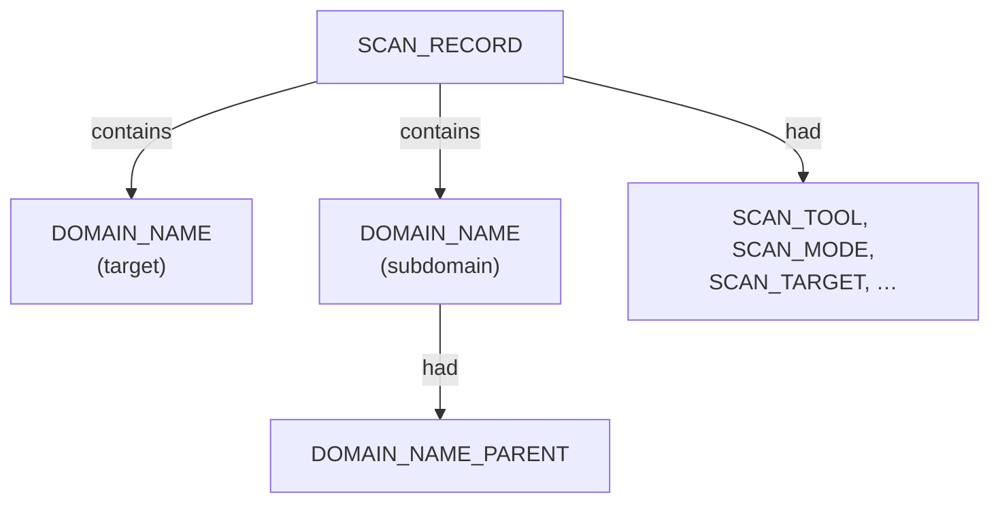
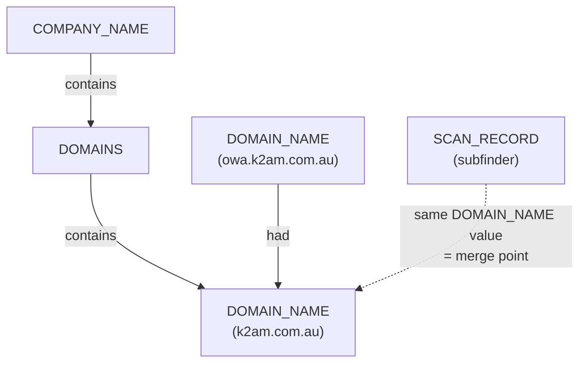
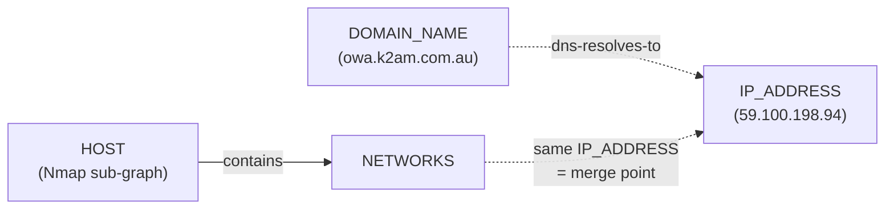

# Subfinder Sub-graph — Ontology Extension

Companion doc to `osint-domain-ontology-rules.md` (the `pius` sub-graph).
Same unified model, same vocabulary reuse discipline — `subfinder` is a
**narrower, DNS-focused sibling** of `pius`, the way Netdiscover is a
narrower sibling of Nmap in the host ontology: it knows subdomains and
(in active mode) IP resolution, and nothing about companies, WHOIS, or
legal identity. It plugs into the same graph rather than forking one.

---

## Alignment with the unified model

| Unified layer | pius sub-graph | subfinder sub-graph |
|---|---|---|
| **Scan head** | `SCAN_RECORD` + `SCAN_TOOL`, `SCAN_TARGET`, `SCAN_TARGET_ORG`, … | `SCAN_RECORD` + `SCAN_TOOL` *(reused)*, `SCAN_TARGET` *(reused)*, `SCAN_MODE` *(new)*, `SCAN_COMMAND`, `SCAN_START`, `SCAN_DURATION`, `SCAN_EXIT_CODE` *(all reused)* |
| **Endpoint (root)** | `COMPANY_NAME` | **`DOMAIN_NAME`** (the queried `target` itself) — subfinder has no org evidence, so it cannot justify a `COMPANY_NAME` node any more than an ARP-only scan can justify `HOST` |
| **Endpoint (provisional → qualified)** | `CANDIDATE_ENTITY` → `AFFILIATED_COMPANY_NAME`/`DOMAIN_NAME` via `resolves-to` | `DOMAIN_NAME` (passive-only, unconfirmed) → same `DOMAIN_NAME` node **enriched** with `IP_ADDRESS` via active resolution — a fact-promotion, not a type change (see Rule S5) |
| **Categories** | `AFFILIATES`, `DOMAINS`, `LEADS`, `PAGES` | none needed — subfinder's only structural relationship is domain-to-parent-domain, already handled flatly by Rule R3 |
| **Nested structural facts (`contains`)** | `COMPANY_NAME` → `AFFILIATED_COMPANY_NAME` → `DOMAIN_NAME` → `PAGE` | `DOMAIN_NAME` → `DOMAIN_NAME_PARENT` (reused, R3) |
| **Facts (`had`)** | `WIKIDATA_ID`, `LEI`, `CONFIDENCE_SCORE` | `DISCOVERY_SOURCE` (repeatable), `DISCOVERY_MODE`, `LIVENESS_STATUS` |
| **Cross-ontology bridge** | — | `DOMAIN_NAME` --[`dns-resolves-to`]--> `IP_ADDRESS` — the **same** `IP_ADDRESS` entity type used by the Nmap/Netdiscover host sub-graphs |
| **Correlation** | shared `wikidata_id` | shared exact-value `DOMAIN_NAME` merges with pius's tree; shared `IP_ADDRESS` merges with the host tree |

Two things fall directly out of matching this to the unified model rather
than treating subfinder as its own island:

1. **No `COMPANY_NAME` without composition.** Exactly like Netdiscover
   can't invent `MAC_VENDOR` without L2 evidence, subfinder's document
   never contains an `org` field at all — there is no legitimate way to
   attach a `COMPANY_NAME` from this data alone. The root of a
   standalone subfinder sub-graph is `DOMAIN_NAME(target)` itself. When
   composed with a `pius` scan of the same target, the two graphs merge
   automatically at that shared `DOMAIN_NAME` node — no reclassification
   step required, unlike `SYSTEM → HOST`.

2. **Active-mode `ip` resolution is the single most valuable field in
   this schema** — it's the literal cross-ontology bridge. `IP_ADDRESS`
   is not a new nugget; it's the *exact same* required L3 key the host
   ontology already uses for correlating `NETWORKS` under `HOST`/`SYSTEM`.
   A `DOMAIN_NAME` that resolves to an IP that a subsequent Nmap scan also
   reports means one connected graph spans company → domain → IP → host →
   port → service, not four disconnected tool outputs.

### Standalone head structure (no composition available)



### Composed with a pius scan of the same target



### The company-to-host bridge (active mode)



---

## Vocabulary additions

### Relations

| Relation | Direction | Meaning |
|---|---|---|
| `dns-resolves-to` | `DOMAIN_NAME` → `IP_ADDRESS` | Active-mode DNS resolution result — distinct from `resolves-to` (identity resolution), since this describes a current A-record fact, not "this uncertain thing turned out to be that entity" |

### Descriptors

| Descriptor | Applies to | Source field |
|---|---|---|
| `DISCOVERY_SOURCE` | `DOMAIN_NAME` | one `had` edge per element of `record.sources[]` — **repeatable**, not a single array-valued descriptor (see Rule S2) |
| `DISCOVERY_MODE` | `DOMAIN_NAME` | `record.mode` (`"passive"` / `"active"`) |
| `LIVENESS_STATUS` | `DOMAIN_NAME` | derived (Rule S5), not a direct field — `"confirmed"` / `"unconfirmed"` |
| `SCAN_MODE` | `SCAN_RECORD` | `document.enumeration_mode` — new addition to the shared scan-head descriptor family |

No new entity types are needed. `DOMAIN_NAME`, `DOMAIN_NAME_PARENT`, and
`IP_ADDRESS` are all reused as-is from the existing vocabulary.

---

## Rule S0 — Value normalization (reuse Rule R0 unchanged)

The same markdown-link wrapping seen in one pius/crt-sh record shows up
here too — five of the eighteen `host` values in the passive scan are
wrapped, e.g.:

```
"host": "[www.k2am.com.au](https://www.k2am.com.au)"
```

This confirms the bug isn't crt-sh-specific or pius-specific — it's
upstream of both tools (likely wherever these exhibits were rendered/
copied). **Reuse Rule R0 exactly as written in the pius doc**: extract
the hostname from the markdown URL, keep `raw_value` for audit, operate
on `candidate_value` from here on. No subfinder-specific variant needed.

---

## Rule S1 — `host` field becomes `DOMAIN_NAME`

Simpler than pius's Rule R1: subfinder only ever emits domains, so there
is no `AFFILIATED_COMPANY_NAME` branch to worry about — every `host`
value that reaches this rule has already passed through S0.

```
FOR EACH record in records[]:
   create/reuse DOMAIN_NAME(value = candidate_value)
   edge: SCAN_RECORD --[contains]--> DOMAIN_NAME
```

**Additionally, always ensure the root exists:**

```
create/reuse DOMAIN_NAME(value = document.target)
edge: SCAN_RECORD --[contains]--> DOMAIN_NAME(document.target)
```

This matters because **neither example document's `records[]` actually
contains the bare target domain** (`k2am.com.au` never appears as its own
host — only its subdomains do). Without this explicit step, the anchor
domain that everything else's parent-chain (Rule R3) eventually resolves
up to would never exist as a node in its own right.

`DOMAIN_NAME` dedup is exact-value, scoped globally across the whole
composed graph (this extends Rule R5's dedup principle — stated there
only for `COMPANY_NAME`/`AFFILIATED_COMPANY_NAME` — to `DOMAIN_NAME` as
well, which was previously left implicit).

---

## Rule S2 — Multi-source descriptor expansion

`sources` is an array — e.g. `"sources": ["crtsh", "hackertarget"]` — and
per the single-data-value principle every descriptor nugget holds one
value. **Do not** create one `DISCOVERY_SOURCE` nugget holding an array;
create one `had` edge per array element instead.

```
FOR EACH record in records[]:
   FOR EACH source in record.sources:
      edge: DOMAIN_NAME --[had]--> DISCOVERY_SOURCE(value = source)
```

**Example:** `owa.k2am.com.au` with `sources: ["crtsh", "hackertarget"]`
→ two separate `had` edges:
```
DOMAIN_NAME("owa.k2am.com.au") --[had]--> DISCOVERY_SOURCE("crtsh")
DOMAIN_NAME("owa.k2am.com.au") --[had]--> DISCOVERY_SOURCE("hackertarget")
```

This is a general principle worth carrying forward to future tools, not
just subfinder: **any array-shaped field mapping to a repeatable
single-valued fact type gets expanded into multiple descriptor edges of
that type, never flattened into one array-valued nugget.**

---

## Rule S3 — Discovery-mode attachment

```
FOR EACH record in records[]:
   edge: DOMAIN_NAME --[had]--> DISCOVERY_MODE(value = record.mode)

SCAN_RECORD --[had]--> SCAN_MODE(value = document.enumeration_mode)
```

Both the per-record and the scan-head version are captured: the
scan-head one gives a fast single lookup for "what kind of run was this"
(matching the shared "Scan head" layer's role in the unified model), the
per-record one stays accurate if a future subfinder invocation ever mixes
modes within one output (not observed in either example here, where mode
is uniform across all records in a given document, but not guaranteed by
the schema).

---

## Rule S4 — DNS resolution bridge (`ip` field, active mode only)

**This is the important one.** When `record.ip` is present:

```
IF record.ip exists
THEN
   ensure IP_ADDRESS(value = record.ip) exists
        (this is the SAME entity type the Nmap/Netdiscover host
         sub-graphs use under NETWORKS — not a new descriptor type)
   edge: DOMAIN_NAME --[dns-resolves-to]--> IP_ADDRESS
```

**Example — from the active-mode K2AM scan:**
```
DOMAIN_NAME("owa.k2am.com.au")   --[dns-resolves-to]--> IP_ADDRESS("59.100.198.94")
DOMAIN_NAME("smtp2.k2am.com.au") --[dns-resolves-to]--> IP_ADDRESS("59.100.198.94")
```

**Immediately worth flagging:** two pairs of hosts in this dataset
resolve to the *same* IP — `owa`/`smtp2` both to `59.100.198.94`, and
`mail`/`smtp1` both to `58.171.162.96`. `ksm`/`kii` both resolve to
`172.64.153.235`, which falls in a **Cloudflare-owned range**. Once two
or more `DOMAIN_NAME` nodes converge on one `IP_ADDRESS`, that's exactly
the trigger condition for **Rulesets A/B/C** from the earlier
network-scan correlation document
(`07_Scan_Record_Host_Correlation_Rulesets.md`) — specifically Ruleset C,
which exists precisely to catch "these aren't the same physical host,
that's a CDN/shared-hosting IP" before drawing a same-host conclusion.
This subfinder rule doesn't re-derive that logic — it just needs to
**hand off to it** whenever `dns-resolves-to` produces a shared
`IP_ADDRESS` fan-in.

```
IF two or more DOMAIN_NAME nodes share the same dns-resolves-to target
THEN flag IP_ADDRESS for Ruleset C (CDN/fronting) evaluation before any
     downstream process assumes "same host"
```

---

## Rule S5 — Passive/active liveness correlation

**New — enabled by having both example documents for the same target.**
The passive scan found 18 hosts; the active scan found 8, and **all 8 are
a subset of the 18** (`ksm`, `kii`, `owa`, `link`, `smtp1`, `smtp2`, `www`,
`mail`). Ten passive-only findings — `apps`, `cpcontacts`, `webmail`,
`cpanel`, `cpcalendars`, `webdisk`, `www.apps`, `www.owa`, `www.ksm`,
`www.kii` — never got an active-mode confirmation at all.

```
IF a DOMAIN_NAME appears in both a passive-mode SCAN_RECORD and an
   active-mode SCAN_RECORD for the same target (or carries a
   dns-resolves-to edge from any active run)
THEN tag it LIVENESS_STATUS = "confirmed"

ELSE IF a DOMAIN_NAME appears only in a passive-mode SCAN_RECORD
THEN tag it LIVENESS_STATUS = "unconfirmed"
     — NOT "dead" or "inactive". Certificate-transparency and other
       passive sources record domains that once existed; absence from
       one active run doesn't prove non-resolution, only that this
       particular run didn't confirm it (rate limiting, transient DNS
       issues, or a genuinely stale cert entry are all equally possible
       explanations, and this rule doesn't have enough information to
       distinguish between them).
```

This is the same epistemic-honesty pattern as pius's Rule R10
(wildcard-suppressed subdomains aren't "confirmed absent," just
"not enumerated here") — absence of confirming evidence is not evidence
of absence, and the descriptor name should say so rather than implying a
stronger claim than the data supports.

---

## Rule S6 — Domain-parent hierarchy (reuse Rule R3 unchanged)

No changes needed — this data is a clean worked example of Rule R3
producing a multi-level chain:

```
DOMAIN_NAME("www.owa.k2am.com.au") --[had]--> DOMAIN_NAME_PARENT("owa.k2am.com.au")
DOMAIN_NAME("owa.k2am.com.au")     --[had]--> DOMAIN_NAME_PARENT("k2am.com.au")
```

Both `www.owa.k2am.com.au` and `owa.k2am.com.au` are independently present
as their own records in the passive scan (not merged), so this chain
forms naturally from two real nodes rather than needing to be inferred.

---

## Conclusions drawn from this specific dataset

- **Subfinder's value is breadth of passive sources, not depth per
  finding.** Each record carries almost no metadata beyond which
  passive-recon sources saw it — the real payoff only shows up when
  composed with something else (pius for company context, active mode or
  Nmap for liveness/host depth).
- **The passive/active gap is itself a finding.** Ten of eighteen
  subdomains found via certificate transparency never resolved in the
  active run. For a security-relevant use of this data, that gap is
  worth surfacing directly rather than only keeping the smaller
  "confirmed" list — a stale-but-still-issued certificate for
  `cpanel.k2am.com.au` or `webdisk.k2am.com.au` is exactly the kind of
  forgotten/decommissioned-but-not-revoked asset an attack-surface review
  cares about.
- **The IP overlaps are worth a second look, not an assumption.**
  `172.64.153.235` (Cloudflare range) hosting both `ksm` and `kii`, and
  two more same-IP pairs on what look like non-Cloudflare IPs, are
  exactly the fan-in pattern Ruleset C exists to disambiguate — this
  dataset shouldn't be read as "3 pairs of duplicate hosts" without
  running that check first.

---

## Full Field Reference

### DOMAIN_NAME (subfinder-contributed fields)

| Field | Type | Source |
|---|---|---|
| `value` | string | `candidate_value` (post S0/R0 normalization) |
| `raw_value` | string | `record.host` unmodified, audit trail |
| `liveness_status` | enum(confirmed, unconfirmed) or null | S5 |

### Edge: DOMAIN_NAME --[had]--> DISCOVERY_SOURCE

| Field | Type | Source |
|---|---|---|
| `value` | string | one element of `record.sources[]` (S2) |

### Edge: DOMAIN_NAME --[had]--> DISCOVERY_MODE

| Field | Type | Source |
|---|---|---|
| `value` | enum(passive, active) | `record.mode` (S3) |

### Edge: DOMAIN_NAME --[dns-resolves-to]--> IP_ADDRESS

| Field | Type | Source |
|---|---|---|
| `resolved_at` | datetime | `document.started_at` (the scan run that produced this resolution) |
| `flagged_for_cdn_review` | bool | S4, true when the target `IP_ADDRESS` has fan-in from 2+ `DOMAIN_NAME` nodes |

### SCAN_RECORD (subfinder-contributed descriptor)

| Field | Type | Source |
|---|---|---|
| `scan_mode` | enum(passive, active) | `document.enumeration_mode` (S3) |

---

## Validation log — datasets tested against this ruleset

| Dataset | Records | Gap found | Fix |
|---|---|---|---|
| K2AM passive (`corporate_k2am_passive_cs`) | 18 | 5 `host` values wrapped in markdown link syntax, same bug seen in the pius Square Peg dataset | confirmed Rule R0 generalizes unchanged; no subfinder-specific variant needed |
| K2AM passive (same) | — | `sources` is an array; a naive parser would create one array-valued descriptor, violating the single-data-value principle | new Rule S2 (repeatable single-valued `DISCOVERY_SOURCE` edges) |
| K2AM passive (same) | — | no `org` field anywhere in the schema — a rule ported directly from pius would try to create a `COMPANY_NAME` from a field that doesn't exist | subfinder's root entity is `DOMAIN_NAME(target)`, not `COMPANY_NAME`; composition with pius merges the two graphs at the shared `DOMAIN_NAME` node instead |
| K2AM active (`corporate_k2am_active_oI`) | 8 | `ip` field is a direct bridge to the existing host-ontology `IP_ADDRESS` entity, easy to miss if treated as "just another descriptor" | new Rule S4, explicitly reusing `IP_ADDRESS` and introducing the `dns-resolves-to` relation |
| K2AM active (same) | — | 3 IP addresses each shared by 2 domains, one in a known Cloudflare range — risk of assuming "same host" without re-checking | S4 explicitly hands off to Ruleset C (CDN/fronting) from the earlier network-scan correlation doc rather than re-deriving that logic here |
| K2AM passive + active (compared together) | 18 + 8 | 10 of 18 passively-found subdomains never got an active confirmation; no existing rule captured this as a fact rather than a silent gap | new Rule S5 (`LIVENESS_STATUS`, "confirmed" / "unconfirmed" — never "dead") |

This table follows the same format as the pius validation log — add a
row here, not a silent patch, whenever a new subfinder dataset surfaces
something this ruleset doesn't yet handle.