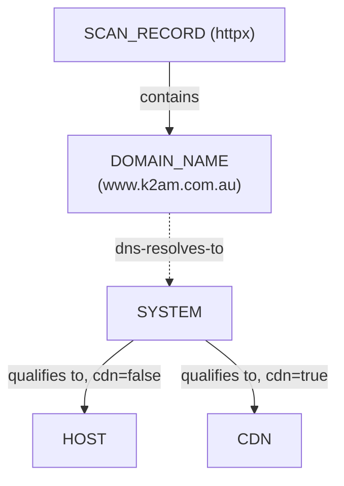
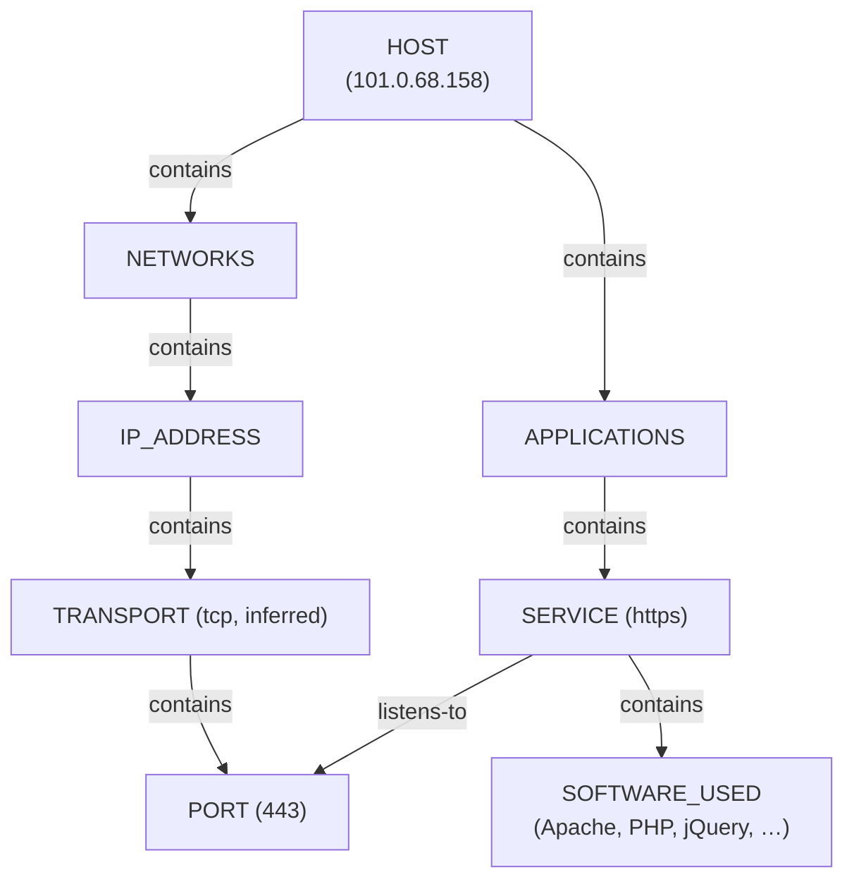
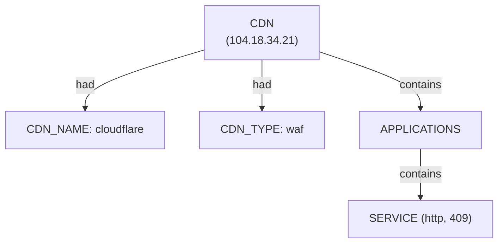

# Httpx Sub-graph — Ontology Extension
 
Companion doc to `osint-domain-ontology-rules.md` (pius) and
`subfinder-ontology-rules.md`. Httpx is a **live-web-probe** sibling: it
takes a host list (typically subfinder's output) and reports which ones
actually answer HTTP(S), with what server, and what's running on them.
Like the other sub-graphs, it forks nothing — it fills in the `HOST` /
`CDN` qualification the existing lattice already defines, and reuses
`IP_ADDRESS`, `NETWORKS`, `APPLICATIONS`, `TRANSPORT`, `PORT`, and
`listens-to` from the Nmap sub-graph directly.
 
**Critical framing for this data: httpx's JSONL output is a live-only
list.** A host that doesn't respond is simply absent from `records[]` —
there is no "dead" record emitted. This dataset's `host_input_count: 18`
against only 4 records in `records[]` means 14 of the hosts subfinder
found were probed and got no confirmed live answer, not that 4 hosts
exist and the other 14 don't.
 
---
 
## Alignment with the unified model
 
| Unified layer | subfinder sub-graph | httpx sub-graph |
|---|---|---|
| **Scan head** | `SCAN_RECORD` + `SCAN_MODE`, `SCAN_TARGET`, … | `SCAN_RECORD` + `SCAN_PROBE_PROFILE` *(new)*, `SCAN_HOST_INPUT_COUNT` *(new)*, `SCAN_TARGET` *(reused)* |
| **Endpoint (root)** | `DOMAIN_NAME(target)` (no company evidence) | `SYSTEM`, qualified per-record to **`HOST`** or **`CDN`** — the exact same lattice from the host ontology, reused directly rather than re-derived |
| **Endpoint qualification evidence** | n/a | `record.cdn == true` → `CDN`; otherwise → `HOST` (see Rule H1). `DEVICE`/`MOBILE` are part of the same lattice but httpx's probe profile has no signal that would ever justify them |
| **Categories** | none needed | `NETWORKS` *(reused)*, `APPLICATIONS` *(reused)* |
| **Nested structural facts (`contains`)** | `DOMAIN_NAME` → `DOMAIN_NAME_PARENT` | `SYSTEM` → `NETWORKS` → `IP_ADDRESS` → `TRANSPORT` → `PORT`; `SYSTEM` → `APPLICATIONS` → `SERVICE` → `SOFTWARE_USED` *(all reused/extended from Nmap)* |
| **Facts (`had`)** | `DISCOVERY_SOURCE`, `LIVENESS_STATUS` | `CDN_NAME`, `CDN_TYPE`, `PORT_STATE` *(derived, not observed)*, HTTP response facts on `SERVICE` |
| **Cross-ontology bridge** | `DOMAIN_NAME` --`dns-resolves-to`--> `IP_ADDRESS` | same relation, reused directly for the `a` record array; **also** the literal key that ties a `DOMAIN_NAME` to the `SYSTEM`/`HOST`/`CDN` this doc builds |
| **Cross-tool provenance** | — | new `derived-from` relation: this `SCAN_RECORD` → the subfinder `SCAN_RECORD` that supplied its host list (`document.subfinder_scenario`) |
 
### Head structure: a domain qualifying into HOST vs CDN
 

 
### HOST case: full Nmap-style depth is available
 

 
### CDN case: deliberately sparse
 

 
`CDN` nodes get the same structural shape as `HOST` — they're still a
qualified `SYSTEM`, still get `NETWORKS`/`APPLICATIONS` — but the content
underneath is thin by nature: you're looking at an edge node, not an
origin, so there's usually one generic-looking `SERVICE` response and
little else, exactly the pattern flagged back in the original
CDN/fronting rulesets (Ruleset C).
 
---
 
## Vocabulary additions
 
### Entities
 
| Entity | Type | Notes |
|---|---|---|
| `SOFTWARE_USED` | SUBENTITY | One per element of `record.tech[]`, `contains`-linked from `SERVICE` — same subentity pattern as Nmap's SSH host-key nodes |
 
### Descriptors
 
| Descriptor | Applies to | Source field |
|---|---|---|
| `CDN_NAME` | `CDN` | `record.cdn_name` |
| `CDN_TYPE` | `CDN` | `record.cdn_type` |
| `PORT_STATE` | `PORT` | derived `"open"` — see Rule H2, never directly observed the way Nmap's SYN-ACK is |
| `TRANSPORT_PROTOCOL` | `TRANSPORT` | inferred `"tcp"` — httpx never states this; HTTP(S) always rides TCP |
| `HTTP_STATUS_CODE`, `HTTP_TITLE`, `CONTENT_TYPE`, `CONTENT_LENGTH`, `HTTP_METHOD`, `HTTP_PATH`, `RESPONSE_TIME_MS`, `WORD_COUNT`, `LINE_COUNT`, `PROBE_FAILED`, `PAGE_TYPE`, `PAGE_HASH`, `PROBE_TIMESTAMP` | `SERVICE` | `status_code`, `title`, `content_type`, `content_length`, `method`, `path`, `time`, `words`, `lines`, `failed`, `knowledgebase.PageType`, `knowledgebase.pHash`, `timestamp` |
| `SOFTWARE_VERSION` | `SOFTWARE_USED` | parsed from a `name:version`-shaped tech string (e.g. `"Chart.js:2.4.0"`) — omitted when the string carries no version |
| `IS_ERROR_PAGE` | `SERVICE` | derived `true` when `PAGE_TYPE == "error"` — surfaced separately since it's the flag behind this dataset's most interesting finding (see Conclusions) |
| `CNAME_TARGET` *(via relation, not a plain descriptor — see below)* | — | `record.cname[]` |
| `HTTP_LIVENESS_STATUS` | `DOMAIN_NAME` | derived (Rule H7) — `"confirmed"` / `"unconfirmed"`, layered alongside subfinder's `LIVENESS_STATUS` rather than overwriting it |
| `SCAN_PROBE_PROFILE` | `SCAN_RECORD` | `document.probe_profile` |
| `SCAN_HOST_INPUT_COUNT` | `SCAN_RECORD` | `document.host_input_count` |
 
### Relations
 
| Relation | Direction | Meaning |
|---|---|---|
| `dns-resolves-to` | `DOMAIN_NAME` → `IP_ADDRESS` | **Reused from subfinder**, extended here to cover every element of `record.a[]`, not just a single resolved IP |
| `cname-alias-to` | `DOMAIN_NAME` → `DOMAIN_NAME` | **New.** `record.cname[]` — this name is a DNS alias for that name, which is frequently a *different organization's* domain entirely (see Rule H5) |
| `derived-from` | `SCAN_RECORD` → `SCAN_RECORD` | **New.** Pipeline provenance — this scan's host list came from that earlier scan, keyed by `document.subfinder_scenario` matching the upstream scan's `scenario_id` |
 
---
 
## Rule H0 — Value normalization (reuse Rule R0, no changes needed)
 
No markdown-link-wrapped values observed in this dataset's `host` /
`input` / `url` fields, but the same normalization applies if they ever
appear — reuse Rule R0 unchanged, same as subfinder does.
 
---
 
## Rule H1 — System qualification: HOST vs CDN
 
```
IF record.cdn == true
THEN
   qualify SYSTEM as CDN(keyed by IP_ADDRESS(record.host))
   attach CDN --[had]--> CDN_NAME(record.cdn_name)
   attach CDN --[had]--> CDN_TYPE(record.cdn_type)
ELSE
   qualify SYSTEM as HOST(keyed by IP_ADDRESS(record.host))
```
 
This reuses the **existing** `SYSTEM → {HOST, DEVICE, MOBILE, CDN}`
lattice from the unified ontology exactly as defined — nothing new is
introduced at the type level, only the evidence rule for *which* branch
httpx's data justifies. `DEVICE` and `MOBILE` remain valid lattice
members but are unreachable from httpx's probe profile (no IoT
fingerprinting, no user-agent/device-class detection here) — don't force
a classification the data doesn't support.
 
**Dedup note:** qualification keys on `IP_ADDRESS`, not on the queried
hostname. `ksm.k2am.com.au` and `kii.k2am.com.au` both have `host:
"104.18.34.21"` — **one** `CDN` node, not two, with both `DOMAIN_NAME`
entities pointing at it (Rule H6).
 
**Example:**
- `ksm.k2am.com.au`: `cdn: true`, `cdn_name: "cloudflare"`, `cdn_type:
  "waf"`, `host: "104.18.34.21"` → `CDN(104.18.34.21)` with
  `CDN_NAME="cloudflare"`, `CDN_TYPE="waf"`
- `www.k2am.com.au`: no `cdn`/`cdn_name`/`cdn_type` fields at all →
  `HOST(101.0.68.158)`
---
 
## Rule H2 — Network chain (`NETWORKS` → `IP_ADDRESS` → `TRANSPORT` → `PORT`)
 
Reuses the Nmap sub-graph's structure directly, with two things httpx
never states outright and must be flagged as inferred rather than
observed:
 
```
SYSTEM --[contains]--> NETWORKS --[contains]--> IP_ADDRESS(record.host)
  --[contains]--> TRANSPORT(protocol = "tcp")   — INFERRED, not stated by httpx;
                                                   HTTP(S) always rides TCP
  --[contains]--> PORT(record.port)
  --[had]--> PORT_STATE("open")                 — DERIVED, not directly observed
```
 
**Why "derived" matters here specifically:** Nmap determines `open` from
a raw SYN-ACK at the transport layer — a fact about the port itself.
Httpx never does that; it only knows a *complete application-layer HTTP
transaction* succeeded. That's still solid evidence the port is open
(nothing completes a GET without an open TCP port underneath it), but
it's evidence of a different kind — a completed conversation, not a
directly observed handshake — and the provenance is worth keeping
distinguishable rather than silently presenting it with the same
confidence as an Nmap-observed `PORT_STATE`.
 
---
 
## Rule H3 — Application chain (`APPLICATIONS` → `SERVICE` → HTTP facts)
 
```
SYSTEM --[contains]--> APPLICATIONS --[contains]--> SERVICE(name = record.scheme)
SERVICE --[listens-to]--> PORT(record.port)          — same relation Nmap uses
SERVICE --[had]--> HTTP_STATUS_CODE(record.status_code)
SERVICE --[had]--> HTTP_TITLE(record.title)                    if present
SERVICE --[had]--> CONTENT_TYPE(record.content_type)
SERVICE --[had]--> CONTENT_LENGTH(record.content_length)
SERVICE --[had]--> HTTP_METHOD(record.method)
SERVICE --[had]--> HTTP_PATH(record.path)
SERVICE --[had]--> RESPONSE_TIME_MS(record.time)
SERVICE --[had]--> WORD_COUNT(record.words)
SERVICE --[had]--> LINE_COUNT(record.lines)
SERVICE --[had]--> PROBE_FAILED(record.failed)
SERVICE --[had]--> PAGE_TYPE(record.knowledgebase.PageType)
SERVICE --[had]--> PAGE_HASH(record.knowledgebase.pHash)
SERVICE --[had]--> PROBE_TIMESTAMP(record.timestamp)
SERVICE --[had]--> IS_ERROR_PAGE(true)               if PAGE_TYPE == "error"
IF record.webserver exists
THEN SERVICE --[had]--> SOFTWARE_USED(record.webserver)   — same nugget type
     as Rule H4, since a webserver banner is itself a piece of software
```
 
**Extensibility note:** every record here probes only `path: "/"`, so
attaching HTTP facts flatly on `SERVICE` is safe. If a future httpx run
probes multiple paths under one host, that flat model breaks — different
paths would collide on one `SERVICE` node. At that point, reuse pius's
`PAGE` entity (`SERVICE --[contains]--> PAGE`, one per distinct path) and
move the path-specific facts there instead. Not needed for this dataset,
worth pre-empting for the next one.
 
---
 
## Rule H4 — `SOFTWARE_USED` expansion from `tech[]`
 
Same array-expansion principle as subfinder's Rule S2 — one nugget per
array element, never one array-valued nugget — applied here to a
`contains` edge instead of a `had` edge, since `SOFTWARE_USED` is
positioned as a subentity (it can itself carry a version), not a bare
fact.
 
```
FOR EACH entry in record.tech[]:
   IF entry matches "name:version" shape (e.g. "Chart.js:2.4.0")
   THEN create SOFTWARE_USED(name = "Chart.js") --[had]--> SOFTWARE_VERSION("2.4.0")
   ELSE create SOFTWARE_USED(name = entry)   — no version descriptor
   edge: SERVICE --[contains]--> SOFTWARE_USED
```
 
**Example — `www.k2am.com.au`**, `tech: ["Apache HTTP Server",
"Bootstrap", "Chart.js:2.4.0", "Cloudflare", "D3", "Google Hosted
Libraries", "Modernizr", "PHP", "Slick", "cdnjs", "jQuery"]` → eleven
`SOFTWARE_USED` nodes, ten with no version, one (`Chart.js`) with
`SOFTWARE_VERSION = "2.4.0"`.
 
**Worth noting, not necessarily acting on:** `"Cloudflare"` and
`"cdnjs"` both appear in this record's `tech[]` even though
`record.cdn` is absent/false for this host — httpx's tech-fingerprinting
picked up Cloudflare-hosted static assets (likely served via `cdnjs`)
without the site itself being Cloudflare-fronted. Don't let a
`SOFTWARE_USED("Cloudflare")` node be mistaken for `record.cdn == true`
qualification evidence — they're different signals from different parts
of the tool, and Rule H1 only looks at the `cdn` boolean, correctly.
 
---
 
## Rule H5 — CNAME alias chains and third-party dependency discovery
 
`record.cname[]` is a different DNS record type from `record.a[]` — an
alias, not an address — and frequently points at **infrastructure
belonging to an entirely different organization**. This dataset is a
clean example: `link.k2am.com.au` is CNAME'd to `track.smtp2go.net` (a
transactional-email SaaS platform, confirmed by the page title
`"SMTP2GO"`), and both `ksm`/`kii.k2am.com.au` are CNAME'd to
`unbouncepages.com` (a landing-page builder).
 
```
FOR EACH entry in record.cname[]:
   create/reuse DOMAIN_NAME(value = entry)   — even though this domain
        belongs to a different org's namespace, it's still a DOMAIN_NAME
        node structurally; no IP/HOST/CDN is created for it from this
        data alone since httpx gives no resolution info for the alias
        target itself
   edge: DOMAIN_NAME(record.input) --[cname-alias-to]--> DOMAIN_NAME(entry)
```
 
This is a genuinely useful third-party-dependency discovery mechanism on
its own, independent of the CDN-detection path — a CNAME to another
org's domain is a supply-chain fact worth surfacing even when
`record.cdn` is false (as it is for `link.k2am.com.au`; SMTP2GO isn't in
httpx's CDN-provider list, but the dependency relationship is just as
real).
 
---
 
## Rule H6 — Full `dns-resolves-to` expansion from `a[]`, with probe-connection flag
 
Subfinder's active mode only ever gave one resolved IP per host. Httpx
gives the **full A-record set**, which can be more than one — itself
sometimes a CDN/anycast signal in its own right (Ruleset C3 from the
earlier network-scan correlation doc).
 
```
FOR EACH ip in record.a[]:
   ensure IP_ADDRESS(value = ip) exists
   edge: DOMAIN_NAME(record.input) --[dns-resolves-to]--> IP_ADDRESS(ip)
   IF ip == record.host
   THEN tag that edge with PROBE_CONNECTED = true
        — this is the specific address httpx actually completed its
          HTTP transaction against, out of potentially several resolved
```
 
**Example — `ksm.k2am.com.au`**, `a: ["104.18.34.21", "172.64.153.235"]`,
`host: "104.18.34.21"`:
```
DOMAIN_NAME("ksm.k2am.com.au") --[dns-resolves-to, PROBE_CONNECTED=true]--> IP_ADDRESS("104.18.34.21")
DOMAIN_NAME("ksm.k2am.com.au") --[dns-resolves-to, PROBE_CONNECTED=false]--> IP_ADDRESS("172.64.153.235")
```
 
---
 
## Rule H7 — HTTP-layer liveness, layered on top of subfinder's DNS-layer liveness, plus scan provenance
 
```
this.SCAN_RECORD --[derived-from]--> upstream.SCAN_RECORD
   where upstream.scenario_id == this.document.subfinder_scenario
 
FOR EACH DOMAIN_NAME in the upstream subfinder scan's full host list:
   IF that DOMAIN_NAME has a corresponding record in this httpx scan's records[]
   THEN tag it HTTP_LIVENESS_STATUS = "confirmed"
   ELSE tag it HTTP_LIVENESS_STATUS = "unconfirmed"
        — NOT "dead". httpx's silent live-only output gives no reason
          for absence (closed port, firewall, rate limiting, and a
          genuinely offline host are all consistent with the same
          missing record), same epistemic caveat as subfinder's Rule S5
```
 
`HTTP_LIVENESS_STATUS` and subfinder's `LIVENESS_STATUS` (DNS-layer) are
deliberately kept as **separate, layered** descriptors on the same
`DOMAIN_NAME` — a domain can resolve fine in DNS but have nothing
listening on 80/443, or vice versa in unusual setups, and collapsing
both into one field would lose that distinction.
 
**Example — from this dataset:** `host_input_count: 18`, matching the
subfinder passive scan's 18 hosts. Only 4 got `HTTP_LIVENESS_STATUS =
"confirmed"` (`ksm`, `kii`, `www`, `link`). The other 14 — including
`cpanel.k2am.com.au`, `webdisk.k2am.com.au`, `webmail.k2am.com.au` and
seven more — get `"unconfirmed"`.
 
---
 
## Conclusions drawn from this specific dataset
 
- **`ksm`/`kii.k2am.com.au` look like an unclaimed third-party landing
  page, not live K2AM infrastructure.** Both are Cloudflare-fronted
  (`cdn: true`), both CNAME to `unbouncepages.com`, both return HTTP 409
  with a 16-byte body and `PageType: "error"`. A 409 on an Unbounce
  domain typically means the CNAME points at Unbounce's shared
  infrastructure but the landing page itself was never published or was
  later removed — a **classic dangling-CNAME pattern**, one step short of
  a subdomain-takeover opportunity if `unbouncepages.com` (or whatever
  it currently routes to) ever allows a third party to claim that slug.
  Worth flagging for follow-up regardless of severity classification —
  this ruleset surfaces it via `IS_ERROR_PAGE` + `cname-alias-to`, it
  doesn't attempt to score the risk itself.
- **`link.k2am.com.au` is real, live, and not K2AM's own stack.** CNAME
  to `track.smtp2go.net`, title `"SMTP2GO"` — this is K2AM's outbound
  email/marketing platform, not internal infrastructure. Confirms a
  known third-party SaaS dependency rather than representing new
  attack surface on K2AM's own systems.
- **`www.k2am.com.au` is the only record here that looks like K2AM's own
  origin** — real Apache server, real page title and content, a rich and
  plausible tech stack (PHP, jQuery, Bootstrap, Chart.js, D3). This is
  the one host worth treating as "K2AM's actual web server" for any
  further depth (e.g. handing its `IP_ADDRESS` to an Nmap scan).
- **14 of 18 subfinder-discovered hosts got no HTTP confirmation at
  all.** Some of these (`cpanel`, `webdisk`, `cpcalendars`,
  `cpcontacts`) are cPanel-suite subdomains — commonly present but
  intentionally not exposed on 80/443 (cPanel typically listens on
  distinct high ports), so "unconfirmed" here is the expected, benign
  outcome for that group specifically — worth noting as a plausible
  explanation without overriding the honest "unconfirmed" status with a
  specific reason this ruleset can't actually verify.
---
 
## Full Field Reference
 
### CDN (qualified SYSTEM)
 
| Field | Type | Source |
|---|---|---|
| `ip_address_key` | string | `record.host` (R1 dedup key) |
| `cdn_name` | string | `record.cdn_name` |
| `cdn_type` | string | `record.cdn_type` |
 
### HOST (qualified SYSTEM) — httpx-contributed fields
 
| Field | Type | Source |
|---|---|---|
| `ip_address_key` | string | `record.host` (R1 dedup key) |
 
*(`HOST_STATUS` / `HOST_STATUS_REASON` from the Nmap sub-graph are not
populated by httpx — see Rule H2's derivation note.)*
 
### SERVICE (httpx-contributed fields)
 
| Field | Type | Source |
|---|---|---|
| `name` | string | `record.scheme` |
| `http_status_code` | int | `record.status_code` |
| `http_title` | string or null | `record.title` |
| `content_type` | string | `record.content_type` |
| `content_length` | int | `record.content_length` |
| `http_method` | string | `record.method` |
| `http_path` | string | `record.path` |
| `response_time_ms` | float | parsed from `record.time` |
| `word_count` | int | `record.words` |
| `line_count` | int | `record.lines` |
| `probe_failed` | bool | `record.failed` |
| `page_type` | string | `record.knowledgebase.PageType` |
| `page_hash` | int | `record.knowledgebase.pHash` |
| `probe_timestamp` | datetime | `record.timestamp` |
| `is_error_page` | bool | derived, `page_type == "error"` |
 
### SOFTWARE_USED
 
| Field | Type | Source |
|---|---|---|
| `name` | string | one element of `record.tech[]` (or `record.webserver`), version-prefix stripped if present |
| `version` | string or null | parsed from `name:version` shape |
 
### Edge: DOMAIN_NAME --[dns-resolves-to]--> IP_ADDRESS
 
| Field | Type | Source |
|---|---|---|
| `probe_connected` | bool | true when this IP == `record.host` (H6) |
 
### Edge: DOMAIN_NAME --[cname-alias-to]--> DOMAIN_NAME
 
| Field | Type | Source |
|---|---|---|
| *(no additional fields — the edge itself is the fact)* | | `record.cname[]` |
 
### Edge: SCAN_RECORD --[derived-from]--> SCAN_RECORD
 
| Field | Type | Source |
|---|---|---|
| `upstream_scenario_id` | string | `document.subfinder_scenario` |
 
### SCAN_RECORD (httpx-contributed descriptors)
 
| Field | Type | Source |
|---|---|---|
| `scan_probe_profile` | string | `document.probe_profile` |
| `scan_host_input_count` | int | `document.host_input_count` |
 
### DOMAIN_NAME (httpx-contributed field)
 
| Field | Type | Source |
|---|---|---|
| `http_liveness_status` | enum(confirmed, unconfirmed) | H7 — layered alongside subfinder's `liveness_status`, not merged with it |
 
---
 
## Validation log — datasets tested against this ruleset
 
| Dataset | Records | Gap found | Fix |
|---|---|---|---|
| K2AM httpx from subfinder-passive (`from_subfinder_k2am_passive`) | 4 (of 18 input) | httpx's live-only output has no explicit "not found" signal — absence from `records[]` needed to be cross-referenced against `host_input_count` and the upstream subfinder scan to mean anything | new Rule H7 (`HTTP_LIVENESS_STATUS`, layered on subfinder's DNS-layer liveness), new `derived-from` scan-provenance relation |
| K2AM httpx (same) | — | `cdn: true` records (`ksm`, `kii`) share one `host` IP but would create duplicate `CDN` nodes if keyed by hostname instead of IP | Rule H1 dedup explicitly keyed on `IP_ADDRESS`, not the queried domain |
| K2AM httpx (same) | — | `record.a[]` can list more than one IP, distinct from the single `host` actually connected to — collapsing them would lose which address was probed vs merely resolved | Rule H6 (`dns-resolves-to` per `a[]` entry + `PROBE_CONNECTED` flag), extending subfinder's single-IP version of the same relation |
| K2AM httpx (same) | — | `cname[]` targets are frequently a different organization's own domain (`unbouncepages.com`, `track.smtp2go.net`) — no existing rule captured third-party infrastructure dependencies discovered via CNAME | new Rule H5 (`cname-alias-to` relation) |
| K2AM httpx (same) | — | `tech[]` array needed the same repeatable-nugget treatment as subfinder's `sources[]`, plus version-string parsing not previously needed | Rule H4, reusing the array-expansion principle, adding `SOFTWARE_VERSION` split |
| K2AM httpx (same) | — | httpx never states TCP explicitly and infers port-open status from a completed HTTP transaction rather than a raw SYN-ACK — treating this identically to Nmap's directly-observed `PORT_STATE` would overstate the evidence | Rule H2, `TRANSPORT_PROTOCOL` marked inferred, `PORT_STATE` marked derived |
 
This table follows the same format as the pius and subfinder validation logs.