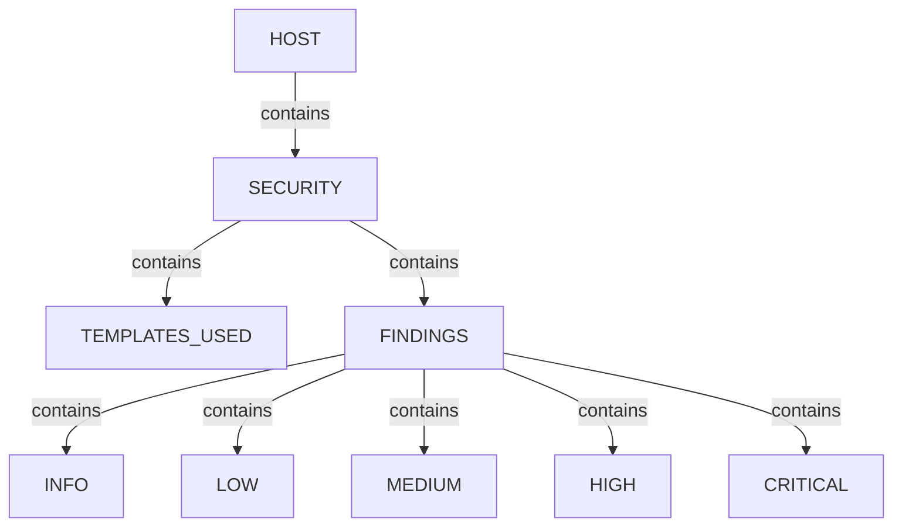
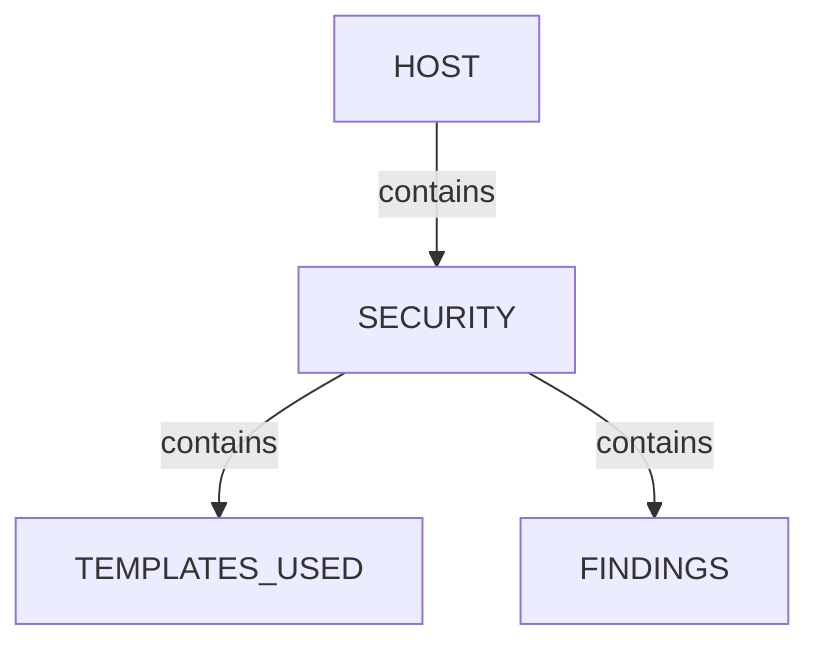
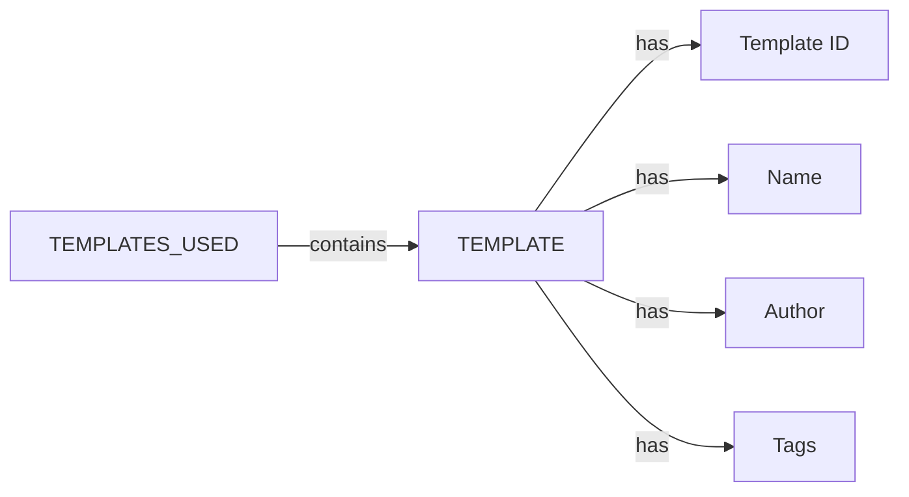
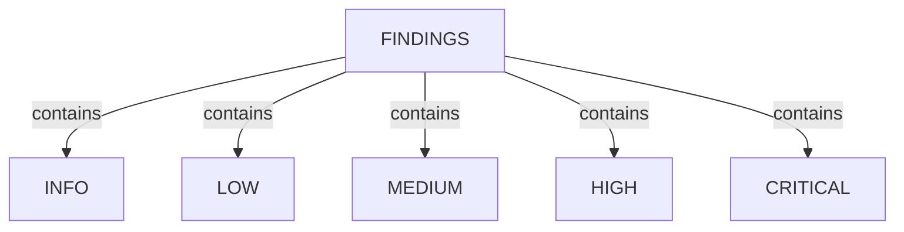
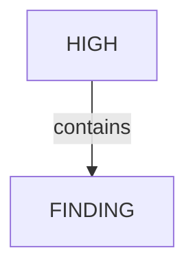
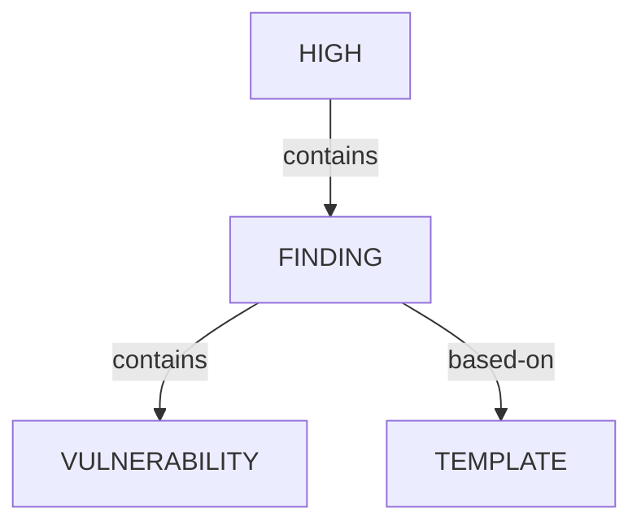
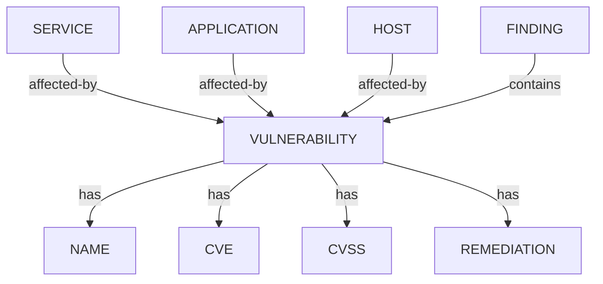
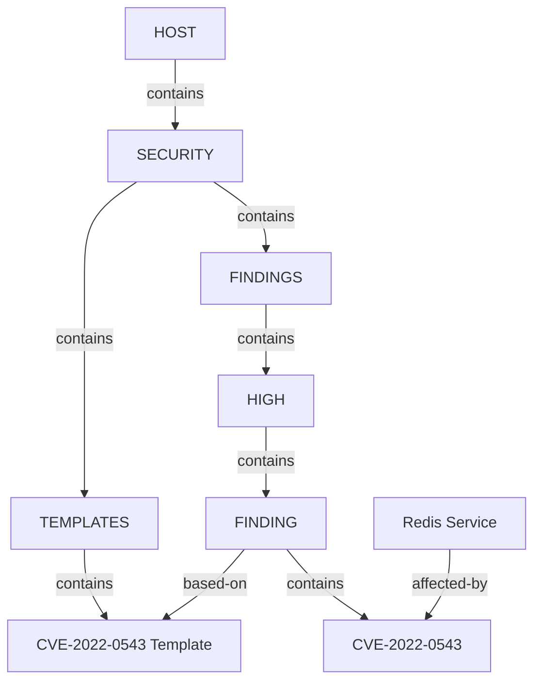

# Nuclei Ontology
**Version:** 1.0  
**Status:** Draft  
**Compatible With:** SpiderFeet Scan Graph Ontology

---

## Purpose

This ontology defines the graph representation of security knowledge produced by ProjectDiscovery Nuclei.

It describes **what knowledge exists** in the graph, independent of how the JSON is parsed. A separate parser specification defines the transformation process.

The ontology follows the same design principles as the existing SpiderFeet Network Ontology.

---

## Design Principles

| Rule | Description |
|------|-------------|
| Atomic Values | Every node contains exactly one atomic value. |
| Node Types | Only two node types exist: Entity and Descriptor. |
| Entity Relationships | Only entities participate in graph relationships. |
| Descriptors | Descriptors are attached to entities using **has** relationships. |
| Canonical Knowledge | Vulnerabilities are canonical entities and must never be duplicated. |
| Findings | Findings represent observations made by scanners. Findings may reference existing canonical entities. |
| Visual Navigation | The graph is organised for intuitive exploration while preserving semantic meaning. |

---

## Relationship Types

| Relationship | Purpose |
|--------------|---------|
| contains | Hierarchical ownership |
| has | Entity possesses a descriptor |
| listens-to | Existing Network Ontology relationship |
| affected-by | Indicates an entity is affected by a vulnerability |
| based-on | Indicates a finding is based on a template |

---

## Overall Graph Structure

---

## SECURITY

### Purpose

Container for all security-related knowledge associated with a Host.

### Entity

| Property | Value |
|----------|-------|
| Type | Entity |
| Parent | HOST |
| Children | TEMPLATES_USED, FINDINGS |
| Descriptors | None |

### Relationships

| Source | Relationship | Target |
|---------|--------------|--------|
| HOST | contains | SECURITY |
| SECURITY | contains | TEMPLATES_USED |
| SECURITY | contains | FINDINGS |

### Subgraph

---

## TEMPLATES_USED

### Purpose

Represents every Nuclei template executed during scanning.

Templates are reusable entities and should never be duplicated.

### Entity

| Property | Value |
|----------|-------|
| Type | Entity |
| Parent | SECURITY |
| Children | TEMPLATE |
| Identity | template-id |

### Descriptors

| Descriptor |
|------------|
| template_id |
| template_name |
| author |
| path |
| tags |
| protocol |

### Subgraph

---

## FINDINGS

### Purpose

Container for all findings associated with a host.

Findings are grouped visually by severity.

Severity categories are organisational only.

### Entity

| Property | Value |
|----------|-------|
| Type | Entity |
| Parent | SECURITY |
| Children | INFO, LOW, MEDIUM, HIGH, CRITICAL |
| Descriptors | None |

### Subgraph

---

## Severity Categories

### Purpose

Provide visual clustering of findings by severity.

### Entity

| Property | Value |
|----------|-------|
| Type | Entity |
| Parent | FINDINGS |
| Children | FINDING |
| Descriptors | None |

### Relationships

| Source | Relationship | Target |
|---------|--------------|--------|
| FINDINGS | contains | HIGH |
| HIGH | contains | FINDING |

Equivalent entities exist for:

- INFO
- LOW
- MEDIUM
- HIGH
- CRITICAL

### Subgraph

---

## FINDING

### Purpose

Represents one observation produced by one scanner execution.

Every occurrence creates a new Finding.

Findings are never merged.

### Entity

| Property | Value |
|----------|-------|
| Type | Entity |
| Parent | Severity Category |
| Children | VULNERABILITY |
| Identity | Generated UUID |

### Descriptors

| Descriptor |
|------------|
| timestamp |
| matched_at |
| host |
| ip |
| port |
| url |
| protocol |
| matcher_status |

### Relationships

| Source | Relationship | Target |
|---------|--------------|--------|
| HIGH | contains | FINDING |
| FINDING | contains | VULNERABILITY |
| FINDING | based-on | TEMPLATE |

### Subgraph

---

## VULNERABILITY

### Purpose

Represents one canonical security issue.

Multiple Findings may reference the same Vulnerability.

### Entity

| Property | Value |
|----------|-------|
| Type | Entity |
| Parent | FINDING |
| Identity | Generated Vulnerability ID: "vulnerability--<UUID4>" |
| Descriptors | name, description, impact, remediation, severity, cve, cwe, cpe, cvss_metrics, cvss_score, epss_score, epss_percentile, vendor, product, tags |

### Relationships

| Source | Relationship | Target |
|---------|--------------|--------|
| FINDING | contains | VULNERABILITY |
| SERVICE | affected-by | VULNERABILITY |
| APPLICATION | affected-by | VULNERABILITY |
| HOST | affected-by | VULNERABILITY |

### Subgraph

---

## Identity Rules

| Entity | Identity |
|----------|----------|
| SECURITY | Category nugget, one per Host |
| FINDINGS | Category nugget, one per Host |
| Severity Category | Category nugget, one per Severity, per Host |
| TEMPLATE | template-id |
| FINDING | Generated Finding ID: "finding--<UUID4>" |
| VULNERABILITY | Generated Vulnerability ID: "vulnerability--<UUID4>" |

---

## Deduplication Rules

| Entity | Rule |
|----------|------|
| TEMPLATE | Never duplicate |
| VULNERABILITY | Never duplicate |
| SECURITY | One per Host, system, device, or CDN |
| Severity Category | One of each type per Host |
| FINDING | Never merge |

---

## Example

---

## Summary

The Nuclei ontology introduces one new top-level category:

- SECURITY

Within SECURITY:

- Templates record **how** findings were discovered.
- Findings record **what** was observed.
- Severity categories organise findings for visual navigation.
- Vulnerabilities represent canonical security knowledge.
- Existing entities (Host, Service, Port) reference vulnerabilities using the **affected-by** relationship.

This design maintains semantic correctness while producing a graph that remains compact, visually navigable, and consistent with the existing SpiderFeet ontology.