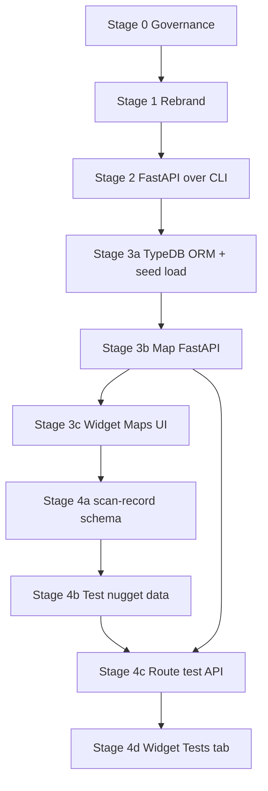

# First Four Stages — Epics & Issues (Review Draft)

**Status:** **Approved 2026-06-03** — Framework + **177 module-test** issues on GitHub; per-route issues **closed** (2026-06-03). Manifest: `github_issues_manifest.json`. Project: `PROJECT_SETUP.md`.

**Source plan:** `.seed/02_stage_by_stage_reengineer.md` (stages 0–4 only; stages 5–8 out of scope).

**Operator decisions (2026-06-03):**

| ID | Decision |
|----|----------|
| D1 | Canonical seed doc: `.seed/02_stage_by_stage_reengineer.md` |
| D2 | Stage 4: **177** issues — **one per OSINT module** (all routes for that module tested inside the issue); quarantine in stage 5 |
| D3 | Stub tabs: **empty placeholder pages** (not disabled UI) |
| D4 | GitHub Project: user-level `@brettforbes` project (simplest); script in `add_issues_to_github_project.py` |

**Repos:**

| Root | GitHub | Role |
|------|--------|------|
| `spiderFeet` | `brettforbes/spiderFeet` | Python backend, CLI, FastAPI, TypeDB, module execution |
| `spiderFeet-widget` | `brettforbes/spiderFeet-widget` | iFrame UI (Bootstrap 5, D3, webpack) |

**Cross-repo workflow:** [cursor-multi-repo skill](https://github.com/brettforbes/spiderfeet/blob/16c1027fb03a301aad338892e0d97acf3b0ac3a3/.cursor/skills/cursor-multi-repo/SKILL.md) — multi-root workspace, independent rules per root, `@spiderFeet/...` and `@spiderFeet-widget/...` references.

---

## 1. Prerequisites before GitHub issue creation

| Prerequisite | Current state | Action before `gh issue create` |
|--------------|---------------|----------------------------------|
| Operator approval of this document | Pending | Review §3–§7; comment or edit |
| Enable GitHub Issues | **Disabled** on both repos (`INIT-TODO.md`) | Settings → Issues → Enable |
| Unified GitHub Project board | **Blocked** (`read:project` / `project` scopes) | `gh auth refresh -s read:project,project`; bootstrap board update |
| Spec binding | `SPEC_GAP` → **SPEC-002** | Create `SPEC-002-first-four-stages.md` after approval |
| `develop` on remote | Local only | Operator: `git push -u origin develop` (both repos if applicable) |
| Pass Gate #1 / bootstrap | See `.governance/project/bootstrap/STATUS.md` | Confirm or accept explicit waiver for planning-only work |

**Recommended board states after creation:** all new items → `Backlog`; move to `Ready` only when issue body meets GOV-06 implementation grade.

---

## 2. Stage dependency overview



Stages 3 and 4 intentionally split into **backend / widget** epics with explicit cross-links.

---

## 3. Cross-repo epic map

| Stage | Epic ID | Repo | Epic title | Widget / backend pair |
|-------|---------|------|------------|------------------------|
| 0 | `EPIC-SF-00` | spiderFeet | Stage 0 — Project governance (Python root) | — |
| 0 | `EPIC-SFW-00` | spiderFeet-widget | Stage 0 — Project governance (JS root) | Linked to `EPIC-SF-00` |
| 0 | `EPIC-X-00` | both | Stage 0 — Unified program board & SPEC-002 | Parent program epic (either repo or org project) |
| 1 | `EPIC-SF-01` | spiderFeet | Stage 1 — SpiderFeet rebrand (backend) | — |
| 1 | `EPIC-SFW-01` | spiderFeet-widget | Stage 1 — SpiderFeet rebrand (widget) | Linked to `EPIC-SF-01` |
| 1 | `EPIC-X-01` | both | Stage 1 — Logo selection & rebrand sign-off | Closes both stage-1 epics |
| 2 | `EPIC-SF-02` | spiderFeet | Stage 2 — FastAPI over CLI | **No widget epic** (per plan §2.2) |
| 3 | `EPIC-SF-03A` | spiderFeet | Stage 3a — TypeDB map ORM & database seed | ↔ `EPIC-SFW-03` (blocked until 3b API exists) |
| 3 | `EPIC-SF-03B` | spiderFeet | Stage 3b — FastAPI for map CRUD & graph export | ↔ `EPIC-SFW-03` |
| 3 | `EPIC-SFW-03` | spiderFeet-widget | Stage 3c — Maps page & force graph UI | ↔ `EPIC-SF-03A`, `EPIC-SF-03B` |
| 4 | `EPIC-SF-04A` | spiderFeet | Stage 4a — `scan-record` schema & type-bridge | ↔ `EPIC-SFW-04` |
| 4 | `EPIC-SF-04B` | spiderFeet | Stage 4b — Realistic test nugget corpus | ↔ `EPIC-SF-04C` |
| 4 | `EPIC-SF-04C` | spiderFeet | Stage 4c — Route/module test execution API | ↔ `EPIC-SFW-04` |
| 4 | `EPIC-SFW-04` | spiderFeet-widget | Stage 4d — Tests tab & module test UX | ↔ `EPIC-SF-04C` |
| 4 | `EPIC-X-04` | both | Stage 4 — Route coverage sign-off | Exit criterion for stage 4 |

**Issue labels (suggested):** `epic`, `stage-0` … `stage-4`, `spiderFeet`, `spiderFeet-widget`, `cross-repo`, `blocked-external`, `operator-review`.

---

## 4. Stage 0 — Governance setup

### Epic `EPIC-SF-00` — spiderFeet

| ID | Type | Title | Acceptance criteria (summary) |
|----|------|-------|-------------------------------|
| SF-00-01 | Story | Audit generic vs project governance gap | Matrix of GOV-01–13 vs `.governance/project/`; list gaps |
| SF-00-02 | Story | Author Python-specific project rules | Rules for modules, FastAPI, TypeDB, pytest, Poetry; live under `.governance/project/rules/` |
| SF-00-03 | Story | Mirror project rules to `.cursor/rules/` | Mirrored `.mdc` files; no drift from canonical `.governance/rules/` |
| SF-00-04 | Story | Update `PROJECT_INTENT.md` for first-four program | Replace provisional intent with staged reengineering goals; link SPEC-002 |
| SF-00-05 | Story | Extend `BACKLOG.md` with stage 0–4 traceability | BL rows reference epic IDs in this plan |

### Epic `EPIC-SFW-00` — spiderFeet-widget

| ID | Type | Title | Acceptance criteria (summary) |
|----|------|-------|-------------------------------|
| SFW-00-01 | Story | Audit generic vs project governance gap | Same matrix pattern as SF-00-01 for JS/webpack/widget |
| SFW-00-02 | Story | Author JS/iFrame-specific project rules | Bootstrap grid, `window.Widgets`, D3, API base URL conventions |
| SFW-00-03 | Story | Mirror project rules to `.cursor/rules/` | Parity with spiderFeet mirroring approach |
| SFW-00-04 | Story | Update widget `PROJECT_INTENT.md` | Align with SpiderFeet map UI program (not template-only wording) |
| SFW-00-05 | Story | Install/sync `cursor-multi-repo` skill in widget root | Skill present at `.cursor/skills/cursor-multi-repo/` per multi-repo skill |

### Epic `EPIC-X-00` — program (cross-repo)

| ID | Type | Title | Acceptance criteria (summary) |
|----|------|-------|-------------------------------|
| X-00-01 | Story | Create SPEC-002-first-four-stages | Requirements IDs for stages 0–4; traceability table |
| X-00-02 | Story | Save/update multi-root workspace | `.seed/spiderFeet_complete.code-workspace` lists both roots with sane excludes |
| X-00-03 | Story | Canonical GitHub Project + board columns | VibeGov columns: Backlog, Ready, In progress, In review, Done, Blocked; both repos linked |
| X-00-04 | Story | Import open backlog into board | BL-006+ and all epics/stories from this plan attached |
| X-00-05 | Story | **Operator review:** approve governance + SPEC-002 | Explicit sign-off comment; unblocks stage 1 |

**Stage 0 exit:** Both roots have project rules + cursor mirror; SPEC-002 exists; board ready (or documented fallback in `BACKLOG.md`).

---

## 5. Stage 1 — Name change & rebrand

### Epic `EPIC-SF-01` — spiderFeet

| ID | Type | Title | Acceptance criteria (summary) |
|----|------|-------|-------------------------------|
| SF-01-01 | Story | SpiderFeet reference inventory | Machine-readable report: paths + counts for `spiderFeet` / `SpiderFeet` / filenames |
| SF-01-02 | Story | Rename files and directories | No path segment `spiderFeet` / `SpiderFeet` remains (exclude `.git`, vendor if documented) |
| SF-01-03 | Story | Update Python package/module imports | `poetry run python sf.py -V` (or successor entry) works after renames |
| SF-01-04 | Story | Replace in-repo strings and docs | README, comments, CLI strings say SpiderFeet |
| SF-01-05 | Story | Apache 2.0 license (Brett Forbes) | `LICENSE` + headers where applicable; MIT removed |
| SF-01-06 | Story | Three logo concepts in README | Three distinct assets linked/embed in `README.md` for operator choice |
| SF-01-07 | Story | Verify `start.ps1` / dev entry still runs | Document any renamed commands in README |

### Epic `EPIC-SFW-01` — spiderFeet-widget

| ID | Type | Title | Acceptance criteria (summary) |
|----|------|-------|-------------------------------|
| SFW-01-01 | Story | Template → SpiderFeet naming pass | README, package.json name, titles, visible UI strings |
| SFW-01-02 | Story | Apache 2.0 license (Brett Forbes) | `LICENSE` present |
| SFW-01-03 | Story | Three logo concepts in README | Same three concepts as backend (shared asset paths or copies) |
| SFW-01-04 | Story | Confirm `npm start` / `start.ps1` | Widget serves on documented port; build succeeds |
| SFW-01-05 | Story | Navbar placeholder branding | Uses provisional logo slot pending `EPIC-X-01` |

### Epic `EPIC-X-01` — cross-repo (last in stage 1)

| ID | Type | Title | Acceptance criteria (summary) |
|----|------|-------|-------------------------------|
| X-01-01 | Story | **Operator review:** select final logo | One logo chosen; documented in both READMEs |
| X-01-02 | Story | Apply chosen logo to widget chrome | Navbar/logo in built `dist/` |
| X-01-03 | Story | Repo-wide `spiderFeet` grep sign-off | CI or script proves zero unintended matches (allowlisted exceptions file) |
| X-01-04 | Story | **Close stage 1 epics** | Operator approval; `.tasks/issue-*.json` after GitHub numbers assigned |

**Stage 1 exit:** No SpiderFeet branding; Apache 2.0; logo selected and visible in widget.

---

## 6. Stage 2 — FastAPI over CLI (spiderFeet only)

### Epic `EPIC-SF-02` — spiderFeet

| ID | Type | Title | Acceptance criteria (summary) |
|----|------|-------|-------------------------------|
| SF-02-01 | Story | CLI capability matrix | Table mapping `sf.py` modes/flags → planned REST resources |
| SF-02-02 | Story | FastAPI application skeleton | App package layout, config, health endpoint, CORS for widget origin |
| SF-02-03 | Story | `start.ps1` for API server | Starts FastAPI with documented host/port; matches README |
| SF-02-04 | Story | Scan-start API (CLI `-s` parity) | Start scan via API; returns scan id; errors for invalid input |
| SF-02-05 | Story | Module list API (`-M` parity) | Lists modules consistent with CLI output |
| SF-02-06 | Story | Event types API (`-T` parity) | Lists types consistent with CLI |
| SF-02-07 | Story | Scan status / results read APIs | Read progress and results sufficient for widget stage 4 prep |
| SF-02-08 | Story | OpenAPI + Swagger UI | `/docs` enabled; schemas match implementations |
| SF-02-09 | Story | API reference documentation | Markdown or generated docs under `.docs/` |
| SF-02-10 | Story | Pytest suite in `.tests/` | `pytest` passes for core routes; linked to SPEC-002 IDs |
| SF-02-11 | Story | Requestly collection & test plan | Document every endpoint: method, path, sample bodies, expected status |
| SF-02-12 | Story | **Operator pairing:** Requestly setup session | Working collection imported; smoke tests green together |
| SF-02-13 | Story | **Operator review:** Requestly full API sign-off | Last story in epic; explicit approval to close `EPIC-SF-02` |

**Stage 2 exit:** Widget can call backend APIs; Requestly proves endpoints (per §2.2).

---

## 7. Stage 3 — TypeDB map model & Maps UI

### Epic `EPIC-SF-03A` — TypeDB ORM & seed (`spiderFeet`)

| ID | Type | Title | Acceptance criteria (summary) |
|----|------|-------|-------------------------------|
| SF-03A-01 | Story | Externalise TypeDB connection config | JSON file injectable; documented; no secrets committed |
| SF-03A-02 | Story | Type-bridge classes for `spiderFeet_map.tql` | Classes for nugget, osint-service, osint-source, route (skeleton), attributes |
| SF-03A-03 | Story | Type-bridge unit tests | pytest proves insert/read for representative types |
| SF-03A-04 | Story | Idempotent DB bootstrap for `spiderFeet-map` | Create DB; apply `.seed/spiderFeet_map.tql`; safe re-run |
| SF-03A-05 | Story | Load archetype nuggets from `nuggets.json` | Kebab-case entity types; empty `nugget_data` / `nugget_instance_id` |
| SF-03A-06 | Story | Load OSINT services from `osint_services.json` | Relations + `osint-source`; `service-state=in-test`; consumed/produced roles |
| SF-03A-07 | Story | CLI/script entry for bootstrap | Runnable without UI; logs success/failure |

**Cross-ref:** SF-03A-04–07 unblock SF-03B-05 and SFW-03-02.

### Epic `EPIC-SF-03B` — Map FastAPI (`spiderFeet`)

| ID | Type | Title | Acceptance criteria (summary) |
|----|------|-------|-------------------------------|
| SF-03B-01 | Story | Connection management API | List/save/test TypeDB connections |
| SF-03B-02 | Story | Trigger map DB init via API | Calls SF-03A bootstrap; returns structured result |
| SF-03B-03 | Story | CRUD APIs for nuggets | Create/read/update/delete archetype nuggets |
| SF-03B-04 | Story | CRUD APIs for osint-services | Includes consumed/produced linkage updates |
| SF-03B-05 | Story | Force-graph export API | Returns `{ nodes[], edges[] }` for full map (services + nuggets) |
| SF-03B-06 | Story | OpenAPI + pytest for map APIs | Documented + tests in `.tests/` |
| SF-03B-07 | Story | Extend `start.ps1` for map + stage-2 APIs | Single dev entry documents all base URLs |

**Cross-ref:** SFW-03-* depends on SF-03B-01, 02, 05.

### Epic `EPIC-SFW-03` — Widget Maps UI (`spiderFeet-widget`)

| ID | Type | Title | Acceptance criteria (summary) |
|----|------|-------|-------------------------------|
| SFW-03-01 | Story | Copy nugget icons to `src/assets/icons/` | From `@spiderFeet/.docs/analysis/nugget_icons/` |
| SFW-03-02 | Story | App shell: navbar, theme toggle, five tabs | Enrichments (default), Composer, Maps, Logs, Tests — Maps implemented; others stubbed/disabled per scope |
| SFW-03-03 | Story | Connection setup widget + global gating | Dropdown of instances; grey-out app until valid; calls init API |
| SFW-03-04 | Story | Maps page layout (Bootstrap 5) | Full-viewport graph panel; desktop-only responsive |
| SFW-03-05 | Story | D3 force graph — core render | Loads graph API; nugget nodes per colour scheme doc |
| SFW-03-06 | Story | OSINT service nodes (2× nugget size) | Rounded square; states active/in-test/invalid; colours distinct from nuggets |
| SFW-03-07 | Story | fav_icon vs logo toggle | Bootstrap switch; persists per session |
| SFW-03-08 | Story | Edge styling & labels | consumed → service, produced → nugget; min edge length ≥ 3× icon width |
| SFW-03-09 | Story | Legend (bottom-right) | Node/edge types and colours |
| SFW-03-10 | Story | Layout button panel | Multiple layouts including grouped horizontal layout per `grouping_of_osint_services.md` |
| SFW-03-11 | Story | Shadow nodes/edges toggle | Predictable ID suffix; restore function |
| SFW-03-12 | Story | Tooltips (pretty-print JSON) | Hover on nodes/edges |
| SFW-03-13 | Story | Zoom & pan | Standard D3 behaviour |
| SFW-03-14 | Story | Drag-to-fix & double-click reset | Fixed position until reset |
| SFW-03-15 | Story | Filters: grouping dimensions + search | access_tier, consumption_group, route_seed, text match |
| SFW-03-16 | Story | RMB context menu — expand hidden neighbours | Progressive reveal of connected nodes/edges |
| SFW-03-17 | Story | Light/dark mode | CSS variables aligned with `force_graph_colour_scheme.md` |
| SFW-03-18 | Story | **Exploratory review:** Maps page scenario matrix | GOV-08 classifications; gaps → backlog |

**Stage 3 exit:** Operator can connect TypeDB, init `spiderFeet-map`, view and filter full OSINT/nugget graph.

**Out of scope for stage 3 (later stages):** route nodes in graph, Favourites/Sequences tabs, Enrichments/Composer/Logs full implementation.

---

## 8. Stage 4 — Module testing framework

### Epic `EPIC-SF-04A` — Schema extension (`spiderFeet`)

| ID | Type | Title | Acceptance criteria (summary) |
|----|------|-------|-------------------------------|
| SF-04A-01 | Story | Extend `spiderFeet_map.tql` with `scan-record` | Fields per §2.4.1; relations to consumed/produced/service/route |
| SF-04A-02 | Story | Type-bridge for `scan-record` + route | CRUD + insert helpers |
| SF-04A-03 | Story | Migrate bootstrap pipeline | Re-init safe; documents upgrade path |
| SF-04A-04 | Story | Pytest for scan-record persistence | Direct proof of insert/query |

### Epic `EPIC-SF-04B` — Test nugget corpus (`spiderFeet`)

| ID | Type | Title | Acceptance criteria (summary) |
|----|------|-------|-------------------------------|
| SF-04B-01 | Story | Generate `nuggets_consumed_list.json` if missing | Distinct consumed nugget ids from map |
| SF-04B-02 | Story | Research & author `test_nugget_data.csv` | Realistic values; AU, UK, US rows per consumed nugget |
| SF-04B-03 | Story | Load test nuggets into TypeDB | `nugget_instance_id`, `nugget_data` populated |
| SF-04B-04 | Story | Document paid/API-key-only modules | Mark `untested` / blocked in map metadata |

### Epic `EPIC-SF-04C` — Route test execution (`spiderFeet`)

| ID | Type | Title | Acceptance criteria (summary) |
|----|------|-------|-------------------------------|
| SF-04C-01 | Story | Module metadata refresh checklist | Template for web/API review per module |
| SF-04C-02 | Story | API: run module test from consumed nuggets | Invokes module (API + optional CLI parity flag); captures duration |
| SF-04C-03 | Story | API: persist `scan-record` on run | Success/failure notes; links to service |
| SF-04C-04 | Story | API: create `route` after successful run | Unique route name; `route-state=in-test` |
| SF-04C-05 | Story | API: mark service `invalid` when no routes work | Per §2.4.3.2 |
| SF-04C-06 | Story | API: module test history (paged 10) | Per-module table data for widget |
| SF-04C-07 | Story | Batch pilot — one consumption group | Pick one `consumption_group`; all routes in group tested |
| SF-04C-08 | Story | Batch — remaining consumption groups | 11 further batch stories OR one epic sub-task per group (operator choice at approval) |
| SF-04C-09 | Story | Paid/blocked services annotation pass | Map reflects untested with reason |

**Note on SF-04C-08:** At approval time, choose **12 issues (one per consumption group)** vs **1 rolling epic** to avoid 177× separate issues. Default recommendation: **12 group batch stories** + exploratory sub-issues for failures.

### Epic `EPIC-SFW-04` — Tests tab (`spiderFeet-widget`)

| ID | Type | Title | Acceptance criteria (summary) |
|----|------|-------|-------------------------------|
| SFW-04-01 | Story | Tests tab scaffold | Accordion list grouped by `module_id` |
| SFW-04-02 | Story | Summary metrics table | Counts: routes, passed, failed, in-progress, not-started, etc. |
| SFW-04-03 | Story | Filters (consumed/produced/module/grouping) | Left panel controls per §2.4.3.1 |
| SFW-04-04 | Story | Accordion item: run test + status icon + duration | Header controls |
| SFW-04-05 | Story | Accordion body: CLI & API commands + copy | Copy-to-clipboard |
| SFW-04-06 | Story | Accordion body: scan-record mini force graph | D3 sub-graph per record |
| SFW-04-07 | Story | Accordion body: results, errors, notes | Pretty display of API payload |
| SFW-04-08 | Story | Per-module performance table (10 rows/page) | TypeDB-backed via API |
| SFW-04-09 | Story | **Exploratory review:** Tests tab scenario matrix | GOV-08; persistence verified via refresh |

### Epic `EPIC-X-04` — cross-repo sign-off

| ID | Type | Title | Acceptance criteria (summary) |
|----|------|-------|-------------------------------|
| X-04-01 | Story | Route coverage audit report | % routes tested; list gaps; paid/untested explicit |
| X-04-02 | Story | **Operator review:** stage 4 complete | Every planned route exercised or documented exception |

**Stage 4 exit:** Tests tab can run and record scans; map holds routes + scan history; coverage audit accepted.

---

## 9. Issue counts (for review)

| Repo | Epics | Stories (approx.) |
|------|------:|------------------:|
| spiderFeet | 10 | 58 |
| spiderFeet-widget | 5 | 28 |
| cross-repo (`EPIC-X-*`) | 4 | 12 |
| **Total GitHub issues** | **19 epics** | **~98 stories** |

If stage 4 uses **12 consumption-group batches** instead of one combined SF-04C-08, total stories ≈ **109**.

---

## 10. GitHub issue body template (use when creating)

```markdown
## Problem statement
<one paragraph>

## Desired outcome
<bullet list>

## Spec binding
- SPEC-002: `<requirement-id>` or `SPEC_GAP` with follow-up

## Repo / cross-repo
- Primary repo: spiderFeet | spiderFeet-widget
- Linked issues: #<n> (other repo) | none

## Acceptance criteria
- [ ] ...

## Verification
- [ ] pytest / npm test / Requestly / exploratory matrix (as applicable)

## Non-goals
- ...

## Dependencies
- Blocked by: ...
```

**Epic issues** add: child story checklist (issue numbers filled after creation).

---

## 11. After approval — execution order for GitHub

1. Enable Issues on both repos (or confirm operator override).
2. Refresh `gh` project scopes; create/link unified board (`X-00-03`).
3. Create **SPEC-002** and requirement IDs (`X-00-01`).
4. Create epics first (labels `epic`, `stage-N`), then stories.
5. Link cross-repo pairs using "Tracked by / Depends on" or project custom field **Linked repo issue**.
6. Set all to **Backlog**; move only ready stories to **Ready**.
7. Store local trace files under `.tasks/` **after** GitHub assigns numbers (per seed doc).

---

## 12. Open decisions for operator (please confirm in review)

| # | Decision | Options |
|---|----------|---------|
| D1 | Canonical seed doc filename | Keep `02_stsage_by_stage_reengineer.md`, rename to `02_stage_by_stage_reengineer.md`, or merge duplicates |
| D2 | Stage 4 module testing granularity | 12 consumption-group batch issues (recommended) vs per-module issues (~177) |
| D3 | Stub tabs in stage 3 | Composer / Enrichments / Logs disabled vs minimal placeholder pages |
| D4 | GitHub board host repo | spiderFeet org project vs single repo project |
| D5 | Start work branch name | e.g. `feature/first-four-planning` from `develop` after approval |

---

## 13. Next step

**Your review:** Comment on §12 decisions, adjust issue splits (§7–§8), then reply **approved** (or list edits).

**After approval:** I will create GitHub issues in both repos via `gh`, link cross-repo dependencies, and update `.governance/project/BACKLOG.md` + SPEC-002 traceability.
