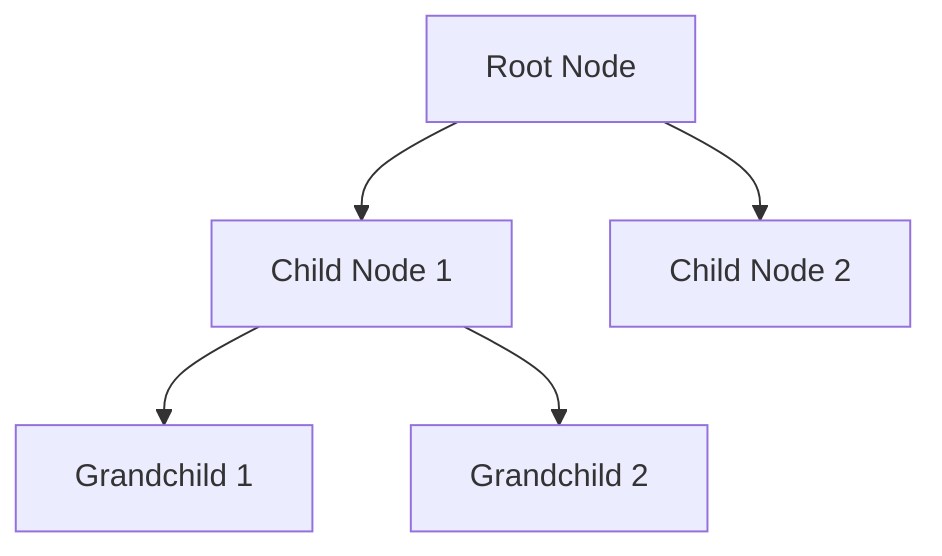
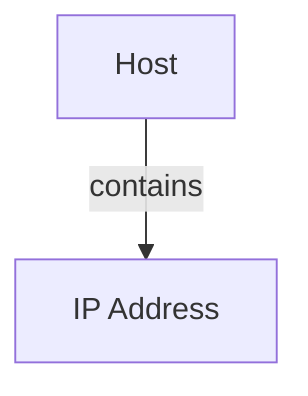
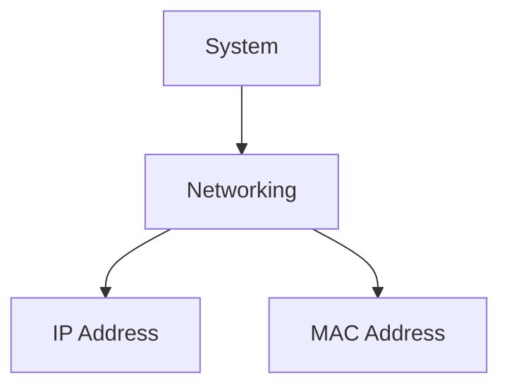
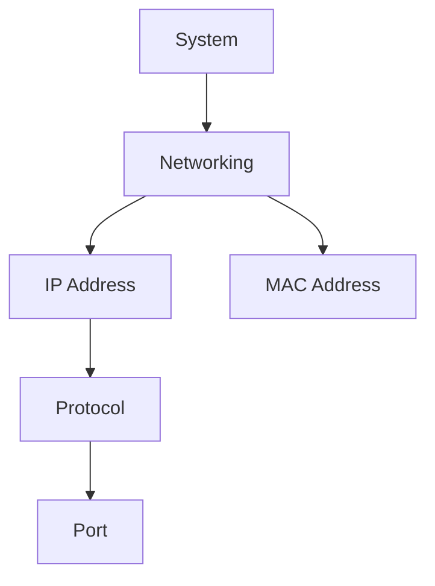
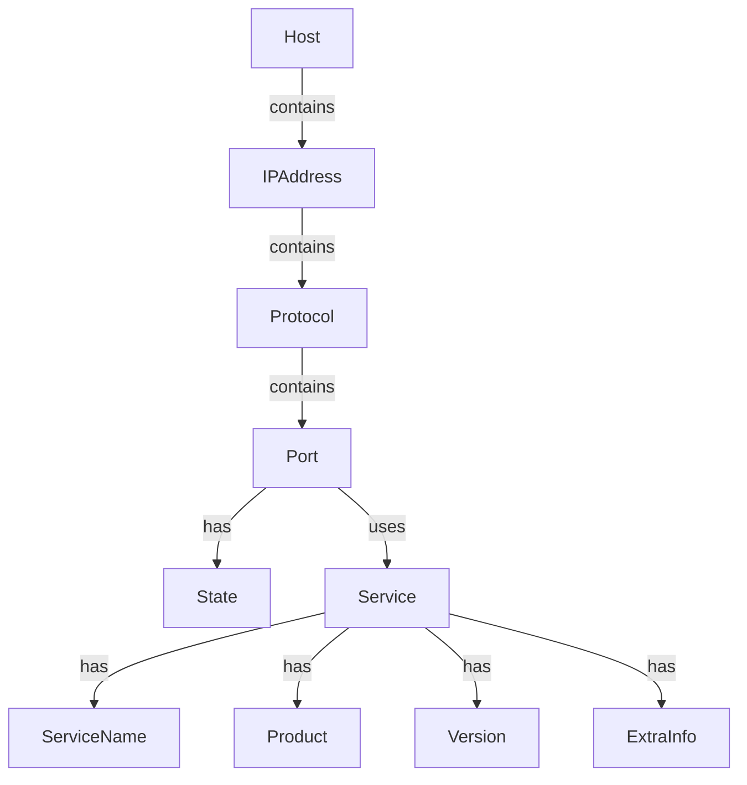
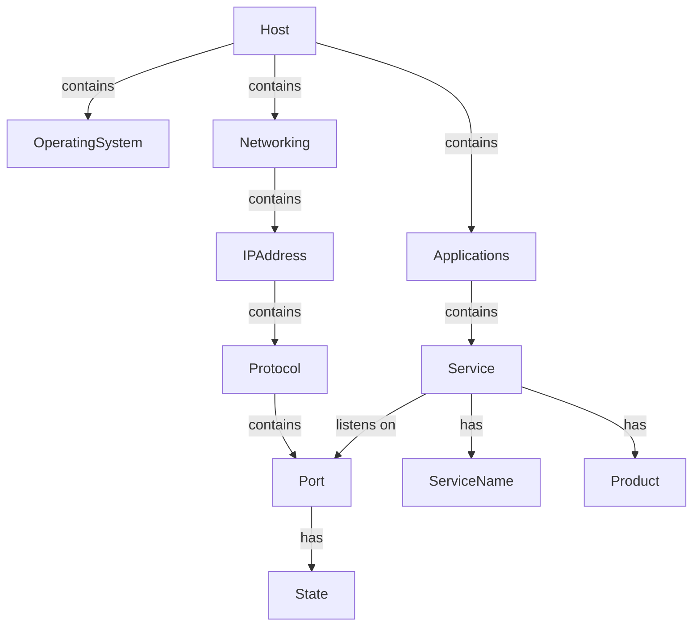

# Nugget Nesting

## Original

## Simplest Systems

An ARP Scan gives you IP Addresses and MAC Addresses, so all you can infer is that a host/device is on the network.

## Some Systems

An ARP Scan gives you IP Addresses and MAC Addresses, so all you can infer is that a system is on the network.

A Port Scan gives you open ports, so you can infer that a system is running a service, and this can be done for UDP and TCP.

## NMAP Scanning

## External Scanning Service Model

